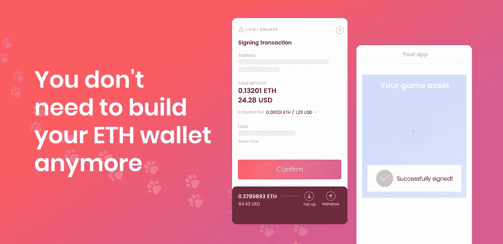

# 欢迎 Metamask 移动模拟:没有人需要再建立加密钱包

> 原文：<https://medium.com/hackernoon/welcome-the-metamask-mobile-analog-nobody-needs-to-build-crypto-wallets-anymore-e06b733094f7>

作为一名经验丰富的加密钱包开发者，我们为不同的区块链项目提供白标钱包解决方案。最近，许多拥有自己的令牌或分散式应用程序的公司都向我们提出了为他们创建应用内钱包的请求。

我们认识的更多公司——我们的合作伙伴/朋友/我们在会议上一起喝啤酒的人——抱怨说*“建立自己的 ETH 钱包是一种拖累”*，尤其是当你提供的服务与钱包/支付完全无关的时候。当然，我们可以把它当作一个挑战——打造一个满足所有需求的 WL 钱包。但是，事实上，我们不能:我们宝贵的人力资源自然是有限的，毕竟，不是每个公司都能够负担得起/把他们的信任放在“黑盒”解决方案中/声称他们没有能力建立一个没有出错风险的钱包。

不管可能的原因是什么，许多加密公司——尤其是 dapps——回避开发自己的应用的想法，只是因为这会花费他们大约 1.5 个月的开发时间(完整的 ios/android 团队负载)？据我们所知，没有哪家成功且雄心勃勃的加密初创公司有多余的开发人员。将钱包的 MVP 融入公司的路线图可能会很困难。。。好吧，如果你碰巧也在这个行业工作，想象一下，然后贴上最佳答案！

如果你没有，我会告诉你:不可能，除非你的生存依赖于此(通常不会)。

即使是地球上最小的 Dapp 也可以通过实现 Metamask 支付轻松上线，但当涉及到移动时，一切都停止了。那么我们能做什么呢？对这些事实考虑了几个星期后，我们想出了一个主意。

## ***为什么不为每个需要的人创建一个 ETH 钱包 SDK？***

***“人人幸福，自由自在，没有人会不满足地走开”***

好吧，那就让钱包和米露一起工作。我们有没有权利从自己的工作中获益？

[Lumi Blockchain Wallet](https://medium.com/u/f775804fe8ed?source=post_page-----e06b733094f7--------------------------------)

我们做到了。SDK(软件开发工具包)——实际上是一个工具包，一堆代码、库等等，你可以用它来创建应用程序。实现米露 SDK 允许应用程序签署以太坊交易。

所以我们创建了[米露 SDK](https://github.com/lumitechnologies/Lumi-SDK-IOS)——剩下的唯一事情就是找一只试验品……我们的意思是，一个先驱。

你们中的一些人可能听说过 0x universe——一款丰富多彩的区块链战略游戏，玩家可以探索太空，驾驶飞船，殖民星球。每个星球都是一个独特的收藏品，通常通过 Metamask(在桌面上)购买。当 0x 团队决定扩展和开发他们创造的移动版本时，问题出现了——当时根本没有 Dapps 的现有解决方案。所以这是给我们的 SDK 一个尝试的绝佳机会，结果，米露钱包已经成功整合到 0xUniverse 手机游戏中。

这对 0x 播放器意味着什么？天哪，终于有一款 0x 应用了！(所以他们会更频繁地玩游戏，花更多的时间在游戏上)

2)他们决定购买一艘新的宇宙飞船，哇哦！他们只需点击购买按钮，被重定向到米露收款，确认付款细节，并返回到应用程序。这再简单不过了。当然，互动的容易程度也会影响购买的频率，如果你明白我们的意思的话:)

这只是米露 SDK 的一个实现案例:使用的可能性是无限的。比方说，你正在运行一个分散式拍卖平台，你的客户想要购买一件物品并作为礼物送给朋友。他不再需要签署几项交易的漫长过程，而是只需点击一下鼠标就能完成整个交易。

你认为是时候让你的 Dapp 移动化了吗？看看这有多简单！( [Github 链接此处](https://github.com/lumitechnologies/Lumi-SDK-IOS))