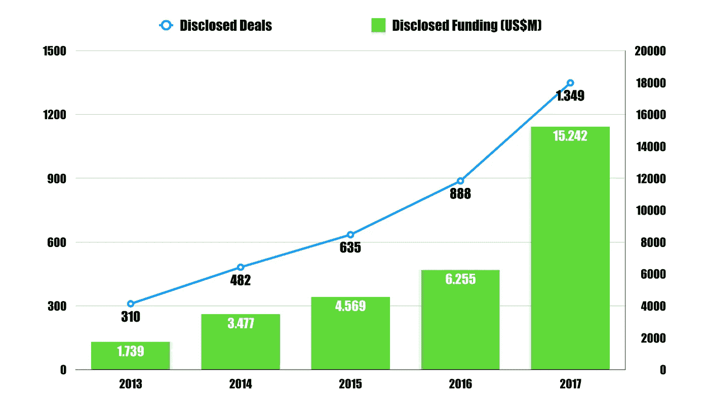
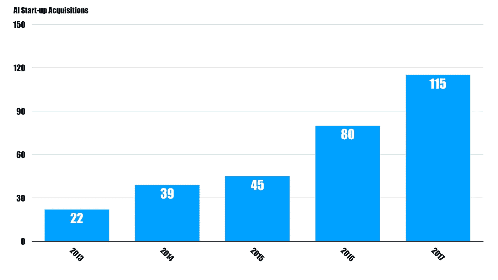
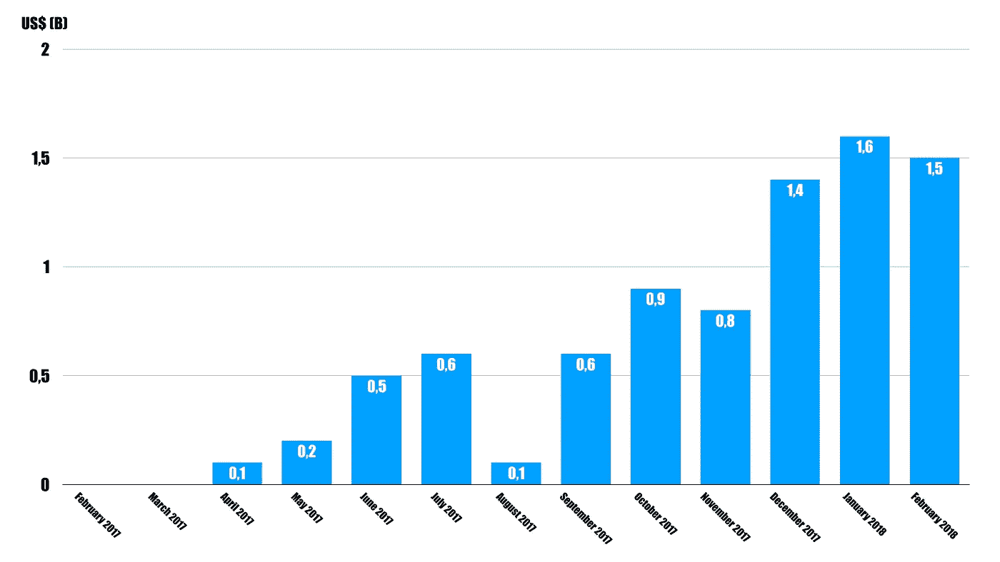

# 欢迎来到“人工智能”和“智能机器”的世界

> 原文：<https://medium.com/hackernoon/welcome-to-a-world-of-artificial-intelligence-smart-machines-c97ff02adda5>

## 如何为“自动化革命”做准备

Dana Scully gets a drone delivery in X-Files Season 11 Episode 7 “Rm9sbG93ZXJz” (original air date: February 28, 2018)

无论你如何看待新的数字技术，如人工智能、区块链和物联网，都不能忽视它们正在改变我们的生活和工作方式。

> 但是，我们应该如何为“自动化革命”做准备呢？

它正在我们周围发生。机器和智能系统正逐渐接管越来越多的日常任务。

目前，这些机器和系统主要设计用于在特定情况下为特定任务提供帮助。它们增加我们的智力，提高我们的技能。

以汽车行业为例。碰撞警告、自动刹车、车道偏离警告和盲点通知系统是当今许多汽车的标准配置。

人工智能和其他数字系统不仅变得更加普遍，而且变得更加准确。

例如，人工智能在审查和注释标准化合同方面已经超越了人类律师。

 [## LawGeex 在 NDA 评论中达到 94%的准确率，而人类律师的准确率为 85%

### 今天，我们许多在法律科技领域的人都从 GLH2018 的兴奋中走了出来，但是，法律人工智能的世界已经…

www.artificiallawyer.com](https://www.artificiallawyer.com/2018/02/26/lawgeex-hits-94-accuracy-in-nda-review-vs-85-for-human-lawyers/) 

当然，还有很多更吸引人的例子，从医疗保健领域的聊天机器人，农业领域的数据分析，能源领域的区块链技术，以及银行和金融领域的机器人顾问。

这些例子非常清楚地表明，没有回头路可走。我们必须习惯并准备好与智能机器和系统一起生活和工作。

# 机器只会变得更加智能和自主

随着机器变得更加先进、互联和自主，为未来做准备只会变得更加重要。

我不打算在这里做任何预测，但我预计自动化趋势只会加速，人工智能将成为新常态。

这样做的原因简单明了。

*   不应孤立地看待当前的数字技术。物联网设备和传感器的激增将导致大量数据的可用性，这将导致更智能和更自主的系统。

> 显然，我们需要人工智能来理解这些数据。

*   对人工智能相关技术的投资正在滚雪球。

AI Equity Deals, 2013–2017 (excluding hardware-focused robotics start-ups), Source: CB Insights

*   企业将赌注压在新的数字技术上。在打电话时提到“数字”和“技术”的次数越来越多。我在数字技术初创公司的收购中看到了类似的趋势。

AI Start-up Acquisitions, Source CB Insights

*   各国政府纷纷效仿，启动数字化流程项目，“消除纸张”并拥抱“无现金社会”。
*   消费者对数字技术的期望也在改变。大多数人已经在使用人工智能驱动的服务设备，而没有真正意识到和理解。然而，当新技术产品推出时，他们往往会感到失望。期望值只是更高了。更快、更安全和更智能的服务似乎对消费者非常有吸引力。

 [## 消费者将接受人工智能的 5 个理由

### 人工智能和机器人 2017 年圣诞节对零售商来说是忙碌的一年。在旺季，亚马逊报道…

www.weforum.org](https://www.weforum.org/agenda/2018/01/consumers-will-embrace-artificial-intelligence/) 

我相信数字技术，并倾向于关注它今天带来的以及未来将继续带来的诸多优势。

计算机、算法和大数据改善了我们的健康，并帮助医生做出更好的诊断。传感器、区块链技术和人工智能提高了全球食品供应链的透明度和公平竞争环境。数字技术让旅行更安全、更高效。它带来了更多的便利和更高的生产率。这也有助于我们更有创造力(因为我们必须减少对等级制度和中央集权制度的依赖)。最后，它促进了新兴经济体的金融包容性。

然而，我也意识到，智能和互联的数字技术将面临许多不容忽视的挑战。

人们经常提到体力劳动者和知识工作者的大规模失业。自动化导致的社会不平等也是如此。隐私、数据保护和所有权等概念都需要重新思考。

 [## 观点|人工智能的真正威胁

### 与工业革命和计算机革命不同，人工智能革命没有夺走某些工作(工匠…

www.nytimes.com](https://www.nytimes.com/2017/06/24/opinion/sunday/artificial-intelligence-economic-inequality.html) 

当物联网经济真正腾飞的时候，这一点将更加重要。

机器和设备将更频繁地行动、互动和交易。他们还将共享数据。你最不希望的就是你的个人数据被一个“坏演员设备”分享。

因此，我们应该将注意力转向潜在的问题和威胁(在数字时代不扼杀创新)。

# 如何应对数字威胁

在这里，我们可以从 ICO 市场的现状中学到一些东西。

ICO 已经成为初创公司筹集资金的一种创造性的、在很大程度上不受监管的方式，同时绕过了风险投资和银行的传统途径。

安全漏洞、加密货币骗局和高失败率(2017 年几乎一半的 ico 已经失败)已经成为引人注目的头条新闻。然而，科技公司和投资者仍在使用“秘密途径”筹集资金。

Monthly Investments into ICOs, Source: Bloomberg and CoinDesk

但监管者正在介入，他们相信更多的监管将提供必要的信任和安全。

 [## 据报道，美国证券交易委员会正在调查一些 ico

### 根据一份新的报告，美国证券交易委员会(SEC)正在密切关注募集 ico 的公司。引用…

techcrunch.com](https://techcrunch.com/2018/03/01/the-sec-is-reportedly-investigating-a-number-of-icos/) 

有四种监管策略来设计更值得信赖和安全的环境:

*   一些国家禁止 ico。
*   一些国家选择将现有的规则和条例应用于新技术。
*   一些国家注重对技术应用的监管。
*   有些国家对底层技术(如分布式账本技术)进行监管。

然而，大多数国家保持沉默，因为规章制度对创新有负面影响。

负责监管的人也知道，如果规则过于严格，ico 和其他数字应用将转移到更友好的司法管辖区，这在经济和社会上都是不可取的。

那么，这是否意味着我们不应该做任何事情，采取“等着瞧”的态度呢？

答案是否定的。

但是我们不应该把注意力放在传统的规章制度上。我们不应该引入基于文本、文字、最佳实践、指导方针和合规性的新法规。

> 我们必须认识到，在当前的数字时代:规则、法规和信任将越来越多地嵌入技术本身。

举个例子:我非常幸运的参与到了 [*Semada* 【区块链】平台](http://semada.io)。该平台使用技术、算法和软件代码来实现区块链和智能合约系统中的治理、信任和安全性，从而为 ico 的问题和高失败率提供了潜在的解决方案。

在某种程度上，该平台试图将规章制度“数字化”。创始人认为我们不应该专注于传统的规章制度。我们应该找到嵌入科技的解决方案。

# **共创经济**

那么，我们如何应对当前的数字挑战和技术颠覆呢？我们如何确保这种信任根植于数字技术中？

> 答案是“共创”。

新的数字技术及其应用必须由技术专家和非技术专家“共同创造”，包括政策制定者、监管者和初创公司。

为了成为一名共同创造者，必须学习、理解和尝试数字技术(及其优缺点)。

这样做将刺激和鼓励创新，同时保证可信和安全的环境。

共创模式还有其他优势:

*   这将刺激所有利益攸关方的参与。
*   它将(尽可能)向所有利益相关者提供必要的保护。
*   它将增强社区及其利益攸关方的权能。

这些优势并不包含在快速变化的数字技术背后的传统法规中。

*感谢您的阅读！请按住*👏*下面，还是留下评论吧。*

每周都有一个新故事。因此，如果你关注我，你不会错过我关于数字时代如何改变我们生活和工作方式的最新见解。