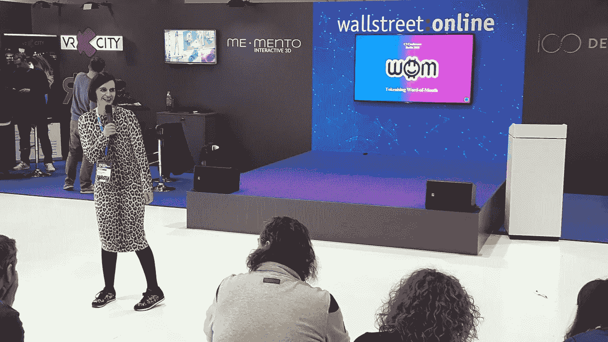

# 欢迎来到柏林的秘密动物园

> 原文：<https://medium.com/hackernoon/welcome-to-berlins-cryptozoo-b465a7f075d8>

C3 Crypto Conference in Berlin April 5–6\. 2018

周五下午晚些时候，我从阳光普照、高大的 Gorlitzer Park(T1)工厂新办公室匆匆离开，赶去参加为期两天的活动的最后几个小时，这个活动叫做 [C3 加密会议](https://crypto-conference.com/)，或者像一位也有兴趣参加的同事亲切地称之为 CryptoZoo。这是她对网上满满的日程表的印象。她基本上是对的，但我很高兴能亲眼目睹。

*正如我的任何忠实读者所知，参加一个结合了数字健康和包容性技术的活动给我带来了快乐。C3 满足了这个标准，因为 Iryo 和 YEAY 做了精彩的表演。*

Blockchain Terminal at Expo are of C3Crypto Conference

在一个温暖的春天，周末前的一天，在穿过克罗伊茨贝格的 S-bahn 路线上航行是一种人类学的体验。一旦阳光开始融化这座城市，柏林就会散发出一种醉人的快乐。当我到达 Gleisdreieck 和柏林车站的入口时，我收到了一枚“金”比特币，当然是巧克力。

这是来自柏林市中心的 C3 密码会议的一个受欢迎的信号，柏林是欧洲的区块链首都。

Shiny & Gold

‘Cryptocurrencies for everyone’

我穿过迷宫般的摊位，这些摊位上有着吸引人的标志和可爱的头像，来验证我参加的原因:

> 我想听听伊约的 Tjasa Zajc 的演讲。Tjasa 是一名出色的记者，也是数字健康的主持人。她还负责 Iryo 的业务开发和沟通，Iryo 是“第一个参与性的、区块链驱动的医疗保健网络，建立在医疗数据的分散访问上”。

[Iryo](https://iryo.network/#network) 正在通过标准化健康数据、利用加密以及支持大数据和医疗人工智能研究来塑造下一代医疗保健。对我来说幸运的是，项目进度远远落后于计划。所以尽管迟到了，我还是听完了 Tjasa 的整个演讲。

“Earn Crypto Watching TV”: TV-TWO earned the first place award from [Paranoid Internet](http://paranoid-internet.de/en/).

在编织过“看电视赚密码！” [TV-TWO](https://tv-two.com/) 的标志，他们后来在推介活动中获得了第一名，我抓住了一些在推介活动间隙休息的客人(见下文)，了解了有趣的硬件和供应链专家 [Arxum](https://arxum.com/) 。他们使用[技术](https://hackernoon.com/tagged/technology)为制造业的新市场提供创新解决方案。

Conference exhaustion is real.

随后，Tjasa 发表了一篇引人入胜、内容丰富的演讲，讲述了为什么医疗保健行业适合颠覆 Iryo。她一边在地板上踱步，一边热情地传达她为什么要为 Iryo 的成功奉献自己的时间，这吸引了一大群人。

## Iryo 分散医疗保健

Tjasa 解释了 Iryo 的背景:医学对利益相关者有益；医疗保健不是。医生被它搞得焦头烂额，而医疗保健应用的需求却跟不上供给。Iryo 认为医疗数据共享应该由患者通过权限控制来控制。

在 Iryo 系统中，医疗数据存储在三个位置:手机上、云中和提供商处。区块链用于对任何这些存储库的访问控制，这在患者手中，患者的移动设备授予和撤销访问权。

Iryo 是第一家在 EOS 区块链建立医疗保健空间的公司，他们使用零知识数据存储。这意味着数据在到达他们手中之前会被加密。“零知识数据存储”是一种加密机制，使数据安全，即使从内部攻击。例如:您可以拥有良好的数据保护软件，但 IT 供应商管理员仍然可以浏览数据库。在零知识数据库中，即使是内部的管理员也看不到数据。

Tjasa Zajc presents why healthcare is ready for Iryo’s decentralized network.

> “隐私问题很像健康问题；不成为问题就不是问题。”- Tjasa Zajc

Iryo 希望从头开始建立这个网络，而不是试图修复一个破碎的系统。利用算法训练，他们寻求建立一个全球医疗保健生态系统，这将产生预防性的见解。在这个新的全球健康数据仓库中，他们的目标是实现医学突破。

Tjasa explains the Iryo token economy’s incentive, stake, and payment tool

他们的目标是中东的发展中国家，虽然那里的家庭可能没有广泛的资源，但他们确实有手机。Iryo 是新代币经济的一部分，但独特的是将患者纳入数据货币化。他们的方法始终以病人为中心，注重可用性。他们计划在六月举行一次 ICO。

Iryo pursues practical cases of AR for the medical world

## YEAY 激励着未来的企业家

在 Tjasa 的演讲结束后，我们听到 YEAY 的创始人兼首席执行官 Melanie Mohr 说“耶”。梅拉妮以承认“青少年是你的盟友，是这里每个人的未来”开始了她的推销。和她的团队一起，她创建了一个使用区块链的社交平台[。这是一个视频内容空间，利用真正的口碑营销为青少年创造一个分享他们喜爱的产品的市场。](https://techcrunch.com/2017/06/05/yeay-a-gen-z-video-network-for-selling-things-raises-4-9m/)

Melanie Mohr, CEO & Founder or YEAY

作为有史以来最年轻的顾问委员会，她强烈建议在产品开发的最早阶段就让青少年参与进来。为什么？原因有很多:他们是数字原生者、早期采纳者、自发者，他们“不记得前移动世界和前社交世界。”我们可以学习他们如何拥抱技术，他们如何做视频魔术，本能地知道什么是酷，什么是正确的渠道。

YEAY’s solution of organic recommendation engine + GenZ word-of mouth + token economy

正是这些青少年引导 YEAY 超越了积分奖励系统，以更好的方式满足他们的需求并奖励他们:那就是通过代币和智能合同。事实证明，区块链反映了下一代想要看到的价值观:真实、透明、天衣无缝。

到目前为止，他们已经下载了 70 万次，并且正在开发 YEAY 3.0。他们将在四月晚些时候进行私人销售。

Chocolate coinage scattered around the venue

听到这两位女士分享她们的商业和技术专长令人振奋。从他们的演讲中，很明显他们有动力进行各种形式的社会变革或思想转变，正如他们所描述的“地震”——走向自动化、共享经济、去中心化和值得信赖。

在写这篇文章时，我要特别感谢硬件爱好者和医疗改革倡导者[迈克·理查森](https://www.linkedin.com/in/mike4tech/)，当我在活动期间问饮料在哪里时，他给我带来了一瓶德国 [Fritz Kola](https://www.fritz-kola.de/en/where-to-buy/) 如此提神，以至于我昨晚几乎没有合眼。是因为在秘密动物园的兴奋吗？谁知道呢，但我会再去的。

干杯，柏林。

*这引起了共鸣吗？欢迎随时* [*关注我*](/@elisheva.marcus) *获取数字健康和科技事件见解。*