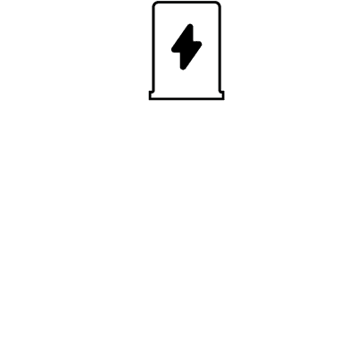

# 欢迎来到 Byteball 平台上的 BIoT —物联网解决方案！

> 原文：<https://medium.com/hackernoon/welcome-to-biot-iot-solutions-on-byteball-platform-94c4d7640f03>

## **物联网背景**

“物联网”一词于 1999 年提出，其先决条件是射频识别(RFID)——[电磁场](https://en.wikipedia.org/wiki/Electromagnetic_field)自动识别和跟踪附着在物体上的标签。

由于无线网络的广泛分布、云计算的出现和软件可配置网络的发展，2010 年“物联网”的概念充满了各种技术内容和实用解决方案的实施。2017 年，物联网不仅仅是供“家庭”使用的信息物理系统，它还扩展到了工业对象(IIoT)。

以下是 NCTA 对物联网市场未来的预测之一:

[NCTA](https://www.ncta.com/sites/default/files/platform-images/wp-content/uploads/2014/05/growth-of-internet-of-things-hero-1024x585.jpg)

当然，“物联网”市场将动态增长和发展。但是所有的解决方案都必须稳定、轻便、安全。

## **毕奥溶液**

Byteball 基础设施是物联网(IoT)领域的理想选择:сore 可以在任何支持 node.js 的平台上运行，0.1 秒内准备就绪，低技术要求:128MB 的 RAM 和 8MB 的数据库。因此，我们想创建一个物联网和微支付系统。

我们将使用 javascript 或任何其他能够与 JSON-RPC、WebSocket 或其他平台一起工作的编程语言，通过 byteball 和[支付通道](https://docs.google.com/document/d/19s4LYDfbWDREzVzUwxPuoKANeIGOgPGKV2zI9jTsPSg/edit#)为开发人员构建一个快速便捷的工作架构。支付渠道的主要优势是:降低交易成本(只支付渠道开通和关闭的费用)、加速交易、资金安全支出。

我们的系统将在基于惩罚的支付渠道上工作，其中资金在渠道双方之间的多签名合同中被冻结，并且为了确保行动的正确性，双方签署了已执行但未在网络上公布的交易。如果一方发布旧数据，它将受到惩罚并被剥夺一切手段。

我们的一些案例:支付、管理和沟通。

给你的电动汽车充电，使用智能家电，观看付费广播或使用互联网——这些以及更多都可以通过使用 BIoT 来管理和支付。

Byteball 平台的功能允许物联网设备之间的通信。

BIoT 允许您通过在您的智能手机上使用我们的客户端或在这种情况下在电动汽车的车载计算机上使用我们的客户端来管理和监控设备之间的支付和通信过程。

我们的解决方案允许您通过使用无线连接(蓝牙、Wi-Fi 等)来控制不同的设备。).结合互联网，您可以在一个应用程序中完全控制所有类型的设备。这为我们产品的进一步发展提供了更多的机会。

## **最近的计划**

1.  创建一个测试 DIY，展示渠道的真实工作。
2.  协议支持，协议和 CLI(命令行界面)的文档。
3.  渠道创建和运营的最大优化。
4.  支持 HTML5 的实时客户端(pc/android/ios)与物联网设备进行交互。

DIY devices

## **联系我们**

关注我们的 [*Twitter*](https://twitter.com/BIoT_ws) 获取最新消息，并在[*Telegram*](https://t.me/BIoTOfficial)*上加入我们的社区。我们的 github 简介—[*biot ws*](https://github.com/BIoTws/biot-core)*。*发送您的问题和建议至-[*team @ biot . ws*](mailto:team@biot.ws)*。**