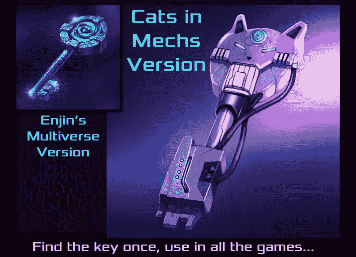
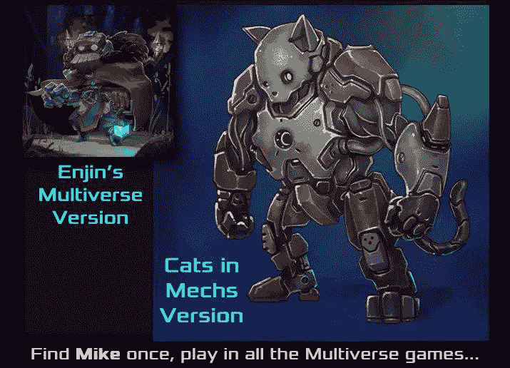
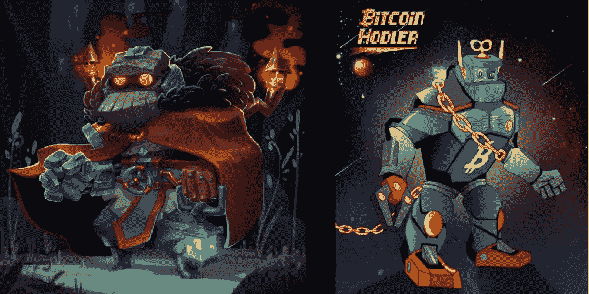

# 欢迎来到基于区块链的多元宇宙——它将永远改变游戏

> 原文：<https://medium.com/hackernoon/welcome-to-the-blockchain-based-multiverse-it-will-change-gaming-forever-58b0cf4c8e29>

## 神奇的事情正在发生。网络世界之间的壁垒正在瓦解。数字资产正在变得分散化，它们不再被锁在孤立的服务器中。它们现在是公共领域，你可以通过选择支持它们的任何游戏、平台或设备来访问它们。

> 在理论物理中，多元宇宙是一个无限排列的宇宙，在那里一切皆有可能，每种可能性都存在。多元宇宙中的各种宇宙通常被称为“平行”或“交替”宇宙或“其他维度”在游戏的背景下，多元宇宙是一个游戏网络，玩家可以在不同的世界使用他们的角色和物品。

还记得 [*准备好的玩家一*](https://www.rottentomatoes.com/m/ready_player_one/) *吗？这部由书改编的大片向我们介绍了绿洲，一个庞大的游戏世界网络，玩家可以在每个世界中使用相同的角色和物品无缝移动。感谢[区块链](https://hackernoon.com/tagged/blockchain) [技术](https://hackernoon.com/tagged/technology)，[类似的未来正在快速接近](https://syfy.com/syfywire/ready-player-one-style-gaming-universe-lets-you-be-one-character-across-multiple-games)——除了这个未来是分散的，这意味着它不像绿洲那样由单一实体控制，也不局限于单一的艺术表现形式。*

Multiverse items created by [Enjin](https://enj.li/about-enjin) and [Cats in Mechs](http://www.cats-in-mechs.com/)

由于其身份、出处、历史和元数据存储在区块链上，而不是锁在中央服务器内，基于区块链的游戏资产可以跨多个游戏转移。所有其他数据，如外观和功能，由每个游戏服务器存储和操作。

只有区块链项目的创建者才能创建更多副本，但由于区块链是公共分类账，因此对于谁可以查看它、使用它的数据以及向它添加数据没有限制。因此，任何游戏都可以支持他们选择的任何区块链物品，即使他们没有创建它。他们甚至可以向该项目添加元数据，这为玩家在不同的游戏世界中旅行时体验持续的进展开辟了潜力。

它是这样工作的:如果你是一名玩家，拥有一个包含一系列物品的区块链地址，任何开发者都可以选择支持这些物品，允许你将你的区块链地址登录到他们的游戏中，并将游戏中的资产链接到你的区块链库存。每个物品的艺术品和玩法都是由它们在游戏中的用途决定的，这意味着你的物品在不同的游戏中可能会有不同的外观和功能。

Multiverse Mike aka “Mike Dyson” by [Enjin](https://enj.li/about-enjin) and [Bitcoin HODLer](https://www.bitcoin-hodler.info/)

[金恩的区块链开发平台](https://enj.li/developer-deck)让游戏创作者能够快速轻松地整合区块链资产。使用这个工具集，开发人员可以选择创建新的游戏多元宇宙或加入现有的游戏多元宇宙。

通过加入[现有的多元宇宙](https://enj.li/multiverse-deck)，开发者获得了已经可以在许多游戏中使用的多元宇宙物品的独家供应。他们可以按照自己的意愿自由实现这些物品，他们可以选择将这些物品作为游戏内奖励、基于社区的竞赛或可购买的资产提供给他们的观众。也有越来越多的多元宇宙玩家，他们自然会尝试任何支持他们所拥有物品的游戏。

在多元宇宙中，玩家将拥有无缝体验，他们的角色可以在游戏世界中旅行时永生。玩家不再需要在游戏结束后向他们心爱的英雄告别或者丢失他们的物品。相反，他们将能够从一个世界到另一个世界保留他们的游戏身份和资产。欢迎体验永无止境的游戏进展。

**欢迎来到多元宇宙。**

*[*Enjin.com*](https://enj.li/about-enjin)*成立于 2009 年，是一个社交游戏社区，积累了超过 2000 万用户。2017 年，金恩通过创建一个区块链开发平台，扩展了其产品，以满足对分散数字产品日益增长的需求，该平台使开发者能够创建、集成和管理分散的资产，让用户拥有对其数字财产的主权。**