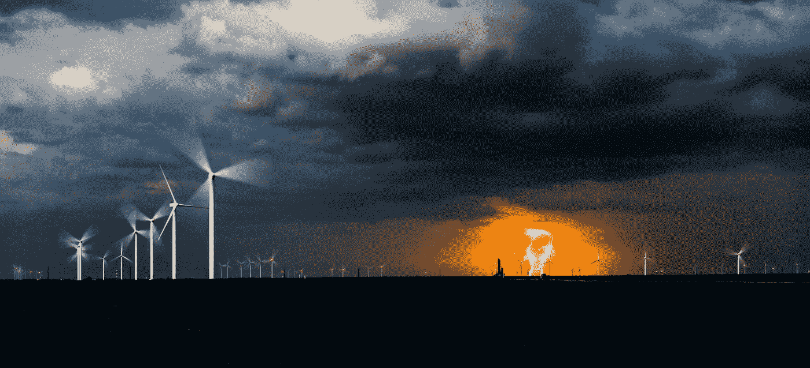

# 见见这个计划象征全球可再生能源产业的人

> 原文：<https://medium.com/hackernoon/wepower-331cc31a3bb>

## 来自:区块链用例世界论坛。

## WePower 联合创始人兼首席执行官尼古拉·马尔蒂纽克

“We believe that the WePower project might be one of the turning points in proving blockchain’s applicability in one of the most fundamental industries to our daily lives — energy.” —Nikolaj Martyniuk, Co-Founder & CEO of WePower. Photo by [Cassie Boca](https://unsplash.com/@cassieboca?utm_source=medium&utm_medium=referral).

说话温和的 32 岁男子尼古拉·马蒂纽克(Nikolaj Martyniuk)肩负着可再生能源的使命。尼克出生于立陶宛，2007 年毕业于意大利米兰的[博科尼大学](https://www.unibocconi.eu/)，获得国际经济学和[管理学](https://hackernoon.com/tagged/management)学士学位。他希望掌握具有重大国际规模、在不同且日益一体化的经济体系中运营的公司所特有的管理工具。在那里，他学会了理解和分析文化和经营全球化的动态，以及欧洲和欧洲以外国家之间的关系。

在 Orion 证券集团担任了一段时间的金融分析师后，他帮助立陶宛人降低了燃料成本，同时通过在立陶宛推广使用压缩天然气来保护环境免受污染。此后不久——在 2013 年——他用 [Modus 能源解决方案](https://www.modusenergy.solutions)开发了一个 16 兆瓦的沼气项目管道。他对可再生能源的热情最终让他在 2014 年 10 月获得了 Modus 首席执行官的职位。

2016 年，他的公司[建造了波罗的海地区最大的太阳能发电厂](https://www.delfi.lt/verslas/energetika/lietuviai-baltarusijoje-irenge-didziausia-regione-saules-elektrine.d?id=71723254)——一座每年能够为 3000 户家庭供电的巨型 5.7 兆瓦发电厂。所需的 956 万欧元中有一半来自欧洲复兴开发银行(EBRD)，其余由 Modus 提供。这是该设施的无人机镜头:

22,000 solar panels near Lake Narač, Belarus, built by Modus Energy.

在 Modus International 担任了 6 个月的首席执行官后，Nick 发现了 Arvind Narayanan 的**普林斯顿比特币和加密货币技术[课程](https://www.coursera.org/learn/cryptocurrency)，并顺利通过。他还完成了博科尼大学关于私募股权和风险投资的在线课程。**

**这两门课程激发他创办了自己梦想中的公司: [WePower](https://wepower.network) 。WePower 实现了能源代币化，这基本上意味着能源购买者现在可以直接与绿色能源生产商签订合同。为了实现他的梦想，尼克[在 2017 年 10 月](https://cryptocoin.news/icos/ico-review/wepower-trading-green-energy-on-the-blockchain-2994/)筹集了 300 万美元，在 2018 年 2 月[又筹集了 4000 万美元](http://www.investorideas.com/news/2018/bitcoin/02024WePower.asp)，并组建了一个由技术专家和合伙人组成的[强大团队](https://www.linkedin.com/search/results/people/?facetCurrentCompany=%5B%2211205077%22%5D)。他的新公司被 [Inc.](https://www.inc.com/yoav-vilner/5-of-sectors-blockchain-is-currently-disrupting.html) 、 [FastCompany](https://www.fastcompany.com/40479952/this-blockchain-based-energy-platform-is-building-a-peer-to-peer-grid) 、[纳斯达克](http://www.nasdaq.com/article/estonia-launched-green-energy-blockchain-project-cm904091)、[商业资讯](https://www.businesswire.com/news/home/20180220005792/en/WePower-Selected-Fast-Company’s-Top-10-Innovative)和[许多其他出版物](https://www.google.com/search?q=wepower&tbm=nws)报道。显然，WePower 在其短暂的历史中获得了巨大的发展势头。**

## **为什么 WePower 如此重要**

**尼克创立了 WePower 公司，作为解决目前绿色能源市场存在的问题的一种方式。今天的全球能源市场被“肮脏能源”所主导，即通过燃烧石油、煤炭和天然气等化石燃料产生的能源。根据 EN21 能源公司的《2017 年全球可再生能源状况报告》(第 30 页)，尽管气候变化专家发出了可怕的警告，但世界上多达 78.4%的能源仍然来自化石燃料。**

**将能源市场——自工业革命以来，许多人从中获利颇丰——转变为清洁能源是一项艰巨的任务，需要大量的资金。银行不愿意为这些项目提供资金，因为赚取回报的时间太长。由于预算紧张，政府不愿意为新的大型基础设施项目提供资金。在位者不愿意改变，因为他们在继续从自然资源中获取数百万美元价值的既得利益( [Navigant Research](https://info.aee.net/aen-2017-market-report) 估计每年 1.4 万亿美元)，尽管这对地球来说是代价。**

**在不愿改变现状的情况下，担心的最终用户正在寻找替代方案。随着世界走向去中心化的未来，像 [SolarCoin](https://en.wikipedia.org/wiki/SolarCoin) 和 [Power Ledger](https://en.wikipedia.org/wiki/Power_Ledger) 这样的点对点能源平台已经出现，它们允许可再生能源的去中心化买卖。然而，大多数 P2P 能源平台难以超越微网。因此，WePower 的目标是通过允许终端用户直接参与可再生能源项目的融资来推广可再生能源。作为回报，这些终端用户以低于市场的价格获得电力。**

## **WePower 平台的工作原理:**

1.  **一家可再生能源生产商希望建设 100 兆瓦的太阳能发电能力。这样一个项目的费用估计为 1 亿美元。制作人还差 2000 万美元才能将这个项目付诸实施。**
2.  **利用 WePower，生产商将 2000 万美元的预计发电量进行象征性地表示，并以低于市场价的价格预先出售。**
3.  **项目完成后，电力被提供给购买者，他们可以自己使用或在市场上出售。**

## **WePower 迄今为止的进展**

****WePower 有一个大胆的愿景，它似乎正在获得巨大的动力:****

**WePower [在 2017 年 10 月](https://cryptocoin.news/icos/ico-review/wepower-trading-green-energy-on-the-blockchain-2994/)筹集了 300 万美元，作为初始种子投资，以测试市场将如何反应。**

**12 月， **EnergyAustralia** [从 300 多名申请者中选择了](https://www.energyaustralia.com.au/blog/innovation/meet-selected-teams-our-accelerator-program) WePower 加入他们在[的 Startupbootcamp Energy Australia 加速器项目](https://www.energyaustralia.com.au/blog/innovation/accelerator-program-nurturing-worlds-brightest-energy-startups)。这个项目得到了像澳大利亚能源和一尘不染这样的主要能源公司的支持。底线是价值数十亿美元的公司将帮助 WePower 在澳大利亚扩大规模，同时在欧洲扩张。EnergyAustralia 受到亚洲能源公司的密切关注，参与这项计划也有可能打开亚洲的大门。**

**爱沙尼亚能源系统的中坚力量 Elering[在一月份宣布与 WePower 合作。](https://elering.ee/en/first-international-project-joins-elerings-estfeed-smart-grid-platform)**

**今年 2 月，WePower 完成了一笔价值 4000 万美元的 ICO 交易，成为迄今为止能源行业最大的 ICO 交易。**

**同样在 2 月，**《快速公司》** [将 WePower](https://www.fastcompany.com/most-innovative-companies/2018/sectors/energy) 列为全球最具创新力的五大能源公司之一。WePower 的技术领先地位获得全球认可，正值该公司的关键时刻。**

> **区块链是能源行业的热门话题，一系列初创公司和公用事业公司正在考虑如何将分散计算与分散能源融合在一起。但大多数项目仍处于概念阶段或试验阶段。WePower 是首批将区块链能源网络商业化的公司之一。—快速公司**

**超过 36 位《快速公司》的编辑、记者和撰稿人调查了数千家公司，评选出了 36 个类别的先锋公司。Fast Company 制作这份榜单已经超过 10 年了。每年都追踪商业巨头如谷歌、亚马逊、脸书、网飞和苹果的重大转变和发展。该榜单还关注了 Spotify 和优步等近期参与者的发展，并认可了具有不可否认潜力的新项目。这些榜单中过去的封面故事包括著名的技术领袖，如微软的塞特亚·纳德拉、AirBnb 的布莱恩·切斯基、脸书的马克·扎克伯格和 SpaceX 的埃隆·马斯克。**

**今年，WePower 公司表现良好:**

1.  ****绿山电力**——[帮助客户脱网](https://www.fastcompany.com/company/green-mountain-power)**
2.  ****比亚迪** — [推出首款电动卡车](https://www.fastcompany.com/company/byd)**
3.  ****Sonnen** — [为社区创建现代能源网](https://www.fastcompany.com/company/sonnen)**
4.  ****漂移市场** — [利用区块链连接独立电力生产商和消费者](https://www.fastcompany.com/company/drift-marketplace)**
5.  ****WePower** — [通过区块链技术实现可再生能源的大众化](https://www.fastcompany.com/company/wepower)**
6.  ****Entrade** — [用于将垃圾转化为清洁的电力、供暖和制冷](https://www.fastcompany.com/company/entrade)**
7.  ****GE 电力** — [在世界各地建设风力发电场](https://www.fastcompany.com/company/ge-power)**
8.  ****Ciel & Terre** — [用于不寻常地方的浮动太阳能电池板](https://www.fastcompany.com/company/ciel--terre)**
9.  ****Zen 生态系统** — [将智能恒温器引入商业空间](https://www.fastcompany.com/company/zen-ecosystems)**
10.  ****蒲公英**——[降低家庭地热发电成本](https://www.fastcompany.com/company/dandelion)**

**二月初，挪威输电系统运营商拜访了 WePower 在爱沙尼亚的工程团队，讨论了令牌化能源交易和区块链技术的未来:**

**爱沙尼亚能源代币化项目也引起了**欧盟委员会**能源总司的注意，他邀请 WePower 就区块链欧洲级能源交易的愿景进行会谈:**

**WePower CEO, Nikolaj Martyniuk speaking after his first meeting with the EC.**

**在获得种子资金不到 4 个月、获得 ICO 不到 3 周的时间里，WePower 的 Nick 和团队以及他们的顾问产生了如此大的兴趣，他们似乎已经准备好成为第一个象征全球可再生能源行业的平台。欧洲和澳大利亚对 WePower 技术的日益认可将有助于该公司更快地融入能源市场。这将使能源开发商更快地采用这种技术，从而使更多的能源可以在 WePower 平台上交易。这是能源供应商的胜利，是能源用户的胜利，更重要的是，是地球的胜利。**

**观看此空间…**

*   **[公司网站](https://wepower.network)**
*   **[白皮书](https://drive.google.com/file/d/0B_OW_EddXO5RWWFVQjJGZXpQT3c/view?usp=sharing)**
*   **[领英](https://www.linkedin.com/company/11205077/)**
*   **[中等](https://medium.com/wepower) (3k 追随者)**
*   **推特 (29k 粉丝)**
*   **[电报](https://t.me/WePowerNetwork) (43k 成员)**

****

**Nikolaj Martyniuk, CEO & Co-Founder, WePower — disrupting and tokenizing the global energy industry.**

## **关于作者**

**迈克尔·豪普特在早餐时狼吞虎咽地阅读区块链的白皮书，并写下他为女儿设想的光明、分散、对等的世界。他在《来自 2035 年的明信片》中描述了一个由区块链驱动的社会，他担心我们可能无法实现这一目标，除非我们能找到创造性的能源解决方案来驱动一个由区块链驱动的世界。**

## **法律方面的东西**

**这篇观点文章代表了迈克尔·豪普特的个人观点。在 WePower 通过初步的 [ICO 评估](/@michaelhaupt/quick-blockchain-startup-or-ico-evaluation-checklist-c1a42b5038d9)后，他因分享自己的观点而获得报酬，他依靠 WePower 管理团队提供的信息来形成自己的观点。**

> **本文不是招股说明书，也不是投资征集，它与任何司法管辖区的证券发行都没有任何关系。**
> 
> **这篇文章不能被理解为投资建议。**