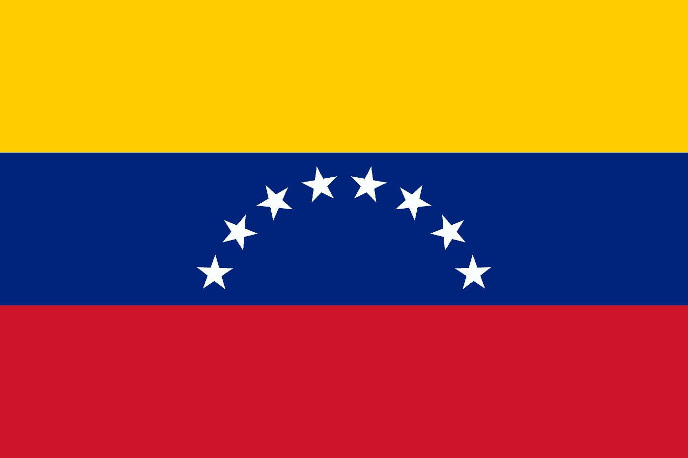

# 我们都是委内瑞拉人

> 原文：<https://medium.com/hackernoon/were-all-venezuelans-c3ac98354f52>

由于通货膨胀，如今加拉加斯一杯咖啡的价格相当于 15 年前同一地区一套小公寓的价格。该国的通货膨胀率预计将在不到一年的时间里达到惊人的 13000%。这种现象被称为恶性通货膨胀，以前发生过很多次。主要靠贷款融资的第一次世界大战结束后，德国通过本币升值来偿还国债。到 1923 年 11 月，1 美元相当于 42105 亿德国马克。这种情况也发生在奥地利、中国、法国、希腊、匈牙利、朝鲜、波兰、菲律宾、南斯拉夫、津巴布韦和苏联。古罗马的衰落是地缘政治失败的结果，其中帝国货币之一安东尼那斯的贬值起了很大的作用。

那么恶性通货膨胀和正常通货膨胀有什么区别呢？从理论上讲，一个运转良好的国家经济应该有每年 2%到 3%的通货膨胀率。这是为了确保人们总是被激励去做一些事情，而不是什么都不做。存钱会受到惩罚，而花钱会得到回报。这让公民忙于工作，也让经济保持增长。除非你仔细看看。你看，新铸造的，印刷的，或者现在凭空变出来的，在你的屏幕上出现的硬币不仅仅是随机发给公众，而是以贷款的形式出现，首先从中央银行贷给小银行，然后从小银行贷给公众。所有这些都是为了偿还之前的贷款，让我们保持一致。如果你缩小到更大的时间尺度，通货膨胀和恶性通货膨胀看起来完全一样。不是因为它们相似，而是因为它们是*相同的现象。*

通货膨胀*是*盗窃。别搞错了。有人称之为隐藏税，但这种税被当权者掩盖，以操纵其公民屈服*也是盗窃，*没有任何理由证明这种不真诚的手段是正当的。以委内瑞拉为例。有人在过去的 15 年里偷走了这个国家所有的钱，并用一杯咖啡的价值代替了每套公寓的价值。在“健康的”3%通货膨胀的情况下，一个国家的货币价值将在不到 23 年的时间里减半。这是慢动作的恶性通货膨胀，有人仍在从每个人那里偷钱。这让我想起三句名言:

人类最大的缺点是我们无法理解指数函数 —艾伯特·艾伦·巴特利特

请允许我发行和控制一个国家的货币，我不在乎谁来制定法律 —迈尔·阿姆谢尔·罗特席尔德

*“如果你不相信或者不明白，我没有时间去试图说服你，对不起。”* —中本聪

一些人回避比特币，因为他们向自己承认，他们对比特币了解得不够多，这通常是正确的。投资你所知道的。只要记得问问自己，你对自己已经拥有的东西了解多少。例如，你真的知道中央银行是如何运作的吗？房价真的在上涨吗？或者当周围的货币体系发生变化时，*的一套房子*仍然值*的一套房子*吗？比特币是你所在的仓鼠转轮的急停按钮。集体金融疯狂的补救措施。这不会让你一夜暴富，但会改变你的视角。不先了解当前的货币体系出了什么问题，就无法理解比特币。