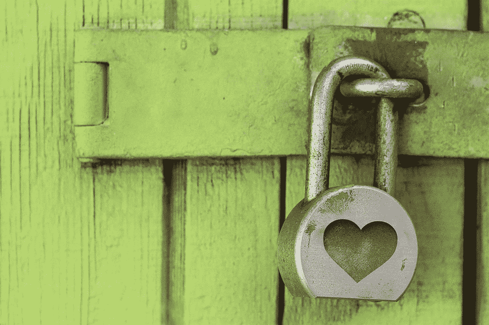
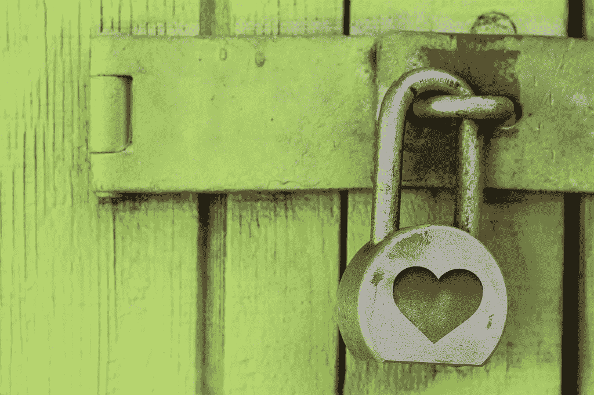

# 我们没有给浏览器足够的信任…

> 原文：<https://medium.com/hackernoon/were-not-giving-browsers-enough-credit-5c7e7359109>

我目前正在做一些特殊浏览器的项目。我不能提供更多的细节，但要点是，我将只有一个 WebView 来玩。浏览器的界面是 JavaScript/CSS/HTML，为此我们分别使用 vue.js 和 Sass。

我也在运行操作系统的内部版本，因为我想站在前沿。我自己的浏览器是一个开发者预览版。这一切教会了我很多东西。

*   浏览器和网络视图有很大的不同
*   在 web 技术中，构建各种奇特的界面是可能的。但是经常会有一些难以解决的问题，比如 T2 安全问题、性能问题和可访问性问题。
*   当你的浏览器是一个移动的目标时，日常的浏览是很糟糕的

它教会我的主要事情是，作为开发人员，我们对浏览器有一个非常扭曲的看法。或者更准确地说，对用户来说什么是重要的。

# 浏览器是一种网络显示工具

*Photo by* [*Kevin Ku*](https://www.pexels.com/photo/coding-computer-data-depth-of-field-577585/)

在与客户的会面中，我发现了一些对他们来说最重要的事情:

*   **性能**——浏览器应该快速启动，而不是让操作系统陷入消耗资源的泥沼，并保持响应。这不仅是第一次使用，而且通常是长期使用的巨大需求——例如在 kiosk 场景中。浏览器重启并不常见，也没有必要
*   **可靠的内容显示** —浏览器也应该即时呈现内容。内容可以是 HTML 文档，以及这些天来它们所附带的所有内容。但是越来越重要的是，所有类型的媒体都能顺利播放。而且往往没有机会依赖一个插件或者第三方播放器。这意味着浏览器应该是视频/音频播放器。它也应该是一个 ePub 和 PDF 阅读器。而且它需要毫无停顿地渲染巨大的图像和 WebGL/WebVR 内容。

这两种情况都不应该令人惊讶——这也是我们作为开发人员所期望的。作为开发者，我们也想要更多。我们在开发者工具体验上投入了大量的赌注。我们希望浏览器支持最新和最热门的实验技术。如果不是所有的浏览器制造商在这两个方面都与其他制造商不相上下，我们就会向他们抱怨。

> 然而，大多数想要定制浏览器的客户有其他的优先考虑。

# 浏览器是使能器

Photo by [rebeck96](https://pixabay.com/p-724689/?no_redirect)

我很高兴听到与我合作的每个客户都高度重视可访问性。我不太高兴看到在 WebView 中制作一个可缩放的界面有多么困难。以及如何正确使用键盘。以及如何启用屏幕阅读器访问和文本到语音界面。但那是我作为开发者的工作。还有你的。

> 浏览器需要让所有不同能力的人都能找到他们想要的东西。能力不是一种固定的状态，而是随着环境和外界影响而波动的。

最近，当我不得不将浏览器放大到 110%来阅读普通网站时，我发现了这一点。一个提醒，我是我看起来的年龄。我后来通过切换到 varifocals 修复了它，但我很高兴浏览器允许我当场修复它。通常嵌入在应用程序中的 WebView 不允许这样做。

# 浏览器是守护者

Photo by [ShonEjai](https://pixabay.com/p-1516242/?no_redirect)

一个非常常见的需求是让**在浏览器**中阻止不想要的内容。这包括从必须具备的恶意站点过滤器到弹出窗口拦截，再到提供预先批准的白名单并拦截所有其他内容。广告拦截通常也是一种需求，但最大的担忧是一个打开的文档可能会让攻击者访问计算机。

浏览器创建者有一个共享的已知攻击网站列表来过滤。这是一项伟大的服务，在过去的几年里保护了相当多的人。

在安全的网站上显示不安全的内容是我需要解决的另一个问题。虽然浏览器有用户界面和内置的屏蔽功能，但有些网页允许混合内容。这可不好。

人们还希望确保视频显示不依赖插件，或者完全禁止 Flash 内容。PDF 也是一个大问题。他们这样做是正确的。浏览器做了很多事情来避免畸形的 pdf 来监视我们。

说到间谍活动，隐私浏览模式或阻止追踪者的一般浏览体验也排在前列。这并不奇怪，也是一个明智的特性。

然而，私有模式的对立面也是我们一直低估的东西。

# 浏览器是记忆的守护者

Photo by [Rachel Demsick](https://www.flickr.com/photos/rmdemsick/5065345783)

> 浏览器的存在是为了让我们显示网页，但更重要的是，随着我们使用浏览器的次数越来越多，浏览器也变得越来越容易。

我在自己使用一个不可靠的(预览版)浏览器时感觉到了这一点。我意识到不断地重新输入密码是多么糟糕。当我键入 URL 的几个字母时，没有我一直访问的网站自动完成是多么令人讨厌。当你没有登录时,“与 X 共享”按钮是如何变得无用的。本质上，我是多么依赖浏览器来记住我做了什么，并在这一过程中智能地帮助我。

> 我们没有给浏览器制造商足够的信任来获得这种神奇的体验，因为它——像所有好的 UX 一样——是无形的。

一个自动安全地存储和输入表单数据的浏览器对我来说是一个很大的帮助。它甚至保护我避免输入错误的信息和令人沮丧的重新填写的经历。是的，当然这也是一个攻击媒介，但这并不意味着我们不应该庆祝它的有用性——相反**我们应该让它更安全。**

> 让 Firefox 的“awesomebar”记住我过去 10 年的冲浪习惯宠坏了我。

我都不记得上次收藏东西是什么时候了。我的重要发现我还是在推特上发布了，让 Pinboard 替我记住它们。

其他人可能也有很多书签。加上同步的自动填充内容和历史记录，能够将这种体验带在身边真是太棒了。独立于电脑、手机或设备。

# 结论

说到回答浏览器为我们做了什么，我在过去的几个月里学到了很多。当我向其他公司从事浏览器工作的同事和朋友要求功能时，我会更加谦虚。他们正在做一项不可思议的工作，开发一个软件，以一种可访问且安全的方式显示网络。一旦你了解了网络和网络浏览的攻击媒介，你将会度过一个难熬的夜晚。

> 我还了解到，当谈到谁在浏览器领域赢得了最多的用户时，这取决于他们如何处理用户数据。

作为开发人员，平台的技术能力和“挑战网络的极限”令我们兴奋不已。然而，最终用户希望 web 使用起来简单、快捷、安全。他们还希望浏览器知道他们去过哪里，并选择什么时候不应该去。他们希望一些事情能够自动化，并且能够方便地访问他们的内容，然后发送到网络上。从隐私的角度来说，我也对此感到不安，但那些让这变得最容易的人，赢了。

说到浏览器能做什么，它们比以往任何时候都更加不相上下——这要归功于标准。

> 最大的区别不在于支持什么样的技术，而在于浏览器在多大程度上是网络上的旅行伴侣。这是一场数据、洞察力和浏览器界面本身的良好 UX 的游戏。

我对未来我们能做些什么来帮助人们在浏览器中保持他们的在线身份而不泄露它更感兴趣。我希望看到更多的界面，让人们在使用浏览器时了解自己数据的价值。

浏览器不仅仅是网络的显示机制。它记录了你的身份和历史。如果做得好，这可能是一件伟大的事情，如果做得不好，这可能是一件可怕的事情。我担心网上有太多人在不知情的情况下留下面包屑。他们看到了便利，却不知道后果或对他人的价值。

我邀请任何其他 web 开发人员仔细看看浏览器的界面元素和以用户为中心的特性。有很多美丽和非常聪明的，基于研究的界面可以找到。我希望看到这在我们的圈子里得到更多的报道，而不仅仅是哪个新的 API 或技术特性是下一个大事件。