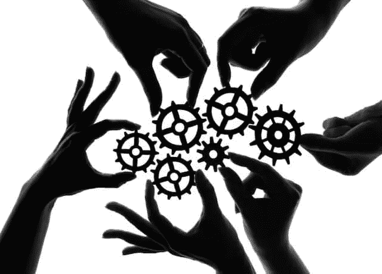

# 我们正在走向分权组织的未来

> 原文：<https://medium.com/hackernoon/were-on-our-way-to-a-future-of-decentralized-organizations-46230576bc4b>

image source: [Marketing91](https://www.marketing91.com/)

自 2009 年比特币刚刚发布以来，去中心化自治组织的概念就一直存在。

DAOs 涉及实现特定的、预编程的规则，这些规则描述了系统中可能发生的事情，并通过智能合同强制执行指定的规则。

## **什么是刀？**

2016 年，官方试图创造一把刀。这个组织简称为“道”。

DAO 于 2016 年 4 月 30 日正式启动。截至 2016 年 5 月 15 日，它已经筹集了超过 1 亿美元。到资助期结束时，它已经从总共超过 11，000 名成员那里筹集了超过 1.5 亿美元。这远远超出了它的创造者的预期。

它的工作原理是允许参与者购买 DAO 令牌，然后他们可以用这些令牌为他们想要资助的项目投票。

除了为项目投票之外，参与者还可以对新规则、现有规则的更改进行投票，甚至可以决定是否终止某个特定小组成员的成员资格。这个过程本质上是用密码保证民主。

DAOs 的好处之一是，一旦实现，代码就不能被更改或篡改，这意味着一个人没有能力改变系统遵循的规则。

然而，这也造成了重大的安全漏洞。例如，如果代码中存在 bug，开发人员将无法修复它。这正是[DAO 项目被黑时发生的事情。](https://coincodex.com/article/50/the-dao-hack-what-happened-and-what-followed/)

## **是什么导致了刀的没落？**

不幸的是，DAO 的软件中有几个错误。其中一个错误包括“递归调用”错误，该公司很清楚这一点，因为 DAO 的创始人之一[发布了一份声明](https://blog.slock.it/no-dao-funds-at-risk-following-the-ethereum-smart-contract-recursive-call-bug-discovery-29f482d348b)，向贡献者保证“没有 DAO 基金会有风险”。

> 当开发人员致力于解决这个问题时，一个黑客开始利用这种方法来耗尽 DAO 从其令牌销售中获得的以太网。

几个小时之内，大约 360 万乙醚(当时价值约 7000 万美元)从道的资金中被抽走。

DAO 包含了大约 15%的以太，因此，黑客不仅削弱了他们的平台，也对以太坊的价格产生了负面影响。在此期间，乙醚的价格从 20 美元暴跌至 13 美元以下。

黑客入侵后该做什么的决定是由股东投票决定的。结果是 89%的人投票支持硬分叉。结果 2016 年 7 月 20 日发生了分叉。这种加密货币共享以太坊区块链高达 1920000 块的所有数据。

从这次磨难中，我们可以学到一些宝贵的教训。特别是，它向我们表明，虽然“一体行动”在理论上是一个好主意，但在实施中存在许多缺陷，因此，未来的项目应该注意到这一点并采取相应的行动。很明显，未来的项目需要增加严格的安全协议。

## 如何改进 DAOs？

image source: [Unsplash](https://unsplash.com/)

尽管 DAO 项目失败了，但越来越清楚的是，DAO 将在可预见的未来继续存在。数百个团队现在正致力于构建他们自己的分散协作平台。

然而，这些分散的组织仍然缺少一个关键要素:一个能够大规模决策的治理系统。这样的组织将使成千上万，甚至可能是数百万的用户能够一起快速做出重要的决定。

[DAOstack](https://daostack.io/) 就是这样一个致力于此的平台。该应用程序本质上是 DAOs 的一个分散式操作系统，用于扩展协作决策。

它将允许数以千计的开源创作者走到一起，共同开发他们自己的分散式应用程序(dApps)。此外，它将把产品的个人所有权分配给价值贡献者。

人群管理者甚至能够合作拥有和管理多价值排名系统，与 Yelp、Tripadvisor 和 Youtube 等网站竞争。

DAOs 的未来潜力是巨大的，DAOstack 可以成为开发实现这种转变所需的基础元素的应用程序。

另一个用来改进 DAOs 功能的类似平台叫做 [Digix](https://digix.global/) 。DigixDAO 项目巩固了自己作为以太坊第一个主要分布式自治组织的地位。

该平台推出了两种代币，分别名为 DGX 和 DGD。DGX 代币的用途是投资黄金，而 DGD 代币主要用于投资 DigixDAO 平台本身。

该项目使用户能够通过 ERC20 令牌购买黄金，称为 Digix 黄金令牌(DGX)，这意味着 DGX 令牌的波动性将远低于其他加密货币，用户现在将有一个稳定的地方来存储他们的资金，而不必将其兑换回法定货币。

DigixDAO Token (DGD)的持有者将能够投票决定资金的分配。如果达成共识，那么资金将被分配给这个用例。照目前的情况来看，DigixDAO 很可能成为黄金的未来。

## **DAOs 可能改变工作的未来**

Dao 是有史以来最公平、最具成本效益的商业模式之一。他们消除了中间人，这通常是集中式项目中最大的弱点，最重要的是，确保利益相关者的利益是一致的。

毫无疑问，它们有可能彻底改变工作的未来，而且有无数种方法可以实现它们，创造性地解决我们最大的一些问题。

一个自主但以人为本的未来可能会比我们许多人预期的更早到来。唯一的问题是:哪家公司能经受住时间的考验。