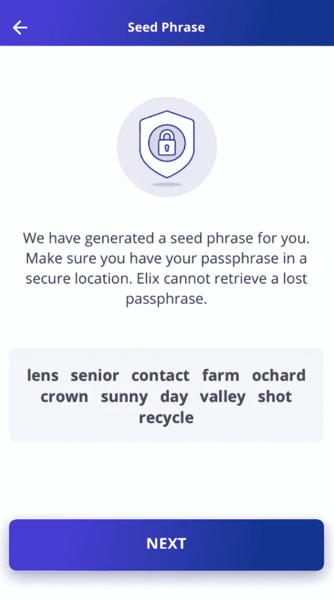

# 我们正在推出我们的测试版！点击这里查看更新。

> 原文：<https://medium.com/hackernoon/were-rolling-out-our-beta-f83495c8f211>

本周，我们的测试版开始推出！我们现在使用 TestFlight 的测试门户在朋友和一些社区成员中分发应用程序。对我们来说，这是一个激动人心的时刻，代表着数月辛勤工作的高潮！Android 测试将在不久的将来进行。

首先，我们邀请那些已经建立了早期项目的人来试用测试版(我们还在建立一些项目)。邀请函将于今晚午夜(太平洋时间)发出。如果您收到试用版的邀请，以下是测试和查看您的项目的方法:

如果你有 iPhone，你可以在这里下载试飞。TestFlight 将在新版本发布时通知您，让您快速更新到 ELIX 应用程序的最新测试版。我们通常每天都会发布很多构建，所以会有很多要测试！该应用程序使用 Ropsten testnet。可以用应用内(惊喜！)Trollbox 聊天功能发布您的公共钱包地址，我们会向您发送一些假的 ELIX 和 ETH，以便您可以尝试该应用程序——不要向该钱包发送真的 ELIX 或 ETH，因为该应用程序连接到 Ropsten 节点。在我们完成未来几天我们想要进行的所有更改后，我们将开始与更多人共享该应用。当我们迁移到 mainnet 时，我们也会通知社区和我们的 Beta 测试人员。

**确保你注册了试用版！**

到目前为止，已经有 750 人注册了测试版！如果您还没有注册，请注册我们的[主页](https://www.elixirtoken.io/)。此外，如果您还没有提交项目想法，请务必在此处提交一个项目想法来推动[。](https://www.elixirtoken.io/boost)

**设计**

设计公司已经完成了钱包设置流程的重新设计。下面，我们展示一些新设计的例子。以下是 wallet 设置的外观:

密码验证如下所示:

通过要求用户陈述顺序，最容易验证密码:

完成钱包设置后，用户将会看到以下内容:

**发展**

我们有一份对 Beta 版本的改进和变更列表，我们会尽快消除任何错误！当我们浏览这个列表时，我们在应用程序中做了许多小的改变。当我们发布测试版并推出新版本时，我们的测试人员将能够衡量开发的进度和速度。我们希望让测试版和我们在测试版上的未来进展来说话。

**智能合约**

我们的众筹智能合同目前要求达到一个最低目标，以便分配资金。我们开发了智能合约，允许使用 ELIX 和 Ether 以预定义的、波动性调整的金额持续支持项目，而不是一次性分发令牌或 Ether。这意味着，如果创作者选择持续分发的模式，他们就不必等到达到最低融资目标才能获得代币或 ETH。

**奖励**

我们将调整我们的用户界面，允许贡献者指定他们希望接收来自创建者的通信的电子邮件。电子邮件存储在链外，以保护那些宣誓者的隐私。这使得创作者可以联系支持者，如果他们需要更多信息，如运输细节，或想通过电子邮件提供更多更新。这是宣誓时的样子:

我们希望您能对我们的进展提出反馈！请在我们的社交渠道上告诉我们您的想法！请务必在这里[注册参加测试，并在 ELIX 应用推出时试用它。](https://www.elixirtoken.io/)

请务必在我们的[主页](https://www.elixirtoken.io/)上注册，以便尽早获得测试版，并通过社交媒体 [Reddit](https://www.reddit.com/r/elixirtoken/) 、 [Twitter](http://twitter.com/elixtoken/) 、 [Discord](https://discord.gg/mu4EJaz) 和 [Telegram](https://t.me/ElixirToken) 进行联系。我们还有新的[脸书](https://www.facebook.com/elixirtoken/)和 [Instagram](https://www.instagram.com/elixtoken/) 页面，你可以在我们的[网站](https://www.elixirtoken.io/)底部订阅时事通讯。我们的创造者门户网站也开放提交[这里](https://www.elixirtoken.io/boost)！如果您有任何问题，请告诉我们，我们很乐意帮助您解决问题！