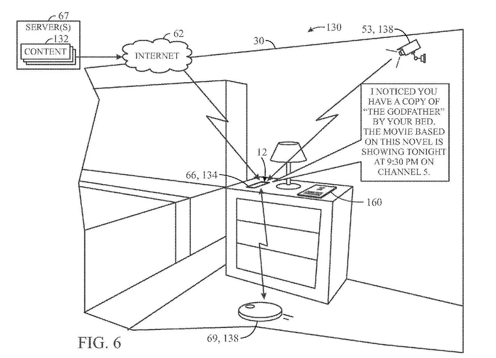

# 我们离更美好的未来如此之近，只要我们不谈论隐私

> 原文：<https://medium.com/hackernoon/were-so-close-to-a-better-future-if-only-we-d-shut-up-about-privacy-104f374a2cad>

Photo by [Tom Sodoge](https://unsplash.com/@tomsdg?utm_source=medium&utm_medium=referral) on [Unsplash](https://unsplash.com?utm_source=medium&utm_medium=referral)

## 欢迎来到新的世界秩序，你的信息就在那里，为什么不让它对你有益呢？

我最初写这篇文章是在扎克伯格出现在国会之前，似乎是在他的“证词”之后，不会有任何关于脸书到来的规定。很明显，美国政府这个老家伙甚至不知道脸书是什么，也不知道如何控制它的传播和影响。

亲爱的读者，随着围绕脸书已有近四年历史的宽松个人数据保护机制的不和谐的喋喋不休，我想花一点时间给你一个对正在进行的隐私辩论的更好的回应。

准备好了吗？

跟着我重复。

亲爱的脸书， ***我如何给你更多我的数据*** ？

## 当然也有警告。

作为获得更多个人信息的回报，我要求两件事；保护这些数据，明确你何时以及如何分享它们，更重要的是， ***让我的生活更美好*** 。

这适用于所有主要的技术平台和服务提供商；你可以得到所有你想要的信息，关于我去哪里，我看什么，我和谁互动，我写的电子邮件，我听的乐队，我购买的产品，如果
(大如果)，作为回报，你 ***继续前进*** ***真正个性化*** 我得到的信息、服务和产品。

我想要的，本质上是一个 ***个性化的操作系统*** 。

一个人的操作系统，专注于减轻我的负担，强调让我最快乐的事情，并为我们承诺了很久的未来带来生活。

> 使用数据让我更容易找到和消费我想要的东西，如何和何时需要它。

你的工作(技术平台和不久的政府)是向我(嗯，我们所有人)交付我们应得的 ***技术乌托邦***；系统预测我们的需求，连接我们生活中的点点滴滴，消除我们生活中所有讨厌的摩擦。

来自谷歌的一份专利申请:

就像上面的图片一样，并不是每一种用法都是非常具有侵犯性的。

# 美好的未来会是什么样子

通过更广泛地获取我们的信息(以及机器 Learning⁴的进步)，世界上的 facebooks 和谷歌还能做些什么？

一个短名单，以我为例；

1.  我喜欢白色的查克·泰勒(匡威)运动鞋，我每年都会买一双(或两双)。一个智能平台，充满了来自我的电子邮件(收据)和网络搜索(匡威出售的鞋子)的数据，应该能够告诉我什么时候该更换我现在的鞋子了(根据购买日期或以前的购买历史，胎面磨损)，然后告诉我什么时候我在附近的零售商那里有我喜欢的，符合我的尺寸，正在出售，就在拐角处(或者可以在线购买并自动订购送货)。
2.  我今年 42 岁了(仍然接受礼物),像我们大多数人一样，可以对我的健康有更好的指导。如果我的医疗记录在一个开放的系统中，结合我的食品购物习惯和生活方式(健身房时间+餐馆访问次数和甘蓝购买频率)，它们可以与其他 42 岁具有类似信息的广泛数据集相匹配，并用于提供预测性医疗建议和更好的诊断。
3.  我讨厌电子邮件，每个人都希望它消失，它拒绝死亡，它不会去任何地方。在电子邮件的混乱中，并不是所有的信息都是平等的；一个更了解我的系统，没有理由不能将电子邮件分类为可操作的和信息性的分组，处理简单的回复(知道我什么时候有空，或者项目的状态)，向我突出显示需要注意的项目，并确保我再也不会在收件箱中看到垃圾邮件。
4.  互联网上有相当一部分人已经相信[脸书](https://hackernoon.com/tagged/facebook)正在监听我们的对话，让他们听吧。如果我对某件事表现出明显的兴趣，比如一位音乐家或一部新电影，我为什么不想让音乐内容在我下次打开[谷歌](https://hackernoon.com/tagged/google)音乐或 Spotify 时出现，或者在一场演出或电影开幕时收到通知，费用再次立即从我的账户中扣除(当然是语音验证后)。
5.  多年来，我一直希望我们能够超越记录数据的时代，进入机器测量我们告诉他们的东西并给我们可操作的情报的时代。我的智能手表可以计算我走了多少步，或者我的 FitnessPal 可以让我输入我吃的食物，这些都很好。但是这些被动的输入除了填充漂亮的图表之外，并没有做更多的事情。一款应用程序可以扫描我的面部和身体变化，对我社交媒体帖子中的语言进行情绪分析，观察我吃什么和我活动的频率，然后向我建议改善我身体健康和心理健康的活动，现在这将是一件大事。

还有几十个很容易想象的例子，足以说明我们周围的机器和驱动这些机器的系统正变得足够复杂，以支持这种愿景，所以你不希望我们周围的设备做更多吗？

难道我们不应该在更大程度上受益于我们所掌握的大量技术和计算能力吗？

> 我们正在路上，看看谷歌的最新活动:“让谷歌去做”——https://www.youtube.com/watch?v=eegp9AaqbxE

# 接受这个个人数据的未来

当涉及到我们的个人数据时，有两个普遍真理；

1.  对于技术平台来说，我们的数据只是总体上的；单个来看，它几乎一文不值
2.  对于消费者来说，了解我们的个人偏好、动机和激情是如何找到让我们生活更美好的方法的圣杯

一个有趣的分裂，以及为什么乱飞的核心处理关于脸书，谷歌，等人有多少数据关于我们， ***是不是帮助事情*** 。

脸书和谷歌是伪装成广告平台的数据聚合者；他们无法说服品牌给他们钱，除非他们能提供大量的客户。

大规模交付意味着品牌不知道他们在向我做广告，Kerry Morrison，他们只是选择一个我(以及许多其他人)适合的桶，并通过平台上的广告，试图吸引我购买一些东西。

这些水桶有很好的针对性，是的，他们有，但他们仍然只是一群无名的消费者。

《出埃及记》在脸书的广告平台上，我可以列出所有年龄在 40-60 岁、住在西雅图、养狗、会说英语、讨论过抵押贷款的男性。利用这一精确的分类，脸书将允许我向大约 84000 人做广告，这些人我都不知道他们的个人详细信息，但我的信息将会到达他们那里。

> 顺便说一句，这种水平的洞察力并不新鲜，为什么你谈论脸书和剑桥分析公司的任何数字营销人员都以某种版本回应……嗯，废话。

这种定位水平已经存在多年了，它在让我们买东西方面非常有效，但这是一种短视的观点，只能让我们在实现真正个性化的道路上走一部分。

这些传统方法关注客户购买、查看或消费的内容，这导致了只以产品为中心的观点，限制了客户的理解。

我们正处于早期的进化，是一个产品的混合体(因为我们最终仍然想要和需要我们的“东西”)，包裹在消费者便利的层面上。

看看有哪些新公司开始处理这些新的便利服务将会很有趣(尽管与谷歌的竞争将会很艰难)。

与目前的参与者不同，这些新的团队将把人工服务作为他们数据收集工作的基础，不再局限于搜索或内容交付。

苹果当然是这里的异类，因为他们主要从硬件中赚钱，并且在保护用户隐私方面做得最好。

苹果会是将数字便利提升到下一个水平的公司吗？

# 这个未来愿景对你来说值多少钱

这些人是我们需要决定我们是否得到真正的价值转移的地方。

如果交易是卖给大科技公司，让我们的生活变得更简单，我们会放心把我们的信息交给大科技公司吗？

为了确保这一更光明的未来，技术平台必须在 ***更加努力地工作，赢得我们的信任******保护我们的信息******将透明度*** 插入到流程中。

如果机器学习和算法将有助于管理我们的生活，那么这些系统需要定期接受 ***审计*** 以防止错误的偏见悄悄进入。

它们需要最高级别的加密保护，进一步匿名化(有时),对于不愿意参与的人， ***选择退出控制*** 到位。

# 如果隐私仍然是你最大的恐惧

如果以上都不能说服你，而你仍然对隐私心存疑虑，我希望你明白三件事:

1.  是的，大型科技公司可以更好地保护他们掌握的我们的数据，但他们建立的系统是以拥有我们的个人数据为前提的，并且太有价值了，无法以任何有意义的方式进行改变。你瞧，脸书会做出一些道歉，他们甚至会出现在国会面前，但他们不会从根本上改变他们每天做的任何事情。再次，让我们明确一点，他们很久以前就关闭了允许剑桥分析公司窃取用户数据的入口，这是一个好迹象，但他们可以做得更多。
2.  除了上面强调的未来想法，很明显我们受益于这些数据今天的使用方式；我们想要的产品引起了我们的注意，我们感兴趣的新闻浮出水面，我们感兴趣的电视和电影被突出显示，朋友被推荐——这些都是个人数据的使用，它们给我们许多人带来了积极的体验。
3.  **更好的保护即将到来**
    脸书发生的事情(以及过去几年更令人震惊的数据安全事故——看看你的 Equifax，正在将隐私和个人数据讨论推向前台，人们正在自我教育，知识就是力量，我们对人们使用我们的数据的目的和方式了解得越多，我们就能更好地向那些首先想要我们数据的人提问。

问题归结到你是想拥抱未来还是为过去而战。我理解你的担心，但是杞人忧天对任何人都没有帮助。机器真的很擅长处理数据，那么我们为什么不让它们去做呢？

# 结论

*您对您的个人数据的实际情况了解多少？*

*你能想象一种情景吗？在这种情景下，你能从大技术公司获得如此多的信息？*

你会在你放在网上的东西上花更多心思吗？

想一想你因为使用脸书、谷歌、推特等而获得的价值、联系和体验。作为产品是否值得？

如果这个新的未来不适合你，我完全理解。我要再次问你，你真的认为这些平台带来的价值，但我会是第一个支持你远离它们，转向有严格隐私控制的付费产品的人。

你就是你。

# 进一步阅读

如果你想了解更多关于脸书和剑桥分析的信息:

 [## 你一直都是产品

### 早在脸书之前，你的个人信息就被买卖，只是没那么有效

hackernoon.com](https://hackernoon.com/youve-always-been-the-product-af22b8401e00) 

这是 2015 年的数据，但似乎与今天更加相关。

 [## 隐私开始看起来像是 20 世纪的异常现象

### 在人类历史的大部分时间里，人们很少或根本没有对私人生活的期望。所以新常态，在那里…

www.theguardian.com](https://www.theguardian.com/commentisfree/2015/nov/07/privacy-seems-20th-century-aberration-but-worth-mourning) 

如果你想对我写的东西发表意见，或者如果我能以任何方式帮助你写文章或帮助完善你的产品或技术战略，请给我写信:kerry@betterstory.co 或在推特上找到我。

2014 年，脸书关闭了对用户朋友数据的访问，这就是剑桥分析公司窃取如此多用户数据的原因。

或者谷歌、苹果、推特、微软、亚马逊等。

[https://www . the verge . com/2018/2/19/17027902/Google-verily-ai-algorithm-eye-scan-heart-disease-cardio vascular-ris](https://www.theverge.com/2018/2/19/17027902/google-verily-ai-algorithm-eye-scan-heart-disease-cardiovascular-ris)

我以前写过的⁴As，都是机器学习而不是人工智能。[https://medium . com/@ kmore/ai-does-not-fuzzy-exist-4 a9 C2 b 0 DFB 36](/@kmore/ai-does-not-fucking-exist-4a9c2b0dfb36)