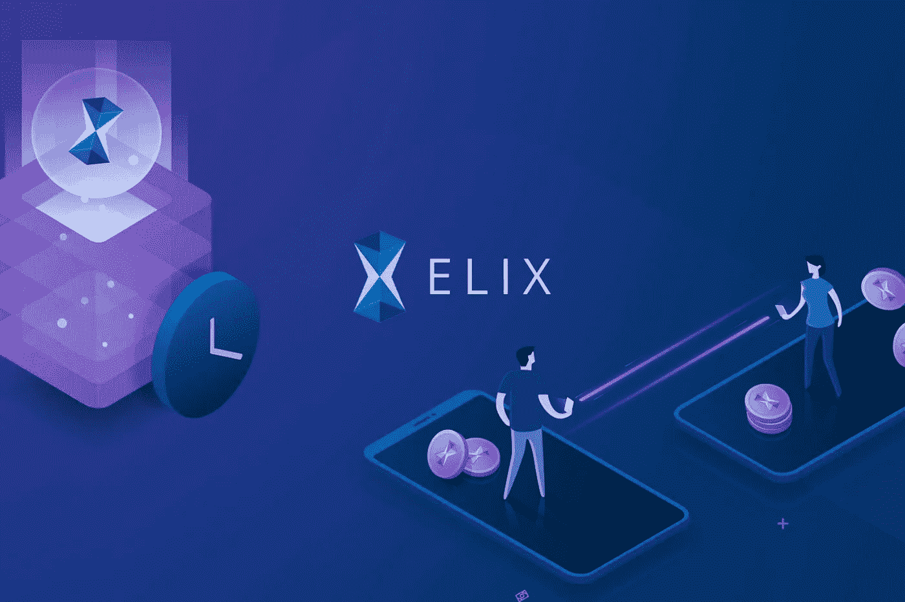
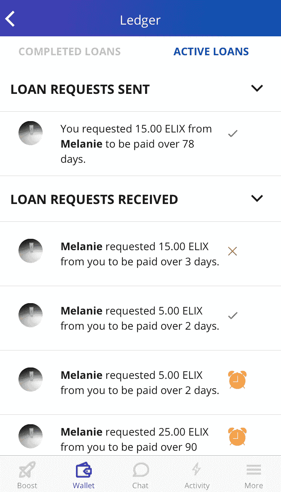
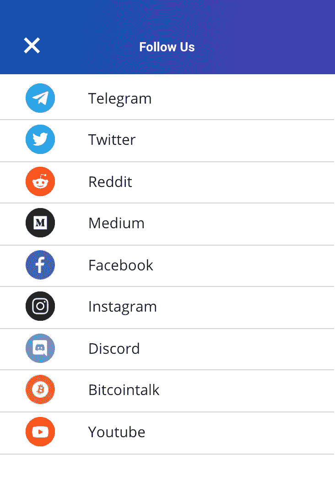

# 我们使用触控 ID 来提高 ELIX 应用的安全性📱🔒+我们新的活动源和分类帐在这里…等等。

> 原文：<https://medium.com/hackernoon/were-using-touch-id-to-increase-security-in-the-elix-app-our-new-activity-feed-and-ledger-b8ba3a2042d2>

欢迎参加这一轮 ELIX 更新！在过去的一周里，我们一直忙于改进我们的应用程序，并为我们的应用程序发布做准备。请继续阅读，了解令人兴奋的细节和我们正在开发的新功能。

**贝塔**

如果你还没有，在这里注册[获得 ELIX 应用的测试版。我们现在有超过 1300 名测试者注册了。在下一个构建中，我们将添加另一组测试人员。我们将按照注册的顺序发布测试版…所以一定要让](https://www.elixirtoken.io/)[得到一个位置](https://www.elixirtoken.io/)。今天将提交包含活动页面和分类帐的构建。一旦获得批准，我们将发布它供我们的社区测试。

**创建者门户**

我们正在努力为我们的众筹平台 Boost 增加新的创作者。在这里报名[就可以成为早期创作者。如果您需要 Boost 的想法，请考虑加密播客、钱包、游戏、智能合同开发、加密摘要甚至定制配件的项目。](https://www.elixirtoken.io/boost)

**新闻报道**

最近，梅勒妮广场在硬币中心做了一次采访。你可以点击查看采访[。Plaza 讲述了她的背景和 ELIX 想要解决的问题。点击下面的预览查看文章:](https://coincentral.com/elix-co-founder-melanie-plaza-talks-crowdfunding-blockchain-usability-and-chicken-tenders/)

ELIX 还出现在区块链新闻来源 Blockonomi 上。你可以在这里阅读初学者指南[或者点击下面的预览:](https://blockonomi.com/elix-guide/)

**视频演示**

这里有一个视频演示，展示了该应用程序的新活动源、分类帐和社交链接部分。视频结束后，我们将详细描述每个新功能。

A demo showing the Activity Feed, Ledger and new social links within the ELIX App.

**活动馈送**

我们新的活动提要显示了最近的交易活动、最近的承诺以及关于项目的一般信息。这是了解应用程序最新动态的最佳方式。我们计划稍后链接活动页面来推送通知。我们也希望人们喜欢整合到众筹页面中的自定义刷新 gif。这是来自我们设计师的惊喜。

**总账**

我们已经将分类账整合到应用程序中！现在，您可以使用分类帐来请求令牌，并获得何时需要将令牌发送回联系人的详细信息。

Josep & Rosello 的设计团队也在为账本进行更新设计。一旦在测试版中经过彻底测试，我们将把这一功能逐步引入即将到来的应用商店版本。

The Ledger, incorporated into the ELIX app.

**可选触控 ID 验证**

我们还增加了可选的触控 ID，以提高应用内的安全性。当发送第一笔交易时，用户可以选择要求触控 ID 访问交易流。这将增加应用程序的安全性，甚至可以防止被盗、未锁定的手机被偷。Josep & Rosello 正在开发一个介绍性的工作流程，让用户选择他们是否希望使用触控 ID——他们设计的自定义弹出窗口应该会告知用户保护他们钱包的额外安全好处。

**社会联系**

我们在更多页面中添加了一个社交链接列表。这将有助于人们了解 ELIX 的最新动态。这是新页面的外观:

我们希望你喜欢这一周的更新！请务必在我们的[主页](https://www.elixirtoken.io/)上注册，以便尽早获得测试版，并通过社交媒体 [Reddit](https://www.reddit.com/r/elixirtoken/) 、 [Twitter](http://twitter.com/elixtoken/) 、 [Discord](https://discord.gg/mu4EJaz) 和 [Telegram](https://t.me/ElixirToken) 进行联系。我们还有[脸书](https://www.facebook.com/elixirtoken/)和 [Instagram](https://www.instagram.com/elixtoken/) 页面，你可以在我们的[网站](https://www.elixirtoken.io/)底部注册订阅时事通讯。要创建自己的项目，在这里注册成为早期创建者。敬请关注[关注我们这里的](/@elixirtoken)精彩更新！

