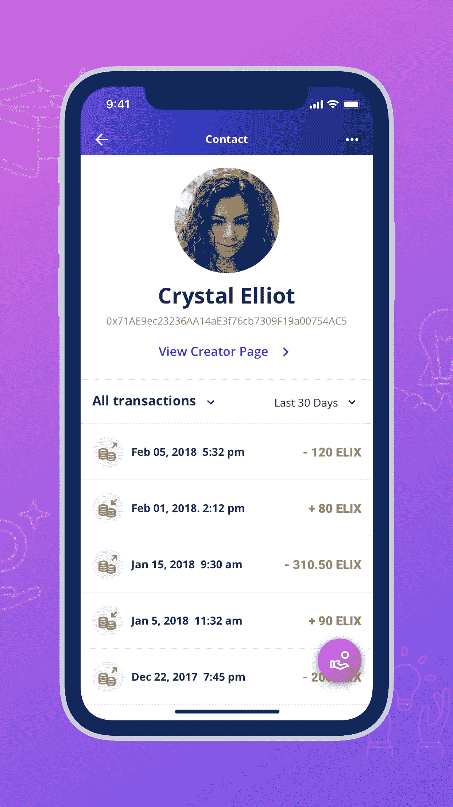
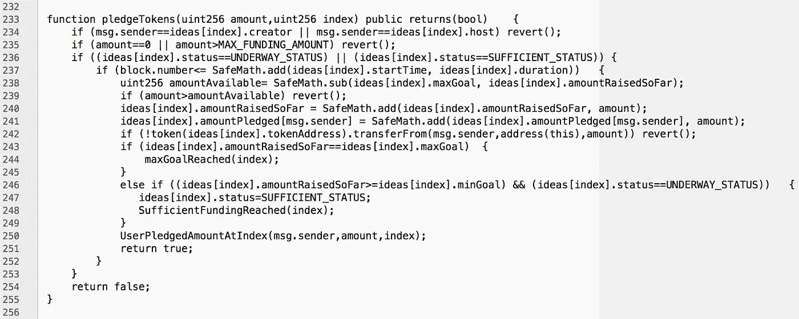

# 我们聘请了一家营销公司，有了一位新的顾问…还有更多！

> 原文：<https://medium.com/hackernoon/weve-hired-a-marketing-firm-have-a-new-advisor-and-more-84414f6acfa0>

我们很高兴为我们的社区带来又一周的 ELIX 更新！

**测试版注册**

这个星期，我们已经达到 975 测试注册。在 [elixirtoken.io](https://www.elixirtoken.io/) 注册即可获得该应用。

**创作者投稿门户**

如果你是一个寻求为一个项目或想法众筹 crypto 的创作者，请在我们的[创作者门户](https://www.elixirtoken.io/boost)上注册。我们正在寻找原始的，创造性的想法。

**营销**

到目前为止，我们一直非常专注于开发，因为我们相信拥有一个令人敬畏的工作产品是我们正在做的事情中最重要的部分。然而，我们知道，业务的其他方面也对我们的成功至关重要，包括我们社区的许多成员一直在询问的营销。随着我们越来越接近一个公共应用程序的发布，我们已经决定现在是开始加大这些努力的正确时间。

过去一周，我们聘请了一家专注于增长的公关公司 [Energent Media](https://energentmedia.com/) 。Energent Media 是一家总部位于旧金山的公司，拥有将品牌与媒体公司(如 Entrepreneur、Forbes 和 Huffington Post)以及其他加密货币出版物联系起来的经验。Energent Media 拥有业经验证的成功记录，并得到了我们认识的其他初创公司创始人的高度推荐。我们很高兴开始与他们合作，并相信他们能够为我们带来一些伟大的成果。随着项目的发展，期待看到围绕 ELIX 的文章和新闻报道！

**顾问**

Devin Smith 作为技术顾问加入我们，我们感到非常兴奋。Devin 在网络和应用程序发布的每一步都有 15 年的技术经验。他曾为沃尔格林、丰田、Tokidoki、Luma Pictures、红十字会、Get Ur Good On(麦莉·塞勒斯的慈善机构)和 Flickr 等公司做过项目，此外，他还是初创公司的联合创始人和首席技术官。他有创建动态、丰富的 UI 网站和应用程序的过程，我们认为他的专业知识将非常有价值，因为我们将我们的测试版带入了主流。Devin 不仅是一名顶尖的开发人员和技术架构师，对伟大的设计有独到的见解，而且他还是一名啤酒爱好者，喜欢在业余时间做一些事情，比如创建最快的 PHP 框架之一 Tipsy。查看 Devin 的个人网站和过去的工作[这里](http://devin.la/)还有他的[博客](http://devin.la/blog)。我们很快会将他添加为 ELIX 主页的顾问。

除了获得一位优秀的顾问，本周 Melanie 还在意大利威尼斯会见了一位出色的开发人员，他有可能加入我们的团队。关于我们加速开发计划的更多细节即将发布！

**设计**

[简&罗塞罗](http://janeandrosello.com/)一直致力于不断改进和扩展我们应用程序中的设计。例如，他们在设计中加入了联系人的交易历史。

Transaction histories for contacts will make our UI more detailed and easy to use.

他们现在专注于创建 ELIX 网站界面的第一个版本，以便我们的社区可以浏览网站并在 ELIX 应用程序上找到有关项目的信息。他们还在努力为应用程序的新功能和元素开发额外的设计。

**发展**

我们将继续根据测试版测试人员的建议对用户界面进行更新和更改。我们要感谢所有测试人员的反馈！很高兴听到人们的想法，我们努力创造一个尽可能用户友好和直观的应用程序。在接下来的几天里，我们将发布一个包含这些更新的新版本。

此外，除了 ELIX 之外，我们还集成了支持 Ether 众筹的更改。我们在与潜在创作者讨论后加入了这一点。虽然我们可能会为创作者提供接受 ELIX 的激励措施，但我们认为，为了使潜在创作者的入职过程尽可能无摩擦，以便应用程序可以在早期提供优秀的内容，这一点非常重要。无论最终产品是否专门关注 ELIX(我们已经听到了来自我们社区的反馈，并阅读了讨论该功能的各种 Reddit 帖子)，我们相信，随着我们的发展，与 ether 兼容的合同为我们提供了选择。

我们正在安卓设备上测试安卓应用，并邀请了一些朋友来测试。由于有各种各样的机器人，我们在发出测试邀请之前正在进行内部设备级测试，因此我们的 Android 用户将能够获得更完美的体验。Android 用户可以期待在下周的某个时候开始收到邀请！

**众筹智能合约**

我们的 ELIX 众筹智能合约现在在我们的公共 Github 上。你可以在这里查看代码[。这个智能契约处理用户和创建者之间的所有区块链级别的交互。该合同目前正在 Ropsten testnet Beta 上使用。智能合约是用](https://github.com/elixirToken/P2P-Payments-Demo/blob/master/Crowdfunding/Smart%20Contracts/crowdfund.sol) [Solidity](https://en.wikipedia.org/wiki/Solidity) 编写的，是今年早些时候 [AE.studio](https://ae.studio/) 帮助创建自动化测试的更大智能合约集的一部分——也可以在我们的 [Github](https://github.com/elixirToken/P2P-Payments-Demo) 上获得。这里有一个展示承诺功能的示例:

When a maximum funding goal is reached, ELIX is immediately dispersed to the creator and host in the subroutine on line 244.

请注意，有一个最低和最高目标，以及一个活动目标的上限—防止目标超过 ELIX 的最大可能供应量。

我们期待在不久的将来与我们的社区分享更多的更新！请务必在 [elixirtoken.io](https://www.elixirtoken.io/) 上注册测试版，以便尽早使用。

请务必在我们的[主页](https://www.elixirtoken.io/)上注册以尽早获得测试版，并通过社交媒体在 [Reddit](https://www.reddit.com/r/elixirtoken/) 、 [Twitter](http://twitter.com/elixtoken/) 、 [Discord](https://discord.gg/mu4EJaz) 和 [Telegram](https://t.me/ElixirToken) 上进行联系。我们还有新的[脸书](https://www.facebook.com/elixirtoken/)和 [Instagram](https://www.instagram.com/elixtoken/) 页面，你可以在我们的[网站](https://www.elixirtoken.io/)底部订阅时事通讯。我们的创作者门户网站也开放提交[在这里](https://www.elixirtoken.io/boost)！如果您有任何问题，请告诉我们，我们很乐意帮助您解决问题！