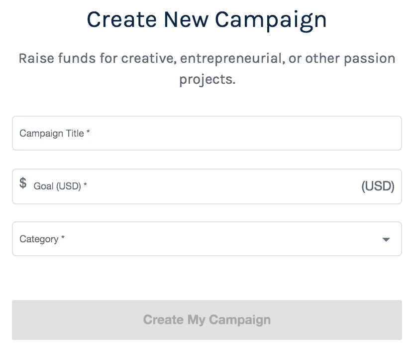
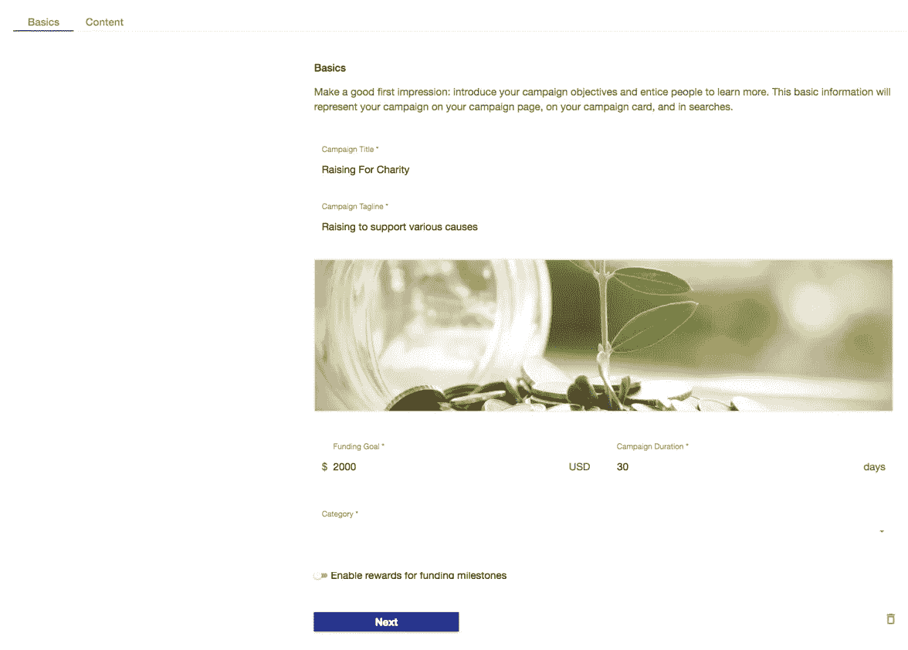
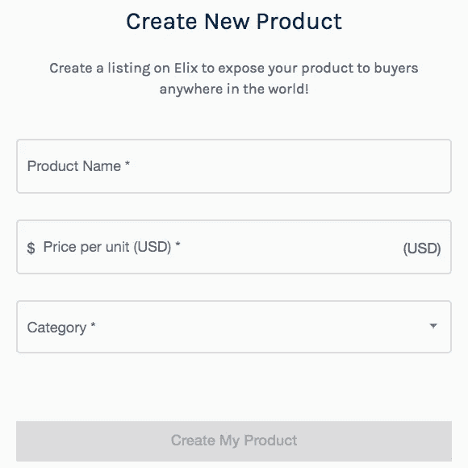

# 介绍产品和活动卡:改进的 ELIX 门户网站

> 原文：<https://medium.com/hackernoon/weve-improved-the-elix-web-portal-a0349d32c649>

欢迎来到本周的 ELIX 更新！我们一直在努力开发我们的门户网站。如果您还没有注册，请务必在此注册新的门户网站[。门户网站是创建和管理产品和活动的简化方式。](https://www.elixirtoken.io/signup)

Click on the above image to sign up for the ELIX web portal

**改进**

我们一直在努力改进 ELIX 门户网站。以下是我们最近做出的一些改变:

我们更新了卡片(我们用于预览产品和活动的仪表板工具)，以显示有关每个活动或产品的更详细信息。例如，下面是每张产品卡片的外观:

卡片包含物品的相关信息:

以下是活动卡现在在仪表板上的样子:

将来，我们计划通过在仪表板中点击产品和活动卡来编辑它们。

我们改进了产品和活动仪表板中的产品和活动创建工具的可用性。我们计划很快添加验证和更好的用户错误警告视图。我们改进了活动和产品数据的保存方式，因此我们重置了开放测试版中的所有活动和产品，但如果需要，我们可以迁移任何数据。

**如何创建营销活动**

要创建活动，请登录 ELIX 门户网站[此处](https://www.elixirtoken.io/signup)并点击左上角的活动。然后，点击右上角的“创建活动”按钮。您将看到以下屏幕:

单击创建新的活动，您将看到以下内容:

填写完这三个字段后，您将进入下一个屏幕:

在“基本”选项卡下，您可以选择产品是否需要提供任何奖励。如果是这样，您将看到奖励选项卡出现。仅使用这些选项卡，填写您的活动的基本信息，并将其保存到您的仪表板。

**如何创建产品**

要创建产品，请登录 ELIX 门户网站[此处](https://www.elixirtoken.io/signup)。然后，单击右上角的“创建产品”按钮，您将看到以下屏幕:

单击“创建新产品”开始。你会看到这个:

填写完这些字段后，在下一个屏幕上，您可以输入所有相关的详细信息:

只需使用几个选项卡，您就可以指定该产品的所有相关信息。

**创建一个活动或产品需要多长时间？**

创建一个众筹活动或产品不到 2 分钟。在这里创建一个。

**营销活动和产品是如何组织的？**

以下是我们为帮助对活动和产品进行分类而纳入的几个类别:

*珠宝&手表*
家具家电&装备
桌游
区块链
电子游戏、游戏机&配件
鲜花、问候&杂项礼品
活动门票
电脑软件
家居&园林
音乐
电影
服饰&配件
办公用品
美食
体育&健身

**即将推出的赠品**

正如上周提到的，我们计划在不久的将来推出另一款 ELIX 赠品。赠品将侧重于推动 ELIX 门户网站的注册。请务必在此注册门户网站[。](https://www.elixirtoken.io/signup)

要创建自己的项目，请在此注册成为早期创建者[。通过社交媒体在](https://www.elixirtoken.io/boost) [Reddit](https://www.reddit.com/r/elixirtoken/) 、 [Twitter](http://twitter.com/elixtoken/) 、 [Discord](https://discord.gg/mu4EJaz) 和 [Telegram](https://t.me/ElixirToken) 上联系。点击查看我们的新网站博客[。我们还有](https://blog.elixirtoken.io/)[脸书](https://www.facebook.com/elixirtoken/)和 [Instagram](https://www.instagram.com/elixtoken/) 页面，你可以在我们的[网站](https://www.elixirtoken.io/)底部注册订阅时事通讯。敬请关注 ELIX 网站博客[这里](https://blog.elixirtoken.io/)的精彩更新！

