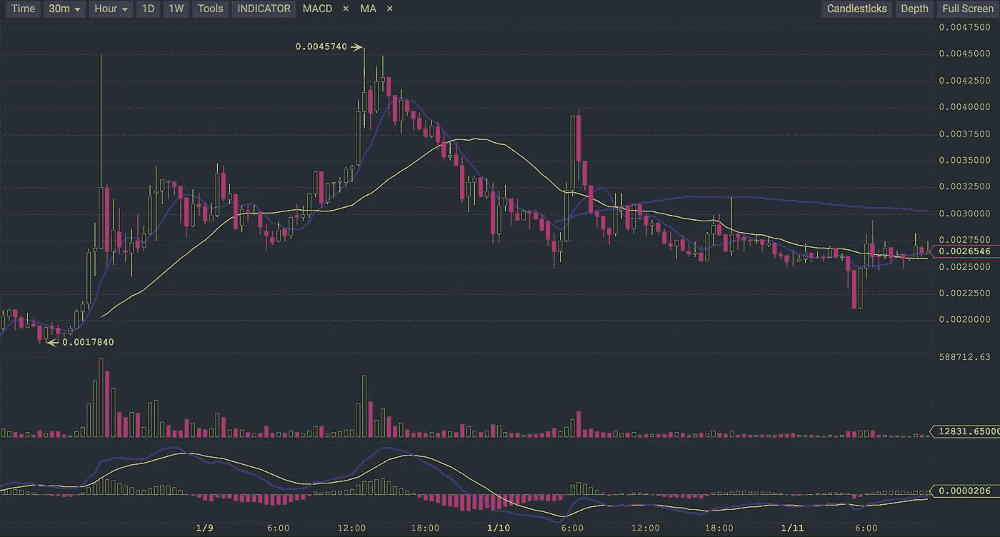
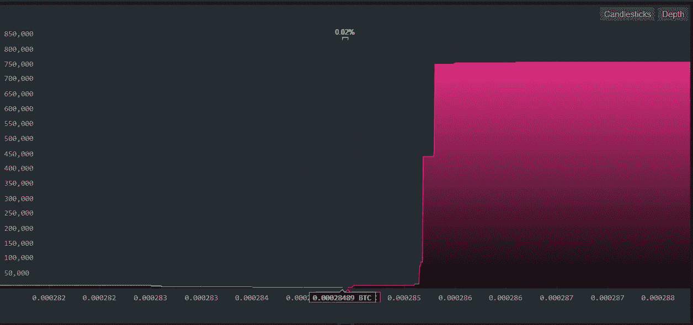
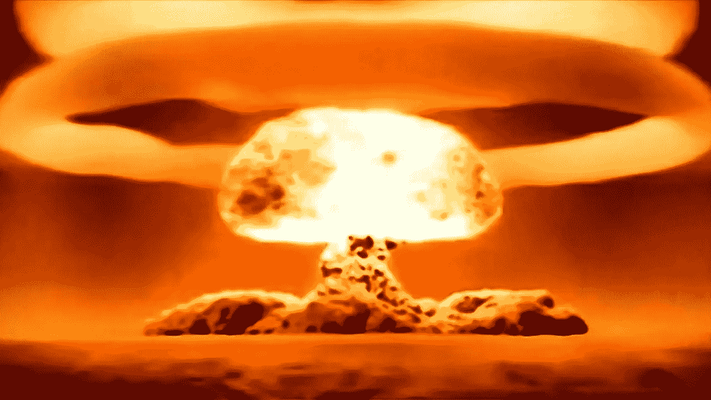

# 鲸鱼战术..

> 原文：<https://medium.com/hackernoon/whale-tactics-f19b3f33ea92>

如果你观察市场，你就会知道有不同的参与者。其中一些被称为鲸鱼。你对鲸鱼的印象可能是基于迪斯尼人物；一种体型庞大、行动缓慢、惹人喜爱的动物，性格非常温和。现实却大相径庭。鲸鱼是非常聪明的猎手，有时会成群猎食。它们中的一些捕食更小的鱼和海豹，它们使用非常聪明的策略来这样做。所以当鲸鱼来参加派对时，你最好小心点，尤其是在加密的时候..

我们来看看鲸鱼在 crypto 中倾向于使用的战术。这对你来说可能很方便，因为它解释了为什么有时价格会波动或不波动，以及你预期的完全相反的情况。

# **泵和倾卸**

最常见的策略之一是泵和转储策略。鲸鱼有足够的资金来人为推高某种股票、硬币或代币的价格。因为对密码交换没有任何限制，所以这种情况经常发生。尤其是那些市值低于 10 亿美元、前景光明的小型连锁店。

策略很简单。一条鲸鱼或一群鲸鱼将开始大量购买。这将导致价格大幅上涨和巨大的绿色蜡烛。有时购买的东西会在几天内被抹掉。有一件事是免费赠送的，那就是价格上涨总是巨大的。
这种增长总是会得到关注，你会看到目标链的电报频道充满了火箭和月球迷因。

这一增长将吸引大量新资金。这就是所谓的 FOMO(害怕错过)钱，所以价格上涨更多。有时候这是指数级的。当倾倒的空间足够大时，鲸鱼开始倾倒。这种情况时有发生。一波上涨将使利润最大化，因为新资金会认为这只是暂时的下跌。最后，鲸鱼带着一场杀戮离开，而那些在人工创造的“空前高度”上的人将带着宿醉离开。对一个连锁的信任不好。但是请记住，这种策略对有前途的连锁店最有效。

最近，Neblio 成功执行了这一策略。一个很有前途的连锁店，市值很小。泵和转储策略总是需要一个事件。在这种情况下，它是 dev-4 更新。水泵持续了 2 天，海浪清晰可见。看到上图中短抽期间的巨大蜡烛了吗？这是第二次泄露。价格最终达到 65 美元的峰值，一些人在这个价位买入。鲸鱼在这里留下了很好的边缘。

幸运的是有希望的部分。那些在 ATH 买入并持有代币的人最终会把钱赚回来。如果你看看昨天和前天发生的事情，那些被撞的已经发生了。Neblio 是唯一一家与美元保持稳定的连锁店。这是异常的。这也意味着 Neblio 的持有者真的相信链条，不会轻易卖出。即使事情进展顺利。如果你在坠机时看他们的电报频道，它几乎看起来像一场战争正在进行，有很多“这是斯巴达”的 gif。我的意思是，在这样的活动中不卖光需要很大的勇气。

# **卖墙战术**

一个需要雄厚资金和大量市场情报的策略是卖出墙。这通常发生在那些在不久的将来肯定会大幅升值的连锁店。这里的近期是指几个月内。使用这种策略的鲸鱼总是能获得内部消息，并在市场知道某些事情将要改变之前知道。

鲸鱼赚钱的方法是低价买进并积累。头寸越大，他们就越能操纵价格。方法是人为压低价格。他们是怎么做到的？通过竖起巨大的销售墙。在深度图上很容易发现的东西。巨大的卖出墙推动价格下跌。crypto 中的一个赠品是一个重要的事件不会使价格上涨。这将挫败持有人，他们会试图以低于应有的价格卖出。所以鲸鱼可以以较低的价格积累。

一旦公告即将发布，销售墙就会被拆除。随着市场放开，这将导致价格大幅飙升。再次，大量的蓝宝和月球迷因和新的资金流入。一旦达到极限，鲸鱼又开始倾倒。因此，这通常会导致泵送和倾倒。因为他们有一个巨大的头寸，他们可以在很长一段时间内继续这样做。

VeChain 成功执行了这一策略，并且正在这样做。VeChain 通常有连续几周的巨大销售墙。价格只上涨了一点点，并不像真正的市场价格。销售墙很大，如上图所示。有时它们会短暂消失，市场开始飙升。你现在看到的是，尽管市场已经崩溃，但卖出墙又被竖起来了。

这里的好处是，你也可以通过买入获利。价格会随着时间的推移而上涨。如果你坚守岗位，你会得到回报。VeChain 的回报可能会很大。所有的小迹象都指向那个方向。政府合同、有前途的技术、内线等等。如果事实真的证明中国政府完全支持 VeChain，你今年将会陷入困境。这可能是今年最赚钱的投资。但是，一如既往，所有的部分都需要到位，没有什么是确定的。

# **利用空头攻击完全操纵市场**

我把这个留到以后的文章中，但是因为我们一天前就坠毁并烧毁了，所以就这样吧。这是核选项。如果某个东西的市值超过 5 亿，并且在不久的将来可能会达到 1 万亿，那么大玩家就会出现。这里的大玩家是银行和对冲基金。他们有资金完全操纵市场。在他们已经拥有的任何其他市场中，crypto 也不例外。他们在这里，尽管他们大声说他们不在。

如果你想了解正规市场是如何被操纵的，我建议你去读一读《闪光男孩》这本书。你已经知道市场被操纵了，但这本书向你展示了银行和对冲基金为了赚钱能走多远。

因为在 crypto 中没有监管，我认为这是一件好事，这些巨大的鲸鱼正在开派对。如果你看看最近的崩溃，它看起来有点奇怪。我们都知道加密市场每个半月都会有一次调整。通常崩溃本身只会持续一天。这次用了 2 天多才见底。奇怪的是:

由手无缚鸡之力的高杠杆买家(一如既往)造成的修正花了一天时间。一天结束时(欧洲时间)，市场回来了(一如既往)。然后，出乎意料的是，比特币开始大幅下跌。我是说努力。由于其市场主导地位，所有低价位也开始跳水。如果你在看图表，你可以看到很多卖出墙突然出现(阅读我写的关于卖出墙的文章),推动价格下跌。这造成了恐慌性抛售。即使是有经验的交易者也被这个事件惊呆了。

这种螺旋式下降又持续了一天。比特币达到了去年 12 月调整期间未曾达到的水平，并停留在那里。大约 10k，峰值甚至低于这个数字。同一天，许多 FUD 被创造出来。中国禁令，密码时代结束的头条新闻等等。对我来说，这通常是一个短攻击正在发生的暗示。然而，我还不能把它放在哪里。当然，有传言称比特币期货与此有关，但我们在加密领域有很多传言。

但是后来发生了。这些期货有一个到期日，当这个日期过去时，市场开始向上移动，当我说确切时，我的意思是确切…事情是，在交易中没有所谓的巧合。没有什么是巧合。你不会碰巧把东西卖给别人。交易总是有原因的。这种情况下的原因是 BTC/美元 15000 期货合同的利润率。

因此，这些大公司操纵市场，通过人为压低 BTC 价格来增加利润。我们知道我们有在比特币上持有大量头寸的大玩家(尽管他们说他们没有)。我们还知道，大型交易所向这些玩家提供所谓的“暗池”服务，以掩饰交易背后的人(请阅读我推荐的书“ [Flash Boys](https://www.amazon.com/Flash-Boys-Wall-Street-Revolt/dp/0393351599) ”,以了解这是什么意思)。我们也看到这个时机是完美的。当一些东西看起来和闻起来像短暂发作时，它通常是短暂发作。

因此，我们预计今年将是动荡的一年，会有很多繁荣与萧条的循环。在那里要小心，这是完全的无政府状态，在上面结束将需要钢铁般的神经和一对大球。即使你有最好的知识，你也会犯错误。很难看出是鲸鱼在操纵价格，还是仅仅是市场在上下波动。但是请注意危险信号。永远不要跟随一天内指数增长的链条，你可能会在人为创造的“历史高点”买入。想想沃伦·巴菲特的商业伙伴曾经说过的话:“我们错过了谷歌和亚马逊，但我们没有错过其他人”…

PS。如果你喜欢这篇文章，请分享，发微博等。你会收到我永远的感激，你可能会阻止一个投资新手犯一个非常愚蠢的错误