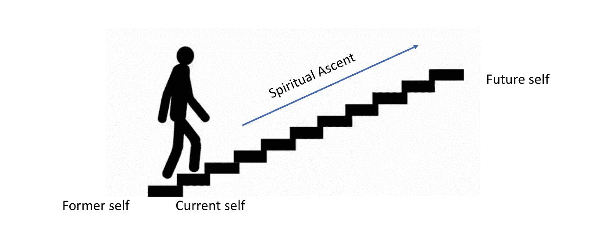

# 一个死去的哲学家能教给创业公司什么样的文化

> 原文：<https://medium.com/hackernoon/what-a-dead-philosopher-can-teach-startups-about-culture-5f72cd430001>

几周前，一位名叫安德斯·克罗恩的天才企业家( [Aula](https://aula.education/) 的创始人兼首席执行官)发给我一封电子邮件(经安德斯许可打印):

> 你好卡梅伦，
> 
> 希望一切都好！下周末你有时间喝杯咖啡吗？我们可以在你附近的一家工厂见面。
> 
> 鲁恩(我们的首席运营官和另一位内部哲学家)和我正在尝试不同的方式来形象化和定义公司价值观。我们看了很多初创公司的价值陈述。不出所料，这在概念上有点混乱…
> 
> 我知道这些关于品牌、价值观和如何表达“它”的东西会让你很感兴趣(而且在哲学上比其他人更严谨: )，所以我认为分享想法会非常有趣。
> 
> 安德斯（男名）

我是安德斯和奥拉的超级粉丝，安德斯在吸引顶级人才加入他的创业公司方面做得非常出色，所以我当然同意。我想我们已经结束了一场关于在创业公司中实施文化价值观的框架的非常有趣的讨论，我想分享一下我们的主要收获。剧透:它涉及到一位老哲学家兼诗人。

由于某种原因，在我和安德斯的聊天中，我想起了我在大学里最难忘的一次研讨会，由杰弗里·斯托特教授讲授。正是在这个研讨会上，我第一次接触到拉尔夫·瓦尔多·爱默生的作品，他是 19 世纪美国超验主义诗人、哲学家和散文家。先验论者分享了一个关键的信念，即每个人都可以超越或超越感官的物质世界，通过自由意志和直觉进入更深层次的精神体验。在这个思想流派中，上帝不是遥远和不可知的；信徒通过审视自己的灵魂和感受自己与自然的联系来理解上帝和自己。

与这篇文章更相关的是，斯托特在这个研讨会上向我们的学生介绍了“爱默生式完美主义”的概念，即每个人都有提升到更高形式的卓越的天职。斯托特写道，

> “爱默生的完美主义思想与柏拉图和奥古斯丁的完美主义有些相似之处。但是爱默生拒绝接受他们的完美的单一固定点的图景，在这个图景中，所有的人都含蓄地寻求休息——对柏拉图来说是超越的善，对奥古斯丁来说是三位一体的上帝。没有固定的目标，没有休息。我们每个人都在楼梯上。你的和我的不同。我们可以看到下面几步，上面几步。
> 
> 在你的上方，有一个更优秀的你是谁的版本，在呼唤你向上。这是你的更高自我。背弃它将会违背神圣的职责。然而，提升需要放弃你已有的自我。更高的自我凝结来自你能从你的立场直觉到的最高的卓越暗示。卓越和神圣的价值是对美好生活最重要的善。"

Emerson’s Staircase of Excellence

强大的东西——卓越的阶梯。当然，斯托特和爱默生是从精神成长的角度来考虑这座*卓越阶梯*的。大多数人都会同意这种增长是最重要的。

但我认为*卓越阶梯*可以为职业成长提供一个有用的心智模型，也可以为任何初创企业提供一颗文化北极星。总会有一个更优秀的你和你的组织，召唤并推动你向上。你的公司正处于哪一步，下一步是什么？最高的一步是什么？作为一名创始人，你必须不断摆脱以前的自己，才能到达下一步。此外，作为一名创始人，一个阶段成功所需的技能通常与另一个阶段截然不同。作为一名员工，你有自己独特的阶梯，而组织作为一个整体，只是一群人，有一个完全不同的上升阶梯。但这种模式适用于所有领域。成长是持续的，也是必要的。原地不动是致命的。创新通常是唯一的前进之路。为了提升得更高，一个人必须不断地*摆脱自己以前的身份。在这样做的同时，我们必须始终明白，卓越是一种渴望，而不是一个具体的目标。*

我认为*卓越阶梯*是一个有用的视觉框架，用于在初创公司内部实施 okr，但 okr 是价值和方向抱负的超级体现。如果阶梯隐喻*与更广泛的全公司使命*相结合，公司可以团结起来为一个共同的目标而努力。因此，楼梯隐喻可以为你公司的价值观和文化提供一个强大的元框架，在这个框架内，你可以组织子战略、个人成就和以目标为导向的活动。我很高兴看到 Anders 如何将这一理念融入到他的组织文化中，并进一步发展我自己的想法。

如果你喜欢这篇文章，请给它拍几下，让其他人发现它。干杯。

**参考书目:**

拉尔夫·沃尔多·爱默生

[衡量什么最重要](https://www.amazon.com/Measure-What-Matters-Google-Foundation/dp/0525536221/ref=sr_1_1?s=books&ie=UTF8&qid=1539362335&sr=1-1&keywords=okrs)约翰·杜尔登

《强大:建立自由和责任的文化》帕蒂·麦考特著

卓越和爱默生式的完美主义者——杰弗里·斯托特访谈