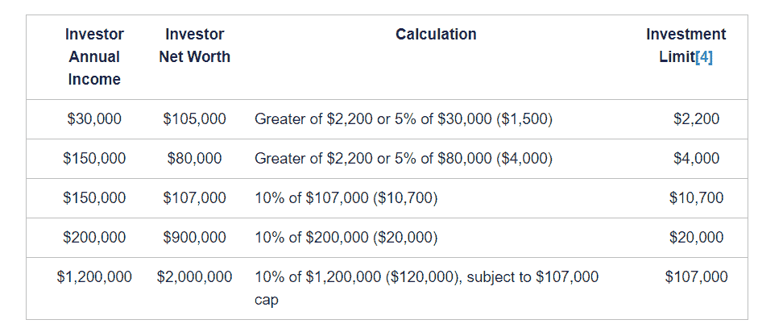

# 如果要在美国出售证券，初创公司需要知道什么？(注册 D，注册 CF，注册 A+，WTF..)

> 原文：<https://medium.com/hackernoon/what-a-startup-needs-to-know-if-their-going-to-sell-securities-in-the-us-f910041f46ce>

本文的目标是简要概述 SEC(证券交易委员会)发布的规则。这是作者的一次尝试，旨在深入了解在美国出售证券的最新规则。本文中的所有材料仅供参考。此处提供的任何材料都不应被解释为投资建议。

众筹的主要革命发生在 2012 年，当时美国总统巴拉克·奥巴马签署了《就业法案》(Jumpstart Our Business Startups)，让人们有更多的自由为“[新兴成长型公司](https://www.sec.gov/smallbusiness/goingpublic/EGC)”(年总收入不到 10 亿美元)筹集资金。从那时起，美国证券交易委员会创建并更新了允许人们筹集资金的规则。

## **法规 D**

我们首先需要开始的是[法规 D](https://www.sec.gov/fast-answers/answers-regdhtm.html) 。这有控制三个规则(504、506(b)和 506(c))的豁免。505 规则于 2016 年 10 月 26 日废止。

监管 D 是初创公司在不需要向美国证券交易委员会注册的情况下从投资者那里筹集资金的最常用方法。

我们感兴趣的主要事情是，初创公司现在可以从合格和不合格的投资者那里筹集无限量的资金(更多细节见下文)。他们甚至可以在媒体上做广告。

要查看你的公司是否合格，你需要先查看这个链接:[https://www.sec.gov/smallbusiness/exemptofferings](https://www.sec.gov/smallbusiness/exemptofferings)

[***规则 504*** *:*](https://www.sec.gov/divisions/corpfin/guidance/rule504-issuer-small-entity-compliance.html)

*   **金额**:最高 500 万美元(12 个月内)
*   **允许投资者**:仅[合格投资者](https://www.investor.gov/additional-resources/news-alerts/alerts-bulletins/investor-bulletin-accredited-investors)
*   **公共广告**:不允许
*   **转售证券**:投资者至少一年内不能转售证券，除非发行人向委员会登记了转售交易
*   **文件**:需要填写[表格 D](http://www.sec.gov/about/forms/formd.pdf)

[***规则 506(b):***](https://www.sec.gov/smallbusiness/exemptofferings/rule506b) ***(私募)***

*   **金额**:无限制
*   **允许投资者**:不限数量的认证投资者，最多 35 个非认证、“成熟”投资者。(“老练”的投资者意味着他们需要有专门的知识。发行人不需要采取额外的步骤来验证投资者是合格的)
*   **公共广告**:不允许
*   **转售证券**:投资者至少一年内不能转售[受限证券](https://www.sec.gov/smallbusiness/exemptofferings/faq?auHash=rh5WfJi9h3wRzP6X2anOmgYLdhPHNuo-3Vw0YNZyR_M#faq4)，除非发行人在 SEC 登记了转售交易
*   **文件**:需要填写[表格 D](http://www.sec.gov/about/forms/formd.pdf)

[***规则 506(c)*** :](https://www.sec.gov/smallbusiness/exemptofferings/rule506c)

*   **金额**:无限制
*   **允许投资者**:不限数量的合格投资者(发行人必须验证投资者是否合格，通常通过第三方，如 verifyinvestor.com)
*   **公共广告**:允许
*   **转售证券**:投资者至少在一年内不能转售[受限证券](https://www.sec.gov/smallbusiness/exemptofferings/faq?auHash=rh5WfJi9h3wRzP6X2anOmgYLdhPHNuo-3Vw0YNZyR_M#faq4)，除非发行人在美国证券交易委员会登记了转售交易
*   **文件**:需要填写[表格 D](http://www.sec.gov/about/forms/formd.pdf)

正如我们所看到的，这里最重要的是筹集的金额、允许的投资者类型和公共广告。

## **监管众筹(Reg CF)**

这在就业法案签署后成为可能。这意味着，现在任何公司都可以从任何类型的投资者(认证或非认证)那里在线融资。现在，在 2018 年第四季度，您甚至可以通过使用加密技术参与，如 BTC 或瑞士联邦理工学院，这难道不是革命性的吗？但是，当然，有一些规则和限制与我们看到的 ico 和它们的实用程序令牌相去甚远…让我们看看它们是什么。

[***注册 CF*** :](https://www.sec.gov/smallbusiness/exemptofferings/regcrowdfunding)

*   **金额**:107 万美元(12 个月内)
*   **允许投资者**:不限数量的合格和非合格投资者。(但投资者的投资额度是有限制的(下文将详细介绍)
*   **公共广告**:允许
*   **转售证券**:投资者至少一年内不能转售[受限证券](https://www.sec.gov/smallbusiness/exemptofferings/faq?auHash=rh5WfJi9h3wRzP6X2anOmgYLdhPHNuo-3Vw0YNZyR_M#faq4)，除非发行人在 SEC 登记了转售交易
*   **文件**:需要填写[表格 C](https://www.sec.gov/files/formc.pdf)

有些重要的事情你需要明白。

*投资限制:*

首先是每个投资者可以投资的限额(取决于你的年收入和净值)。你可以向一个投资者出售的证券的最大金额也有限制(不应超过 107，000 美元)。下表进一步解释了这些限制:

[https://www.sec.gov/info/smallbus/secg/rccomplianceguide-051316.htm#3](https://www.sec.gov/info/smallbus/secg/rccomplianceguide-051316.htm#3)

*对注册中介的要求:*

第二件最重要的事情是，你的所有投资都应该通过“一个在美国证券交易委员会注册的中介，要么是经纪自营商，要么是融资门户。”这里有一个链接，你可以找到这样的中介:[https://www.finra.org/about/funding-portals-we-regulate](https://www.finra.org/about/funding-portals-we-regulate)

以下是一些门户网站的列表:

*   [Crowdsourcefunded.com](https://crowdsourcefunded.com/)
*   [Startengine.com](https://www.startengine.com/)
*   [Startwise.com](https://www.startwise.com/)

你所有的钱都会托管在这样一个平台上，直到众筹过程结束。在大多数情况下，中介会得到佣金。

好消息是，你现在可以使用 crypto 来投资这些活动。下面是对正在进行的此类活动的深入描述。

## **条例 A+**

作为实施《就业法案》的一部分，证券交易委员会修订了条例 A，免除证券登记。这些修正案被称为条例 A+。你可以通过阅读这份文件了解更多:[https://www.sec.gov/files/Knyazeva_RegulationA%20.pdf](https://www.sec.gov/files/Knyazeva_RegulationA%20.pdf)

新 Reg A 规则中最有争议和最重要的条款之一是联邦对这些产品的州审查的优先权，这是根据州规则[被称为“蓝天”法](https://techcrunch.com/2015/03/27/sec-rule-change-gives-startups-an-a-for-capital-formation/)。

以前，每家公司都必须在发行其证券的每个州单独注册其 Reg A 发行。除了要求在 SEC 注册之外，这种管理负担导致 Reg A 发行数量极少。现在，根据 Reg A 的第 2 层，只需要 SEC 审查，这大大减轻了企业的管理负担。

这里我们将解释一下关于 Reg A+的要点。新法规赋予企业从合格和不合格投资者那里筹集最多 5000 万美元的能力。Reg A+分为两部分:一级(最高 2000 万美元)和二级(最高 5000 万美元)

***第一层:***

*   **金额**:最高 2000 万美元(12 个月内)
*   **允许投资者**:合格投资者和非合格投资者数量不限(投资不限)
*   **公共广告**:允许
*   **倒卖证券**:不受限制。可以立即转售
*   **文件**:向 SEC 提交披露文件并获得批准

***二级:***

*   **金额**:最高 5000 万美元(12 个月内)
*   **允许投资者**:不限数量的合格投资者和非合格投资者(对于非合格投资者，每年的最高限额为其年收入/净资产的 10%，取决于哪个数额更大。)
*   公共广告:允许
*   **倒卖证券**:不受限制。可以立即转售
*   **文件**:前期审计(美国通用会计准则级别的审计，可追溯至两年前——对于新公司，审计针对其存在期间)。向 SEC 提交披露文件并获得批准

这里需要注意的最重要的一点是，让你的公司为 Reg A+要求做好准备需要更多的工作和金钱。你的公司将不得不与独立会计师一起准备经审计的财务报表，而筹资少于 2000 万美元的公司将在 1 级和 2 级之间做出选择。

> 感谢 Howtotoken Agency 专家为该主题提供的信息和评论。

> *如果你是金融专家，发现了这篇文章中的一些错误，请在下面评论，我会更新文章。*

## 关于作者:

基里尔·希洛夫——geek forge . io 和 Howtotoken.com 的创始人[。采访全球 10，000 名顶尖专家，他们揭示了通往技术奇点的道路上最大的问题。加入我的**# 10k QA challenge:**](http://twitter.com/kirills4ilov)[geek forge 公式](https://formula.geekforge.io/)。