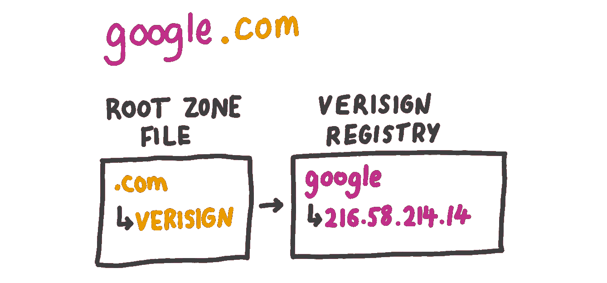
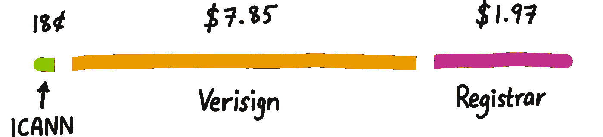
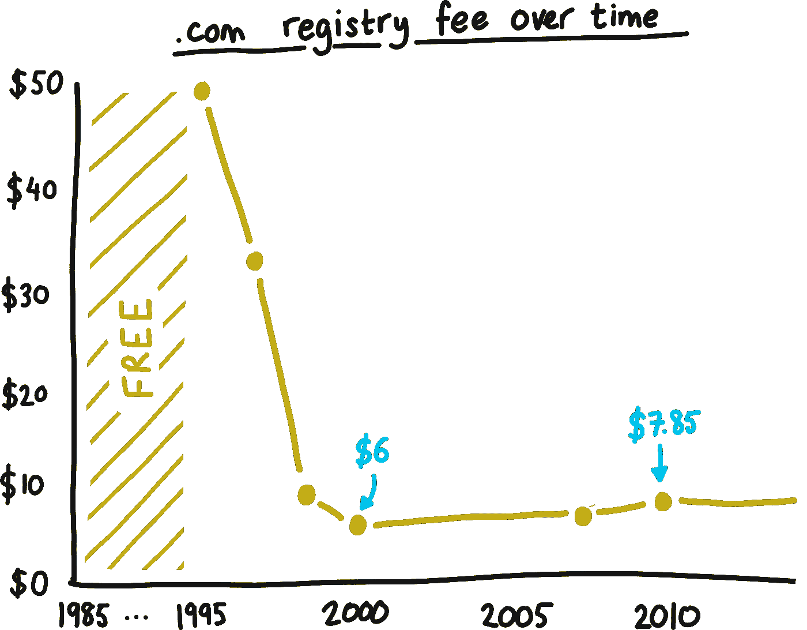

# 当你购买一个域名时，实际上会发生什么？

> 原文：<https://medium.com/hackernoon/what-actually-happens-when-you-buy-a-domain-name-9c996d352af3>

*注:此文原载于我的* [*个人博客*](https://taimur.me/) *。*

你刚刚想到了下一件大事。它会有人工智能，你要把它放在区块链上。

你上 GoDaddy，输入名字，然后嘣——

最终你会找到一个没被拿走的，10 美元后，它就是你的了。当然，你最终没有开始那个项目。

但是有没有想过那 10 美元去了哪里？

你可能知道，当计算机通过互联网交谈时，它们使用数字标签(IP 地址)来识别彼此。这些对我们来说很难记住，所以我们更喜欢像“google.com”这样友好的名字。要访问谷歌，必须在幕后施展一些魔法，将“google.com”变成谷歌的 IP 地址“216.58.214.14”。

首先，谷歌必须有人注册了 google.com 这个名字。这是通过一个[域名](https://hackernoon.com/tagged/domain)如 GoDaddy 的“注册商”来完成的。注册商就像商业街上的商店，他们实际上是从批发商那里获得域名，但是为客户购买和管理域名提供了一种便捷的方式。

接下来，必须有人告诉互联网上的其他人*google.com*指向*216.58.214.14*。这是由“注册管理机构”完成的，注册管理机构也是向注册商提供域名的批发商。每个顶级域名(TLD)——*。com* ，*。网*。，*。org*etc——有一个注册中心来管理它。*。从一开始，TLD 就一直由同一个注册中心管理——一个利润丰厚的垄断公司 Verisign。稍后会详细介绍。*

最后，由于有许多不同的 TLD，需要有人跟踪哪个注册管理机构管理每个 TLD。只有大约 1，000 个 TLD 需要跟踪，所以这是在一个小文件中完成的，即“根区域文件”，它托管在世界各地的许多不同服务器上，因此任何人都可以轻松地访问它。

当你在浏览器中输入*google.com*时，域名被“点”从右到左分割成几部分。第一部分是“com”，因此您的计算机检查根区域文件以查看哪个注册表管理着*。TLD。然后它检查这个注册表，看看下一部分“google”指向哪里。注册表返回 IP 地址*216.58.214.14*，然后你的电脑可以要求谷歌发送他们的主页。*

如果你还和我在一起，那么你可能会想是谁想出了这一切。答案是 ICANN——互联网名称与数字地址分配机构。ICANN 是一个非营利组织，其职责是协调所有保持互联网在线的名称和号码。他们将大量繁重的域名升级工作外包给像 Verisign 这样的注册机构，后者向 ICANN 支付费用以获得特权。

## 那么你的 10 美元到底去了哪里？

你付钱给注册商(商店)，但是他们从 Verisign 购买域名。com registry(批发商)，谁要向 ICANN(监管者？税务员？)一笔费用。谁得到什么？

在*的情况下。com* ，威瑞信得到了馅饼的最大份额。注册服务商可以向客户收取他们想要的任何费用，但有一个明显的警告——如果他们收取的费用低于 Verisign 的费用，他们将亏本经营，如果他们收取的费用远远高于 Verisign 的费用，其他注册服务商将会降低他们的价格。

这种自由市场的功夫对消费者来说是一种胜利，促进这种竞争是 T4 ICANN 的主要原则之一。所以，肯定同样的力量适用于威瑞信的费用，对不对？

这是一年一度的。过去 30 年的 com 注册费:

这是怎么回事？尽管技术进步和更大的规模经济，Verisign 运营. com 域名的边际成本在过去 8 年里真的保持不变吗？2007 年发生了什么，使得域名管理成本比 2000 年更高？

注册管理机构之间竞争的方式应该是，许多公司去 ICANN 说“我们认为我们可以可靠地管理*。我们认为每个域名将花费我们[5 美元]。”ICANN 审查这些投标并授予*。一份持续固定时间的合同，给他们认为最适合这份工作的人。在这个时候，其他公司可以想办法管理*。更好/更便宜，努力赢得下一份合同。理论上，这将激励注册管理机构进行创新，其中很大一部分是为了降低成本。***

实际上，*从未出现过这种情况。com* 。ICANN 和 Verisign 于 2001 年签订的合同允许对续约进行竞争性招标，但在合同签订仅 3 年后，麻烦就出现了——Verisign 和 ICANN 史无前例地开战了。

这场争论是关于 Verisign 在 2003 年推出的名为 Site Finder 的服务。交通四通八达。通过 Verisign，站点查找服务将任何访问未注册域名的人(例如，通过打字错误)重定向到带有赞助链接的 Verisign 网站。该公司认为，这比看到一个普通的错误页面对互联网用户更有用。不管他们的理由是什么，这使得威瑞信成为了每一个未注册域名的事实上的所有者(拥有一个域名还意味着什么？)，并从第 2500 名飙升至访问量最大的 10 个网站。最精彩的部分？威瑞信推出这款产品时没有经过任何人的审核。

在阅读网站搜索门户时，我试图对 Verisign 宽容一些。即便如此，似乎也很清楚，他们深陷与 ICANN 合同的灰色地带，他们故意违背了他们受托建立的互联网精神。也就是说，我尊重这种努力——Verisign 曾经是，并将继续是一家上市公司，有责任为股东提供价值，这种准诱饵调包法是一种非常有创意的方式。

就在 Verisign 推出网站搜索服务几天后，ICANN 写了一封措辞强硬的信，命令他们禁用这项服务。威瑞信照办了，但也写了一封措辞强硬的信，以诉讼的形式。Verisign 认为 ICANN 试图控制他们的活动是越界行为，ICANN 认为……Verisign 在进行这些活动时越界了。

经过 3 年漫长的诉讼，2006 年底，诉讼达成庭外和解。没有人知道在那些紧闭的门后到底发生了什么，但很明显，Verisign 拿走了蛋糕。

ICANN 续签了 Verisign 的*。这一次有了一个有趣的新条款——之前对 Verisign 收费的 6 美元上限被取消，允许 Verisign 从 2007 年到 2010 年每年增加 7%的费用，达到 7.85 美元。[ICANN 给出的理由](https://www.icann.org/news/announcement-2005-11-21-en)是“让市场力量决定价格”，我不太明白，但我不是凯恩斯。他们还用更微妙的语言指出，担心 Verisign 的垄断是美国政府的工作，我想这是公平的。*

更有争议的是，新协议保证了 Verisign 的合同在 2012 年续签，除非他们“根本违反”他们作为注册管理机构的义务。2012 年协议中的一个类似的推定续约条款最近锁定了 Verisign 对*的控制权。com* 到 2024 年。ICANN 说，这种安排激励注册管理机构对有益于互联网社区的基础设施进行长期投资。

虽然这听起来很合理，但 ICANN 对此事的最后评论描绘了一幅不同的画面，一家处于被动的公司，试图在不吵醒大坏狼的情况下向前发展:

> 消除与 VeriSign 的现有和未来纠纷的好处…对社区具有重大价值，这只有通过与 VeriSign 的谈判才能实现。

Verisign 有资格成为互联网订阅模式的先驱。1.3 亿*。域名每年带来 7.85 美元的费用，总计超过 10 亿美元的年度经常性收入，随着越来越多的人上网，这个数字只会越来越大。*

然而，他们一路走来也树敌不少，包括几乎所有不为他们所用的人。他们面临[越来越大的降低注册费用的压力](https://forum.icann.org/lists/comments-com-amendment-30jun16/)，其他玩家承诺做同样的工作，每个域名只需 1 美元，而[像谷歌](http://www.circleid.com/posts/google_free_public_dns_load_tops_verisign_raising_dot_com_contract_question/)这样的公司已经在 DNS 领域搭起了帐篷。

然而，很容易忘记的是，威瑞信已经设法做到了*。在过去的 20 年里，没有一点中断或停机，也没有保证一个更民主或更具竞争力的过程会导致 20 年的*。我们所享受的稳定。互联网监管显然很重要，但我们应该记住，绝大多数用户不知道或不关心幕后发生的事情。**

考虑到这一点，我们日记的日期是 2018 年 11 月 30 日，届时 Verisign 的现有合同到期，新合同开始。这肯定会引发公众对这些问题的讨论，并对我们通常认为理所当然的互联网结构——卑微的 DNS——投下罕见的一瞥。

*如果你喜欢这篇文章，请在*[*www . taimur . me*](http://www.taimur.me)*查看并订阅我的文章——随时欢迎评论和反馈！*