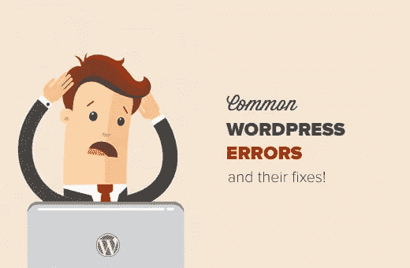
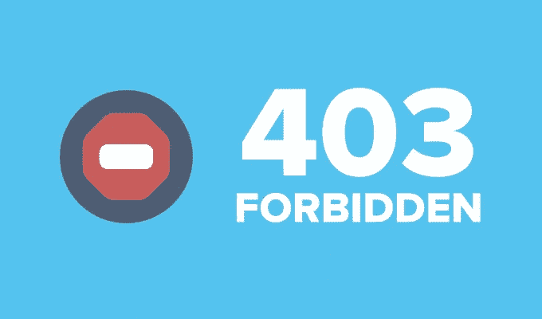
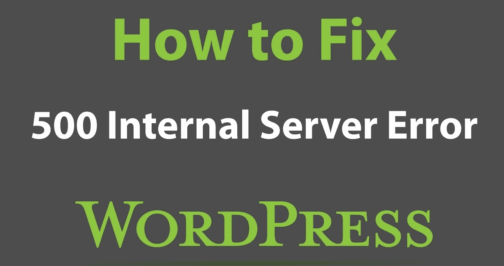

# 什么是 402、403、404 和 500 WordPress 错误，如何修复？

> 原文：<https://medium.com/hackernoon/what-are-402-403-404-and-500-wordpress-errors-and-how-to-fix-them-87fedc73f8e3>

毫无疑问，WordPress 是最通用的内容管理系统之一。然而，对一个网站拥有如此多的控制权的缺点是，一个错误的举动可能会使整个网站瘫痪，在最坏的情况下甚至会删除网站上的全部内容。

对 WordPress 用户来说幸运的是，网上有很多关于各种 WordPress 错误以及如何修复它们的指南。然而，最少谈论的错误是 WordPress 上的 402、403、404、500 和 502 坏网关错误。

今天，我们编辑了一篇文章，详细介绍这些错误实际上是什么，以及如何修复它们。

## 如何修复 WordPress 上的错误 402？

错误 402 很可能是由于你的 WordPress 站点上任何错误的插件或主题安装造成的。

WordPress 上的错误 402 的问题是，它不允许网站所有者登录他们的管理仪表板。在这种情况下，下面是你如何在没有访问管理面板的情况下手动重置网站主题插件。

1.  登录到您的托管 cPanel。
2.  找到“PHPMyAdmin”并点击相同的。
3.  点击面对错误 402 的 WordPress 站点的数据库。
4.  在“wp_options”表中，在“option_name”字段下，找到显示“active_plugins”的行。
5.  将“active_plugins”的“option_value”的值更改为“a:0:{}”。
6.  保存更改。

如果手动重置插件没有解决你的 WordPress 站点上的错误 402，那么按照下面的步骤尝试禁用你的 WordPress 站点上的主题。

1.  首先，下载并安装一个 FTP(文件传输协议)客户端。
2.  通过向 FTP 客户端输入所需的凭据来登录到您的服务器。
3.  现在，从根数据库文件夹，导航到“wp-content”文件夹，然后点击“themes”文件夹。
4.  导航到站点上运行的主题的根文件夹。
5.  将站点上当前主题的根文件夹重命名为便于日后记忆的名称。
6.  这将禁用当前主题，并在你的站点上加载默认的主题。
7.  保存更改。

如果禁用 WordPress 主题也不能帮助你解决错误 402，那么尝试联系主机提供商寻求解决方案，因为错误 4402 有时也是由于服务器相关的问题而发生的。

如果重置插件帮助您解决了错误 402 问题，那么尝试手动切换您站点上安装的每个插件，直到您找到导致错误的插件。

## **如何修复 WordPress 上的错误 403？**

当服务器不被允许访问特定页面时，WordPress 上出现错误 403。403 错误可能出现在不同的地方，比如安装 WordPress 时，登录仪表板时，或者访问网站上的任何特定网页时。

WordPress 上的错误 403 在大多数情况下是由错误的插件安装引起的。要解决错误 403 问题，您可以按照上面写的指南手动重置插件。

## 如何修复 WordPress 上的错误 404？

错误 404 可能是 WordPress 上遇到最多的错误。尝试访问网站上的帖子或特定内容时，出现错误 404。

在大多数情况下，错误 404 与你的 WordPress 站点的永久链接设置有关，下面是你可以很容易地修复它的方法。

1.  登录你的 WordPress 管理仪表板。
2.  在侧面板中，单击“设置”选项。
3.  从出现的下拉菜单中，单击“永久链接”选项。
4.  现在，当永久链接页面加载时，不做任何更改，单击“保存更改”选项。

现在尝试访问之前显示错误 404 的页面。上面的方法将更新与你的站点永久链接相关的设置，应该可以解决这个问题。

如果没有，那么您将需要编辑"。htaccess”文件，按照下面的步骤。

1.  使用 FTP 客户端登录到您的 web 服务器。
2.  现在，导航到”。htaccess”文件并点击相同的。的”。htaccess”文件可以在保存你的站点的“wp-content”、“wp-admin”和“wp-includes”文件夹的同一个根文件夹中找到。
3.  将下面的代码添加到。htaccess 文件:
    # begin WordPress
    <if module mod _ rewrite . c>
    rewrite engine on
    rewrite base/
    rewriterule ^index\.php$ — [L]
    重写秒% {请求文件名}！-f
    重写第% {请求文件名}！-d
    重写器。/index . PHP[L]
    </if module>
    # END WordPress
4.  保存更改。

现在加载先前显示错误 404 消息的网页。错误现在应该解决了。

## 如何修复 WordPress 上的错误 500？

出现错误 500 的原因可能是。或者因为 PHP 内存限制问题。

按照下面的步骤重命名“”。htaccess”文件并解决损坏的。htaccess 文件问题。

1.  使用 FTP 客户端登录到您的 web 服务器。
2.  现在，找到了”。htaccess”文件夹，并右键单击文件夹名称。
3.  将文件夹名称重命名为“”。htaccess_older”。

现在重新加载网页，错误一定会消失。

重新创造。htaccess 文件，请按照以下步骤操作:

1.  登录你的 WordPress 管理仪表板。
2.  点击侧面板上的“设置”选项。
3.  然后点击“永久链接”。
4.  单击“保存更改”选项，不对选项进行任何更改。

仅此而已。您现在已经创建了一个新的。您网站的 htaccess 文件。

如果重命名。htaccess 文件没有解决错误，然后尝试按照下面的指南增加 PHP 的限制，以解决错误 500。

1.  使用 FTP 客户端登录到您的站点服务器。
2.  找到并下载“wp-config”文件夹，该文件夹应该位于与“”相同的根文件夹中。htaccess”。
3.  使用代码编辑器工具并打开下载的 wp-config.php 文件。
4.  一旦文件打开，找到文本“就这样，停止编辑！快乐的博客”。
5.  在上一行之前，粘贴下面的代码，保存文件:
    define('WP_MEMORY_LIMIT '，' 300m ')；
6.  将编辑过的 wp-config.php 文件上传回下载它的目录。
7.  如果提示覆盖现有文件，请允许同样的操作。

就是这样。尝试重新加载您的网站，错误现在应该得到解决。

对于 [502 坏网关](https://www.000webhost.com/blog/fix-502-bad-gateway-error)的错误，你可以参考 000webhost.com 的人写的详细指南来解决问题。

## 最后的话

希望我们能够帮助你解决在 WordPress 上经常遇到的错误。

如果你对上面的文章有任何疑问，请在下面留下你的评论，我们一定会指导你。