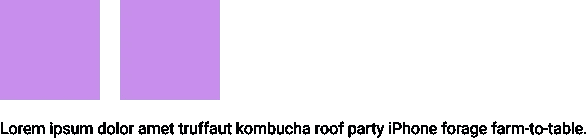

# 什么是:之前和之后伪元素？

> 原文：<https://medium.com/hackernoon/what-are-before-and-after-pseudo-elements-fabb2c6eee3>

CSS **:before 和:after** 属性也称为**伪元素**。它们用于在元素内容之前或之后添加内容。这些伪元素有很多很好的用途，所以让我们来探索其中的一些。

# 语法

如果你有这样一个元素:

`<h2>welcome to our website</h2>`

您可以使用 CSS 在它之前添加一个伪元素，如下所示:

```
h2:before {
  content: “Hello“;
  color : blue;
}
```

结果将是:


这是一个非常简单的原则。您正在某个元素之前或之后添加内容。在**添加图标、** [**清除浮动**](https://kolosek.com/css-clear-float/) 以及其他许多情况下，这非常有用。

伪元素的**内容**属性可以用类似于`content: “”`的空引号将**留空**。这样，您可以将伪元素视为一个没有内容的**框**。如果内容属性被一起移除，那么伪元素**将不能工作**。

# 添加图标

可能 before 和 after 伪元素最流行的用法是用它们来添加图标。您可以添加一个简单的。png 图标。

让我们看看标记。

超文本标记语言

```
<h2>Weather report</h2>
```

半铸钢ˌ钢性铸铁(Cast Semi-Steel)

```
h2:before {
  content: “ ”;
  display: block;
  height: 15px;
  width: 25px;
  url: (‘images/icon.png’’);
  margin-right: 5px;
}
```

结果是:


现在，您已经成功地在文本前添加了一个图标。很简单，对吧？

在元素[浮动](https://kolosek.com/css-float/)之后，需要添加另一个元素来清除浮动。您可以**避免添加新元素**并简单地使用一个伪元素。

假设你有这种情况:


您可以使用下一个代码来实现清除浮动。

超文本标记语言

```
<div class="box-container">
  <div class=”box”></div>
  <div class=”box”></div>
</div>
<p>Lorem ipsum dolor amet truffaut kombucha roof party iPhone forage farm-to-table.</p>
```

半铸钢ˌ钢性铸铁(Cast Semi-Steel)

```
.box-container:before,
.box-container:after {
  content: "";
  display: block;
}.box-container:after {
  clear: both;
}.box {
  height: 100px;
  width: 100px;
  background-color: #C98EED;
  margin: 5px;
  float: left;
}
```

现在，让我们看看结果。



通过使用这个方法，你正在清除浮动，段落被移动到两个元素的下面。

# 使用背景图像

你也可以**添加一个背景图片**到一个伪元素中。这通常在设计标题样式时使用。

超文本标记语言

```
<h2>Hello World</h2>
```

半铸钢ˌ钢性铸铁(Cast Semi-Steel)

```
h2:after {
  content: “”;
  width: 100%;
  height: 30px;
  background: url(‘underline.png’) center center no-repeat;
  display: block;
}
```

取得的成果:


# 浏览器支持

和 CSS 中的其他东西一样，需要检查浏览器支持。通过咨询[我能不能用](https://caniuse.com/#search=%3Abefore)服务，你可以看到这些伪类的浏览器支持度很高(**超过 98%** )，使用时不会头疼。

在这篇文章中，我解释了 CSS 伪元素的基本原则。这些例子只是说明了许多可能的用法中的一部分。如果一开始不太清楚，也不要担心。一点点练习会有很大帮助。

希望这篇文章能对未来的项目有所帮助。感谢您的阅读！

*原载于 2018 年 5 月 17 日*[*【kolosek.com】*](https://kolosek.com/css-before-and-after/?utm_source=me)*。*