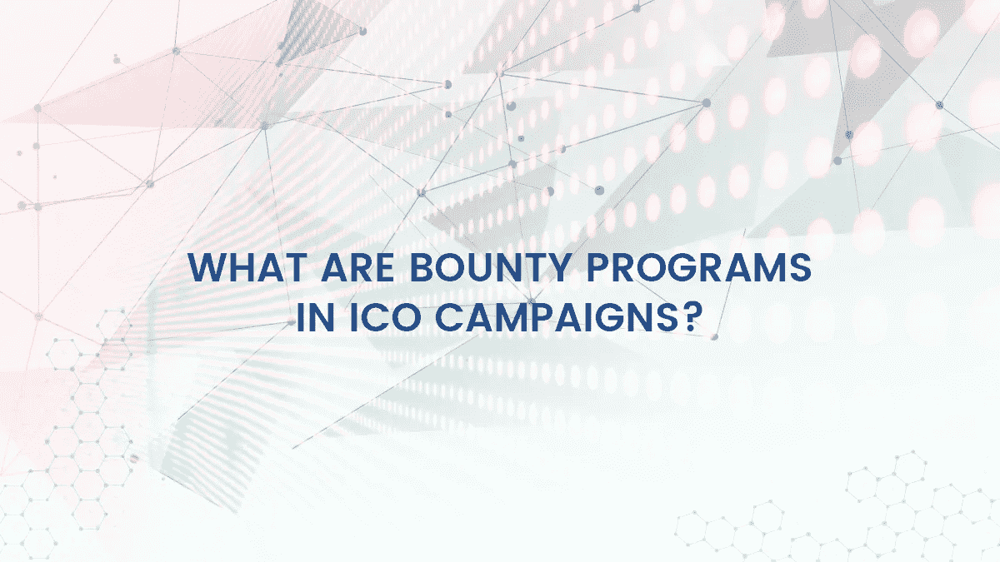

# ICO 战役中有哪些赏金计划？

> 原文：<https://medium.com/hackernoon/what-are-bounty-programs-in-ico-campaigns-6aefbc9c56e6>

任何营销策略的关键目标之一是确保产品/服务尽可能多的市场渗透。通过这样做，许多人开始了解该公司，他们提供什么，以及如何与他们的产品和服务互动。这有助于增加口碑广告，从而增加销售额。自从数字时代开始以来，人们一直非常重视社交媒体营销。利用基于互联网的平台推广业务。赏金计划通常是任何数字营销和促销企业不可或缺的一部分。

# 什么是赏金计划

*数字世界中的奖金来源于在线游戏平台，这些平台为参与游戏开发的人提供奖励*。奖金本质上是公司向个人提供的激励性奖励机制。这意味着，一家公司推出一种产品或服务，向人们提供一些奖励，以换取他们完成某些任务。这类似于某种形式的易货贸易；公司奖励一个人，作为回报，这个人为公司做一些简单的工作。这是许多公司名副其实的广告手段。

在加密货币领域，奖金已经成为任何 ICO 活动的有用组成部分。许多初创公司通常会将奖金计划作为其 ICO 活动的一部分。在 bounty 计划期间，ico 为市场营销、漏洞报告甚至改进加密货币框架方面的许多任务提供补偿。奖励通常是加密货币代币或法定货币的形式(然而这种选择很少)。加密货币空间已被证明是一个非常有利于奖金计划的环境。这是因为它为加密货币初创企业和个人提供了巨大的回报和激励。

# ICO 赏金框架

*加密货币 ICO 活动已经成为一种传统，它结合了奖金计划，要么进行 ICO 前奖金，要么进行 ICO 后奖金。奖金通常不与 ico 一起发放。*

# 前 ICO 赏金计划

顾名思义，这些是在实际 ICO 之前进行的赏金计划。它们通常是为了引起轰动，并提高加密货币项目在社交媒体平台上的存在。这一切都是为了提高对加密货币 ICO 的认识，并获得口碑。该框架利用非正式广告渠道来增加市场渗透。这种奖金的目的是，随着参与者开展各种活动，他们圈子里的人开始更多地了解加密货币。常见的 ICO 前奖金活动包括:

# 1.社交媒体活动奖金

这包括在参与者的社交媒体账户上推广 ICO 的活动。获得的奖励取决于此类帖子产生的参与度。这可以是转发、喜欢、分享、观点和评论的形式。用于 ICO bounty 项目的流行社交媒体平台包括脸书、Twitter 和 YouTube。

# 2.文章写作奖金

这是为那些拥有大量追随者和读者的博客的参与者准备的。ICO bounty 计划可以为在博客上撰写关于 ICO 的专题文章的博主提供奖励。就像社交媒体的奖金一样，奖励将取决于文章和博客帖子的参与度。

# 3.Bitcointalk 签名奖金

这是很多 ico 的热门赏金。它对 [Bitcointalk 论坛](http://bit.ly/2KWCTpN)的参与者开放。ICO 发布嵌入了代码的签名。张贴此签名的参与者的排名决定了他们获得的赌注数量。对于大多数赏金计划，只有 Bitcointalk 上的 Jr .会员及以上的人才能参与。

# 后 ICO 赏金计划

*至此，ICO 已经完成，资金已经筹集完毕。现在，这一切都是为了根据社区建议对加密货币项目进行改进。后 ICO 奖金计划旨在改善项目社区的反馈。一些常见的后 ICO 奖金计划类型如下:*

# 1.翻译活动奖金

这包括翻译与加密货币项目相关的所有文档，以及主持不同的论坛小组。对于像日语、法语、西班牙语、荷兰语和德语等母语人士来说，这是一个完美的奖励计划。常见的翻译活动包括加密货币网站、白皮书和 Bitcointalk ANN 线程。

# 2.错误报告奖金

除了作为一个有效的奖励活动，错误报告也帮助了开发者。一份好的错误报告清晰而简明地指出了加密货币软件或平台的问题。

需要注意的是，ICO 前和 ICO 后的活动并没有硬性规定。**加密货币 ICO 可以决定在 ICO 之前或之后的赏金计划中使用上述任何活动。**

加密货币初创公司通常会从硬币总供应量中留出一定比例用于奖金计划。关于这个数额的信息通常可以在他们的网站、白皮书或 Bitcointalk ANN thread 上找到。

# 如何参与 ICO 奖金

ICO 赏金计划是参与市场和赚取代币的好方法。这些代币甚至可以兑换成法定货币。大多数活动本质上都不是真正的技术性活动，因为它们依赖于普通的互联网活动和互动。参与赏金计划的最佳方式之一是通过 Bitcointalk 和 Cryptocointalk 论坛。几乎所有的 ICO 奖金都列在这里。

# 赏金计划的未来

随着 ico 在 2017 年越来越受欢迎，赏金计划也越来越受欢迎。促销活动获得免费代币的诱惑吸引了许多密码爱好者。然而，赏金项目已经受到了一些金融监管机构的审查，如美国证券交易委员会。这是因为奖金计划本质上鼓励人们参与有金融风险的商品。

证交会审查的要点是基于[豪威测试](https://www.coinist.io/the-howey-test-the-sec-and-ico/)以及它如何应用于赏金项目。利润来自于第三方推动者(在本例中是赏金的参与者)的努力这一事实，那么赏金运动就构成了投资契约交易。因此，这意味着几乎所有奖金促销的代币实际上都是证券，因此受美国证券交易委员会证券法规的约束。

SEC 并不是唯一一个拖着这条线的机构，英国的金融监管机构也得出同样的结论。随着加密市场的监管框架变得更加清晰，赏金计划可能会成为更多政府审查的焦点。

*渴望了解更多关于 FundYourselfNow 的信息吗？在我们的*[*Telegram*](https://t.me/fundyourselfnow)*群上加入我们的众筹革命对话，或者在* [*Twitter 上关注我们。*](https://twitter.com/fundyourselfnow)