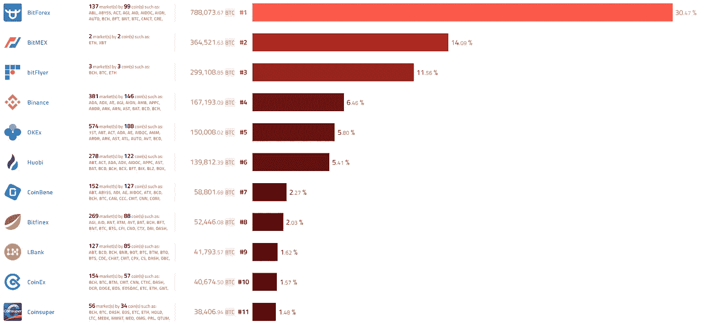
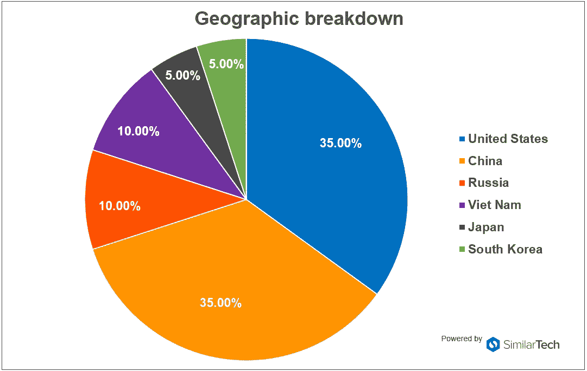

# 什么是加密交换，我们为什么需要它们？

> 原文：<https://medium.com/hackernoon/what-are-crypto-exchanges-and-why-do-we-need-them-e53e662e1bd4>

Photo by [Chris Liverani](https://unsplash.com/@chrisliverani?utm_source=medium&utm_medium=referral) on [Unsplash](https://unsplash.com?utm_source=medium&utm_medium=referral)

比特币背后的基本理念是创建一个没有任何第三方参与的点对点转账系统。虽然比特币在技术上解决了这个问题，但现实世界带来了许多其他挑战:第一个挑战是接受度。

假设你想用比特币支付披萨——收款方必须是*愿意*收到比特币以换取他们给你的披萨。美元几乎不存在这个问题，但由于数字货币尚未成为主流，我们需要找到那些想把我们的加密货币兑换成法定货币或其他代币的人。密码交易所诞生了。

加密交易所创造了巨大的需求和供给池，这使得寻找其他交易方变得简单。它们也被大量用于日内交易。此外，他们简化了加密工作:我们都听说过有人不小心[扔掉他们装有大量比特币密钥的硬盘](https://www.newsweek.com/man-accidentally-threw-bitcoin-worth-108m-trash-says-theres-no-point-crying-726807)的新闻。这种事情不会发生在加密交换中。此外，交易所可以帮助你解决数字货币特有的另一个问题；由于所有的地址都是散列码和数字，人们有时会把钱汇错地址。而且由于不涉及银行，交易是不可逆的。正如 ABCC 公司的首席执行官郑恩里告诉我的:有一次，“一个用户向一个错误的地址发送了大量代币。理论上，用户对错误负有全部责任。然而，我们的团队努力帮助他从损失中恢复过来。”

另一方面，交易所也是黑客的目标，臭名昭著的 Mt. Gox 黑客攻击是最大的，而 Bithumb 黑客攻击是最新的。当然，比瑟姆能够掩盖 3100 万美元的损失。

# 比特币跌了

最近，比特币和其他加密货币已经失去了价值和市值。虽然有些人声称泡沫即将破裂，但其他人仍然希望价格会再次上涨。他们说，重点应该是他们制造的产品，[而不是价格](https://mashable.com/2018/08/14/cryptocurrency-market-cap-under-200/?europe=true#UJ7xkvXprmqC)。这都归结到一个至关重要的问题；比特币有真正的用途吗，还是说[只对犯罪活动](https://bitcoinist.com/former-paypal-ceo-labels-cryptocurrency-a-cult-that-is-headed-straight-to-zero/)有用？

对区块链和加密项目有许多规定和打击，其中一些是打击骗局，而另一些对区块链实际上是什么一无所知。但是除了官方的立场，研究加密交换揭示了公众的支持。Coinhills 是列出这些交易所的网站之一:

*Digital Currency Exchanges, ranked by volume according to Coinhills*

研究这些交流揭示了一些有趣的信息。根据 SimilarTech 提供的统计数据，这些交易所的大部分用户来自美国和中国。考虑到中国政府最近对密码的打击，这是一个有趣的数字。

*Geographical breakdown of the top 20 digital currency exchanges’ usage by SimilarTech*

因此，虽然在官方层面上，中国可能不在对加密最友好的国家之列，但这些图表揭示了这些国家对数字货币的真正普遍支持。

# 交易所市场

如你所见，密码交易所已经进入了一个巨大的市场。不同的交易所竞争的是它们的交易量和它们交易的代币，以及它们提供的服务。例如，一些交易所提供零费用交易来扩大客户基础。其他人，比如 ABCC，用一种创新的模式来奖励他们的客户；他们向他们支付自己的代币，根据他们在那些代币中的份额，他们将获得比例份额的利润(80%的交易费分配给他们)。为了进一步鼓励早期参与，代币根据用户的活动情况奖励，每 120 天减半——类似于比特币的奖励系统。

这个方法行得通吗？到目前为止，增长率一直很有希望，但我们不要忘记，他们也有马耳他前外长在船上。他们很快将发布一个专业版本，该版本反应灵敏，并提供一些奇怪的功能，如 K 曲线和深度图集成，改进的交易视图以及止损和止盈。

比特币的价格可能已经下跌，但它仍然是一个重要的参与者。密码交易所为这一领域提供了一条简化的道路，他们对市场份额的竞争可以导致更好地使用您的密码的创新方法，更少的担忧和更多的回报。

*这篇作品是* [*最初发表在 NullTx*T5 上](https://nulltx.com/what-are-crypto-exchanges-and-why-do-we-need-them/)