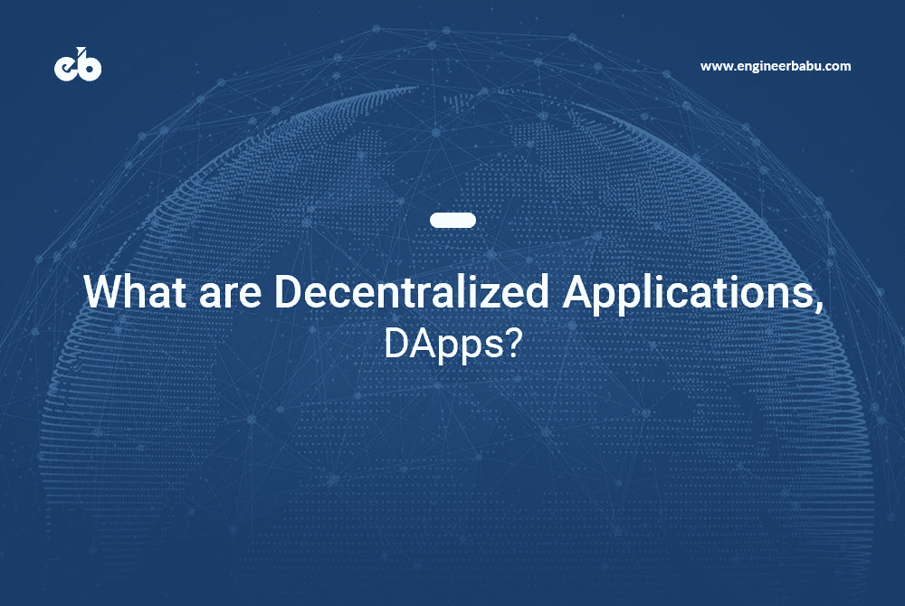
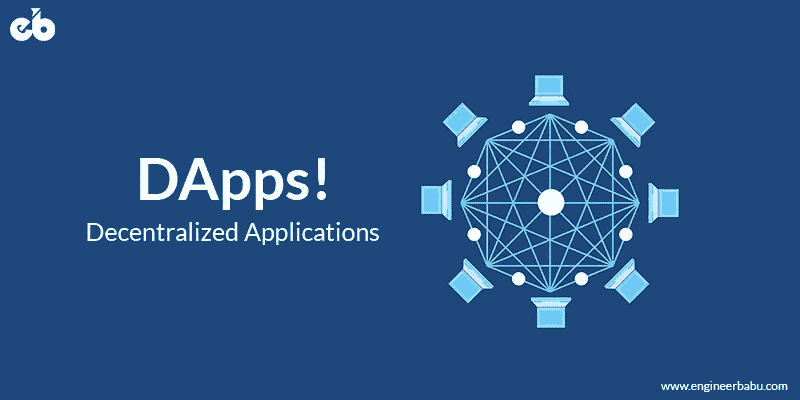
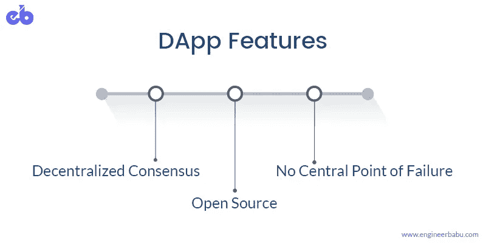
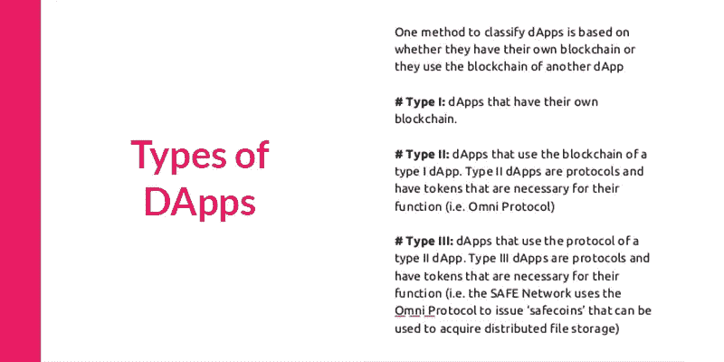
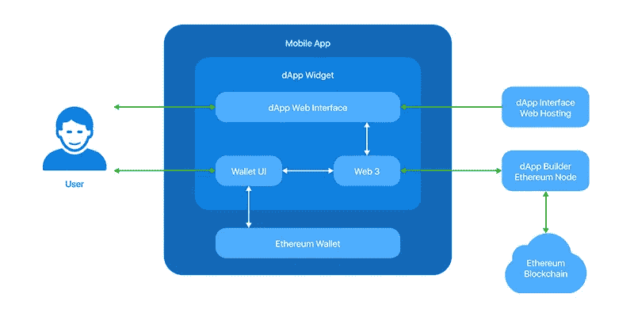
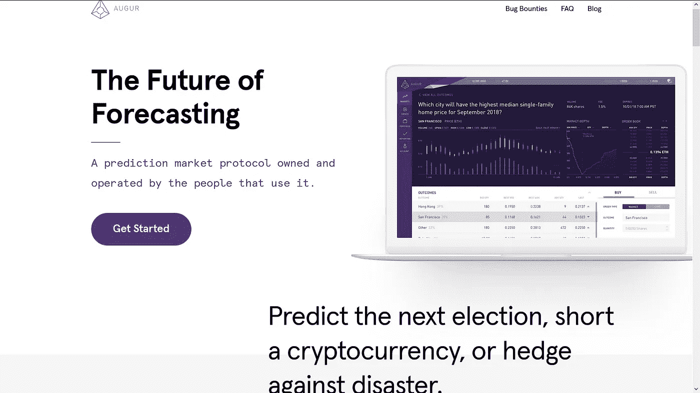
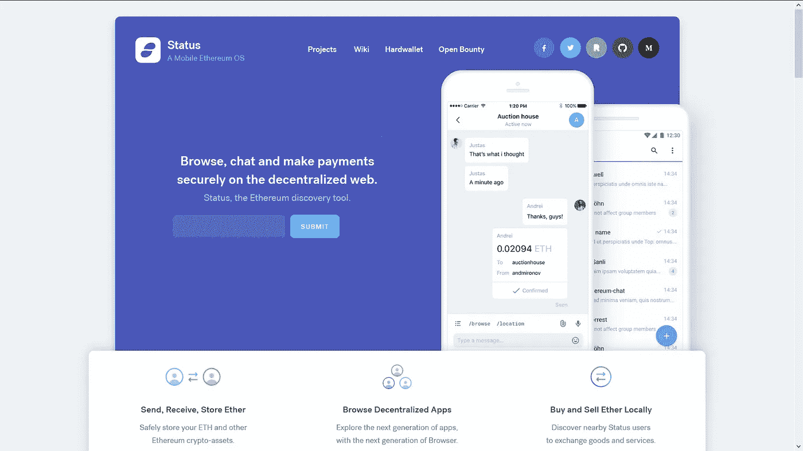
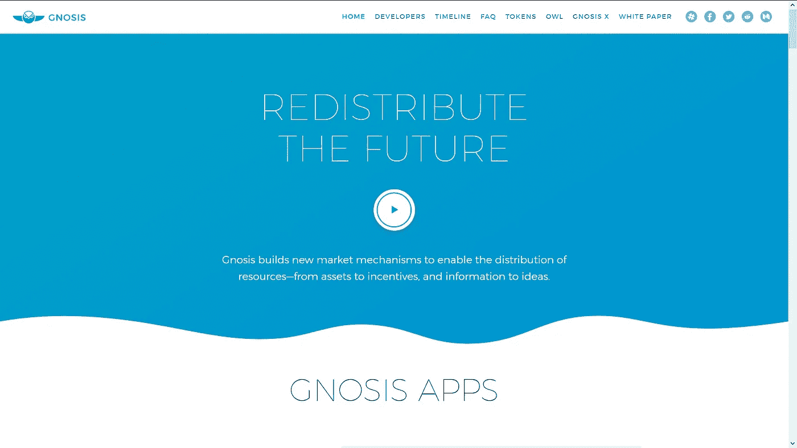
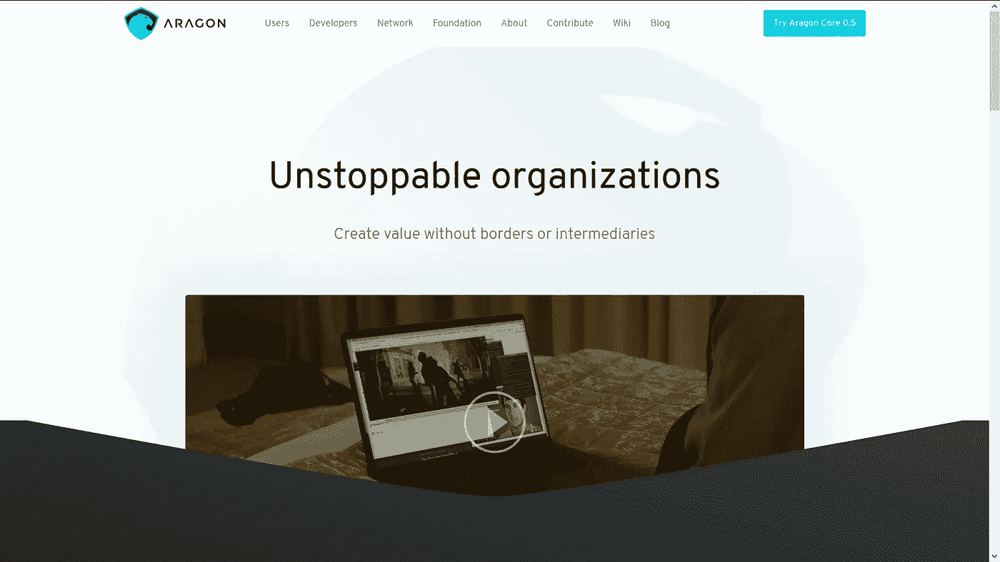

# 什么是去中心化应用？

> 原文：<https://medium.com/hackernoon/what-are-decentralized-applications-dapps-3b63b4d587fe>

What are Decentralized Applications? — Image Source: [EngineerBabu](https://www.engineerbabu.com/blog/what-are-decentralized-applications/)

如今，一种用于创建高度可伸缩且盈利的应用程序的现代模式正在进入我们的日常生活。比特币因其点对点技术和分布式存储账本等功能而广受欢迎。这些特性为创建新类型的应用程序提供了构建模块，这种应用程序称为分散式应用程序，简称 DApps。

作为行业中的一个新概念，DApps 得到了很多媒体的报道。然而，随着它们越来越多的实现和出现的用例，它们很可能被人们采用和接受。众所周知，DApps 是分布式的、灵活的、透明的，并且具有比当前软件模型更好的激励结构。

# **分散应用简介**

DApps(分散式应用程序)是目前区块链领域最有趣的术语之一。术语 DApp 是由两个词组合而成的——分散式应用程序。简单来说，DApps 可以被认为是工作在去中心化以太坊区块链上的应用、工具或程序。

根据维基百科给出的定义，“去中心化应用(dApp，Dapp 或 DApp)是由许多用户在一个去中心化网络上使用无信任协议运行的应用。它们旨在避免任何单点故障。他们通常会有代币来奖励用户提供的计算能力。”

为了更好地理解这个定义的含义，让我们首先尝试理解传统的 web 应用程序是如何工作的，DApps 有什么不同吗？在传统的 web 应用程序中，使系统可用的两个重要元素是前端和后端。这些元素通过 HTTP 协议以编码消息的形式相互通信。

与 DApps 相比，这种应用涉及多个问题。首先，这种应用服务器被托管在使用集中式架构的托管服务上，这在恶意攻击的情况下会导致单点故障。此外，通过中央服务器关闭应用程序只需要黑客中断主机服务。当我们依赖集中式服务器时，数据更容易受到攻击。

DApps — Image Source: [EngineerBabu](https://www.engineerbabu.com/blog/what-are-decentralized-applications/)

当谈到 DApps 时，又涉及到两个主要因素。虽然前端与传统应用程序保持一致，但后端是以以太坊区块链的形式形成的。前端和后端之间的通信以与传统应用相同的形式发生，最终用户将无法区分两者。在使用 DApp 的情况下，很难关闭任何应用程序，因为它需要关闭所有分布式托管节点，这实际上是不可能的。

以同样标准的流行网络应用为例，如脸书、Twitter 和 Instagram 目前都是在一个集中的服务器模型上运行的。这些应用程序的数据由单一机构控制，可以根据需要进行操作或更改。这意味着尽管这些应用程序的前端有数百万用户，但后端仍然由单个组织控制。

与此相反，DApp 在本质上是分布式的，并且涉及网络所有元件的参与，以便修改或控制任何信息。DApps 既可以运行在点对点网络上，也可以运行在区块链网络上。当像 Twitter 这样的应用程序采用基于 DApp 的方法时，一旦任何人的推文在通过共识机制后发布到网络上，没有人有权删除它。

DApps 的本质可以概括为分布式、灵活和透明，因为它们具有改变技术前景的潜力。

在当今时代，我们将信任、数据和重要信息交给通过典型服务器、数据库或独立计算机运行的集中式应用程序。这种方法允许一个机构控制我们在这些应用程序上所做的一切，从而将我们的隐私置于风险之中。另一方面，以太坊网络运行在基于社区的模型上，该模型以分布式模式运行。

分散的应用程序非常有用，因为它们可以用于连接市场中的不同人，共享资源并存储它们，维护密码以及执行智能合同，而无需将所有权交给一个中央机构。目前运行的 DApps 包括用于存储、安全和服务器等的工具。除此之外，一些应用程序是以数字钱包的形式创建的，允许人们管理他们的加密货币。

# **DApp 特色**

虽然 DApps 是最近才推出的，有这么多的用例，但它们已经变得很受欢迎，也很受欢迎。使分散式应用程序引人注目的一些常见特征是:

DApp Features — Image Source: [EngineerBabu](https://www.engineerbabu.com/blog/what-are-decentralized-applications/)

## 开放源码

在闭源应用程序中，终端用户需要在去中心化方面信任应用程序的开发者，因为他们不能通过任何中心源直接访问他们的数据。因此，当用户采用闭源应用程序时，它们总是会面临风险。另一方面，DApps 是去中心化和开源的应用。DApp 为商业实践创造了一种新的结构，因为它允许所有的网络参与者而不是一个人来跟踪发生的事情。它们通过自治来管理，DApp 中的任何更改都是通过共识(大多数用户)来决定的。DApp 的代码库应该可供审查。

## 分散共识

在比特币推出之前，任何交易的有效性总会需要某种集权。为了进行支付，交易通过清算所进行监控。分散式应用程序基于对等(P2P)模型工作，这意味着节点能够直接相互连接。在 DApp 中，交易是通过共识机制来处理的。当大多数节点批准交易时，交易继续进行并得到处理。此外，通过以加密令牌的形式奖励网络的验证者来激励他们。

## 没有中心故障点

由于 DApps 是分布式的，它们不依赖于单个服务器，所以没有中心故障点。DApps 允许存储在其中的数据分散到所有节点上。这些节点是相互独立的。在一个节点发生故障的情况下，其他节点不会受到影响，并将相应地在网络上运行。不同的分散式数据库系统，如 IPFS(星际文件系统)、BitTorrent 和独立分布式哈希表，可用于创建具有此功能的 DApps。

# **DApps 分类**

根据以太坊白皮书，DApps 可以分为三种不同的类型。让我们在这里逐一了解它们:

## **金融区块链应用-**

顾名思义，这一类别将拥有 Dapps，为用户提供管理财务和金钱的方法。这一类别的一个例子是比特币，它为用户提供了一个分布式和去中心化的货币化系统。

由于没有对网络的集中控制，没有一个单一的权力机构负责控制你所有的钱。金钱的权力和监管掌握在网络和共识协议的人们手中。在这些应用程序中，用户是他们金钱的主人。除了比特币，至今还创造了各种 Altcoins。这些代用币属于这一类。

## **半金融区块链应用** -

这个类别是位于区块链之外的资金和信息的混合体。这方面的一个例子是保险应用程序，它允许在航班延误的情况下退款。这一类别的另一个例子是 ICO(首次发行硬币)。ICO 只不过是一种类似于 IPO 的筹资机制，唯一的区别是加密货币取代了法定货币。

ICO DApps 易于构建，因为它们应用了 ERC20 令牌标准等技术。大多数 ico 的运作方式是让投资者将资金以比特币或以太网的形式存入智能合约。这种智能合约存储资金，并在以后的某个时间点以新令牌的形式分享等值的资金。

## **全功能分散应用**

第三类 DApps 利用了分散和分布式系统的所有特性。这类应用程序是最受欢迎的 DApps，它们不需要任何级别的财务支持。例如，在线投票或分散治理的应用程序。像迪拜这样的国家已经开始利用区块链，建立第一个区块链政府。

[Types of DApps — Image Source](https://www.slideshare.net/SherminVoshmgir/smart-contracts-dapps)

# **DApps 的要领**

为了将申请视为 DApp，需要满足以下标准:

*   该应用程序应该是开源的，并且应该以自治的方式运行。没有一个集中的单一权威机构可以访问大多数应用程序令牌。DApp 必须遵守其所使用的共识机制中关于建议的未来升级以及市场反馈的规则。应用程序中引入的所有更改都必须通过系统用户的一致同意来决定。
*   应用程序运行的数据和记录应保存在一个公共且分散的区块链上。此外，存储在区块链上的所有信息都必须加密。
*   应用程序必须使用加密令牌，如比特币或任何自己的本机令牌。这个令牌应该用于根据矿工和农民在系统中的贡献来奖励他们
*   DApp 必须使用标准加密算法来生成令牌，并具有类似于比特币的固定共识机制，比特币使用工作证明算法来实现奖励目的。

## 建立共识的机制

DApps 使用两种常见的机制来建立共识，即工作证据(PoW)和利益证据(POS)。顾名思义，工作证明机制在区块链被用作一种共识机制，其中的奖励分配是基于每个利益相关者对网络或 DApp 所做的工作量来完成的。比特币区块链中使用了 PoW 机制，人们通过其获得奖励的共识被称为挖掘。

而另一方面，利益相关方证据机制允许根据利益相关方对申请的所有权百分比做出任何关于 DApp 的决定。例如，如果一个分散式应用程序的利益相关者持有该应用程序发行的 25%的令牌，那么他/她就拥有 25%的权重。Omni 协议利用了利益证明机制。

没有必要在这两种机制中使用一种算法，即任何应用程序都可以并行使用这两种机制。这种情况的一个例子是 Peercoin。这种组合允许 DApp 消耗更少的能量，这是单独使用工作证明的主要缺点之一，并且它还允许应用程序变得更能抵抗 51%的攻击。

## 令牌分发机制

为了在市场上分发他们自己的代币，DApps 遵循三种常见的机制，即挖掘、筹款和开发。正如我们前面所讨论的，挖掘机制基于 PoW 原则工作，它允许将最大数量的令牌分发给那些为应用程序操作贡献最多工作的人。例如，当矿工通过使用他们的计算能力来验证交易和维护比特币区块链来解决数学问题时，比特币允许以奖励的形式分发令牌。

筹资机制只不过是为应用程序的初始开发筹集资金的一种方法。这是在 ICO 的帮助下进行的，最初的硬币提供过程。人们通过白皮书、网站和概念证明来了解应用程序的想法，如果他们似乎对此深信不疑，他们可以通过筹集资金来为应用程序做出贡献。

在筹款机制中，令牌被分发给为应用程序的初始开发做出贡献的人。为了理解这一点，考虑主协议的例子。应用程序令牌 Mastercoins 最初分发给参与其 ICO 的人，他们将自己的比特币发送到给定的地址，以换取 Mastercoins。这些比特币随后被用于资助应用开发。

第三，是开发机制，其中令牌是通过利用预定义的机制生成的。这些代币只能用于 DApp 的发展。再次以主协议为例，应用程序使用协作机制和筹资机制来为未来的开发提供资金。通过筹款筹集的大约 10%的主币被留作协议开发之用。这些代币的供应是基于预先确定的时间表，并通过社区驱动的赏金系统分发。

Example — Image Source: [Github](https://github.com/DAPPBUILDER/dApp-Builder/tree/master/dApp%20Widget)

# DApp 是如何工作的？

为了使 DApp 发挥作用，需要实施上一节中介绍的四个基本要素。这使得 DApp 成为在分散的区块链上实现的开源应用。这些应用程序使用协议生成的令牌。

DApp 的开源特性使其完全去中心化，允许任何人查看和贡献代码。这也确保了质量和数量因素，因为它加快了产品开发的可扩展性过程。

一旦完成了这些步骤，下一步就是使用区块链来分散应用程序。区块链技术允许你创建一个永久的分类账来存储任何种类的记录。下一步是在令牌的帮助下将交易和记录添加到区块链分类账中，这些令牌是使用不同的协议或算法挖掘的，例如 PoW、PoS 或在某些情况下两者都使用。

# **基于以太坊的流行 DApps**

## **假人**

假人是 DApp 的一个项目，旨在创建一个利用闲置计算能力的全球市场。该项目的概念是利用个人电脑和数据中心的能力来创建一台可租赁的超级计算机，供世界各地的任何人使用。

该项目不依赖于任何中央服务器场，而是将计算负载分配给愿意租用其机器进行计算工作的“提供商”。这些提供商可以共享他们的资源来换取 GNT 令牌。该项目具有很大的潜力和范围，因为它允许分散渲染过程，并且比集中式选项更快更便宜。

## **预兆**

Augur — [Image Source](https://www.augur.net/)

Augur 是一个有趣的 DApp 项目，它基于将预测市场与分散网络的力量相结合的概念。它可以被认为是一个分散的市场平台或预测工具，允许你对潜在的交易收益进行预测。它利用“群众的智慧”来预测真实世界的事件，并使用 ERC20 令牌。

奥格应用程序预测了许多结果，这些结果被证明比现实世界中许多专家的预测更准确。Augur 被认为是一个市场预测平台，当用户对世界事件做出正确预测时，它将激励用户。此外，报告事件的市场创造者平台代币持有者也将获得报酬或激励。

## **状态**

Status — [Image Source](https://status.im/)

Status 将自己定义为移动以太坊客户端，允许移动设备充当轻量客户端节点。基于以太坊网络，它允许你在分散的网络上安全地聊天、浏览和支付。DApp 还能让你从任何地方进入整个以太坊生态系统。

用户可以发送智能合同，并在 DApps messenger 系统中相互交换付款。由于该应用程序是基于点对点协议运行的，因此服务器停机不是问题。

## **灵知**

Gnosis — [Image Source](https://gnosis.pm/)

与 Augur 类似，Gnosis 也是一个建立在以太坊区块链上的预测市场平台。该项目旨在让人们对选举、市场价格等现实世界的事件做出准确的预测。根据项目的预设规则，平台的用户可以通过 GNO 代币或其他加密货币的形式获得 Gnosis 准确预测的奖励。

Gnosis 允许开发者通过平台上可用的开发者工具在 Gnosis 上创建自己的定制预测市场。

## **棱镜**

Prism 是一个由 ShapeShift 主持的以太坊项目。它提供了一个不可信和分散的资产组合市场。它利用 EDCCs，可执行的分布式代码契约，为市场投资组合生成定制的管理工具。在 Prism 的帮助下，任何人都可以投资不同的密码，并指定他们想要的持股比例。

Prism 消除了对第三方的需求，以及保存和存储钱包和多个私钥的复杂过程。由于该项目基于以太坊智能合约，因此无需管理不同交易所的密码和密钥。此外，它通过交互式用户界面显示一个人的投资组合，并实时自动跟踪一切。

## 阿拉贡

Aragon — [Image Source](https://aragon.org/)

DApp 系列的另一个雄心勃勃的项目是阿拉贡。基于以太坊的平台允许人们创建和管理一个分散的组织。Aragon 是一个开源项目，由 Aragon 基金会管理。该项目的概念是消除对人员交易的需求，并允许人们使用区块链管理整个企业和组织。

创建该平台是为了构建和管理 Dao(分散自治组织)。Aragon 还包括平台的令牌 ANT，它提供了对产品未来发展做出决策的投票权。阿拉贡的道概念可以用于任何组织或公司，甚至任何非营利组织或基金会。预计这将为这些实体提供透明度和额外的有效治理。

Aragon 还通过用基于以太坊的智能合约取代不必要的第三方来帮助遏制它们。通过消除地理边界和文书工作，该平台旨在为每个人提供一个极其方便的数字司法管辖区。

# **结论**

Dapp 已经发展出特殊的功能，这使它们有可能成为自我维持的资源，因为它们为其利益相关者提供了投资 Dapp 发展的能力。观察它们的受欢迎程度，可以确定在未来的日子里，DApps 将用于多种用途，如支付、存储、云计算等。将很快超过目前可用的传统应用。

区块链采用的不可避免的进展将使许多当前的做法过时。目前看来，这似乎是一个遥不可及的结果，但像银行这样的服务肯定可以在未来几天采用区块链，并在无信任、自我维持和分散的网络中运营。大公司朝着这个方向努力，以确保他们在区块链生态系统中的地位，这就是证明。

— — — — — — — — — — — — — — — — — — — — — — — — — —

## 看我的其他相关文章

**1。** [**区块链技术讲解:简介、意义、应用**](https://www.engineerbabu.com/blog/what-is-blockchain/) **，也上**[**hacker noon**](https://hackernoon.com/blockchain-technology-explained-introduction-meaning-and-applications-edbd6759a2b2)
**2。** [**区块链是如何彻底改变银行和金融市场的**](https://www.engineerbabu.com/blog/blockchain-revolutionizing-banking-financial-markets/) **，也上**[**hacker noon**](https://hackernoon.com/how-is-blockchain-revolutionizing-banking-and-financial-markets-9241df07c18b) **3。** [**区块链在医疗保健:机遇、挑战、应用**](https://www.engineerbabu.com/blog/blockchain-in-healthcare-opportunities-challenges-and-applications/) **，也上**[**hacker noon**](https://hackernoon.com/blockchain-in-healthcare-opportunities-challenges-and-applications-d6b286da6e1f) **4。** [**区块链是如何颠覆供应链行业的？**](https://www.engineerbabu.com/blog/how-is-blockchain-disrupting-the-supply-chain-industry/) **，也上** ****5。** [**关于智能合约你需要知道的一切:初学者指南**](https://www.engineerbabu.com/blog/what-are-decentralized-applications/) **，也上**[**hacker noon**](https://hackernoon.com/everything-you-need-to-know-about-smart-contracts-a-beginners-guide-c13cc138378a) **6。** [**十大知名区块链开发公司**](https://www.engineerbabu.com/blog/top-10-reputable-blockchain-development-companies/) **，也上**[**hacker noon**](https://hackernoon.com/top-10-reputable-blockchain-development-companies-7c6eba562b90)**

> ***我是 Mayank，*[*engineer Babu*](https://www.engineerbabu.com/)*的联合创始人。随时联系我*[*LinkedIn*](https://www.linkedin.com/in/mayankpratap/)*| mayank@engineerbabu.com(关于 EngineerBabu —* [*中*](https://hackernoon.com/how-mayank-pratap-built-engineerbabu-a-profitable-it-service-company-generating-more-than-50-000-per-month-bcd3006bdbb5) *)。***

**此外, [EngineerBabu](https://www.engineerbabu.com/) 通过构建高级 IT 解决方案，帮助初创公司、企业和所有者发展业务。他们开发的项目 95%都按时完成了。 [30+由风投](https://www.engineerbabu.com/casestudies)资助，获得最具创新总理设计奖，入选 Y-Combinator 2016 & 2017。**