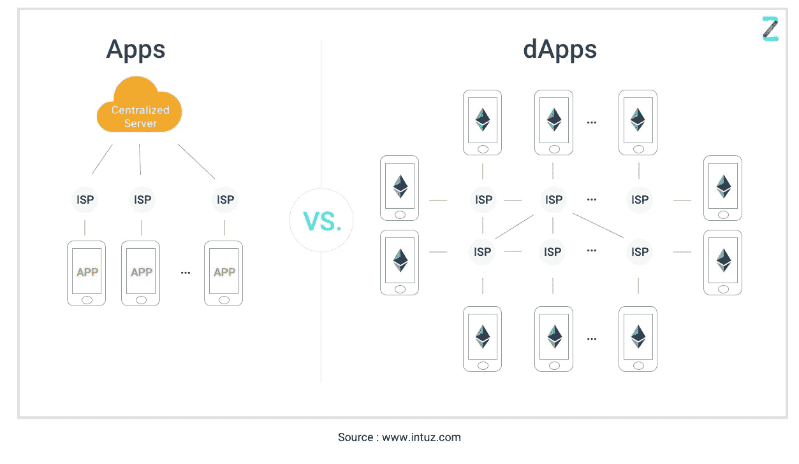
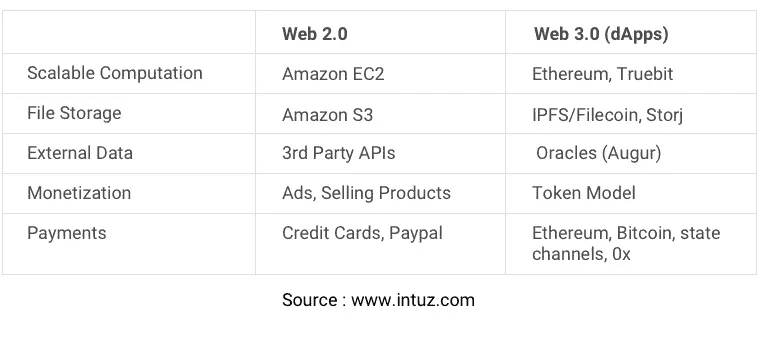

# 什么是分散式应用程序(dApps)？—举例说明

> 原文：<https://medium.com/hackernoon/what-are-decentralized-applications-dapps-explained-with-examples-7ff8f2c4a460>

技术世界是整个宇宙中最具活力的部分之一。前一刻，世界还落后于某项技术，下一刻，这项技术突然就过时了。应用程序世界也是如此。许多技术栈、框架和语言都可以用来开发一个应用程序，但是开发者仍然不相信一个框架可以提供最好的结果。

随着世界适应传统应用，整个生态系统也在不断发展。dApps 或分散式应用程序是一种新型的应用程序，不受单一机构的控制或拥有，无法关闭或停机。

# dApps:终极开源革命

dApp 概念仍处于萌芽阶段。用一行文字解释这一点很困难，因为似乎没有一个特定的定义适合使应用程序成为分散应用程序的所有属性。作为 dApps，应用程序需要表现出以下四个特征:

*   **开源:**第一个也是最重要的属性是，这类 app 应该把自己的核心源代码提供给所有人。由于 dApps 的核心特征是自主性和一致同意，所以本质上，改变必须由所有或大多数用户决定。此外，代码应该可供每个人检查。
*   **去中心化性质:**顾名思义，去中心化应用将所有东西都存储在去中心化的区块链或任何密码技术上，以避免应用程序遭受集中授权的危险，并强调自治性质。
*   **激励:**由于该应用基于去中心化的区块链，网络上记录的验证者必须获得加密令牌或任何形式的有价值的数字资产的奖励/激励。
*   **算法:**去中心化的 app 需要有一个共识机制，在密码系统中刻画价值的证明。本质上，这赋予了加密令牌价值，并创建了用户同意生成有价值的加密令牌的共识协议。

现在我们已经知道了这些特征，我们可以试着把它放入一个定义中，帮助我们识别现实生活中的例子。本质上，dApp 是一个运行在分散的 P2P 网络上的应用程序，由所有成员而不是一个单一的中央机构管理。

# 【dApps 如何适应现实世界？

利用上面得出的定义，我们发现世界上第一个已知的 dApp 是比特币。作为一种顶级加密货币，比特币很受欢迎，它解决了集中化问题，并让用户能够通过自我维持的公共账本，在没有任何中间人或中央机构的情况下进行交易。谈到分散式应用程序的用例，我们可以根据它们可以融入的场景对这些应用程序进行分类。这种分类将 dApps 分为三个部分，这也是其潜在的使用案例:

*   **资金管理&转账**

分散的应用程序可以用来平滑世界上的资金转移。我们已经看到了比特币和其他加密货币的成功带来的好处。使用区块链网络和自己的加密令牌，dApps 可以通过消除中间人来加快资金管理、转移和借贷，并由于没有多数票就不可能改变的共识机制而增强安全性。

*   **业务流程管理**

公司可以集成分散的应用程序来简化流程，而无需人工干预。借助智能合同——区块链网络的重要组成部分，可以解决关键问题并提高流程效率。例如，物流公司可以将 RFID 芯片集成到他们的货物中，可以在目的港进行扫描，在目的港可以通过买卖双方之间的智能合同自动结算付款。

*   【道】

“道”是一种全新的现象，即在没有领导者的情况下创建不知名的组织。这些组织可以像公司一样工作，并通过区块链上的编程语言定义的规则运行。成员将如何投票，组织将在哪个业务部门运营，谁可以成为成员，价值令牌将如何交换，一切都可以在将运行组织的区块链上编程。这些组织一旦部署就不能停止，可以在世界范围内工作，没有任何困难地搭上区块链网络的顺风车。

# **真实世界的 dApp 示例:世界上成功的 dApps 项目**

大多数 dApps 专注于资金管理和简化资金转移。大多数加密货币消除了与 P2P 转账相关的摩擦。但是，dApps 也有一些创新的使用案例。例如，Factom 是一个不可更改的开源记录保存系统。还有一些其他有前途的 dApps 项目正在改变应用程序的格局。其中包括:

*   **假人**

假人利用闲置的计算机能力，它的第一个用例以黄铜假人的形式出现。布拉斯假人旨在通过给予 CGI 艺术家出租强大计算资源的权力来改善 CGI 渲染景观。通过创建一个分散的网络，闲置的机器得到了很好的利用，让它们有能力接受假人网络用户的任务。这是 Goem dApp 实现的下一级资源共享和池化。

*   **预兆**

Augur 旨在将分散式网络的力量与预测算法相结合，为市场创建完全可靠的预测工具。尽管这款应用仍处于 beta 测试阶段，但其潜在的影响还是很有希望的。该应用程序将能够将真实世界的事件输入到其他事件中，以创建一个不可更改的区块链真实事实网络，可供各行各业参考。

*   **状态**

Status 运营着一个点对点网络，用户可以通过这个网络互相付款，并签订智能合同。通过信使系统，用户可以保持联系，没有服务器停机的问题，因为一切都是基于区块链 P2P 网络。

# **开发 dApps:如何构建强大的去中心化 app？**

就像任何新的编程概念或技术一样，开发人员在考虑开发分散式应用程序时，可以利用大量的编码选项和平台。如果你不得不为自己开发一个 dApp，你需要获得合适的工具、组件和框架来获得成功。我们尝试将 dApp 开发与传统开发进行比较，并在下表中编译构建分散式应用程序所需的一切:

dApps 基于在 P2P 网络上运行的后端代码。与传统应用相比，这是一个主要的区别，因为普通应用的后端运行在一个中央服务器上。说到前端，代码可以用任何编程语言编写。在分散应用程序的情况下，前端使用 API 调用后端。此外，前端也可以托管在分散式存储系统上，如 IPFS。

现在你看到了分散式应用程序的开发与普通应用程序的不同之处，让我们来关注选择 d app 而不是通过集中服务器管理的应用程序的好处。

# **为什么选择 dApp 开发而不是传统的 App 开发？**

dApps 提倡去中心化，使它们防篡改，记录不可更改。由于 dApps 基于安全的区块链网络，这种应用程序提高了安全性，并且不会受到黑客和入侵的影响。

*   更快的支付处理，无需集成支付网关来接受资金。
*   由私钥管理的智能合约带来了高级别的数据安全性。
*   更好的匿名性，不需要用户遵循冗长的注册过程。
*   可靠的数据记录，因为用户可以访问公共区块链来验证交易信息。

为了启动一个成功的 dApps 项目，你需要一个 [**专家区块链开发者**](https://www.intuz.com/blockchain?utm_source=Medium&utm_medium=dApps-Article&utm_campaign=dApps-Article) ，他拥有处理复杂框架的灵活性和专业知识。为了让你的去中心化应用开发之旅成功，你需要一个有成功部署 d app 经验的可靠伙伴。Intuz 已经在 dApps 领域工作了很长时间，并为多个行业提供专业的区块链服务。立即联系 Intuz dApps 专家和**。**

****阅读我之前关于区块链/加密货币的文章****

> **[**如何搭建加密货币兑换 App**](/swlh/how-to-build-a-cryptocurrency-exchange-app-d463d3e0ccb3)**
> 
> **[**如何推出和营销自己的加密货币/ICO**](/@Patrickhq/how-to-launch-and-market-your-own-cryptocurrency-ico-33dbebecf382)**

****另外:**请继续关注我们的[推特](https://twitter.com/IntuzHQ)、[脸书](https://www.facebook.com/Intuz/)和 [LinkedIn](https://www.linkedin.com/company/intuz) 上来自我们的其他有趣消息！**