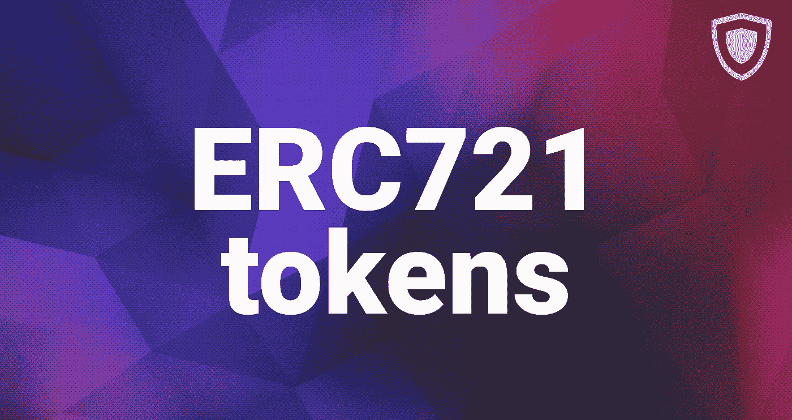

# 什么是 ERC721 标准令牌？

> 原文：<https://medium.com/hackernoon/what-are-erc721-standard-tokens-3624adcc3e54>

加密货币的世界又大又广。当我们试图理解周围的所有术语时，我们中的许多人会感到困惑。好吧，如果你在谈论代币时仍然有点迷失，Guarda 可以帮助你理解。我们的主要目标是让你们每一个人停止妖魔化区块链，并熟悉在它上面生活和繁荣的一切！让我们从方便的 ERC721 令牌指南开始。

加密货币代币有哪些？在开始讨论细节之前，让我们先弄清楚什么是代币。在以太坊区块链，代币是“契约”的一部分。基本上，这是上述合同的一个入口。在这种情况下，持有者被记录并正式参与区块链以太坊的合约。

好吧，但是还有什么奇怪的字母和数字——ERC 20，ERC721 等等？这些是标准——一组数字和字母表示您正在查看的令牌对特定命令做出响应。任何 ERC20 令牌的行为方式都与任何其他 ERC20 令牌相同，它们在结构上是相同的。如你所见，这些公式没什么特别的。

什么是 ERC721 令牌？

ERC721 型比 ERC20 型更先进一些。这种类型的每个令牌都是独一无二的，它们经常被用作收藏品。你小时候收集过口袋妖怪卡片的玩具车吗？如果有，那么就知道什么是 ERC721 令牌。

你们中的一些人可能对基于以太坊的游戏 CryptoKitties 有困难。基本上，玩家饲养、出售和管理数码猫。毫无疑问，数字动物是独一无二的，无过敏反应的，可爱的，非常有收藏价值的——这是成功的关键。人们喜欢收集不同种类的东西。还有，收集数码猫比活的容易多了，随便说说。

ERC721 令牌主要特征的独特性使其不可替代(即一个部分不能被另一个同等部分替代)。ERC721 是独一无二的，这意味着代币可以在任何交易所使用，但每个代币的价值取决于其稀有程度和特性。一些定义功能是名称、符号、总供应量、所有者等

创建 ERC721 令牌

当您需要创建一个 ERC20 令牌时，您只需要知道令牌供应(当然，除了名称之外)。说到 ERC721，情况就更复杂了——您实际上需要单独创建和设计每个令牌。增加供应的情况也是如此:新一批 ERC20 代币是通过增加总供应量而制成的，而新一批 ERC721 代币则需要您将每个单独的单位添加到包中(手动添加！).

ERC20 与 ERC721

让我们把这篇文章中一直在谈论的一切用简短的话来说。这两种加密货币令牌的主要区别在于可替代性。

ERC20 是货币型代币。所有的代币都是平等的，可以互换。想象一下现实世界的钱。1 英镑等于另一个 1 英镑，对吗？

ERC721 是资产类型。每个令牌都是独一无二的，具有不同的特征。有一只黑色的密码猫和一只白色的密码猫。他们是不同的。

ERC721 使用案例

代币的主要目的是成为某人收藏的一部分。然而，一些项目脱离了这种想法，开始使用 ERC721 作为表示现实世界资产的一种方式。例如，WePower(一个支持可再生能源生产的平台)使用代币来充当一定数量的电力。之前提到的 Crypto Kitties 成为第一个如此大规模的 ERC721 应用。后来，甚至还创造了隐密小狗和其他隐密宠物。如您所见，大多数用例仍然以某种方式与独特的可收藏项目及其应用相关联。

[Guarda](https://guarda.co/) 上的 ERC721

Guarda 是一家专注于轻量级加密货币钱包和其他区块链相关产品的公司，今年早些时候迎来了代币。首先，令牌生成器发布了。生成器是帮助用户轻松制作 ERC20 令牌的工具。

ERC20 对帮助您的业务和奖励客户肯定很有帮助，但所有的乐趣呢？毕竟现在是圣诞节！
现在，您可以制作自己的冬季系列——使用 Guarda 获得您独特的 ERC721 代币，并解锁新 Guarda 产品的一些特殊功能！

要参与空投，你需要做的就是从我们的 Twitter 页面转发一篇[帖子](https://twitter.com/GuardaWallet/status/1076607425283870720)，在 Google [表单](https://docs.google.com/forms/d/e/1FAIpQLSexwqydQ1yvb-oQtGrxr6tcg3lmtwYHHbNmfWB3W6HV4QV0bg/viewform)上回答一些简单的问题，并获得你的代币(确切地说，伙计们，这是免费的——这是给你们所有人的圣诞礼物)。