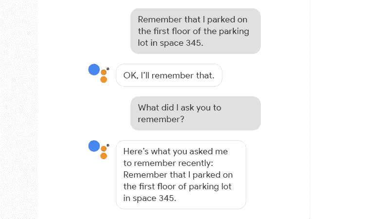
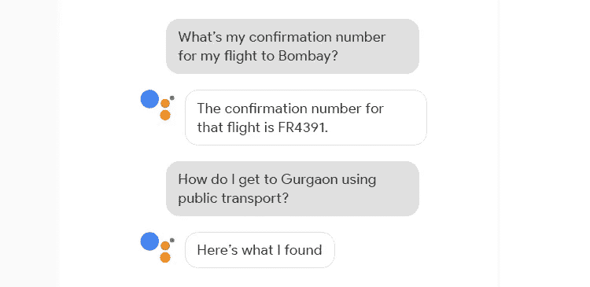

# 谷歌助手有哪些套路？这是你应该知道的一切

> 原文：<https://medium.com/hackernoon/what-are-google-assistant-routines-here-is-everything-you-should-know-523a3c077a55>

自从智能音箱发明以来，生活在智能家居中不再是梦想。他们使得通过简单地使用我们的声音来控制其他智能设备变得更加容易。此外，随着每一次新的更新，亚马逊 Alexa 扬声器和谷歌家庭扬声器都提供了更多的功能和集成。最近的这类更新向我们介绍了谷歌助手例程。

到目前为止，我们已经让我们的[谷歌助手执行各种任务](https://www.pricekart.com/blog/least-known-ways-google-assistant-used)，比如播放音乐、打电话、设置闹钟、支付账单等等。然而，你的谷歌助手能做的远不止这些。你只需要发出一个简单的命令，你的助手就会同时完成几项任务。很顺利，对吧？到目前为止，有六个标准的谷歌助手程序可以帮你度过一天。这些套路可以根据你的喜好定制。让我们来看看这些默认的谷歌助手例程是什么。

## 早上好例行公事

你可以这样开始你的一天。你醒来后做的第一件事是什么？关掉手机的静音模式？查看新闻更新？或者，看一下天气预报？嗯，当你有谷歌助手在你身边时，你就不必为这些平凡的任务而烦恼了。你只需要说“好的谷歌，早上好”或者“好的谷歌，我醒了”。您的助理可以执行以下列表中的各项任务

*   关闭静音模式
*   获取新闻更新
*   听听从家到单位的交通状况
*   收听即将到来的事件和时间表
*   启动智能家居设备
*   调整恒温器设置
*   播放音乐、广播、新闻或播客
*   调节手机的音量

## 离家惯例

在这个程序中，你只需要说“好的，谷歌，我要走了”，你的谷歌助手就会调整灯光，调整与之相连的智能设备的设置。这种惯例肯定会减少你在房间里跑来跑去的任务，确保在你离开之前所有的东西都被关掉。

## 通勤上班路线

在这个例程中，一旦你告诉谷歌你“去工作了”，它会自动给你外面的天气和路上你可以预期的交通的详细信息。此外，它还会提醒您当天安排的约会。除此之外，谷歌将自动调节灯光和其他智能设备。Google 可以在这个例程中执行的一些功能有:

*   听交通状况
*   听听天气情况
*   提醒您当天的日程安排和会议
*   调整智能家居设备
*   调节电话音量
*   播放音乐、广播、新闻或播客

## 通勤回家例行公事

一旦你说，“好的，谷歌，我要回家了”，这个程序就被激活了。谷歌将再次执行各种任务，让回家的旅程变得更容易。这个 Google Home 例程的一些功能包括:

*   听交通状况
*   听听天气情况
*   接收和发送文本
*   调整智能家居设备
*   调节电话音量
*   播放音乐、广播、新闻或播客

## 回家例行程序

类似于离家的例行程序，当你说“好的谷歌，我回来了”时，这个例行程序就会激活。然后谷歌会执行你回家后通常会做的各种任务。该例程的一些功能包括:

*   提醒你某些差事
*   调整智能家居设备
*   调节电话音量
*   播放音乐、广播、新闻或播客

## 就寝时间惯例

你可以通过激活就寝时间来平静地入睡。这个程序将确保你不会被任何短信或通知打扰。通过说“好的谷歌，睡觉时间”来激活这种模式。Google 将在这个例程中执行的一些功能是:

*   调整智能家居设备
*   调节恒温器
*   将手机切换到静音模式
*   设置闹钟
*   听音乐或轻柔的睡眠声
*   调节手机的音量

这是六个标准的谷歌助手程序，可以帮你度过一天。此外，如果需要，您还可以根据自己的喜好编辑和定制这些例程。除了谷歌家庭扬声器，谷歌助手也可以在印度所有最新的安卓手机上使用。