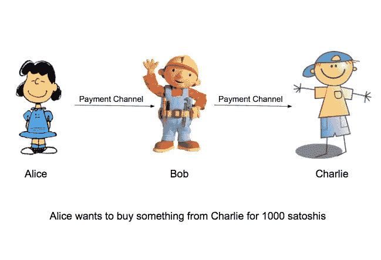
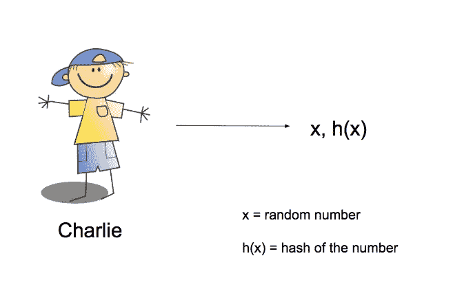
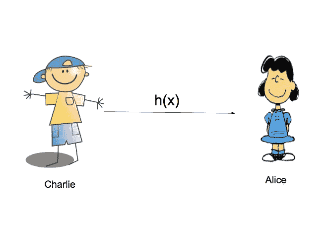
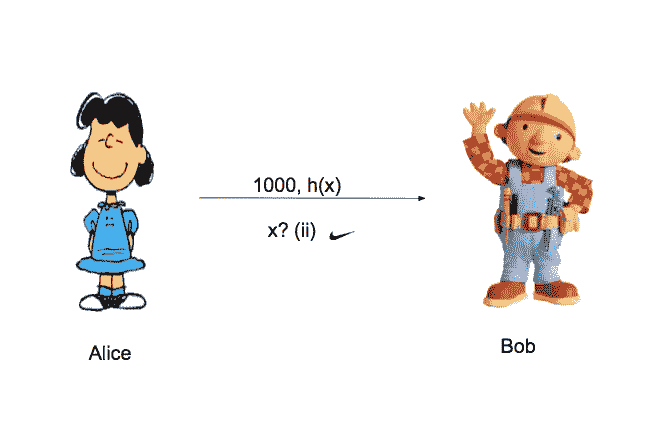
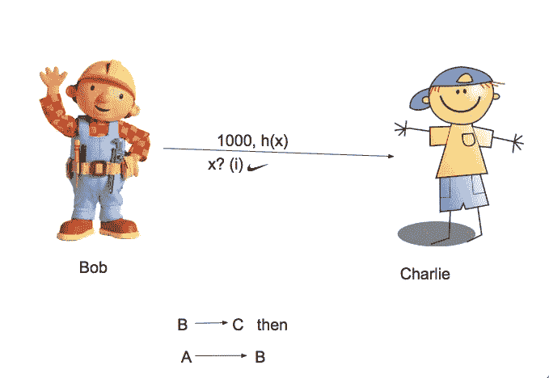

# 什么是散列时间锁契约(HTLCs)？在闪电网络和支付渠道中的应用

> 原文：<https://medium.com/hackernoon/what-are-hashed-timelock-contracts-htlcs-application-in-lightning-network-payment-channels-14437eeb9345>

[视频版本](https://www.youtube.com/watch?v=UUstHqIp2XA)

来自[比特币维基](https://en.bitcoin.it/wiki/Hashed_Timelock_Contracts)的定义:

> **散列时间锁合同**或 **HTLC** 是一类支付，它使用[散列锁](https://en.bitcoin.it/wiki/Hashlock)和[时间锁](https://en.bitcoin.it/wiki/Timelock)来要求收款人要么通过生成支付的加密证明来确认在截止日期之前收到支付，要么放弃要求支付的能力，将其返回给付款人。[【1】](https://en.bitcoin.it/wiki/Hashed_Timelock_Contracts#cite_note-russell_htlc-1)
> 
> 然后，接收者生成的加密支付证明可用于触发其他支付中的其他操作，使 HTLCs 成为以比特币进行有条件支付的强大技术。

# [**中的 HTLCs 支付渠道**](https://en.bitcoin.it/wiki/Payment_channels) :

HTLCs 允许支付在**多个**支付渠道之间安全地路由，这一点非常重要，因为对于一个人来说，与他/她正在交易的每个人打开一个支付渠道并不是最优的**。**

**HTLCs 是更高级支付渠道设计的组成部分，如 [**闪电网络**](https://en.bitcoin.it/wiki/Lightning_Network) 所使用的支付渠道。**

**例如:
**如果 Alice 有一个对 Bob 开放的通道，Bob 有一个对 Charlie 开放的通道，Alice 可以使用一个 HTLC 通过 Bob 向 Charlie 付款，而没有 Bob 在传输中窃取付款的任何风险**。**

**让我们一步一步地了解交易将如何展开(**注意，在本例中，我们不讨论 HTLCs 的时间锁方面**):**

## **第一步:**

**1.爱丽丝想用 1000 satoshis 从查理那里买东西。**

**2.爱丽丝为鲍勃打开一个支付通道，鲍勃为查理打开一个支付通道**

****

**STEP 1**

## **第二步:**

**Charlie 生成一个随机数(x)并生成它的 sha 256 hash-h(x)。**

****

**STEP 2**

## **第三步:**

**Charlie 将生成的哈希交给 Alice。**

****

**STEP 3**

## **第四步:**

**Alice 使用她的支付渠道向 Bob 支付 1，000 satoshis，但是她将 Charlie 给她的散列添加到付款中，并且附加了一个附加条件:为了让 Bob 要求付款，他必须提供用于产生该散列的数据。**

****

**STEP 4**

## **第五步:**

**Bob 使用他给 Charlie 的支付渠道向 Charlie 支付 1，000 satoshis，Bob 添加了一份与 Alice 给 Bob 的付款相同的条件。**

****

**STEP 5**

****最后:****

## **第六步:**

**B →C(步骤 5 中的交易通过)**

**Charlie 拥有用于生成哈希的原始数据(称为前映像)，因此 Charlie 可以使用它来完成付款，并从 Bob 处完全收到付款。通过这样做，Charlie 必然使 Bob 可以获得前映像。**

## **第七步:**

**A→B(步骤 4 中的交易通过)**

**Bob 使用该预映像来完成 Alice 给他的付款**

**在上面的例子中，我们讨论了一个特殊的例子，在这个例子中，我们有一个中间人(Bob ),让我们的付款到达目的地。
这种方法可以扩展，这样我们就可以跳过一个以上的媒介，这对公共/大众使用是必不可少的。**

## **旁注:**

**理想的加密哈希函数有五个主要属性:**

*   **它是[确定性的](https://en.wikipedia.org/wiki/Deterministic_algorithm)，所以相同的消息总是产生相同的散列**
*   **计算任何给定消息的哈希值都很快**
*   **除非尝试所有可能的消息，否则从消息的哈希值生成消息是不可行的**
*   **对消息的一个小的改变会导致哈希值的大范围改变，以至于新的哈希值看起来与旧的哈希值不相关**
*   **找到两个具有相同散列值的不同消息是不可行的**