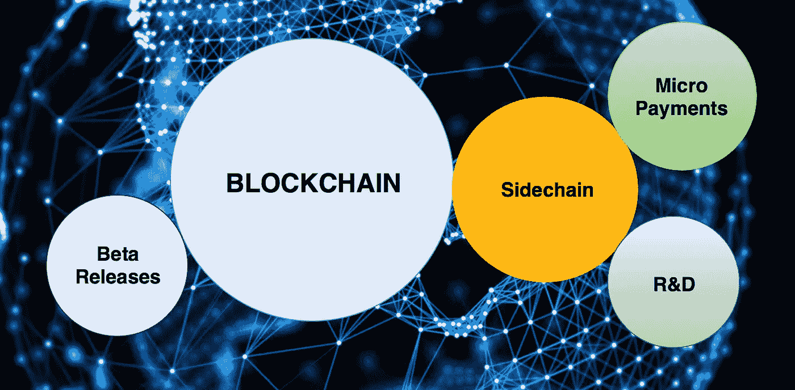

# 什么是侧链？

> 原文：<https://medium.com/hackernoon/what-are-sidechains-1c45ea2daf3>

侧链是一种新兴机制，允许一个区块链中的令牌和其他数字资产在另一个区块链中安全使用，然后在需要时移回原始区块链。侧链功能具有极大的潜力，可以增强现有自动区块链的功能。

## 侧链是如何工作的？

侧链是一个独立的[区块链](https://hackernoon.com/blockchains-versus-traditional-databases-c1a728159f79)，它使用双向挂钩连接到其母区块链。双向挂钩使得母区块链和侧链之间的资产可以按预定比率互换。最初的区块链通常被称为“主链”，所有附加的区块链被称为“侧链”。区块链平台 Ardor 将其侧链称为“儿童链”。

母链上的用户首先必须将他们的硬币发送到输出地址，在那里硬币被锁定，因此用户不能在其他地方花费它们。交易完成后，会在整个交易链中进行确认，然后等待一段时间以获得额外的安全性。等待期过后，同等数量的硬币被释放到侧链上，允许用户在那里取用它们。当从侧链移回主链时，情况正好相反。

## **残联**

联合是充当主链和它的一个侧链之间的中间点的组。这个组决定用户使用的硬币何时被锁定和释放。侧链的创建者可以选择联盟的成员。联合结构的一个问题是它在主链和侧链之间增加了另一层。

## **安全**

侧链负责自己的安全。如果没有足够的采矿力量来保护侧链，它可能会被黑客攻击。由于每个侧链都是独立的，如果它被黑客攻击或破坏，损害将包含在该链内，不会影响主链。相反，如果主链受损，侧链仍可运行，但 peg 将失去大部分价值。

侧链需要自己的矿工。这些矿工可以通过“合并开采”来激励，即同时开采两种基于相同算法的独立加密货币。

## **当前的侧链平台**

1. **RSK** (根茎的简称)为其侧链创建了一个名为 Ginger 的开源测试网。它与比特币区块链双向挂钩，并通过合并采矿奖励比特币矿工。RSK 的目标是让比特币区块链具备智能合约功能，并加快支付速度。

2. **Ardor 的区块链**作为业务的服务平台:Ardor 使用[利益证明](https://hackernoon.com/what-is-proof-of-stake-8e0433018256)共识机制。Ardor 将其侧链称为“childchains”，它们紧密集成到主链中。安全性得到了增强，因为所有交易都由母链伪造者处理和保护。大多数事务被下推到子链级别，因为父主链保留了最少的功能。可以通过子链访问跨链的全局实体，如资产和货币。

## **侧链的承诺**

侧链允许加密货币彼此互动。它们增加了灵活性，并允许开发者在将它们推向主链之前，尝试测试版的替代硬币或软件更新。传统的银行功能，如发行和跟踪股票所有权，可以在转移到主链之前在侧链上测试。如果侧链的安全机制能够得到支持，侧链技术就有望实现巨大的区块链可伸缩性。

[陕雷](http://www.shaanray.com/)

关注 [Lansaar Research](https://medium.com/lansaar) 关于媒体的最新新兴技术和新商业模式。