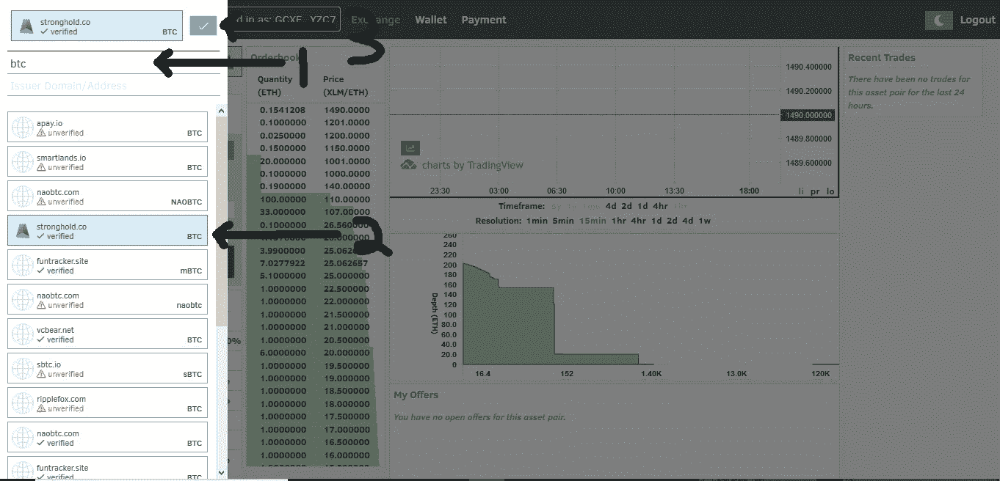

# 什么是明星资产，我如何在 StellarPort 上购买它们。木卫一？

> 原文：<https://medium.com/hackernoon/what-are-stellar-assets-79b3145b5c7f>

你可能想知道什么是恒星资产。答案是，任何事情！

简单地说，一项重要的资产就是电子借据。借据可以是任何代表商品、价值或服务的东西。

这种发送和接收多种不同类型资产的能力使 Stellar 网络变得非常强大和灵活，并向许多用例开放。

**资产可以用来做什么？**

被称为代币的资产并非生而平等。每个资产或代币可以代表特定的商品、服务或其他价值。记住，重要资产是一张代表其他东西的借据。恒星资产可以代表几乎无限的类别和特定的价值。

一个很好的恒星资产的例子是你的贝宝余额。当你从银行账户向 PayPal 汇款时，你实际上是在用你的美元(法定货币)换取 PayPal 的代币(这是一种未命名的代币，因为你和 PayPal 都假装 PayPal 代币实际上是美元)。PayPal 承诺兑现您的代币，并向您选择的收款人支付美元现金。考虑到这一点，我们可以看到恒星资产和现代网上银行的相似之处，只不过你的恒星资产除了你自己之外，不受任何机构的监管或控制，例如 PayPal。

明星资产的一个很好的例子是购买代币在击球场使用。有了这些代币，我们可以接受某种服务，在这种情况下，我们将获得 10 个击球笼代币。

实用程序令牌的另一个潜在用例可能是 API 访问。例如，公司可以在 Stellar 网络上发行他们的公用事业资产，这将授予购买公司以该资产的每 0.0001/th 进行 API 调用的能力。这将增加 API 的安全性，并允许 API 发布者进行更灵活的监督。

街机公司可能会根据你在游戏中的表现奖励你他们的明星资产，让你在世界上任何地方的任何视频游戏系统中跟踪你的积分和奖励。在比赛中获得第一名？赚取代币。100 代币？升级你汽车的引擎。在不同城市的街机上玩同样的赛车游戏？使用您的 Stellar 帐户登录，然后离开您离开的地方。

另一个例子是，一家公司发行了代表其公司股份的重要资产。持有这种形式的代币类似于在传统证券交易所购买该公司的股票。

从上面的例子中，我们可以看到，恒星资产的借据性质可以让它们被用来代表几乎任何东西的价值。我们可以简单地看到一个人如何创造代表黄金、公共汽车票、电影票、游戏代币、杂货店奖励计划积分、碳排放信用、应用商店信用和现金(美元、欧洲欧元、英镑和任何其他货币)的恒星资产。

重申一下，恒星资产是可以代表任何东西的借据。

**信用额度**

我们知道恒星资产是欠条。你应该知道，就像一个真正的欠条，你需要信任给你欠条的人，你需要在交易之前信任重要资产的发行人。

假设你的朋友在你下次出去喝酒时给了你一张免费啤酒的欠条，但是谁*不值得信任*(一个未验证的发行账户)。当你去酒吧请他为你的啤酒买单时，他可能会拒绝！那张欠条毫无价值*，因为签发它的人*。然而，如果你的另一个朋友，众所周知是一个诚实的人，他总是信守诺言，给你同样的借条，它现在就有价值了。

另一个例子是在棒球场购买一把代币，每把代币广告上会给你 10 次投球机会。如果你购买 10 个代币，那么你将会得到 100 个音高。然而，在你购买代币之前，你必须相信击球场经营者会为你提供广告娱乐(100 个球)来换取你的美元。如果那个击球笼经营者是坏人，他可能会拿走你的钱，发给你代币，并拒绝向你提供你的投球(当然，这是一次可怕的经历)。从理论上讲，他发行的代币几乎一文不值(互联网代币甚至没有印在廉价金属上)，你能得到的唯一真正的价值是他是否像宣传的那样兑现了这些代币。在这个例子中，击球笼令牌是恒星资产。

这就是为什么在 Stellar Network 上，你必须首先“信任”(也称为建立“信任线”)你希望购买的每项资产的发行人。

仅信任其名称下具有已验证状态的发行帐户。

信用额度有限制和平衡。最初，当您设置信用额度时，它的余额为零。限额代表你对资产发行者的信任程度。余额代表你实际拥有多少资产。余额永远不能超过限额。

流明(XLM)是唯一自动信任的重要资产，不需要信用额度，也没有信任限制。

**如何在 StellarPort.io 上购买资产？**

StellarPort.io 可让您在使用 Stellar 网络的同时，轻松快速地购买各种不同的资产。这是你怎么做的。

**步骤 1** :使用您的密钥库文件、密钥或分类帐 Nano 登录到您的 StellarPort 帐户，并导航到*交换*页面。

**步骤 2:** 选择您是否要更改您正在交易或接收的资产。(在交易之前，一定要检查你的钱包，确保你有足够的资产。)

Select the “Change” button to change which asset you will receive.

**第三步:**输入您想要交易的资产的缩写。在这种情况下，我们将交易比特币(BTC)。

如上所述，在这个步骤中，当你在侧边栏菜单中选择交易账户时，重要的是你只选择一个验证过的账户。经验证的符号确保主域(资产卡顶部说明的网站和机构)实际上已经从该特定账户发行了该特定资产。这是发行帐户和 Stellar 网络上的域名之间的双向验证。此验证过程是“已验证”符号出现所必需的，有助于防止不真实、未经授权或恶意的实体发行资产。不建议使用未经验证的帐户进行交易，因为您可能会收到一个未知的潜在非法实体的令牌，该实体可能会也可能不会兑现该令牌。

应该说，加密资产交易通常包含一定程度的风险，即使帐户被验证，您也必须确保信任该帐户，这是我们在本文的“信任线”一节中讨论的概念。

Step 1: Type in the abbreviation on the asset (BTC). Step 2: Select the network you want the transaction to go through. Only choose a network that you trust. Step 3: Confirm the asset type.

**第四步:**确定你的卖出(或买入)类型。市场销售和市场购买一样，将以目前最好的价格出售。限价买卖允许你决定你资产的价格。接下来，确定你想出售或购买多少资产。最后，提交您的订单！

Step 1: Buy or Sell? Step 2: Market or Limit Order? Step 3: How much are you selling/buying? Step 4 :Place order!

**第五步:**恭喜你！您已成功提交订单！您应该会在网页的右下角收到提示，让您知道您已经成功了。您的订单可以在屏幕“订单簿”的相应部分(购买或销售)看到。如果你的交易已经完成，你可以在右边的“最近交易”栏找到它的历史。

**发行人和锚**

恒星网络上的所有账户都可以发行资产。

发行资产的账户称为“锚”。

私人、组织和企业都可以发行资产并充当锚。

如需了解更多关于成为发行人和运行锚的信息，请查看这里的官方文档[锚:发行资产](https://www.stellar.org/developers/guides/concepts/assets.html#anchors-issuing-assets)和这里的[定制资产。](https://www.stellar.org/developers/guides/walkthroughs/custom-assets.html)

*免责声明:*

*StellarPort.io 不是 Stellar 基金会的成员。*

*此外，我目前在 StellarPort 担任开发人员和营销人员。*