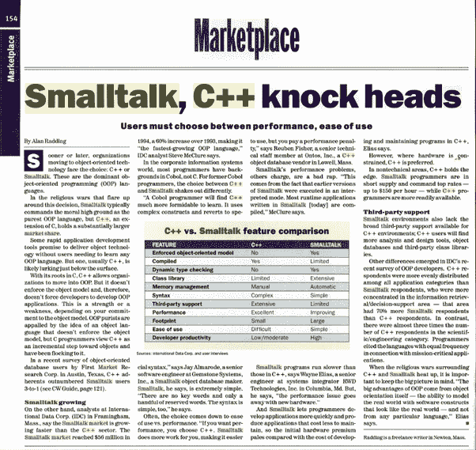
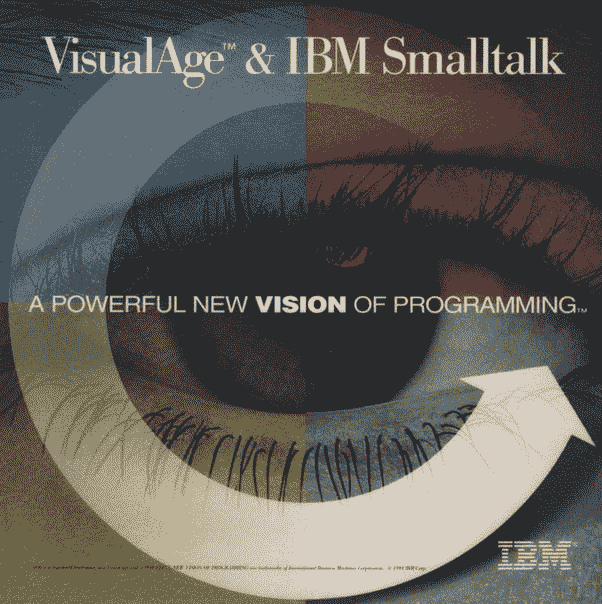

# Smalltalk 最大的误区是什么？

> 原文：<https://medium.com/hackernoon/what-are-the-biggest-myths-about-smalltalk-832a1c29f1ad>


最大的神话是 Smalltalk 是一种死亡或即将死亡的语言。没有什么比这更偏离事实了。

Smalltalk 在 [ESUG](http://esug.org/wiki/) 有一个活跃的全球社区。 [FAST](https://www.fast.org.ar) 是阿根廷著名的 Smalltalk 用户组织。 [Cincom](http://www.cincomsmalltalk.com/main/) 、 [Instantiations](http://www.instantiations.com/index.html) 和 [GemTalk Systems](https://gemtalksystems.com) 是拥有大量全球企业客户的三大 Smalltalk 供应商。我有几个朋友在加拿大渥太华一家名为 [Simberon](http://www.simberon.com) 的大型小型聊天室工作。

Smalltalk 的开源方言不下六种: [Pharo](http://pharo.org/) ， [Squeak](https://squeak.org/) ， [GNU Smalltalk](http://smalltalk.gnu.org/) ，[海豚 Smalltalk](http://www.object-arts.com/dolphin7.html) ，[琥珀 Smalltalk](https://amber-lang.net/) ， [Cuis Smalltalk](http://www.jvuletich.org/Cuis/Index.html) 。

一个相关的神话是 Smalltalk 从来都不受欢迎。事实上，在 20 世纪 90 年代，Smalltalk 成为继 C++之后最流行的 OOP 语言。根据 1995 年的 IDC 报告，OOP 语言的市场份额是:

1.  C++ — 71.3%
2.  **small talk——15.1%**
3.  目标-C — 5.7%
4.  帕斯卡对象— 4.2%
5.  接近 2.5%
6.  埃菲尔铁塔——1.1%
7.  所有其他— 0.2%

这是《计算机世界》1995 年 11 月 6 日的一页，展示了 Smalltalk 和 C++之间的争斗:



Smalltalk 非常适合商业应用，以至于 IBM 选择它作为其 VisualAge enterprise 计划的核心，以取代 COBOL:



在 21 世纪初，美国联合军方使用 Smalltalk 编写了一个名为 JWARS 的*百万行*战斗模拟程序。它实际上胜过了美国空军用 C++编写的类似模拟程序 STORM。这本身就是语言能力的惊人证明。

JP 摩根用 Smalltalk 编写了他们的大型金融风险管理系统，名为 Kapital。其实 Smalltalk 在金融行业还是挺受欢迎的；其他用户包括 Desjardins 和 UBS。

[Orient Overseas Container Lines 使用 Smalltalk 开发其 IRIS-2 航运管理系统。](http://www.cincomsmalltalk.com/main/successes/shipping/orient-overseas-container-lines-ltd/)

其他主要用户包括佛罗里达电力和照明、德州仪器、阿根廷电信、宝马和西门子公司。

在我的祖国，Smalltalk 被加拿大国家密码机构通信安全机构(CSE)所使用。

T 第二个最大的误解是 Smalltalk 的系统映像怪异或不寻常，并且与文本编辑器和版本控制系统等传统工具链不兼容。

然而，Smalltalk 的映像与 VMware 和 VirtualBox 等虚拟化软件中的系统映像并无不同。假设您在 VirtualBox 映像中运行 Linux。假设您正在使用 Eclipse 开发 Java 软件。假设您在映像中运行 Java 软件。这与 Smalltalk 有何不同？

在 Smalltalk 中，您使用的是一个叫做系统浏览器的 IDE。您在映像中运行 Smalltalk 应用程序。这完全是一回事。

在我们假设的 Linux 映像中，您可以使用 Git、CVS 和 Subversion 等版本控制系统。在 Smalltalk 中，你使用像 Monticello (Pharo)、ENVY (VA Smalltalk)和 Store (VisualWorks)这样的版本控制系统。也可以使用 Git。

在 Smalltalk 中，您可以将源代码“归档”到传统的文本文件中。这允许你使用 Git，Vim，Emacs，Visual Studio 代码，任何你喜欢的东西。

一些 Smalltalk 方言甚至让您完全从命令行工作。GNU Smalltalk 是最初的版本，但是 Pharo 最近也提供了这个功能。

第三个最大的误解是 Smalltalk 的语法很奇怪，很难学。这种抱怨通常来自使用 C、C++、Java 或任何其他源自 C 的语法语言的程序员。

与 Python ( [场外规则语法](https://en.wikipedia.org/wiki/Off-side_rule))、Ruby、Clojure、Haskell、Erlang、J、Forth、Rebol 相比，Smalltalk 的语法并不奇怪。有一整个宇宙的编程语言看起来与 C 不同。我们应该只学习类似 C 的语言直到时间结束吗？

```
/* In C and C++, the brace brackets style of syntax has spread to
many other languages like Java, JavaScript, PHP, Perl, etc. */
if (x < y) {
    x++;
    printf("x is %i\n", x);
}
else
    printf("*** warning\n");""" In Python, whitespace indentation is part of the syntax used to delineate blocks of code. Now, that is strange! """
if x < y:
    x += 1
    print 'x is', x
else:
    print '*** warning'=begin
In Ruby, there are no brackets for delineating blocks of code!
=end
if x < y then
    x += 1
    puts "x is #{x}"
else
    puts "*** warning"
end"In Smalltalk, nearly all syntax is based on message passing.
The message **ifTrue:ifFalse:** is sent to Boolean objects."
x < y ifTrue: [ x := x + 1.
                Transcript show: 'x is ',x printString; cr ]
    ifFalse: [ Transcript show: '*** warning' ].
```

适应 Smalltalk 语法是非常容易的。我做了 15 年多的 C 开发人员。我用了不到一周的时间就熟悉了消息传递。Smalltalk、Python、Ruby 和 C 之间的相似之处很容易识别。

第四大误区是 Smalltalk 程序太慢。什么太慢了？Smalltalk 怎么比 Python、Ruby、Perl、PHP、Erlang、Racket 等其他动态类型语言慢？Python 和 Ruby 还是挺受欢迎的；Perl 和 PHP 曾经相当流行。在大多数情况下，这些语言的性能不是问题。

值得指出的是，有些 Smalltalk 方言语速非常快。Pharo 的 Cog VM 令人印象深刻。Smalltalk MT 针对最大性能进行了优化。

Smalltalk 比 C++和 Java 慢吗？毫无疑问。如果对于某些应用程序，Smalltalk 不够快，那么就不要使用它。总是为工作选择正确的工具。

T 第五个最大的误解是 Smalltalk 程序无法扩展。事实是，Smalltalk 很可能是唯一值得注意的可轻松扩展的面向对象语言。这是因为 Alan Kay 对 OOP 的杰出构想。让他解释一下(从 2:18 开始):

艾伦·凯的《[small talk](http://worrydream.com/EarlyHistoryOfSmalltalk/)的早期历史》(1993 ACM)提供了更多的见解:

> Smalltalk 是对计算机本身概念的递归。每个 Smalltalk 对象都是对计算机的全部可能性的递归，而不是将“计算机的东西”分成比整体更弱的东西，如数据结构、过程和函数，这些都是编程语言的常用工具。因此，它的语义有点像成千上万的计算机通过一个非常快速的网络连接在一起。

和

> *Smalltalk 的贡献是一种新的设计范式——我称之为*面向对象*——用于解决专业程序员的大问题，并使新手用户的小问题成为可能。面向对象的设计是一次成功的尝试，它从质的方面提高了硅爆炸所带来的越来越复杂的动态系统和用户关系的建模效率。*

像 C++和 Java 这样的语言将面向对象编程视为抽象数据类型的应用，而 Smalltalk 和 Ruby 这样的语言将面向对象编程视为开发一个协作虚拟计算机(对象)网络。

你听到的所有关于面向对象编程、继承和可伸缩性问题的抱怨都来自于使用 C++、Java、C#等。抽象数据类型哲学不利于*大型软件开发*。

艾伦·凯有句名言:

实际上，我创造了“面向对象”这个术语，我可以告诉你我脑子里没有 C++。

(Jump to 10:00.)

艾伦·凯(Alan Kay)说:“互联网做得太好了，以至于大多数人认为它是像太平洋一样的自然资源，而不是人造的东西。上一次如此大规模的技术如此准确无误是什么时候？”

艾伦·凯将他的面向对象哲学比作互联网是如何建立的，或者由数十亿个细胞组成的生物有机体是如何建立的。Smalltalk 非常适合真正可扩展的解决方案。