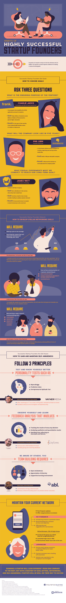

# 非常成功的创业公司创始人有哪些习惯？

> 原文：<https://medium.com/hackernoon/what-are-the-habits-of-highly-successful-startup-founders-fc26e6acdb0f>

所以你认为你想建立自己的创业公司？有些事情你需要先做。从了解你的性格类型和你的局限性开始——知道什么时候你可以自己做什么事情，什么时候你需要外界的帮助，这很重要。了解自己的优势和劣势并能够相应地适应是至关重要的。

你还需要人际网络。尽可能多的认识一些人，在商界保持活跃。你永远不知道你的关系网什么时候会派上用场。

你也需要问自己一些问题，批判性地思考你的业务。企业的持久目的是什么？你需要知道你的初创公司在 5 年、10 年甚至 20 年后会是什么样子，以及你如何适应市场变化。你能做些什么来小规模地测试你的概念，这样你就能在潜在的失败点造成严重问题之前发现它们？

从头开始建立一个成功的创业公司需要很多认真的自省和积极的习惯。你认为你有这个能力吗？从这张信息图中了解更多关于成功创业创始人的习惯。

