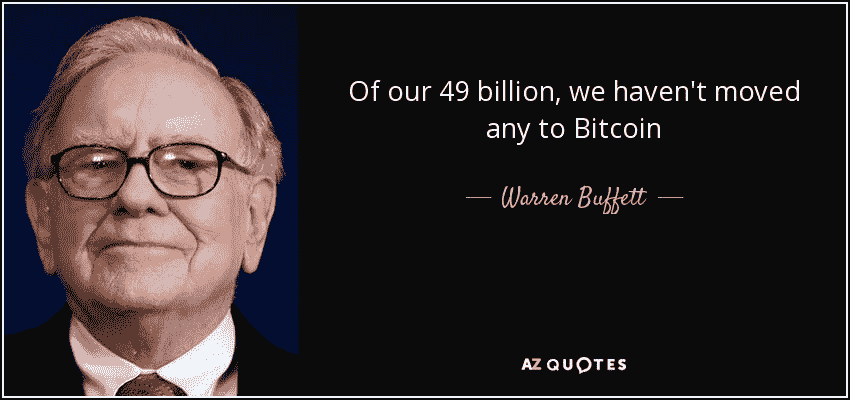
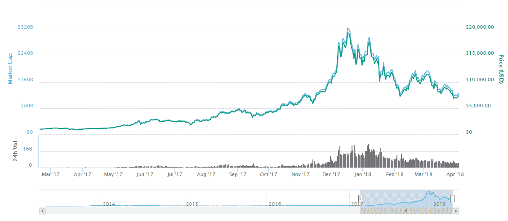

# 密码市场大幅下滑背后的主要原因是什么？”—每周#10KQA 问题。

> 原文：<https://medium.com/hackernoon/what-are-the-main-reasons-behind-the-huge-drop-in-the-crypto-market-weekly-10kqa-questions-bc869c86c2c7>

source: [institut-mittelstand.com](http://institut-mittelstand.com)

不久前我们开始了 [10KQA 挑战](https://howtotoken.com/all-questions/)(详情[这里](https://hackernoon.com/the-10-000-question-challenge-your-blockchain-journey-starts-here-98829f6b3cbc))。核心思想很简单:为任何想了解区块链和加密货币的人建立一个包含 1 万个问题的适度列表。这个挑战已经是我们的第二周了(第一周的报告可以在[这里](https://hackernoon.com/weekly-top-5-questions-about-making-a-profit-with-crypto-10kqa-challenge-602cce953a7e)找到)

source: coinmarketcap.com

在过去几个月里，人们提出的主要问题是加密市场发生了什么——这是市场的终结，还是仅仅是普通的冬季/春季调整？这是本周被问得最多的问题之一。

## 2018 年初密码市场巨幅下跌的主要原因是什么？(完整回答[此处](https://howtotoken.com/question/main-reasons-huge-drop-crypto-market-beggining-2018/))

[要加入我们的挑战并获取新的更新，请关注我们:](https://medium.com/u/82a6fd020122#10KQA </strong>提问，我们将收集这些问题用于未来的报告。如果你是一个专家，想帮忙，请不要犹豫与我们联系，我们会让你知道你如何能帮助加密社区。

提问，我们将收集这些问题用于未来的报告。如果你是一个专家，想帮忙，请不要犹豫与我们联系，我们会让你知道你如何能帮助加密社区。
<p id=) [10KQA](http://t.me/TENKQA)

**推特** : [@howtotoken](http://twitter.com/howtotoken)

我将感谢所有的参与者、想法和讨论。我希望我们都能从这个过程中得到一些积极的东西，以及那种难忘的心流感觉。

我们还在寻找版主加入我们的挑战，他们将与我们一起学习，并在这些类别中搜索关于区块链和加密的新问题和答案:

*   **核心区块链开发**
*   **利润(交易、ICO、采矿)**
*   **真正的颠覆性车型**
*   **法律法规**

***我们需要你的掌声*** 👏 ***因为这是一本新的出版物，所以能接触到更多的人。请通过推文、脸书分享等方式传播这个故事。***