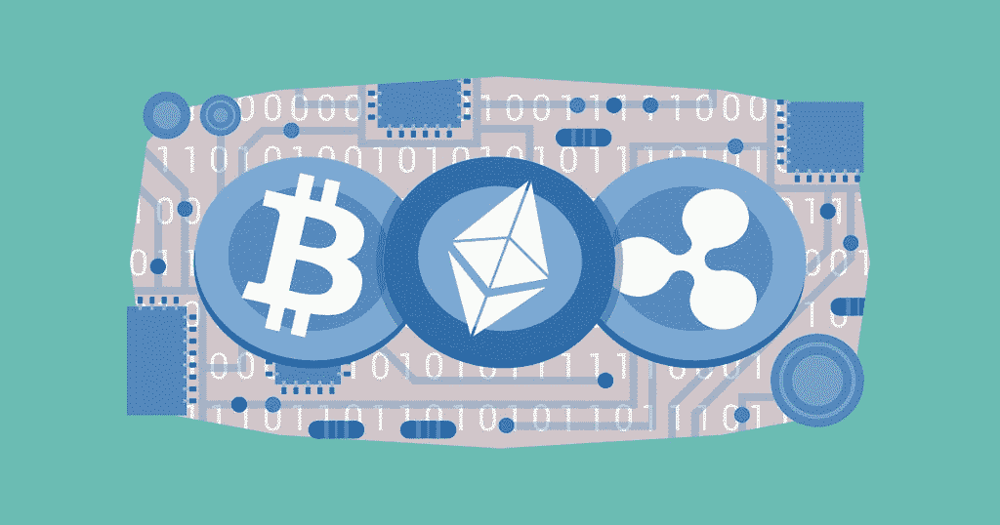

# 2018 年末最有前景的币有哪些？

> 原文：<https://medium.com/hackernoon/what-are-the-most-promising-coins-in-late-2018-85bb2b0b028e>

## 根据 NYU 大学教授大卫·耶马克对加密货币的评估标准

*Image credit:* [*Descryptive.com*](https://www.flickr.com/photos/159526894@N02/39682510910/in/photolist-23sBeYA-o1BdhG-nJfEPT-i7CP74-i7C9cU-i7CpuM-i7Cerm-i7CmMb-i7BXan-i7CA1p-i7C1RF-i7CdRn-27F8z5u-27GwMg3-26BZLj7-24ZWRff-J4KxX4-26hEnht-25qEcV7-J1nhjc-27RFmSZ-24UBQRC-Z8qPE4-KyzJwQ-27BYe1C-27VnWPH-GhvL22-J5QsFg-24ZWRc9-J6AXLT-wnSkeL-J6AXv2-256SU6Y-KzYYjN-J5Qtmp-24t9JeY-26D2FuN-21bT2Rk-KyzJR7-2193qjN-J5QsVK-28cYVfd-26xytKL-27VnWDc-28cYV7h-28cYV91-27VnWWr-27VnWwt-27VnWQe-ZG5YfL) *|* [*CC BY 2.0*](https://creativecommons.org/licenses/by/2.0/)

九年前，数字革命从一个新奇事物开始，现已成为全球金融科技环境中讨论最多的话题。自那以后，比特币的发展速度和增长速度加快，已经到了主导全球商业环境的地步。今天，有许多硬币可以在几个全球交易所交易。实际上，每天都有更多的硬币被发行和开发。这并不奇怪，许多加密交易者想知道哪些加密硬币值得投资。今天我们将谈论其中的一些。

# **研究方法**

2013 年初，纽约大学金融学教授大卫·耶马克(David Yermack)发表了一篇关于对加密爱好者来说最有前途的硬币的[论文](http://www.nber.org/papers/w19747.pdf)。这本书详细介绍了定义有前途硬币的三个最重要的标准。硬币必须:

作为记账单位，

成为价值储存手段，

并起到交换媒介的作用。

尽管混乱，由中本聪创造的比特币仍然是所有加密货币中最占主导地位的。比特币鼓励加密货币的新浪潮，并充当潮流引领者。比特币背后创造的货币统称为替代币，是原始加密货币的改进和修改版本。

这些替代硬币根据特定和独特的使用情况调整了它们的可用性和潜力。这些新兴的硬币侧重于分散和公用事业的应用。尽管如此，其他有前途的货币特别关注可伸缩性、安全性和隐私。这些受欢迎的硬币只能在小规模的特定生态系统中用作交换媒介，因为它们难以充当记账单位或价值储存手段。

加密货币的波动性是造成这种情况的主要原因。价格在任何一天都可能波动，这使得硬币不适合满足两个标准。为了应对这些挑战，加密货币的特定子集浮出水面，正是这些才是最值得投资的硬币。与第一种加密货币比特币不同，比特币的典型特征是高波动性，这些有前途的硬币为加密爱好者提供了一种替代选择，并具有更一致的定价水平，因为它们适用于现实世界。

在本文中，我们将讨论 2018 年末最有前景的一些硬币。我们认为，这些硬币不仅符合有前途硬币的三个共同标准，而且也符合大多数密码交易者的要求。首先，硬币希望模拟法定货币的相对不稳定性，但之后仍保持加密货币的主要特征，如安全性和分散性。虽然这个列表是我们的研究结果和一些密码传播者的投入，但它绝不是权威的，因为它回顾了大多数当前有影响力的期刊、论文和文章，这些期刊、论文和文章已经在密码社区内得到认可。

我们研究的基础包括:

汇率的稳定

每种货币的增长及其前景

高流动性

开发商的声誉

因此，哪些加密货币最有前途？

# **1)莱特币**

[莱特币](https://litecoin.com)俗称“银币”，基于“黄金”比特币(2011 年推出时的名称)的类比，是遵循比特币协议的早期加密货币浪潮的一部分。它是由前谷歌工程师、麻省理工学院毕业生查理·李开发的。这种硬币建立在一个全球性的开源支付网络上，采用脚本作为工作证明，不受任何中央机构的控制。它只能使用消费级 CPU 进行解码，其特点是块生成速度更快。

虽然在许多方面它的操作类似于比特币，但许多人仍然认为莱特币比比特币提供了更快的交易确认。凭借一套独特的挖掘算法和大量代币，莱特币已经证明了它的长寿和价值。人们普遍认为它是市场上价格最稳定的加密货币之一，大多数加密爱好者认为它有一天会取代比特币成为加密之王。除了众多的开发者，还有一批接受莱特币作为交易媒介的商人。截至 2018 年 9 月，该硬币的市值约为 32 亿美元，收于 55.9 美元。

# **2)以太坊**

[以太坊](https://www.ethereum.org)于 2015 年推出，是一个去中心化的安全软件平台，允许分布式应用(DApps)和智能合约在没有任何第三方欺诈、干扰、控制或停机的情况下运行和构建。以太坊在 2014 年推出了以太的预售，后来获得了压倒性的反响和采用率。以太允许应用程序在以太坊平台的特定加密令牌上运行。本质上，以太类似于在以太坊平台上导航的总线，是许多寻求在该平台上运行和开发应用程序的开发人员的首选。根据以太坊，这可以用来分散、交易和编纂任何东西。

在对道的攻击持续两年后，出现了分裂为以太坊经典(ETC)和以太坊(ETH)两大组成部分。继比特币之后的第二个加密市场，以太坊拥有超过 224 亿美元的巨大市值。收于 219.8 美元(失踪？每股？)截至 2018 年 9 月。与任何其他加密货币相比，更多的企业巨头和公司积极参与以太坊。它们包括 JP 摩根、Consensys、丰田、丰业银行、BP、万事达、微软和加拿大国家银行。

# **3) Zcash (ZEC)**

一种非常有前景的加密货币 [Zcash](https://z.cash) 于 2016 年推出。它是一种开源和分散的硬币，通常被认为是“如果比特币就像钱的 http，Zcash 就是 https”。硬币为持有者提供了选择性的交易透明度和隐私。因此，类似于 https 的 web，它声称为所有可能的在线位置提供隐私和安全，在这些位置，交易被记录、存储并在区块链上发布。然而，它确实对交易金额、收件人和发件人等敏感信息保密。Zcash 上还有一种屏蔽交易的选择，它允许使用零知识构造证明(zK-SNARK)或由其团队创建的高级加密技术对所有内容进行加密。在撰写本文时，据报道市值约为 5.627 亿美元，收于 116.83 美元。

# **4)破折号(DASH)**

DASH[DASH](https://www.dash.org)最初被称为 Darkcoin，是比特币的一个更加隐秘和分散的版本。它提供了更多的匿名性和隐私性，因为它在主节点的分散网络上运行，这使得交易的可追溯性变得困难。DASH 于 2014 年 1 月推出，其粉丝群在短时间内迅速增长。它是由 Evan Duffield 有目的地开发和创建的，可以使用 GPU 或 CPU 成功挖掘。

Darkcoin 于 2015 年 3 月更名为 DASH，并采用 DASH 作为代表数字现金的股票代号。2015 年的更名并没有改变硬币的任何独特功能，如 InstantX 和 Darksend。这枚硬币于 2018 年 7 月 31 日收于 196.81 美元，截至 2018 年 9 月，市值为 16 亿美元。

# **5)涟漪(XRP)**

[Ripple](https://ripple.com) 于 2012 年推出，是一个实时全球结算网络，提供低成本、确定、即时的国际支付。该网络允许银行和其他金融机构以较低的风险实时结算所有跨境支付，并具有端到端的透明度。Ripple 的确认方法——其共识分类账——不需要挖掘；这是一个与 altcoins 和比特币相背离的独特特征。这意味着它最大限度地减少了计算能力的使用，因为它不需要任何挖掘，这减少了网络延迟。

硬币是建立在分配的价值是激励特定行为的重要渠道的基础上的。它计划通过各种业务发展交易来分销 XRP，将 XRP 出售给对硬币感兴趣的机构买家，并激励为其支付提供利差的流动性提供商。Ripple 截至 2018 年 9 月的市值为 111.94 亿美元，收于 0.28 美元。

# **6)莫内罗(XMR)**

Monero 是一种不可追踪的、私有的、安全的加密货币。作为一种开源、去中心化的硬币，它于 2014 年推出，引起了加密社区和加密爱好者的巨大兴趣。Monero 的创立是由社区推动的，是基于捐赠的。它的创建是出于对可伸缩性和分散化的浓厚兴趣。它通过使用一种称为“环签名”的独特技术来实现完全的隐私保护。通过这种特殊的技术，有一组涉及最少真实参与者的加密签名，但是真实的签名不能被隔离，因为它们看起来都是有效的。截至 2018 年 7 月，Monero 收于 128.12 美元，市值约为 2.084 美元

# **7) CIX100**

[CIX100](https://cryptoindex.io/) 是一种市场币，代表表现最好的 100 种加密货币的指数，简称 Cryptoindex 100。它是前 100 个硬币的数字表达，随着加密货币市场的起伏，它会根据自己的人工智能算法 Zorax 不断重新平衡。

超过 1，800 枚硬币通过基于 200 多个因素的固定过滤器，这提供了大约 500 枚硬币的粗略输出。数据是从加密货币交易所、新闻网站、Twitter、GitHub 等社交媒体平台和其他来源收集的。然后，将这些因素输入神经网络，创建硬币的最终评级，前 100 个硬币组成 Cryptoindex 100。