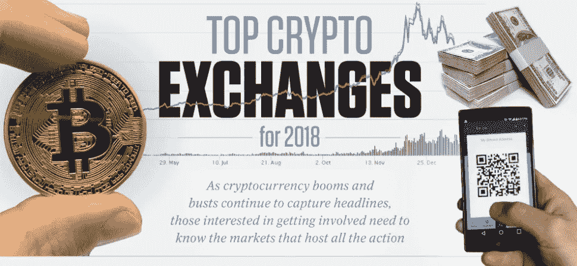
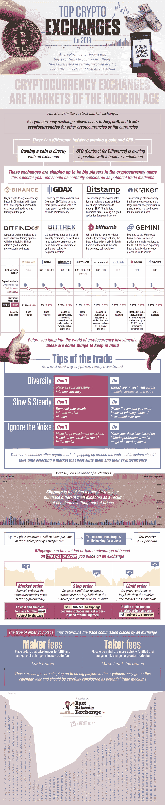

# 顶级加密交易所有哪些？

> 原文：<https://medium.com/hackernoon/what-are-the-top-crypto-exchanges-5cfa4406aee4>

这些天，每个人和他们的祖母都在谈论加密货币。不过，知道从哪里开始投资并不总是那么容易。你不能走进一家银行说，“我想把我的美元换成 3 个比特币，拜托！”那么，如何涉足加密货币市场呢？

有加密货币交易所就像有股票交易所一样。它们有一点不同——你可以用它们来购买、出售和交易，尽管法规和法律规则没有那么严格。你可以拥有一枚硬币或者差价合约，这意味着你拥有一个经纪人的头寸。

有许多加密货币交易所可供选择，就支付给经纪人的费用和支付给货币创始人的费用而言，每一个都有其利弊。一旦你找到了适合你的交易所，遵循你一贯的基本投资原则——分散投资，不要一下子全押进去，也不要做出下意识的投资反应。

从此信息图中了解更多关于加密货币和[加密交易所](https://www.bestbitcoinexchange.io/top-crypto-exchanges-2018-infographic/)的投资机会。你准备好投资下一波热门新商品了吗？

