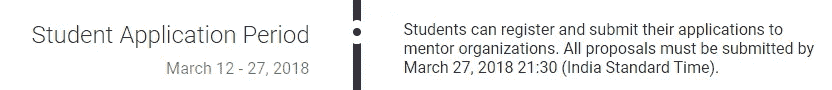

# 作为谷歌代码之夏的导师，我学到了什么？

> 原文：<https://medium.com/hackernoon/what-being-a-google-summer-of-code-mentor-taught-me-8c97aad503a5>

和一本给想知道如何被选中的学生的指南。

2017 年，我成为了 [Google](https://hackernoon.com/tagged/google) 代码导师之夏。对于外行人来说，[谷歌代码之夏](https://en.wikipedia.org/wiki/Google_Summer_of_Code)是一个国际性的年度项目，学生们在[开源](https://hackernoon.com/tagged/open-source)软件项目上工作，当他们成功完成项目时就可以获得报酬。前往[官方](https://summerofcode.withgoogle.com/how-it-works/#timeline)网站了解时间表和更多细节。但是在那之前跟我出去玩一会儿:)

This is the most important piece of information, if you want to be selected this year!

## 开源的重要性

为什么谷歌会付钱给学生来完成开源项目？鼓励学生开发者的开源贡献。如果你在想为什么开源很重要，那么，你可以这样想:我们今天使用的 Android 手机都是基于 Linux 的，这是一个开源倡议。开源帮助世界以更快的速度变得更好，因为它利用了全世界最优秀的大脑。

## 作为导师我学到了什么？

1.  *反馈困难*

提供反馈真的很难。这是一种平衡的行为，既要给学生足够的批评性反馈，让他们能够改进，同时又要确保感谢他们鼓励他们的努力。我坚信批判性反馈是成长和进步的一种方式，所以仅仅欣赏对我来说是不够的。

2.*指导很累，但同样令人满足*

管理一份每周花 4-5 个小时的全职导师工作是一项艰巨的任务。起初，投入的时间看起来并不多，但当它与一天的劳累工作结合在一起时，我觉得自己永远都在忙。这让我意识到我的工作实际上有多忙碌，在班加罗尔的长途通勤和在家参加的工作会议。然而，最终，大约在项目结束的 8 月份，我有了一种成就感。回馈社区确实很满足。

3.*认识自己*

我在做导师的过程中学到了一些关于我的事情。我对 [PowerUp Android 应用](https://github.com/systers/ossprojects/wiki/PowerUp)的复杂性以及各种特性和功能应该如何设计充满热情，我总是有一系列的建议和方法来完成一些事情。我意识到我可以成为一名优秀的产品经理，如果我将来想把它作为职业选择的话。

## 会议邀请和网络！

作为一名导师，我接触了一个由 GSOC 导师和学生组成的庞大网络，他们被邀请参加在加州谷歌总部举行的谷歌代码之夏会议。当我因为个人原因不能去的时候，我收到了另一个邀请，去参加在谷歌纽约办公室举行的 GSOC 会议。能见到谷歌的开源主管 Chris DiBona 真是一种荣幸，他用自己的故事激励了 GSOC 的所有校友，讲述了 GSOC 是如何在谷歌起步的。一些组织展示了他们的项目，一些学生展示了他们作为 GSOC 的一部分所取得的成就。互动是无价的，这一经历让我相信，当我们回馈社区时，我们会得到更多的回报。

我非常鼓励软件工程师/图形设计师考虑成为一名导师，亲自看看指导如何丰富你的生活。

## 奖金:给学生的礼物

现在是我指导学生申请 GSOC 导师组织并被选中的部分。我看到很多学生在 Quora 上询问关于被选为 GSOC 学生的问题，并制作了一个关于这个主题的迷你课程。

你可以在 Skillshare 上观看(通过以下链接注册 Skillshare Premium 会员可以免费获得 2 个月的时间)。我自己也是一名高级会员，我认为这是一个探索平台 2 个月并决定是否继续使用它的好方法。

 [## 你想知道的关于谷歌代码之夏的一切

### 这是一门课程，旨在回答围绕谷歌代码之夏(GSOC)的所有信息。它将帮助学生…

skl.sh](https://skl.sh/2CPjhjG) 

你也可以在 Youtube 下面的播放列表中观看。

A mini-course about GSOC.

声明:我从来没有成为 GSOC 的学生，所以在现实生活中事情可能会有所不同，但是如果你需要一个估计的框架，这个课程会给你提供。

以下是我在 Quora 上关于 GSOC 话题的回答列表:

 [## 你会给一个非 CS 的学生什么建议来破解《代码 2018 的谷歌之夏》？

### 答案(4 之 1):学生非 CS 背景没关系。步骤是相同的。如果你知道哪怕一个…

www.quora.com](https://www.quora.com/What-advice-would-you-give-to-a-non-CS-student-to-crack-the-Google-Summer-of-Code-2018)  [## 在开始为开源软件做贡献时，学生应该了解哪些 C++知识

### 答案(第 1 题，共 2 题):1。你需要了解基本的 C++。那是假设。2.找一个 C++ GSOC 项目做贡献(我是…

www.quora.com](https://www.quora.com/What-are-the-things-a-student-should-know-in-C++-while-starting-contributing-to-open-source-for-GSoC)  [## 详细来说，我的学习路径应该是什么，才能入选使用 C++的 GSoC 2018？

### 回答(第 1 题，共 2 题):我现在是 android 应用 PowerUp 的 GSoC 导师。我将分享我的经验，选择…

www.quora.com](https://www.quora.com/What-should-be-my-learning-path-in-detail-in-order-to-get-selected-for-GSoC-2018-using-C++)  [## 如何用 C++作为我的编程语言来准备 2017 年谷歌代码之夏(GSOC )(参见…

### 回答(第 1 题，共 2 题):我认为你已经需要开始投稿了，因为你至少懂一门语言。如果 C++是你的…

www.quora.com](https://www.quora.com/How-do-I-prepare-for-the-Google-Summer-of-Code-GSOC-2017-with-C++-as-my-programming-language-see-description)  [## 如果我需要申请 GSOC 16，我应该精通 C/C++的哪些概念？

### 答案(第 1 题，共 4 题):https://www.youtube.com/watch?t=183s&v = m1 fbf 2 hqbry 这是一个必须知道的列表。除此之外，它…

www.quora.com](https://www.quora.com/What-all-concepts-of-C-C++-should-I-be-well-versed-with-if-I-need-to-apply-for-GSOC16) 

如果你喜欢你读到的内容，请分享一些爱，并多次点击拍手符号。

这篇文章最初发表在我的网站[www.heisenbugtech.com](http://www.heisenbugtech.com)