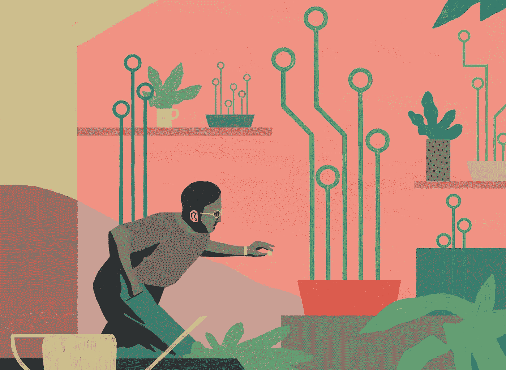

# 比特币、以太坊等数字资产会变成什么样

> 原文：<https://medium.com/hackernoon/what-bitcoin-ethereum-and-other-digital-assets-will-become-3dde7e570b6d>

## 了解向数字时代的过渡

人们不断重复说货币已经数字化，并质疑区块链的可用性。但仔细想想，在传统的金融系统中，价值转移并不是真正的数字化。

银行展示的数字货币并没有真正以数字方式转移价值。这只是一个数字显示，背后没有复杂的价值转移。电汇时，没有硬通货从一家银行转到另一家银行(这就是为什么效率很高)。这只是我们盲目相信这是真的一种表现。姑且称之为**展示货币。**

# 为什么会这样呢？让我们深入一点

如果您观察一下传统的金融基础架构，就会发现其中始终包含五个组件:

*   监管是一个组织
*   发行是另一个(央行)
*   支付系统是独立的
*   异地审计
*   提供治理的国家。

几乎在每一笔交易中，为了使系统有效运行，上述所有组件都发挥了作用。

如果你看看[比特币](https://hackernoon.com/tagged/bitcoin)，我们拥有上述菲亚特系统的所有组件，但都由同一段代码管理。比特币网络提供支付系统、发行、审计、治理、保管，所有这些都在一个网络中。

# 那么比特币真正实现了什么？

比特币实现的是真正的价值转移；**真正从纸质时代过渡到数字时代**。当你把一枚比特币转让给某人时，你就立刻转移了实际资产。这种情况的发生不涉及任何可信的第三方。只是用数学。

这是一个很难理解的概念，因为这条线很细，但如果你理解，你会发现比特币网络颠覆了传统的金融基础设施。

# 但是那些噪音是什么？

过去几年，我们已经看到过多的团队试图复制比特币的天才基础设施。

团队正在引入新的硬币，承诺创新。但是这些到底是什么样的破坏呢？

所有这些硬币和服务之间的区别只不过是我们从纸质时代过渡到数字时代的新基础设施。

# 什么样的基础设施？

如上所述，支付系统要以安全的方式运行，需要几个流程:

1.  治理，
2.  监护权，
3.  发行和分配，
4.  交易处理，
5.  审计

在比特币出现之前，上述所有地方都是独立的实体和完全集中的。

但它不需要为了创建一个数字资产而分散所有 5 个。例如，可能有一项数字资产根本不需要审计，因为有些人希望对公众或任何中央机构完全保密他们的交易历史。

所以，今天上述 5 个过程的 3 个**状态可以是:**

1.  集中的
2.  分散的
3.  没有人

例如，中央银行网络完全集中了上述 5 个过程，这就是为什么您会收到中央银行货币(**显示货币**)。

比特币是一个完全去中心化的网络，这就是为什么你收到的数字资产也是完全去中心化的(**加密货币**)。

ZCash 和 Monero 是分散的网络，但审计是不可能的，因为你看不到交易的历史(**仍然是一种加密货币**)。

Ripple 拥有集中的治理和发行(该团队负责这两项工作)，但所有其他流程都是分散的(**不是加密货币，因为它是集中的，但它是可审计的数字货币)。**

Tether，或现在的 Gemini dollar，由美元支持，由某个组织控制，集中管理(**不是加密货币，只是数字资产的新形式**)。

# 还有一个障碍我们必须克服

上述系统的互连性。

例如，现在，如果你想打开一个网站，你可以从任何浏览器，任何设备。但如果你想管理你的法定资产，你就不能使用富国银行，除非你在那里开了一个账户，你也不能把钱转移到另一个国家，除非 Swift 介入。加密空间也是如此。如果你有 10 种不同的货币，你想把价值从一种资产转移到另一种资产，你将需要使用第三方服务(如交换或原子互换)，这将允许你这样做。

在目前的状态下，我们可以形容为不同的网站必须使用不同的浏览器。

最终，我们将拥有一个通用的基础设施，一个金融互联网，所有的资产都可以互相“交谈”。

# 好吧，但是他们为什么需要区块链呢？

如上所述，上述所有资产正在成为数字资产，并将基本上由它们‘存在’的基础设施(支付系统)来定义。

为什么？因为会计系统可靠所需的基本特征是**安全性**。区块链提供安全功能。这是一种在互不信任的多方之间达成共识的机制。换句话说，区块链将信任和记忆因素数字化。转移价值所需要的一切。

因此，区块链不是关于货币，而是关于一些数字资产状态的共识。为了达成共识，你需要参与。为了激励人们参与这样的网络，你奖励他们一种货币。它可以是从零开始构建的新硬币，只用于这个网络或现有的网络。

我们永远不应该忘记，区块链只是一个系统的工具，就像照片的相机，钉子的锤子，或者汽车的引擎。

# 新数字资产的创造

如果你仔细想想，这些是我们在数字时代之前从未想象过的资产。由于数字化，我们现在可以灵活地创造出前所未有的资产。这是通过引入另外两种状态实现的，一种是分散状态，另一种是无状态(目前是这样，将来可能会更多)。

总之，有三种主要类型的数字资产:

*   **展示资产。**一切都是完全集中的，没有复杂的价值转移。这只是一个展示，我们只是相信银行，我们看到的数字代表了真相。
*   **加密货币**。基础设施层面的终极分权。信任因素最终被消除。没有一个部分是集中的。
*   **混合数字资产。基础设施的某些部分是集中的，而其他部分是分散的或者根本不存在。**

# 数字资产不同于模拟资产的令牌化。

不要把模拟资产的符号化和数字资产混为一谈。这是两码事。

前者是当我们拿一个模拟资产，如房地产，我们使用区块链，以自动化所有权。我们不再使用律师，而是将模拟资产及其所有权转化为一个包，我们称之为令牌。房子没有数字化，还是房子。我们刚刚利用区块链的技术实现了所有权基础设施的自动化。

后者将资产完全转化为数字形式。比如比特币没有把美元(模拟资产)变成代币。比特币本身是一种独立的数字货币。它使模拟资产过时了。

# 结论

正如我们在上面看到的，数字资产根据上下文获得特定的功能。

目前，我们用我们理解和知道的资产进行类比，“比特币是新的黄金”，“以太是新的美元”，但我们实际上建立的是更大的东西。

我们逐渐从纸质时代过渡到数字时代，构建一个通用的基础设施，一个无信任的网络，所有资产将相互“对话”，人们将根据自己的需求自由使用它们。

最终，我们甚至不会意识到我们每次使用的是哪种资产。同样，我们也不知道每次打开一个新网站时使用的是哪种协议。你能想象这能走多远吗？

我们很幸运处在这个时代的开端。

在 twitter 上关注我的更新 [@katerinastro](https://twitter.com/katerinastro) 。