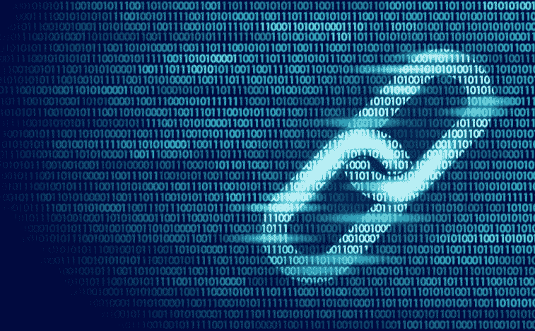

# 区块链是什么，不是什么

> 原文：<https://medium.com/hackernoon/what-blockchain-is-and-what-it-isnt-6e4284218bad>

自 2017 年以来，‘[区块链](https://hackernoon.com/tagged/blockchain)’这个词一直被广泛使用，它已经意味着任何东西，从将改变世界的技术到数字形式的蛇油。这也将使每一个投资者变得非常富有。

区块链传奇的一部分是基于围绕[加密货币](https://hackernoon.com/tagged/cryptocurrencies)的所有炒作，公平地说，它的力量已经膨胀到一些人开始相信它能够提供它很可能无法提供的东西。毕竟，它只是一个具有新功能的数据库。

[Jack dosman](https://hackernoon.com/10-things-blockchain-isnt-dcb7966d22e5)在 Hackernoon 上写道:“它允许多方在数据库上实时记录和共享信息，而不需要相互信任，因为他们通过代币/硬币被激励去做正确的事情。”

正如他所说，区块链有一定的特殊性，这使得它只在某些情况下有用。这对加密货币和更快、更便宜的跨境支付服务来说很好，但它不是绝对万能的解决方案。

它有一些缺陷:例如，工作验证机制使用了大量的电力。但是，我们也必须记住，我们仍然处于区块链的早期，现在忽视它就相当于在 1995 年说互联网永远不会起作用。

这不是庞氏骗局，也不是简单地通过在公司名称中添加“blockcian”来让公司股价飙升的方法；尤其是没有区块链参与的时候。它也不像有些人希望你认为的那样，是骗子专用的工具。那只是技术的副作用，不是最终目的。许多骗子使用电子邮件和社交媒体渠道，但这并不能阻止我们使用互联网。

它不会给你的业务带来革命性的变化，除非你的公司真的需要区块链技术来发展——所以不要为了它而加入它。另外，你可能听说过它是一个“颠覆者”；嗯，它可能不会扰乱每个行业，因为不是所有地方都需要它。

那么什么是区块链呢？

正是技术提供了:

共享的、仅添加的数据库

消除对中介的需求

这是不可信的

它提供了共识和认可

这使得它非常适合加密货币和金融界。将来可能会有其他大众市场案例供区块链使用，但不要绝对相信你听到的关于区块链能做什么的一切。