# Booking.Com 可以教初创公司不要用他们的 UX 做什么(以及我如何花 130 美元买了一个显示为 60 美元的地方。)

> 原文：<https://medium.com/hackernoon/what-booking-com-can-teach-startups-not-to-do-with-their-ux-and-how-i-spent-130-instead-of-60-ed6a201df825>

## 当跟随数字出现可怕的错误时

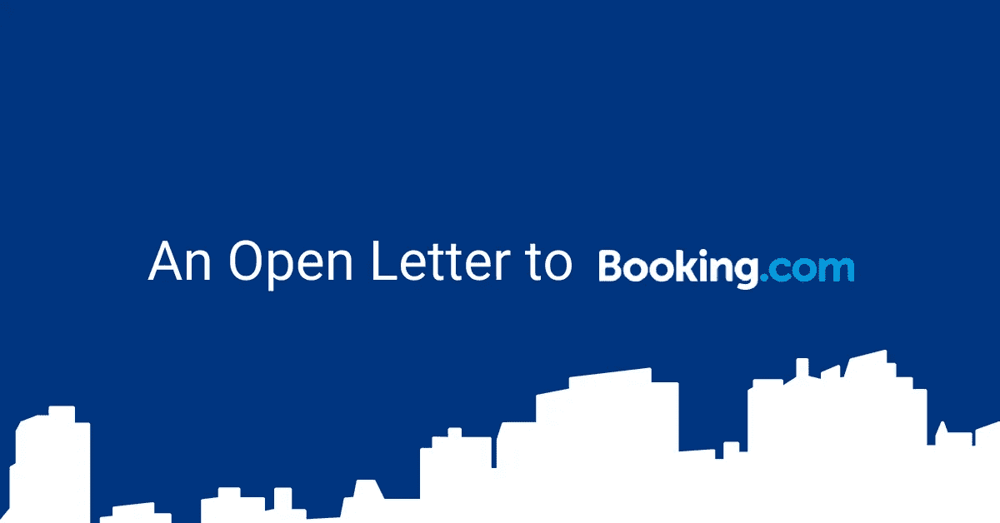

Booking.com 的实践和用户体验是一个很好的例子，说明了初创企业不应该遵循什么。

上周我第一次尝试了 booking.com 的公寓预订。

接下来发生的事情让我写下了这篇文章，最初的标题是“Booking.com 可怕的用户界面如何骗走了我 70 美元”。

不用说，我对结果并不感到兴奋。

我曾多次使用 booking.com 酒店/宾馆和合租房屋，从未有过投诉。

我甚至是他们天才计划的一员。

所以我很习惯他们网站预订酒店的方式。

所见即所得。

没有隐藏的费用，没有废话。

至少我是这么想的。

我认为公寓也是如此，但这就是我错的地方(显然不仅仅是我)。

# 搜索页面:看起来没什么问题

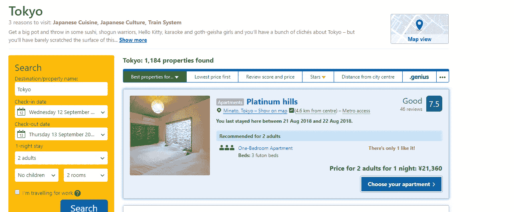

What booking.com looks like when searching for apartments.

你搜索公寓，你可以按照你喜欢的任何方式安排它们。(我更喜欢分数和价格，甚至是最低的价格，因为我破产了，但这只是我自己)。

你认为这没什么不对。

然后点击你喜欢的结果，它就像一个酒店房间一样显示出来，同样，这里似乎没有什么问题。

貌似。

只是，这里有问题。

# 可疑的东西

在 **4 个不同的地方**，甚至在搜索中显示出价格的根本错误。

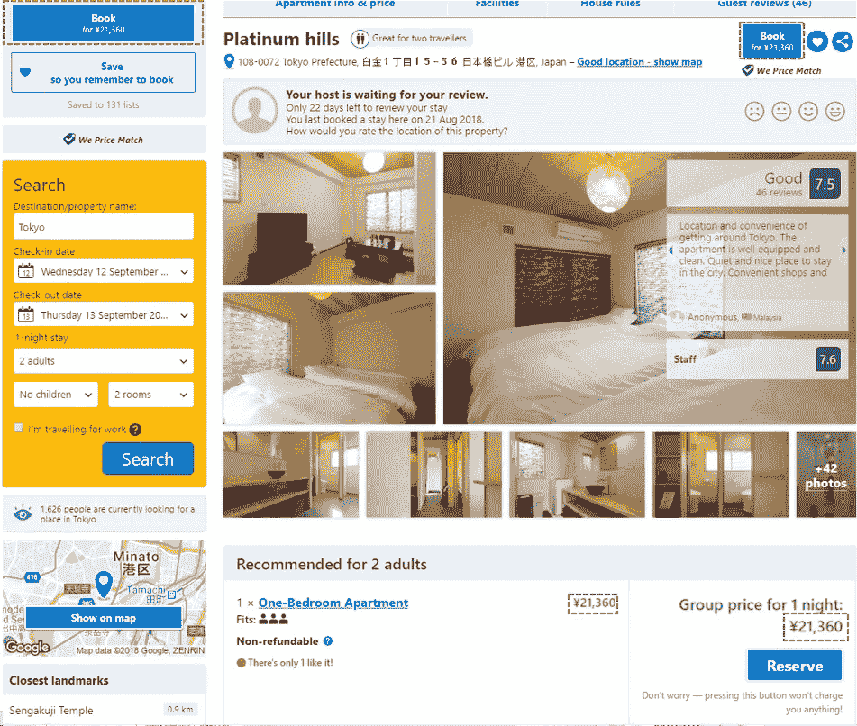

> 都不是实际价格。

Booking.com 认为，公寓业主为他们在 booking.com 的房源支付的清洁费是一项“排除费用”(如果这意味着它“排除”在我的信用卡账单之外)，但所列价格中包括增值税和税款。

但是好吧，至少当你点击预定的时候，房产的真实价格就会显现出来，对吗？

实际上情况变得更糟了。

这是我在预订页面上方看到的内容:

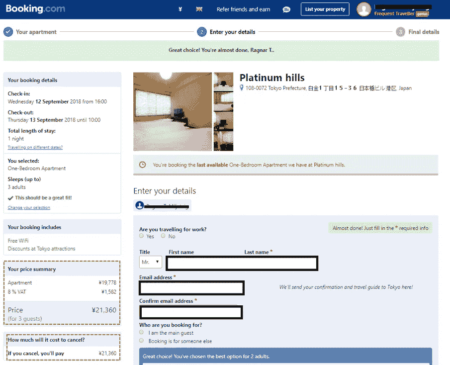

看起来很直接，对吧？

我的价格总结，一个漂亮的大价格似乎总结了我必须支付的总价格。

我当时没有注意到的是隐藏在折页下面的讨厌的“排除费用”部分**，根本没有试图突出或告诉我**嘿，这里实际上有一笔相当大的额外费用**，你可能想告诉潜在客户，以免他们感到不安并写一篇这样的抱怨博客。**

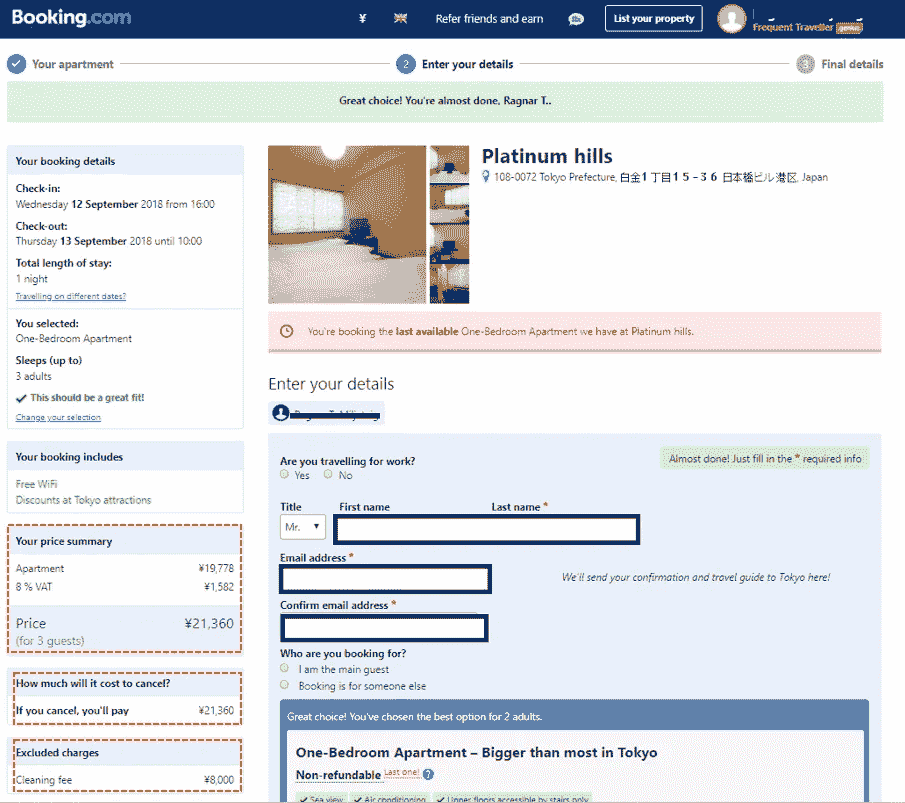

更不用说，“不包括费用”听起来更像是 booking.com 在给我一个特殊的价格，通常包括这个费用，而不是一个讨厌的惊喜，你会在结账前不用提到它就标记在总数上。

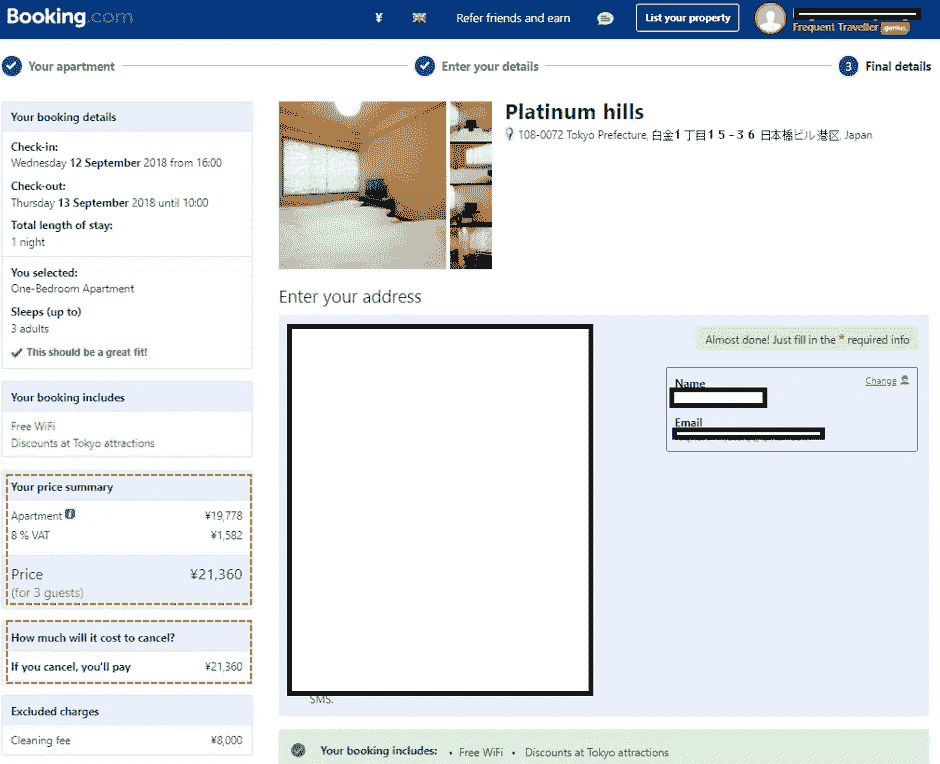

这是你实际预订和承诺入住的最后一页，他们仍然显示非常不清楚的价格，尽管最后清洁费出现在折叠上方。

还是恐怖的用户体验。

我找到了一套标价通常为 200 美元的公寓，价格约为 60 美元，还有些零钱，我想在别人抢先买到之前犒劳一下自己。

(这是同一天预订的。)

甚至在我的预订概览中，它也显示了我最初以为的价格。

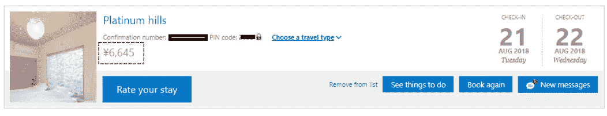

这是我预订的电子邮件提醒:

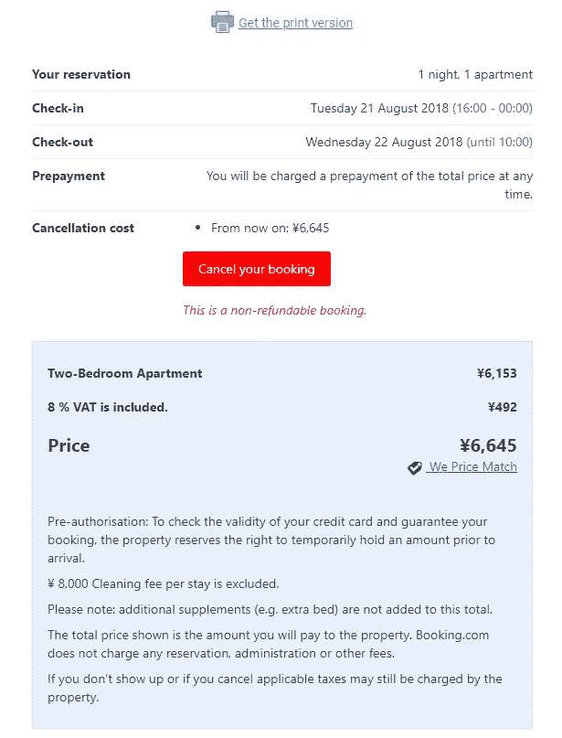

实际价格实际上不是 6645 日元，或者更接近的价格。8000 日元的清洁费将一晚的价格推高至 14645 日元，这是东京一家相当不错的酒店一晚的价格，包括早餐。

# “没人骗你，你只是个白痴”

事情发生后，我真的觉得自己像个白痴。

一开始我以为我可能是唯一一个犯这种错误的人。

但是后来我在物业的后续邮件里看到了*这个*。

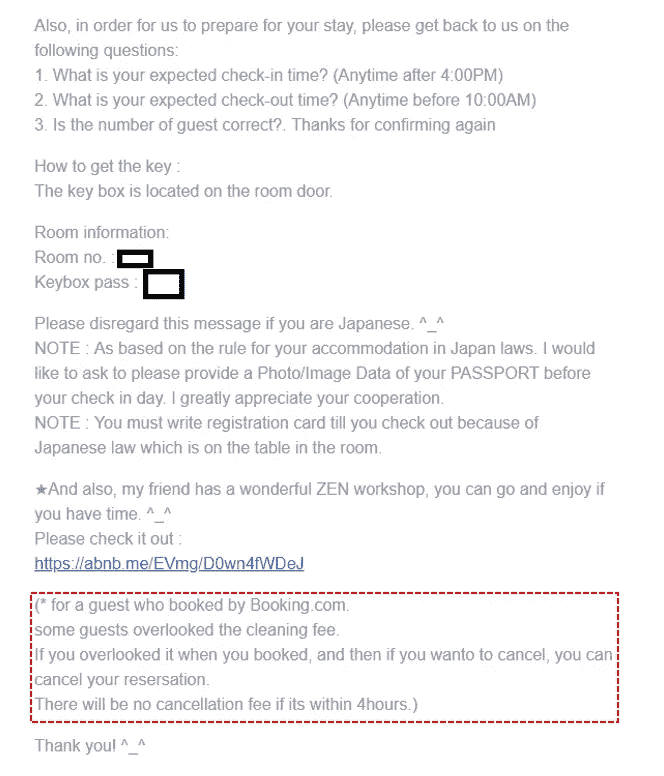

这是**针对该酒店的标准跟进电子邮件**，他们觉得有必要添加这封邮件，以减少他们的客户支持工作量。

我猜这是他们经常处理的事情。

然后我做了一些谷歌搜索，我发现像[这篇](http://travellingboomer.com/hotel-booking-fees/)一样的文章覆盖了完全相同的问题，但是针对多个网站。

*老实说，即使我是个白痴，这也是 Booking.com 的字面意思* ***job*** *确保这样的事情不会经常发生，以至于他们服务的用户雇佣了一个如上所示的黑客补丁，不管最终用户是不是白痴。*

听着，我不是想在这里提出法律诉讼，说他们骗走了我的血汗钱。

这只是作为一个*不太友好的*(因为你拿着我辛苦赚来的钱跑了，走着瞧)提醒**修复你该死的用户体验**。

# 为什么？他们的 UX 是怎么来的？

这让我们想到了一个问题，为什么他们的 UX 会是这样的呢？

答案很简单，跟着数字走。

我愿意用我的午餐打赌，他们只是简单地测试了不同的定价模型，发现这个界面“表现得更好”。

当然，让公寓看起来比看起来要便宜

这就是跟着数字走的问题。

## 有时候数字并不能反映全貌

你对 X 做了改变，这个月你的点击率、转化率和销售额都上升了？

这并不总是自动意味着保持这种变化是正确的决定。

我可能最终通过预订预订了一个比平时更贵的地方，给了他们更高的佣金，但与我作为 Booking.com 终身用户的价值相比，这只是沧海一粟，(这是他们在整个互动中所失去的)。

# 关于客户服务的说明

当我注意到我的错误时，我正在工作，没有机会在线等待联系客户服务代表，然后试图说服他们做正确的事情，所以我发送了一条关于我的问题的简短消息，如果可能的话，我想取消，然后就这样了。

第二天，我得到的只有这些:

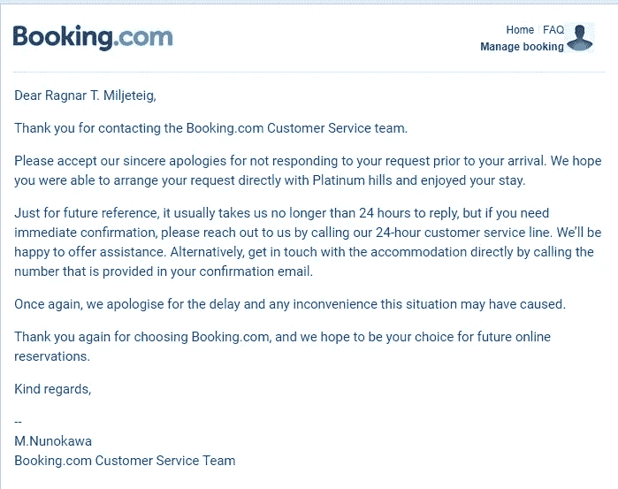

很明显，他们甚至没有浏览内容，看看我的投诉实际上是什么，这只是一个自动回复，通知我应该打电话给我。

我不喜欢打客服电话(我也知道不止我一个)，说实话也不应该打。

让人们接听电话的整个过程似乎比让人们在不到 24 小时内回复确认预订的人的短信复杂得多(这并不难细分，老实说，现在是 2018 年)。

实际上，在消息被发送的时候，没有人必须在场，如果一个人没有处理消息的专业知识，那么拥有该专业知识的人也不必立即在场。

紧急呼叫之所以存在，可能是因为它阻止了许多紧急服务请求，并降低了总体工作量(和劳动力成本)，因为显然，呼叫比仅仅发送消息具有更高的准入门槛。

他们不仅按照自己的方式定价，遵循“转换”的数字，他们还按照自己的方式提供客户服务，同样，很可能是“遵循数字”。

我想这就是“以数字为中心”的用户体验的感觉。

# 每个 OTA 都一样，Booking.Com 需要这样做来竞争

这只是**错了**。

事实上，我更喜欢使用 Booking.com 的原因之一是，在搜索过程中，他们的价格中包含了税收和增值税，不像 Agoda、Hostelbookers 和我过去尝试过的其他在线旅行社。

AirBNB 是一家 OTA，它做的事情和 Booking 一样，但实际上从搜索、到属性页、到退房，价格中都包含了清洁费。

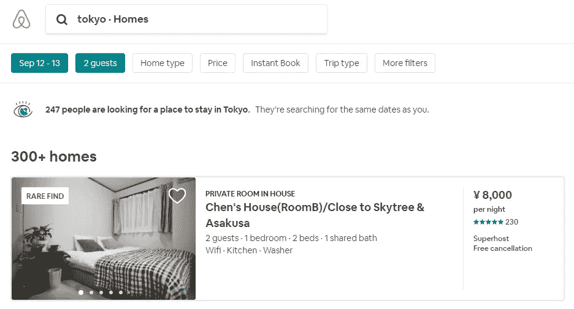

Cleaning Fee/By Number of nights included in search.

遗憾的是，Airbnb 在搜索中不包括服务费，但 AirBNB 用户对此会很熟悉，而且与 Booking.com 不同的是，所有东西实际上都包括在你看到的每一笔总额中。

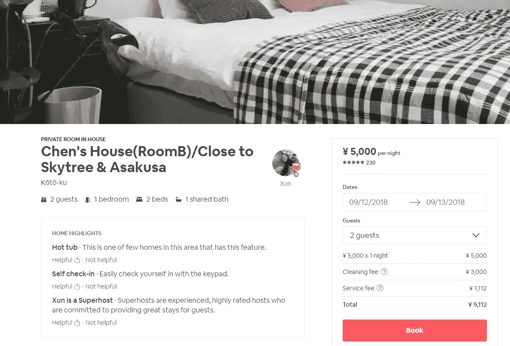

As you can see, nightly fee plus cleaning fee tallied up in the total.

只要能增加短期利润，其他所有 OTA 都在跟踪数字，近乎欺诈，但这不是做同样事情的借口。

这就是为什么预订或任何想要长期获胜的 OTA 都应该以消费者为中心，保护他们的声誉，并且从搜索到预订和退房都要 100%清楚定价的确切原因。

保持体面和透明，你会赢得客户的忠诚，你可以把这种忠诚带给银行。

(或者，如果没有一家在线旅行社愿意这么做，这就在市场上留下了一个缺口，等待着正在阅读这篇文章的黑客来填补。

# 外卖食品

对于任何想要我的业务或任何其他“白痴”终端用户的业务的创业公司，月复一月，年复一年，终身如此，这里有一些经验教训。

## 数字=/=真相

这些数字并不总是能反映出你的客户的真实感受和想法。

他们是如何与你的服务互动的。

例行检查你自己的销售旅程，检查每件事是否有意义，你没有在任何地方偷工减料。

以完全不可扩展的方式与你的客户交流并倾听他们的意见(不要相信我的话，[倾听 Linkedin 的联合创始人，与 AirBNB 的联合创始人谈论这个确切的事情](https://mastersofscale.com/brian-chesky-handcrafted/)。)

## 透明度是健康的客户关系的关键

我不是第一个因缺乏透明度而受害的客户，也不会是最后一个。(除非这篇文章能激发一些改变，对此我高度怀疑。)

不用说，我对 Booking.com 不感兴趣，我已经开始使用替代品，并寻找更好的东西。

## 实际客户优先

在我看来，Booking.com 似乎陷入了他们的增长，试图出售尽可能多的酒店，现在公寓/公寓/出租业主尽可能多的服务。

要做到这一点，显然更好的数字，更多的预订通过他们的服务，更容易销售。

但这不应该分散他们对最终用户的注意力。

说到底，由于 Booking.com 是一种基于佣金的模式，而不是基于订阅的模式，他们不是从酒店那里获得报酬，而是从像我这样的人那里获得报酬(通过从我住的酒店抽取佣金)。

酒店和公寓业主是 Booking.com 不可或缺的宝贵商业伙伴，但没有哪家企业会在失去顾客的视线后存活很久。