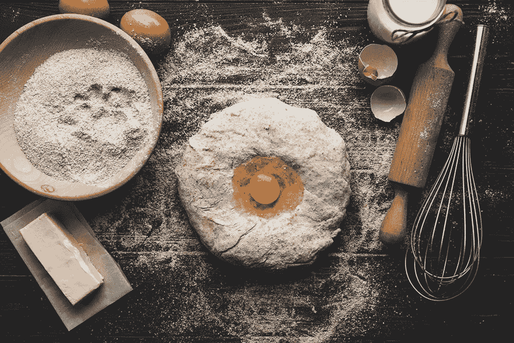
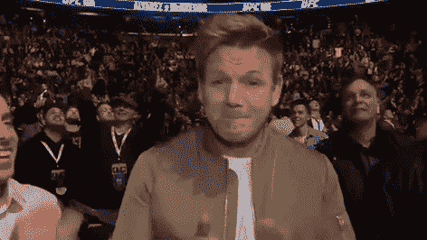

# 关于提高你的创造力，戈登·拉姆齐教了你什么？

> 原文：<https://medium.com/hackernoon/what-can-gordon-ramsay-teach-you-about-improving-your-creativity-cbdf4ef39bc2>

在过去的一周里，我参加了戈登·拉姆齐的烹饪大师班，我很喜欢它。这家伙对他的手艺流露出的热情令人难以置信地鼓舞人心。

他对烹饪表现出的热情、激情和旺盛与他在电视上的形象大相径庭:

在整个课堂上，他表现得更像这个人:

当班上的一名学生让他推荐业余厨师需要掌握的五项基本技能时，他提到了这些:

1.  视力
2.  尝
3.  好食材
4.  勇于冒险
5.  何时停止

如果这还不是对创造力的完美类比，我不知道什么才是！

# 视力

在你开始任何创造性的项目之前，你需要有远见，因为你应该知道你要做什么。想象结束，然后倒着回到开始，这样你就能确切地知道你需要做什么才能到达那里。

# 尝

当你创造“好”的时候，你需要知道“好”是什么感觉，这样当你的工作达到一个适当的水平时，你就能认出它。

但是，不一定要获奖精彩。如果你刚开始，只需要尽你所能做到足够好。

随着时间的推移，你会有所提高，你对“好”的认知也会增长。你的工作会慢慢接近你的品味，和你脑海中的工作质量。

# 好食材

烹饪时，拥有好的食材非常重要，在创造力的其他方面也同样重要。

演奏音乐需要好的音乐家。如果你想成为一名作家，你需要对写作的基本原理有正确的理解。要成为艺术家，你需要好的素材。

# 勇于冒险

对于创造力的任何方面来说，敢于冒险都是一个重要的特质。这很可怕，因为你经常怀疑自己是否有一点点跳出框框的想法。

我不认为尝试和冒险有什么不好。例如，当我为一个客户做混音时，我不认为看到我能创造性地将项目进行到什么程度有任何风险。最糟糕的情况是，它听起来很糟糕，此时我将返回到我们开始的基本会话。

就在昨天，我收到了戴尔的电子邮件，他是[音频问题](http://www.audio-issues.com)的长期读者，感谢我的观点:

> “…您每天向我们所有人展示的东西非常有帮助！我是说真的很有帮助！你的建议是神话般的，是对常识的伟大提醒。另外，你读起来很有趣！非常感谢你…我会告诉我所有的朋友关于你的事。希望一个(或者全部)买买买！我毫不怀疑你的指南是一流的，技术上是正确的，同时也很有趣。无论如何，谢谢你！你真的让我的混音更好了，好多了。主要是你说服我不再遵循愚蠢的规则。我利用了直觉、经验和你的一些很好的指导方针。结果令我非常满意。谢谢大家

# 知道何时停止

最后一个非常重要。

创造力面临的一个重大挑战是知道事情何时完成。对“完成”的最大恐惧是当你完成时的焦虑，因为你知道你应该“发表”出版让事情变得永久。它们不是你可以随意涂鸦的“半成品”。它们是向全世界发布的最终产品。对一个艺术家来说，这可能是最可怕的事情，因为你内心的批评家会用自我怀疑来迷惑你的创造力。

音乐制作界有句话是这样说的:

> “一次混不完。它被遗弃了。”

你可以继续“工作”你的混音，调整鼓、低音和人声，直到你的 CPU 崩溃并开始在角落里哭泣，但如果它不能让你的混音变得更好，为什么要麻烦呢？

是不安全感。

同样的事情也适用于你开始的任何创造性努力。

不要纠结于那些对最终产品没有任何贡献的小细节。但是也不要忽视需要修复的东西。

迟早你会发现你不必过度分析和纠结于每一个小细节。你是最接近你的项目的人，你注意到了它所有的缺陷，因为是你自己把它们放在那里的。我保证其他人不会有同样的注重细节。或者他们根本不会在意它有一点瑕疵。这里面有美，事情不一定是完美的。

> “完美是好的敌人。”-伏尔泰

所以记得知道什么时候停下来，回顾，反思，然后最后，**发表。**

看啊！很简单。我刚刚写了这篇文章。你要怎么办？

我是一名电子邮件营销专家，帮助您扩大电子邮件列表，产生吸引内容的想法，并通过电子邮件营销推动销售。[获取你的精彩电子邮件宣言，学习如何通过 6 个简单的步骤每天获得 100 个电子邮件订户。](https://bbenediktsson.com/)