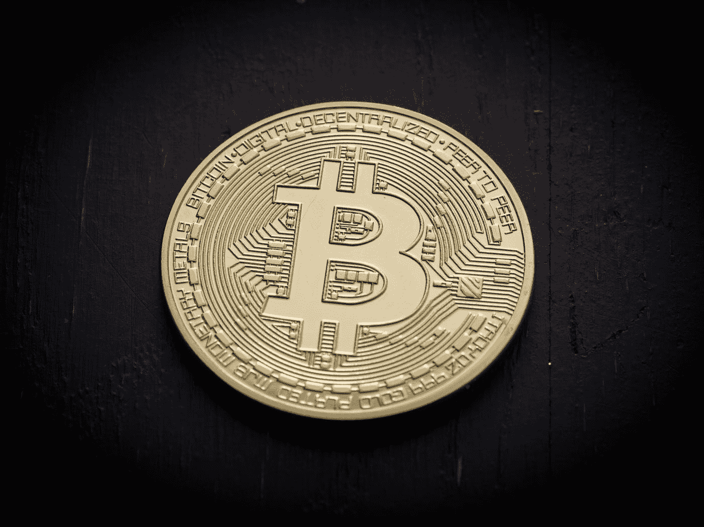
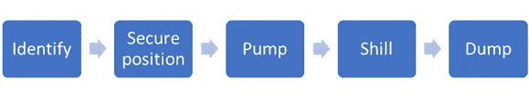

# 密码社区能从 1929 年的股市大崩盘中学到什么？

> 原文：<https://medium.com/hackernoon/what-can-the-crypto-community-learn-from-the-great-stock-market-crash-of-1929-97bbf381b42>

Photo by [Thought Catalog](https://unsplash.com/@thoughtcatalog?utm_source=medium&utm_medium=referral) on [Unsplash](https://unsplash.com?utm_source=medium&utm_medium=referral)

加密革命始于 2008 年，当时中本聪在“[比特币:一个点对点的电子现金系统](https://bitcoin.org/bitcoin.pdf)”中首次提出了这个概念，如今这场革命已经走过了漫长的道路。在过去的两年里，它获得了很大的吸引力，在它最受欢迎的时候，比特币的价格甚至[一度触及 2 万美元](https://cointelegraph.com/news/bitcoin-hits-20000-per-coin-capping-year-of-enormous-growth)。它还催生了一种新的筹资形式，即首次发行硬币(ICO)。除了比特币，ico 作为一种融资机制，在区块链和区块链以外的初创企业中也广受欢迎。强劲的融资势头在 2018 年得以延续，仅在今年前 5 个月[就有 383 个 ico 筹集了近 90 亿美元](https://www.coinschedule.com/stats.html?year=2018)，是 2017 年筹集金额的两倍多。

今天的加密市场的状态在许多方面类似于 20 世纪 20 年代的美国股票市场的状态，也就是人们通常所说的繁荣的 20 年代。在这篇文章中，我研究了今天的加密市场在许多方面与 20 世纪 20 年代的股票市场是如何相似的，以及我们能从中学到什么。这将有助于我们确保不会重蹈 20 世纪 20 年代的覆辙，这样密码市场就不会遭遇与 20 世纪 20 年代股票市场相同的命运，当时数百万投资者失去了他们的血汗钱，美国陷入了有史以来最大的大萧条。我使用术语“加密货币”或“密码”不仅指像比特币和以太这样的协议币，还指通过 ICOs 发行的各种其他代币。

## **背景条件——咆哮的二十年代 Vs 今天**

20 世纪 20 年代是一个经济强劲增长和技术迅速变革的时期，尤其是在美国。这导致了 20 世纪 20 年代大部分时间的股价投机热潮，类似于当前的加密货币牛市。就像今天区块链和比特币如何刺激市场对加密货币的投机一样，相对较新的无线电通信媒体和美国无线电公司的股票帮助推动了 20 世纪 20 年代的反弹。[【1】](#)

当时的主导主题是中央集权。目的不是消除竞争，而是消除无能、梦游、天真，甚至是当地管理层不必要的诚信。就公用事业而言，实现管理和控制集中化的工具是控股公司。当涉及到食品零售、百货店、百货商店和电影院时，集中化的工具就是企业连锁。对分行和连锁银行的兴趣也很浓厚，人们普遍认为，州和联邦法律是整合的古老障碍。各种违背法律意图的安排，尤其是银行控股公司，受到了高度重视。[【2】](#)

今天的主题是分散化，这与集权化正好相反。区块链、智能合同、数字自治组织(DAOs)是实现这种去中心化的关键工具。他们的目标是改变我们生活的方方面面，从我们如何使用和管理我们的钱到我们如何管理我们的隐私。密码界的许多人认为，今天的法律倾向于中央集权，是分散化革命的障碍。仅举几个例子，已经进行了许多尝试并且正在进行许多尝试来通过 ico、Dao、分散交换(DEX)、公用事业令牌和管辖权购物来绕过这些法律。

那时候没有管理证券交易的法律。二级交易由证券交易所自我监管，而证券交易所又受其会员即股票经纪人的监管。联邦一级也没有管理证券发行的全面规则。每个州都有自己的证券法，规定了发行和出售证券的标准。此类法律旨在保护个人免受欺诈性或过度投机性投资的影响。如今加密货币和 ico 的情况也非常相似。大多数 ico 声称发行公用代币，因此不受现有证券法的约束。此外，加密货币的二级交易由加密交易所自我监管，除了在某些司法管辖区之外，没有任何政府监管。

在股市崩盘前的一段时间里，公司发行股票，并热情地提升公司价值，以吸引投资者购买这些证券。经纪人反过来基于高额利润的承诺将股票卖给投资者，但很少披露公司的相关信息。在许多情况下，公司和经纪人做出的承诺很少或没有实质性依据，或者完全是欺诈性的。[【3】](#)如今 ICOs 的情况颇为相似。许多公司正在利用各种社交媒体渠道，不加区别地推广许多声称在某种程度上利用区块链技术并承诺获得巨大收益的项目。[根据各政府机构的调查](http://www.nasaa.org/45121/state-and-provincial-securities-regulators-conduct-coordinated-international-crypto-crackdown-2/)，大量新闻报道表明，大多数 ico 没有披露完整的信息，其中相当一部分是公然欺诈。

随着成千上万的投资者买入股票，希望获得巨额利润，市场处于投机狂热状态，这种状态在 1929 年 10 月结束，当时市场崩溃，恐慌的投资者集体抛售他们的投资。[【4】](#)坠机事件导致国会调查，以挖掘坠机原因。调查揭示了操纵特定股票和整个市场价格的各种行为。

Stock markets of 1920s V/s Crypto markets

# **市场惯例**

我研究了繁荣的 20 年代和今天的密码市场中以下实践的相似之处:

*   二级市场交易；
*   公开发行证券；
*   证券的私募发行；
*   保证金交易和
*   投资信托。

在即时文章中，我比较了二级市场的交易行为。其他做法将在适当时候发表的后续文章中介绍。

## **二级市场交易**

交易所的真正功能是维持一个开放的证券市场，在这个市场上，供求可以不受操纵和控制的影响，以自由的价格进行交易。国会的调查揭示了资金池交易是如何被用来操纵证券交易价格的。

**池交易—1920 年代**

资金池是几个人之间积极交易一种证券的协议。人们发现，资金池的目的是通过资金池成员的一致行动来提高证券的价格，从而使他们能够在公众被这种活动或传播的股票信息所吸引的情况下出售他们的股票并从中获利。当时，池操作不被视为非法，就像加密货币中的抽取和转储操作在今天不被视为非法一样。

这是池操作的工作方式:

**识别:**当发行股票的公司或其所属行业的状况或外部实际条件(如立法可能对行业产生有利影响)吸引了足够的公众注意力时，资金池就开始了。

**安全头寸:**作为资金池操纵标的的证券的供应或供应来源是成功执行的必要条件。该资金池有时通过卖空或散布不利的谣言预先压低股票价格，然后以较低的价格积累大量资金。最常见的做法是从公司本身或董事、高管或大股东手中购买期权。

**泵:**池成员通过在基本相同的时间、以基本相同的数量、以基本相同的价格购买和出售大量股票来刺激股票交易。只要每笔交易中的受益所有权发生变化，交易所就认为这是公平的做法。

**Shill:** 此外，资金池还导致了对资金池标的股票有利的信息传播。典型的方法是让经纪公司向其分支机构发送营销信函。其他方法包括雇用专业宣传代理人、资助金融作家和分发据称来自声誉良好的金融服务机构的情报单。

抛售:一旦价格上涨到足够高的程度，这个资金池就会把股票卖给不知情的公众，从而获得巨额利润。[【5】](#)

**资金池交易如何运作**

人们发现，在许多情况下，资金池参与者是大型经纪公司的负责人和资金池业务所在公司的高级管理人员。因此，拥有特权的内部人士是这些操纵行为的真正受益者，他们以毫无戒心的普通投资者为代价获利。

**资金池交易—今日**

有大量的新闻报道提供了大量的证据，证明许多加密货币受到泵和转储集团的操纵，这些集团的运作方式与 20 世纪 20 年代的资金池相同。唯一的区别是，互联网和 Telegram 等加密信息应用的可用性，使得任何人都可以随时随地组织一次抽水和倾倒。此外，由于当今的病毒式社交媒体渠道，兜售任何硬币都非常容易。

## 20 世纪 20 年代的教训

**交易所不擅长自我监管:**引发国会调查的关键因素是，纽约证券交易所未能采取更强有力的自我监管行动，以应对报道的市场违规行为。这让胡佛总统感到沮丧，他随后支持国会对市场操纵进行调查。

在繁荣的 20 年代，证券交易所是一个依靠自律的会员协会。这些交易所由会员组成的管理委员会管理。该委员会的成员是一些最大经纪公司的负责人，他们本身也是操纵型池交易的受益者。这在交易所、其会员和公众之间造成了利益冲突。这也是交易所没有采取强有力行动的原因之一。

说到加密交易所，我们到目前为止还没有看到任何交易所对任何操纵者采取行动。一些交易所已经[警告](http://uk.businessinsider.com/bittrex-warning-cryptocurrency-pump-and-dump-scams-market-manipulation-2017-11)他们的用户存在泵和转储计划，而一些说[被保护免受市场操纵对于密码交易员来说并不重要](https://blog.kraken.com/post/1561/krakens-position-on-regulation/)。加密交易所方面的这种冷漠的一些似乎合理的原因可能是，这些操纵者中的一些是这些交易所的最大客户或最大投资者，没有一个交易所希望得罪他们的最大客户或投资者。另一个原因可能是，交易所本身可能是操纵的一方，或者可能是这些操纵行为的最大受益者之一。没有人知道确切的答案，但无论如何，操纵对加密市场的未来没有好处，历史表明，如果交易所不整顿好自己的秩序，监管将被迫强加于它们。

一旦有机会，人们就会作弊:当有机会时，许多诚实的人就会作弊。当它远离金钱时，欺骗就容易多了。[【6】](#)内幕交易和抽逃计划的实例表明这是事实。原因是股票和加密货币不是货币。此外，没有规定说加密货币的内幕交易或市场操纵是非法的，所以从事这种行为不会有任何后果。

**权力导致腐败，绝对的权力导致绝对的腐败:**交易所对证券市场有着巨大的影响力，因为它们有能力为迄今为止缺乏流动性的资产提供流动性，如果不加约束，这种权力会导致滥用。已经有许多[报道](http://www.businessinsider.com/cryptocurrency-exchanges-listing-tokens-cost-fees-ico-2018-3?r=UK&IR=T)关于加密交易所如何滥用权力，要求项目支付高昂的上市费，有时高达 100 万美元才能上市。此外，交易所的上市标准相当主观和不透明，这可能会对这些交易所的主要官员产生不正当的激励。

交易所不能控制一切:交易所可以采取的强制措施是有限度的。充其量，他们可以逆转操纵交易，禁止不良行为者。此外，他们无法对发生在其他交易所的操纵行为采取行动，而操纵行为反过来会影响他们交易所的价格。他们没有证券监管机构或法院可以获得的一系列补救措施。

**事情变得严重起来:**在某个时间点，加密市场将变得对整个金融体系具有系统重要性，然后我们就不能再依靠自我监管来保护生态系统了。

## 结束语

我认为，市场操纵对密码市场的未来是有害的，因为它侵蚀了系统参与者的信任，并阻止了它的广泛采用，这一事实是毋庸置疑的。争论的焦点是如何对其进行最好的监管，以便在不妨碍新兴市场发展的情况下，惩罚不良行为者。我相信这些学习可以帮助设计适当的框架来监管加密货币的交易。

如果你喜欢这篇文章，请鼓掌表示你的支持，并分享给你的朋友。让我知道你对这篇文章的想法，并分享一些你在加密市场上看到的弊端。

你可以在这里找到文章系列[的下一部分。](https://hackernoon.com/what-can-the-crypto-community-learn-from-the-great-stock-market-crash-of-1929-part-2-9bf7b683a480)

[【1】](#)http://www.jgbm.org/page/5%20Larry%20Bumgardner.pdf[佩珀代因大学 Graziadio 商业与管理学院 Larry Bumgardner 的《美国 20 世纪 30 年代证券法简史——以及对今天的潜在借鉴》](http://www.jgbm.org/page/5%20Larry%20Bumgardner.pdf)

加尔布雷斯于 1929 年创作的《大崩盘》

[【3】](#)[https://www.law.cornell.edu/wex/securities_law_history](https://www.law.cornell.edu/wex/securities_law_history)

[【4】](#)[https://www.law.cornell.edu/wex/securities_law_history](https://www.law.cornell.edu/wex/securities_law_history)

[【5】](#)证券交易惯例，参议院银行和货币委员会报告，1934 年 6 月 6 日。

[【6】](#)丹·艾瑞里，表语非理性。

#####关于 FinFabrik # # #
FinFabrik 改变了专业人士的交易和投资方式。

我们创建加密资产和股票交易软件平台是有目的的。我们的使命是让资本市场的企业和个人获得投资机会，做出正确的决策，享受积累财富的体验。

每一天，我们的员工都在运用他们的专业知识和精力，为区块链技术开创的金融市场新领域构建解决方案。我们的目标是塑造和推动这场运动。

FinFabrik product | CryptoFabrik |
面向专业人士和企业的加密资产交易平台。它为所有用户的 exchange 帐户提供了单一界面。CryptoFabrik 可以在一个集中的平台上查看所有持有情况、比较价格以及执行跨交易所的交易。

对个人用户是免费的。
针对加密资产经纪和财富管理公司的机构版本现已推出。

等候名单开放。|[www.cryptofabrik.com](http://www.cryptofabrik.com)