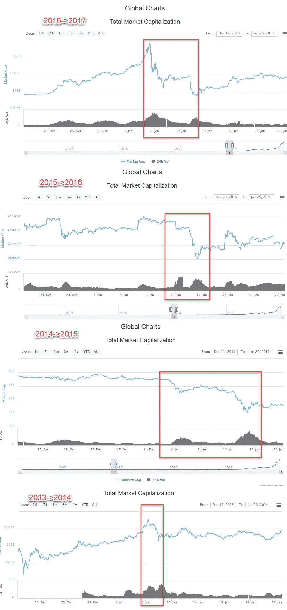
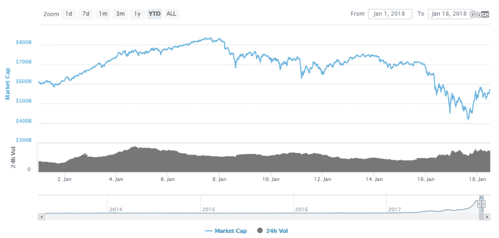
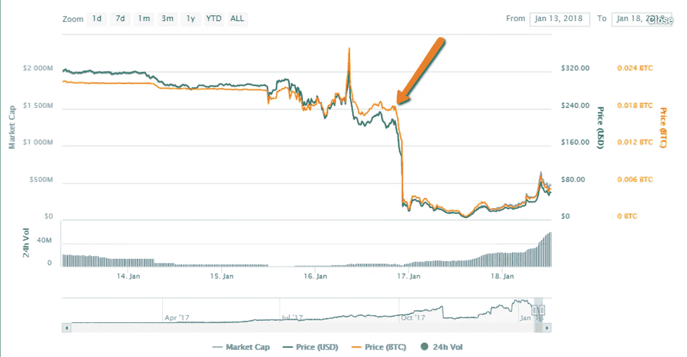
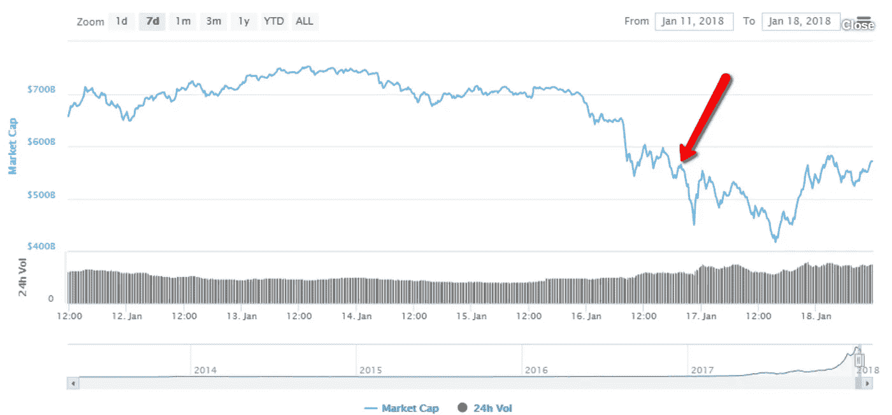

# 是什么导致了 1 月 16 日星期二的加密货币抛售？

> 原文：<https://medium.com/hackernoon/what-caused-the-cryptocurrency-sell-off-on-tuesday-january-16th-5667eb3ebacf>

> 这个答案最初发布在 Quora 上。[可以在这里查看答案](https://www.quora.com/What-exactly-caused-the-huge-sell-off/answer/Brian-Schuster-5)。更多来自[【1】](https://medium.com/u/3853f85f7d5e#bdABP)*新增用户 25 万。*
> 
> 这些用户中的许多人对加密货币完全陌生，没有经历过上涨或暴跌。所以它们对上升和下降的程度都有影响。因为这些投资者，我们从 3000 亿美元上升到 8000 多亿美元，所以由于同样的投资者，下降到接近 4000 亿美元是合理的。他们变得兴奋，然后害怕，重创了市场。我认为还有更具体的答案要探究，但我认为这解释了为什么今年如此戏剧性。
> 
> **一月份的下跌**
> 
> 对于为什么会出现下跌，最常见的解释是，自 2014 年以来，每年的 1 月中旬，总会出现 20%至 30%的突然下跌。你可以看看 Reddit 上关于这个话题的更多讨论[【2】](https://www.quora.com/What-exactly-caused-the-huge-sell-off/answer/Brian-Schuster-5#YrAVe)，这里是他们制作的图片:
> 
> 
> 
> 就个人而言，这看起来像是人们出于税收目的抛售投资，然后市场对负面走势“反应过度”。今年，我们有很多经验不足的投资者，他们只是在随波逐流，所以 2018 年 1 月看起来是这样的:
> 
> 
> 
> 有所下降，但与前几年并不矛盾。
> 
> **比特连接失败**
> 
> 无论如何，Bitconnect 都不是加密货币市场上最大的参与者(不到加密货币市场总量的 0 . 3%)，因此它对价值的下降没有太大贡献。然而，Bitconnect 最终退出美国业务的消息像阴影一样笼罩了一整天。许多社交媒体推广者基本上进入了文件粉碎模式，以消除他们推广庞氏骗局的所有证据。
> 
> 一个更成熟的投资者群体可能会对这个消息不屑一顾，但鉴于缺乏经验的交易者水平很高，我敢肯定，许多投资者看到了这里发生的事情，并认为这是市场整体的一个坏迹象。Bitconnect 退出的消息在 1 月 16 日 20:00 UTC 左右冲击了市场:
> 
> 
> 
> 这是大约同一时期的整体加密货币市场。
> 
> 
> 
> 我认为接下来几个小时 750 亿美元的低谷是由有关 BCC 的新闻直接引起的。再说一次，我不认为这是任何崩溃的主要原因(它已经在融化)，但它显然似乎加速了事情的发展。
> 
> 脚注
> 
> [【1】](https://www.quora.com/What-exactly-caused-the-huge-sell-off/answer/Brian-Schuster-5#cite-bdABP)[币安:1 小时 25 万用户订阅交易所！](https://steemit.com/bitcoin/@tighilt/binance-250-000-users-subscribe-to-the-exchange-in-1-hour)
> 
> [【2】](https://www.quora.com/What-exactly-caused-the-huge-sell-off/answer/Brian-Schuster-5#cite-YrAVe)[每年的一月都会出现低谷。过年要花钱，抓紧就好。r/ethtrader](https://www.reddit.com/r/ethtrader/comments/7qt5ux/the_january_dip_happens_every_year_lunar_new_year/)

> 最初发表于[www.quora.com](https://www.quora.com/What-exactly-caused-the-huge-sell-off/answer/Brian-Schuster-5)。
> 
> 更多来自 Quora[的趋势科技答案，请访问](https://medium.com/u/3853f85f7d5e?source=post_page-----5667eb3ebacf--------------------------------)[HackerNoon.com/quora](https://hackernoon.com/quora/home)。