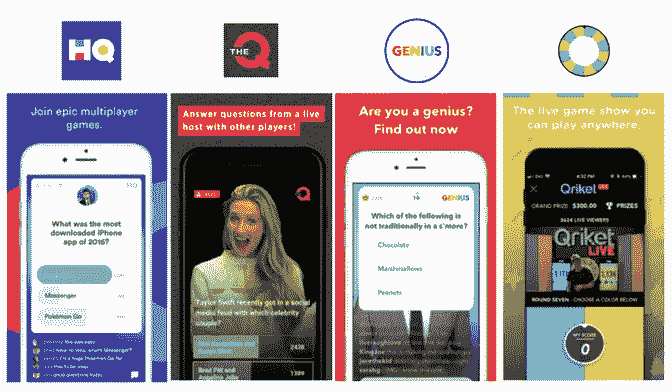

# 总部的未来会怎样？看看 2017 年最热门的应用

> 原文：<https://medium.com/hackernoon/what-could-the-future-hold-for-hq-a-look-at-2017s-most-buzzed-about-app-a04a94ff758e>

> 注:CRV 目前不是 HQ Trivia 母公司 Intermedia Labs 的投资者。以下是我们的个人观点，不一定代表 CRV 的观点。

作为 [HQ 琐事](https://twitter.com/venturetwins/status/923689575062544384)的早期玩家(还有三次冠军！)，看着 app 从 10 月初的~ 3k DAUs 增长到现在的 100 万+已经很激动了。HQ 似乎正在成为一个家喻户晓的名字——主持人斯科特·罗格夫斯基[在新年摇滚夜亮相](http://www.zimbio.com/photos/Scott+Rogowsky/Dick+Clark+New+Year+Rockin+Eve+Ryan+Seacrest/JT5xYtxxfPy)，吉米·基梅尔[客串主持](https://www.youtube.com/watch?v=rmHSiHLf2PU)一场比赛，推特上充斥着来自歇斯底里的赢家的[视频](https://twitter.com/averyarmour/status/948312152921710592)。

Our personal favorite video of an HQ Trivia win — it accurately captures the thrill of winning even a few dollars on the game.

我们已经有一段时间没有看到新的消费者应用程序像 HQ 一样腾飞了。我们知道年龄从 8 岁到 80 岁的普通 HQ 玩家，从独自呆在宿舍的大学生到为了游戏一天停止工作两次的公司。鉴于 HQ 每天只有两次直播，其庞大的经常性用户群尤其令人印象深刻——因此，使用人数更像是电视节目，而不是全天候可玩的消费者手机游戏。

We’ve been roasted by family members for texting while HQ is still live.

鉴于围绕该应用的讨论，我们决定深入研究商业模式，以更好地了解 HQ 的长期潜力。在这篇文章中，我们讨论了传统游戏节目的经济性、盈利选择、总部竞争对手以及潜在的商业风险。我们希望听到您对我们的分析或您在总部的体验的反馈——您可以找到我们[@ venture wins](https://twitter.com/venturetwins)。

**游戏节目可比**

我们看了一下美国最受欢迎的五个电视游戏节目——《价格是对的》、《家庭不和》、《危险边缘》、《幸运之轮》和《让我们做笔交易》——看看它们的成本和收入与总部相比如何。这些节目通过广告赚钱，主要支出是主持人工资、现金奖(产品或旅游奖往往是捐赠的)、制作费用。与标准的电视游戏节目相比，HQ 可能在主持人工资、制作预算、选手审查和差旅费上节省了资金。

在成本方面——在 11 月中旬，我们发现 HQ 为每名观众支付了大约 0.01-0.02 美元的奖金，每晚用户群约为 10 万，每日奖金为 1 千美元。这与我们对排名前五的电视游戏节目的计算是一致的，我们估计每个观众将获得 0.01-0.02 美元的奖金。值得注意的是，HQ 现在定期拥有 100 万以上的观众，每夜奖金为 2000 万美元(周日节目除外，其奖金为 10000 美元)。假设每周有 12 场演出，每场演出平均有 100 万观众，除了周日，每天都有 2000 万美元的奖金，则每场演出/观众的平均奖金为 0.003 美元。

这很有说服力，因为它比电视游戏节目的费用少 3 倍，也因为随着时间的推移，总部的奖金/观众/节目已经显著下降——他们扩大用户群的速度比扩大奖金的速度快得多。这也说明了 HQ 作为独立于奖金的令人上瘾的消费者体验的力量。

就这些游戏节目专营权的估值而言，我们估计，仅基于广告收入(不包括联合版权)，一个成功的专营权(10 季以上)可能价值 5 亿美元至 1B+美元。我们计算出一个网络电视游戏节目的 CPM 为 15 美元*，这将使一个有 500 万观众、每年播放 200 集的 30 分钟节目的年收入达到 2.1 亿美元。这种性质的长期专营权是罕见的——我们估计 75%的美国游戏节目持续两季或更少。因此，一部有着持续年度现金流的电视剧，其价值至少是收入的 2-5 倍，但可能会更高。

如果 HQ 能够将每场演出的观众人数扩大到 500 万，每场 15 美元，每周 12 场演出，他们每年可以从每场比赛前播放一个广告中获得约 5000 万美元的收入。这是假设广告商认为 HQ 上的广告更像网络电视(每分钟 15 美元)，而不是 YouTube(每分钟 5 美元)。按照 YouTube 的 CPM 费率，在这种情况下，HQ 的赛前广告年收入将降至约 1500 万美元。

* *根据上表中的指标，我们可以假设平均 30 分钟的网络电视游戏节目每集有 500 万观众，每年 200 集，每集播放 7 分钟的广告，每 30 秒的广告收费 7.5 万美元(平均)，或 15 美元的 CPM。我们根据《国际商业时报》2013 年关于网络电视广告费率的文章***计算出 75000 美元/广告费率，70000-80000 美元是收视率相近的节目的大致范围。**

***商业模式***

*据我们所知，HQ 尚未将其用户群货币化。以下是我们认为该公司未来可能赚钱的一些方式:*

*   *赛前广告。当总部在每场比赛前显示无广告的 2.5 分钟倒计时时，竞争对手[的 Q](https://twitter.com/theqtrivia) 推送提前五分钟通知用户，并在倒计时时偶尔播放广告。用户似乎可以通过在推送后等待几分钟登录来轻松避开广告。然而，我们这样做的尝试以失败告终，因为我们经常忘记登录并错过游戏——我们已经听天由命地等待倒计时，并将成为这些广告的忠实观众。*
*   ***赞助提问。**总部的问题涉及一系列话题，其中许多要么围绕公司或品牌，要么以它们作为答案选项。因此，总部提出赞助性问题是相当自然的，只要它们不是以明显的促销方式措辞(例如，“任天堂 Wii 是第一个推出哪项功能的视频游戏平台？”会起作用，而“任天堂 Wii 有什么惊人的新功能？”不会)。*

**

*These questions could have easily been sponsored, but didn’t raise objections or interrupt the flow of the game.*

*   ***游戏内购买。像 Trivia Crack 这样的消费者手机游戏已经能够相当有效地将应用内购买货币化。[截至 2015 年](http://www.businessinsider.com/how-did-trivia-crack-become-so-popular-2015-1)，购买额外的生命或奖金“power ups”构成了 Trivia Crack 收入的 50%，这证明了即使没有赢得真钱的机会，用户也愿意为游戏内的优势付费。总部用户目前只能通过向朋友推荐该应用程序来获得免费生命，但我们可以很容易地看到该公司对生命、免费通行证或提示收费。***
*   ***订户专用游戏或内容。**类似于 YouTubers 和播客如何在 Patreon 和 Stitcher 上提供独家内容，HQ 可以为付费用户举办特别的游戏或给予他们经常性的好处(每场游戏多一次生命，可以晚开始，等等)。).随着 HQ 的主持人(特别是斯科特·罗格夫斯基)不断获得声誉，用户可能也愿意为以他们为特色的内容或商品付费——罗格夫斯基最近主持了一场[客串活动](https://www.bookcameo.com/traptrebek)，用户为他的定制视频支付了每人 36 美元(他将收入捐给了国家多发性硬化症协会)。*

***竞争者***

*许多竞争对手已经开始运作，希望利用总部的成功。我们玩了所有的游戏，发现没有一个像原版一样吸引人——HQ 的产值、主机质量和在线社区都远远超过了其他游戏。然而，在这个领域有一些应用值得关注:*

*   ***Q**——最受欢迎的总部竞争者，[Q](https://twitter.com/theqtrivia?lang=en)每场比赛吸引 5000-10000 名观众，通常每天举办两场比赛。游戏的形式和 HQ 完全一样，有 12 个问题，每个问题回答 10 秒钟。然而，奖品往往较小——通常工作日为 200 美元，周末为 500 美元以上。在本月总部发布之前，Q 曾短暂受益于 Android 版本，但也一直在与困扰总部的服务器问题作斗争(见 Google Play [评论](https://play.google.com/store/apps/details?id=live.trivia.theq&hl=en))。*
*   *Genius——[Genius](https://twitter.com/thegeniusquiz?lang=en)是一个不太受欢迎的竞争对手——大多数游戏只有几百名观众和 100 美元的奖金——但它有一些有趣的功能。只有五个问题，游戏更快，也更宽容，因为你可以在时间到之前改变你的答案。同一个人主持每场比赛，他倾向于问更多的大脑问题，比如“1 和 51 之间有多少个质数”(试着在十秒内回答这个问题！).该应用程序正处于为期五天的休息期，我们很高兴看到他们正在进行的改进。我们喜欢 Genius 不仅仅是一个 HQ 克隆——团队正在测试不同的因素，如游戏时长和问题类型。*
*   ***qri ket**——[qri ket](http://home.qriket.com/)不是一个琐事游戏，而是一个游戏直播节目竞争者。每天有两个游戏，你可以通过 PayPal 购买或通过完成任务(例如，在社交媒体上关注游戏，观看赞助商的广告)获得的游戏内令牌付费。主持人转动一个带有蓝色和黄色面板的轮子，你猜它会落在哪个颜色上。如果你答对了，你将进入下一轮，并最终开始赢得 500 美元总奖金的一部分。我们对这款游戏不太感兴趣——它缺少技能型游戏的挑战，广告也很烦人。*

**

*HQ’s four main competitors are The Q, Genius, and Qriket — but thus far, engagement and usage of HQ has blown the other three away.*

*虽然 HQ 目前主导着市场，但值得注意的是，直播琐事节目空间并不一定要像传统电视游戏节目所展示的那样“赢家通吃”。参与者玩游戏没有实际成本(除了他们的 5-15 分钟时间)——只有可能赢钱的好处。我们可以想象一个场景，用户一天从不同的应用程序中收听几个游戏，游戏根据长度、主题或技能水平而变化。*

***风险***

*虽然 HQ 已经能够发展和维持令人印象深刻的用户群，但从长远来看，该公司作为独立平台取得成功的能力存在风险。以下是我们的一些担忧:*

*   ***由于游戏的时效性，用户群有限。**HQ 每天只有两次直播，这一事实营造了一种强烈的 FOMO 感，促使用户打开应用程序，即使如果游戏持续可用，他们可能不会玩游戏。然而，它也排除了在每日游戏时间有其他承诺的潜在用户。我们对一些用户愿意重新安排会议以参加总部会议印象深刻，但不确定这是否会成为一个限制因素，特别是当应用程序的新鲜感逐渐消失，用户不得不不断决定是否为总部牺牲其他活动。*

*Kerry’s tweet is one of dozens referencing missing or rescheduling meetings due to HQ.*

*   ***反向网络效应。**与大多数消费者社交平台不同，HQ 可以说具有反向网络效应，因为每个用户都因更大的总用户群而处于不利地位。例如，随着用户数量的增加，滞后和延迟的可能性更大。此外，随着用户群的扩大，该公司必须在增加奖金规模、允许更多获奖者(每个人的奖金减少)或提高问题难度之间做出决定，这可能会阻止一些用户参与。评论 feed 一度感觉更像一个社区，现在几乎无法跟踪，因为一分钟就有数百条评论发布。我们希望随着公司规模的扩大，HQ 团队能够解决这些问题，可能会对同一款游戏进行细分。*
*   ***消费者变化无常，如果他们从未赢过，可能会离开这个应用程序。**作为早期投资者，我们深知消费者的行为往往是不可预测的。随着消费者偏好的改变，更好的选择变得可用，或者人们只是失去兴趣，应用程序可以飙升至成功，然后暴跌回地球。作为 Vine 的联合创始人，科林·克罗尔(Colin Kroll)和鲁斯·尤苏波夫(Rus Yusupov)在打造粘性消费产品方面比大多数人更有经验，赢得免费资金是一个强大的价值支柱。然而，虽然早期的牵引力是引人注目的，但总部需要更多的时间来证明这不仅仅是一种趋势，我们担心因未能获胜而产生的持续沮丧可能会导致大量用户流失。*

**相关边注:心理学* [*实验*](http://www.indiana.edu/~p1013447/dictionary/sked.htm) *已经表明，间歇性条件反射(例如偶尔赢 HQ 或接近 HQ)实际上比持续强化(一直赢或接近 HQ)更容易产生工具性条件反应(打 HQ)。这表明，如果用户至少偶尔能尝到胜利的滋味，他们会继续回到这个应用程序。我们当然发现这是真的！**

*   ***建立持久的特许经营的难度。虽然像 Jeopardy、Wheel of Fortune 和 The Price is Right 这样的游戏节目展示了该领域持久专营权的价值，但我们的研究表明，一个新的游戏节目更有可能火起来，而不是火起来。在美国播出的 100 个游戏节目的随机样本中，我们发现平均每个节目持续三季。然而，这被一些持续了 10 多季的剧集严重扭曲了——75%的剧集持续了不到两季。这证明了制作一部经久不衰的游戏节目是多么具有挑战性，这绝对是评估 HQ 时要考虑的一个风险。***
*   ***“关键人物”与主持人的风险。《总部》的主要主持人斯科特·罗戈夫斯基已经成为名人，因为他在镜头前极具魅力的个性以及在应用程序出现故障时能从容应对的能力。罗戈夫斯基是今年万圣节服装的[热门选择](https://twitter.com/JamieNBmak/status/925370820465188865)，是 2018 年矮子奖的[提名](http://shortyawards.com/10th/scottrogowsky)，最近已经成为纽约杂志、 [W 杂志](https://www.wmagazine.com/story/scott-rogowsky-hq-trivia-host-interview)和[赫芬顿邮报](https://www.huffingtonpost.com/entry/hq-host-scott-rogowsky_us_5a3943f9e4b0860bf4ab6c1c)等杂志的简介和特写的主题——他甚至出现在[第六页](https://pagesix.com/2017/12/04/why-hq-trivia-host-scott-rogowsky-is-having-a-hard-time-dating/)中。罗戈夫斯基是第一批对新生代和千禧一代以外的人群有吸引力的数字原生明星之一——他足够出名，可以被视为名人，但也足够平易近人，粉丝们可以随意搭讪或要求自拍。在罗戈夫斯基休假期间，HQ 成功地尝试了客串主持人，但斯科特仍然是 HQ 品牌的重要组成部分，我们怀疑如果他离开公司，该应用程序将会出现一些流失。***

*Though some “HQties” make fun of Rogowsky for his occasionally off-topic riffs and enthusiastic dancing, he’s widely regarded as the best HQ host.*

*   ***作为媒体公司获取用户的困难。虽然《总部》是一款手机游戏，但最明显的收入来源(广告)使其更能与脸书、Twitter 或 Buzzfeed 等媒体公司相提并论。游戏公司可以通过应用内购买从其核心客户群中获得可观的经常性收入。这使得他们有一个高的 CAC，因为它将在使用的前几个月收回。媒体公司的每用户收入通常要低得多——即使 HQ 能够达到 15 美元的 CPM，并且一个用户玩了一整年的所有游戏，公司一年也只能从这个用户身上获得 9 美元的广告收入(假设每游戏一个广告)。HQ 将需要在用户获取方面变得聪明，当最初的炒作平息时，保持低 CAC，或者找到一种方法来激励大量的游戏内购买。***

**感谢萨尔·古尔对本文的反馈和贡献！**

*感谢阅读！我们希望听到你对这篇文章的反馈或对总部的想法。你可以在 Twitter 上找到我们，我们的电子邮件地址是 justine@crv.com 和 olivia@crv.com。您也可以在 HQ 上给我们额外的生命—我们的用户名是 justine 和 oliviam。*