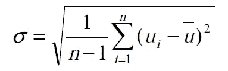
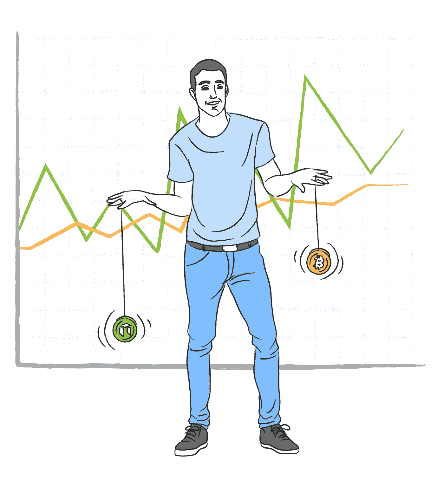
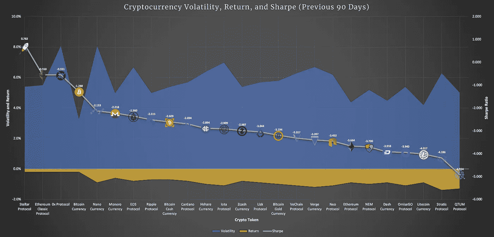

# 你需要拥有哪些加密资产？把它留给夏普比率

> 原文：<https://medium.com/hackernoon/what-cryptoassets-should-we-own-leave-it-to-the-sharpe-ratio-340b10d3a374>

# 理解 Crypto 剧烈起伏背后的数学原理

对于任何投资或交易过 [crypto](https://hackernoon.com/tagged/crypto) 的人来说，他们都很清楚加密资产的价值会有多不稳定。波动很大程度上是由于[加密货币](https://hackernoon.com/tagged/cryptocurrency)是如此年轻的资产类别，但还有其他因素，我将在本文中讨论。随着 crypto 慢慢向大规模采用的方向爬行，市场慢慢获得更厚的订单，每枚硬币都有其剧烈运动的份额。但是**并不是所有的硬币都是生来平等的**，这种观点在早年它们的交易方式和价值波动的差异中得到了很好的证明。

与一些流动性较低的市场上的新代币相比，像比特币和以太坊这样的大型硬币在价格上相对稳定。但在加密中，没有真正的代币可以保护你免受重大损失，除了必须提到的与美元挂钩的稳定货币，如美国泰瑟斯(USDT)或真实美元(TUSD)。市场之所以如此，有几个原因:

*   **用一个顺序移动值的能力也是为什么我以前写过的[操作](https://hackernoon.com/the-mysterious-manipulation-of-crypto-markets-and-how-to-manage-5234e19e6e77)在 crypto 中如此普遍的一个重要因素。**
*   ***缺乏内在价值****——作为一个新领域的投资者，他们几乎没有基本面资源来决定一枚特定硬币的价值，因此真的没有一致的方式**对一项加密资产进行内在估值**。是的，我们可以研究代币如何以比同行更先进的方式利用区块链技术的创新。但是在大多数情况下，我们仅仅依赖于未来的用例以及对最终现实世界采用的看法。*
*   ****缺乏监管****——*加密货币没有任何中央监管机构来确保负责任的交易和合理的市场波动。价值本质上是由市场和情绪创造的，没有联邦存款保险公司的支持来确保密码在合理的模式或范围内交易。*

*除了以上原因，我们还看到其他通常不适用于传统股票的因素，比如缺乏[机构投资者](https://www.investopedia.com/terms/i/institutionalinvestor.asp)。流动性差的市场通常需要机构投资者来稳定资产和大宗商品的价格。它们提供了大量的交易量，这是创造稳定的高交易量市场所必需的。根据区块链杂志的 [Guillaume Belisle](https://the-blockchain-journal.com/author/votreconseillerblog/) ，*

> *“许多高净值对冲基金或风险投资公司投资于加密货币市场，并密切关注市场上发生的事情。然而，大多数大型机构投资都不是在加密货币市场进行的。许多金融机构认为区块链技术具有长期发展潜力，但并未向市场投入大笔资金。”*

**

*The formula for historical volatility, using a specific timeframe (n) and the mean price (u).*

*一枚特定硬币的[波动性](https://www.investopedia.com/terms/v/variance.asp)(在特定时间框架内，其高点和低点之间的差值)实际上相对容易测量。就像我们可以用一只股票的 [beta](https://finance.zacks.com/define-stock-beta-9520.html) 来衡量它相对于整个股票市场的特定波动水平一样，我们可以在我们选择的任何时间范围内，以百分比为基础来衡量任何硬币的波动性。通过找出任何硬币在此期间的最高价和最低价，然后将其与平均值(平均价格)进行比较，您可以测量每个极值与平均值的差异。不，还没完成。然后，对这些数字求平方(我保证这比你想象的要简单)，然后除以数据集中的总值。对一些人来说，这可能看起来介于*“计算起来有点令人畏惧”*到*“地狱里没有路……”*但是不要害怕！像 [**Level**](http://lvl.co/?r=CxEGyn1x) 这样的网站上有免费的资源，实际上利用了日收益率的标准差和波动率百分比。*

**

*No, this isn’t a crypto trader. If it was, his mouth would be even wider. Many who have been in the space have felt a similar anguish. The massive swings that occur in crypto can undoubtedly be too much for many to bear. Photo courtesy of: [https://www.businessinsider.com/cme-to-close-open-outcry-futures-trading-2015-2?r=UK&IR=T](https://www.businessinsider.com/cme-to-close-open-outcry-futures-trading-2015-2?r=UK&IR=T)*

*现在，许多人可能会错误地将一枚硬币的整体实力与投资联系起来，仅仅是看它的价值波动有多小。如果这是传统投资的情况，那么像债券这样流动性最小的资产将是每个专家的投资工具的选择。许多人在发现价格可能在给定的一天内波动 10%、20%甚至 30%以上后，完全放弃了对加密货币的投资。尽管在[历史上的某些日子](https://www.aier.org/article/bitcoins-largest-price-changes-coincide-major-news-events-about-cryptocurrency)里，crypto 市值最高的硬币比特币出现了显著的波动，但假设像这样的跳跃和下跌*每天都会发生*是错误的**并且被大大夸大了**。*

*不管怎样，确实发生的波动并不适合心脏虚弱的人。保守的、有经验的交易者从他们以前可靠的股票、债券和股票中寻求每年 4-8%的收益，他们会问为什么有人会让自己经历这些。加密货币要求其交易者容忍的剧烈波动对那些希望年复一年从投资中安全获得小额保证利润的交易者来说似乎完全没有意义。但是，对于那些能够忍受 cryptoasset 过山车的波动的人来说，奖励是有的，其中一些奖励在历史上相当可观。尤其是从长远来看。*

# *通过打破夏普比率拥抱风险和回报*

*我们必须记住，硬币价值上涨的速度和下跌的速度一样快。担心一个月内硬币投资损失 20%的投资者忘记了，在同一时间段内，可能会有 40%的收益，这种情况仅在 2017 年就发生过多次。由于加密货币仍处于起步阶段，订单薄，投资组合持续起伏。如果我们真的希望控制我们的潜在回报和损失，以符合我们的风险承受能力，我们需要像**夏普比率**这样的指标来帮助我们走上正确的道路。*

*把价格想象成悠悠球，当一个特定的市场试图决定资产的价值时，价格会上下波动。这些硬币中的一些具有比其他硬币明显更长或更短的溜溜球绳，并且更稳定的硬币由于它们的绳更短(更低的挥发性)而根本不能向上或向下够得那么远。各种代币的这些串长度取决于硬币的市值，以及它们的订单簿的大小。这种简单的比较展示了一枚硬币在给定时间内价格上涨或下跌的历史和预测范围。*

**

*If only trading were as simple as dual-wielding children’s toys…*

*此外，请记住，几乎每枚硬币的走势都与比特币的价值密切相关...只是在一个更不稳定的方向上。这在很大程度上是因为大多数交易所提供的[交易对](https://cryptocurrencyfacts.com/what-are-trading-pairs-in-cryptocurrency/)大多与比特币相关。在某个时候，这种情况可能会改变。但目前，作为投资者，这只是我们在做研究时需要接受的东西。Andrew Munro 讨论了多样化、相关性和数学比率，就像 Sharpe 在他的[文章](https://www.finder.com.au/the-mathematical-case-for-cryptocurrency-investment)中雄辩地论述的那样:*

> *“一般来说，与多样化相关的风险降低取决于投资组合中不同资产类型的数量，以及它们之间的密切相关程度。”*

*我已经写了关于[多样化是一件秘密的事情](https://hackernoon.com/the-art-of-the-index-handling-cryptocurrency-bubbles-and-minimizing-volatility-371faddfa2dd)，并且是一件在像 [Level](http://lvl.co/?r=CxEGyn1x) 这样的网站上很好利用的事情。然而，当大多数硬币在同一个方向上相对移动时，一个人能够真正多样化的程度是有限的。加密的多样化在很大程度上与拥有一个大盘股、中盘股和小盘股的良好组合相关，然后根据你的风险承受能力，当然，还有你对未来采用它们的信念来分散它们。*

*由于比特币在加密领域拥有最大的市值，目前为 1093 亿美元，其波动百分比一直是最低的，并将一直是你可以交易的任何代币中最低的。这是一件好事，特别是对那些风险厌恶的交易者来说。然而，尽管波动性比比特币高，但大量硬币的短期和长期收益都远远超过了比特币。不要忘记，波动性衡量的是两个方向的运动。*

*这就是为什么我们，作为投资者，在理想情况下，会将总体回报纳入我们愿意承担的风险。夏普比率是由威廉夏普于 1966 年提出的，是几乎每个金融部门都经常引用的指标。它结合了我们愿意为隧道尽头的期望之光接受的风险量(也就是利润)。考虑到这一点，让我们来看看 [Samsa](http://lvl.co/?r=CxEGyn1x) 目前在其交易平台上提供的 25 种硬币:*

**

*请记住，在本次分析时(2018 年 8 月中旬)，加密货币已经处于长达 8 个月的熊市，但实际上已经进入了 14 个月以来的[最低波动时代。上面的图表是我使用](http://samsa.ai?utm_medium=partner&utm_source=medium&utm_campaign=sharpening+your+crypto+investing+the+sharpe+ratio&utm_content=hackernoon) [Samsa 的](http://lvl.co/?r=CxEGyn1x)在其网站上提供的指标创建的，使用了每种硬币在过去 90 天的市场表现的每日数据。在过去的 90 天里，名单上的所有硬币每天都会损失 0.2%到 1.3%的价值。是的，对我们投资者来说一点都不好玩。我们可以看到图表底部的黄色区域代表每日回报率指标。*

*与此同时，这些代币的波动性(最高和最低之间的百分比范围)在比特币的 3.2%和纳米的 8.2%之间波动。这意味着在过去的三个月里，Nano 的波动性是比特币的两倍半。由我图表中的蓝色区域表示，我们可以看到这种差异相当显著。*

*因此，鉴于加密货币在过去三个月(以及 2018 年的大部分时间)的价值流失天数多于未流失天数，可以肯定比特币自 5 月中旬以来表现最佳，对吗？令人惊讶的是没有。假设波动性最小的硬币将在负回报时间框架内保持最佳状态是正确的，但也有例外，在动荡时期，它们仍可能蓬勃发展或与避险硬币保持同步。从图表中我们可以看到，Stellar (XLM)、Ethereum Classic (ETC)和 0x (ZRX)就是这种情况。*

*尽管波动性很大，但我们可以从夏普比率的灰线(硬币从最好到最差排序)中看到，这三种硬币具有更高的比率，因为尽管波动性更大，但它们的每日回报更好。总的来说，看这些指标和图表真的可以帮助交易者理解每个硬币都有自己的风险量化指标。根据这种风险，确保潜在回报是值得的是至关重要的。所以，不要把你的投资建立在哪个骗子喊得最响，哪个硬币上的标志最鲜艳的基础上，试着看看夏普比率，以此来衡量一个硬币是否值得你的时间和风险承受策略。*

**

*如果某个硬币的波动性真的让你太担心，并且与你晚上睡觉的能力相冲突，那就从数学的角度考虑一下。如果一枚硬币目前的波动幅度是一只贝塔系数已经很高的热门股票的五倍左右，比如亚马逊(Amazon)，你可以只投资五分之一的加密资金，以抵消更大的风险。尽管 crypto 拥有改变世界相互交易方式的巨大潜力和能力，但缺乏对其投资风险的了解是最大的进入壁垒之一。只有投资你觉得舒服的东西，并专注于年化回报，而不是每周和每月的回报，才是保持头脑清醒并做出高质量决策的好方法，因为所有的选择都唾手可得。*

****我在*** [***水平***](http://lvl.co/?r=CxEGyn1x) ***写深入的加密货币分析，对于加密这种被动的投资工具。参见我们在***[***Lvl.co***](http://lvl.co/?r=CxEGyn1x)***所做的分析以及参见我们在*** [***所做的其他分析我们的杂志***](https://medium.com/samsa-ai?utm_medium=partner&utm_source=hackernoon&utm_campaign=samsa_publication) ***。如果你喜欢你所看到的，给这篇文章 50 个掌声！如果你讨厌它，就用 49 表示你的不满。****

**本文及相关内容仅供参考。这不应被视为投资建议，你应该咨询财务顾问，并在进行任何投资之前进行自己的研究和尽职调查。在引用证券或商品时，仅用于说明目的，并不意味着对证券或商品分类的任何立场。就提供或讨论的* [*级*](http://lvl.co/?r=CxEGyn1x) *服务而言，这些服务仅可用于* [*级*](http://lvl.co/?r=CxEGyn1x) *白名单资产。**