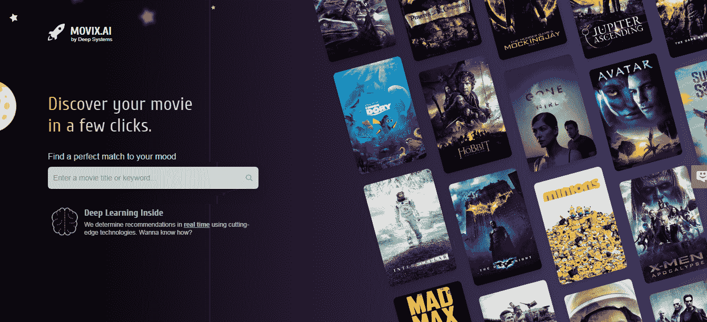
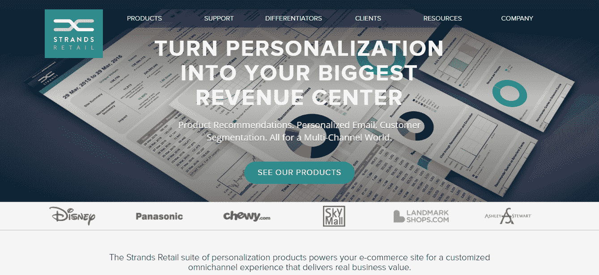
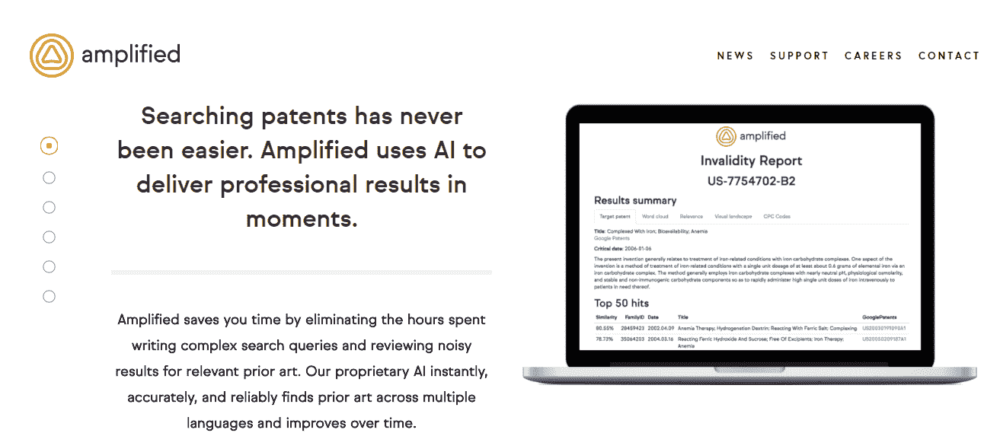

# 深度学习能给企业带来什么

> 原文：<https://medium.com/hackernoon/what-deep-learning-can-offer-to-business-d0631a294172>

What machine and deep learning can offer to business

首先，我们在这里再次强调，首先，机器学习是一个提高收入的伟大工具，如果发生这种情况，使用[机器学习开发](https://perceptionbox.io/ai-machine-learning-development)的一个很好的副作用就是降低成本。更重要的是，当谈到让机器学习在商业领域发挥作用的原则时，这一概念是必不可少的，因为任何公司的主要目标都是销售并正确地提供信息、产品或服务。

但是你可能想知道贸易繁荣的步骤是什么。在这里，你需要问自己三个重要的问题，并决定卖什么，谁是你的目标受众，以及如何吸引他们的眼睛和耳朵到你的品牌。除此之外，你还需要选择合适的时机卖出。简而言之，在回答这些问题时，机器学习可以帮助权衡所有选项。

尽管如此，当你想一次拥有一切并迅速得到答案时，它可能会在我们的口袋里烧一个洞，并影响利润率。因此，今天在处理深度学习技术时，你不能没有人情味。

还有一点值得一提的是，机器学习通常热衷于提高商业效率，然而有时它不仅有助于产生更多的收入，而且[人工智能还可以帮助你降低商业成本](https://perceptionbox.io/blog/how-ai-can-cut-your-business-costs/)。

# 把…作为目标

协调目标设定过程并利用每一个什么？给谁？什么时候？问题，你会发现有很多不同的工具。首先，推荐系统、销售套件和营销工具浮现在脑海中。

利用神经深度学习网络的力量，这些智能工具可以很容易地猜测用户想要什么(如果有的话)，并根据他的个人资料定制建议。

例如，如果你感到无聊，无法决定如何度过夜晚，外面正在下雨，你完全没有心情出门，movix.ai 可以帮你摆脱困境。该引擎类似于一个智能影院，帮助用户实时选择。

在线服务背后的想法是，用户访问网站，点击几个他喜欢的标题(也许他现在就下定决心，通常不会选择阿凡达)，然后由深度学习驱动的系统提供他可能喜欢的公司。瞧啊。该去拿爆米花了！

另一个很好的例子是疯狂购物。通常，这种类型的开发关注用户在电子商务网站上做什么，从用户体验中学习，并基于历史数据建立机器学习亲和力，以帮助用户在无数选项中进行选择。例如，Strands 有助于个性化每个访问者的购物体验。

通过学习在线人群的行为，该引擎收集个人见解，并在帮助零售商提高销售额后汇总数据。

此外，当你谈到 CRM 和预测性线索评分时，深度学习会很方便。消除猜测可以节省大量工作，并有助于快速找到销售线索。例如，Mintigo 定义了从网络上挖掘数据的营销指标，并将这些指标与客户的 CRM 进行合并，从而对每个潜在客户提供 360 度的概况。

该公司利用机器学习，密切关注数千家在线公司的数字足迹，提炼数据，以挖掘有意义的见解，帮助销售决策。

# 计算机视觉

当你绞尽脑汁考虑到底卖什么以及如何卖给你的目标受众时，计算机视觉就出现了。计算机图像处理背后的科学是一个复杂的课题，但经验丰富的深度学习实践者会同意这是一场革命。首先，计算机视觉消除了人类在多任务处理时分散注意力的典型错误，因此可能会分散注意力。通过非常精确地一次做几件事，引入机器学习的公司可以显著加快开发速度，降低生产成本，而不会牺牲产品质量。

想想 TensorFlow，它向那些愿意深入研究机器学习模型的人免费提供其库。这个开源库具有不同的抽象层次，是数值计算专家的天赐之物。

你一定听说过另一个故事，日本农民将他们的农业业务部分自动化，并将一些任务外包给机器学习，例如…分拣黄瓜。当地农民的一个精通技术的儿子想出了用 TensorFlow 对蔬菜进行分类的主意。三个月来，这位工程师一直在拍摄照片并对黄瓜进行分级，以教会模型排序摆脱人工排序，随着时间的推移，准确率达到 95%。

# 优化和调整

这就是现实世界中卖什么的解决问题的例子。你可以生产成千上万的产品，并以各种方式提供服务。现在考虑深度学习增加价值的潜力，并帮助你选择最有效的方法来做到这一点。为了酿造更好的啤酒，这家总部位于弗吉尼亚州的啤酒厂决定优化其运营，并加入了与机器学习公司的合作。酿酒专家将美国啤酒节 IPAs 上的数据提供给技术供应商，以便这些数据能够与十大畅销国家保持一致。结果是[的动态配方](https://www.foodandwine.com/news/champion-brewing-ipa-machine-learning)，在收集和处理啤酒爱好者的反馈后，每一批新配方都会发生变化。

# 消灭官僚主义

对繁文缛节说“不”,是不是很神奇？机器学习可以走得更远，帮助处理更少的文件，并能够将注意力从花费太多时间处理的日常任务上转移开来。

通过提供自动化的专利搜索，该公司节省了大量的文档筛选和审查时间。在对历史无效案例进行实验后，Amplified 创建了一个快速易用的系统，该系统由机器学习提供支持，可以优化搜索，从数百份文件中挑选出三到五个最相关的结果。随着这种智能的发展，对专业人类搜索者及其意见的需要在几秒钟内变得模糊。

# 这里的底线是什么？

没有人喜欢将宝贵的资金花在可以轻松转移到深度学习和智能算法的事情上，这些算法处理大数据的时间更少，一眨眼就能提出有意义的见解。