# 关于编码/加密/散列/加盐/拉伸，开发者需要知道什么

> 原文：<https://medium.com/hackernoon/what-devs-need-to-know-about-encoding-encryption-hashing-salting-stretching-76a3da32e0fd>

在软件开发的世界里，我看到很多人把加密术语和用法搞错了*。我从自己开办的课程中收到的许多反馈之一是，他们从来都不清楚它们之间的区别，以及在使用它们时什么是最佳做法。*

*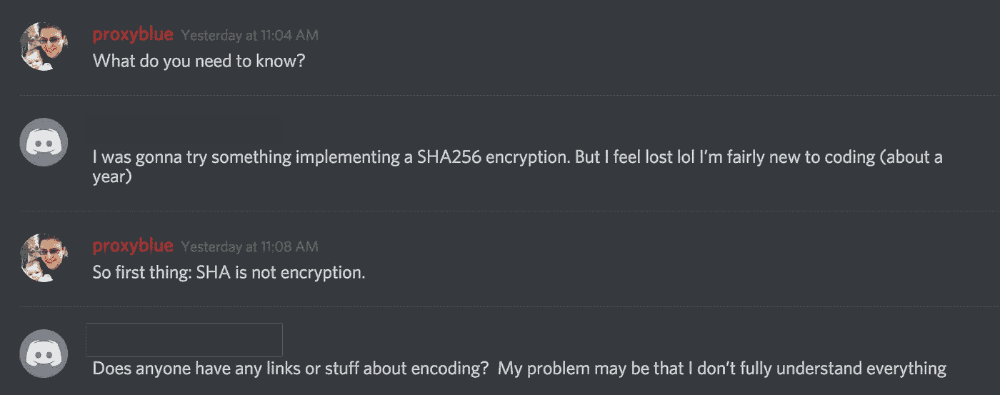*

*A typical exchange about encryption with someone willing to learn*

*我对这些人没有任何评价，除了，很有可能他们在生产中写了一些非常不安全的东西，并且没有意识到这一点。*

*And then hacked by some skid with a script*

*我知道，我已经审计了许多外部系统和我们自己的一些系统，发现数据存储和传输中的不安全性，因为开发人员不了解如何使用某些安全算法。*

*让我们探讨一些概念(用最佳和不良实践的例子)。这些示例引用了加密文件，但是许多相同的原理也用于“存储密码”和帮助认证服务。*

# *编码*

*许多人倾向于混淆术语加密和编码，或者互换使用。这是可以理解的，因为*加密是编码*的一种形式。*

*`Encoding is the process of applying a specific code, such as letters, symbols and numbers, to data for conversation into an equivalent cipher.`*

*这听起来像 encryption^^.*

*编码和加密最大的区别就是*加密需要一个密钥来加密/解密*。*

*因为我们使用“编码”一词来表示其他类型的数据格式，如 base64、unicode、UTF-8 以及其他不需要密钥来编码/解码的格式，所以我们几乎从不将加密称为编码。*

*Encryption ‘is’ a form of encoding, but we never really call it that.*

# *加密*

*正如我们刚刚提到的，加密是将数据转换为特定格式的过程，它需要一个密钥来锁定/解锁加密信息。只有有钥匙的人才能查看未加密的数据。其他人只能阅读密码文本。*

*现在，不需要说了(但会说的)——你应该只使用已经过全面测试的加密算法和库。如果你试图创建自己的密码，你没有数学博士学位，没有几十年的密码学经验，也没有让其他密码分析师对你的研究进行同行评议，我向你保证——你的算法既不聪明也不安全。*

*有两种类型的加密。`Symmetric Key Encryption`和`Asymmetric Key Encryption.`为了这篇博文的目的，我只打算更详细地讨论对称密钥加密。*

## *非对称密钥加密*

*非对称密钥加密是指用于加密数据的密钥不同于用于解密数据的密钥。这也称为公钥加密。*

*我不打算在这里做太多的详细介绍，因为大多数开发人员在他们生命中的某个时刻都在使用对称密钥加密或密码散列，而不是实现一个需要非对称密钥加密的系统。TLS (https)和 PGP 是使用非对称密钥算法的著名例子。*

*如果你想更深入地了解拥有两个不同的密钥和共享密钥背后的数学魔力是如何工作的，我建议你查找 Diffie-Hellman 密钥交换和 RSA 算法。*

## *对称密钥加密*

*对称密钥加密是一种加密算法，其中用于加密数据的密钥与用于解密数据的密钥相同。*

*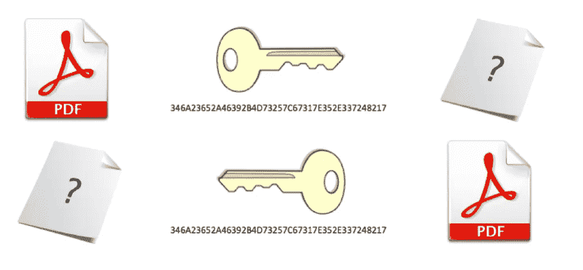*

*The keys are the same. Symmetric Key Encryption.*

*这很容易理解。开发人员往往非常善于找到一个好的库来为他们选择的语言使用加密算法。Github 和谷歌有很多这样的东西。*

*我看到开发人员遇到的问题是**生成和存储密钥。***

*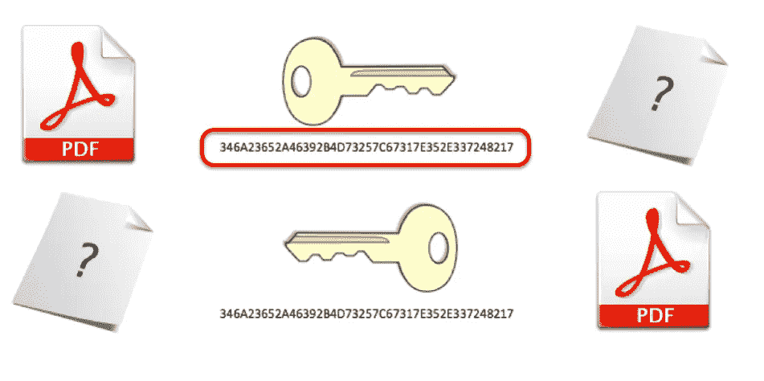*

*Key generation is always a problem for unfamiliar developers*

## *错误的开发移动#1:静态键*

*这是很常见的。开发人员知道密钥应该是“强”的，因此他们在应用程序代码中创建一个强密钥，并在任何地方使用它进行加密。*

*问题是，一旦它被发现(无论是在源代码中，还是通过密码分析技术)，一切都很容易被解密，因为你在任何地方都使用相同的密钥。*

*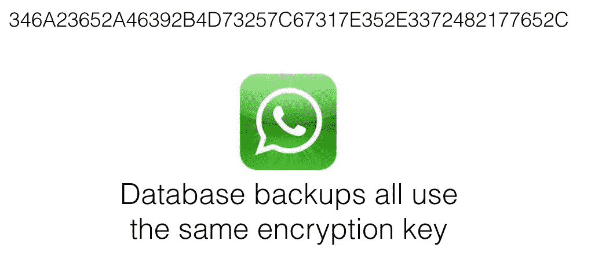*

*This key I keep using in my images is the ACTUAL key WhatsApp used to use to encrypt every backup on every phone.*

*一个密钥需要是唯一的，并且只有被允许访问该信息的人才能够访问它。*

*WhatsApp 示例:*

* [## 如何解密 WhatsApp 数据库消息-堆栈指针

### WhatsApp 会在每天凌晨 4 点(当地时间)将信息备份到 SD 卡上。在 Android 上，这个备份是一个…

堆栈指针. io](https://stackpointer.io/security/decrypt-whatsapp-database-messages/261/) 

## 糟糕的开发举措#2:简单的键

只有被授权查看信息的用户才知道密钥。完美。密码时间到了。

Does this seem like a good idea?

当我看到这个的时候，很明显开发者已经明白了密钥不应该是静态的，只有授权的用户才能查看相关信息。

但是，根据我们的经验，我们不能相信用户会用安全的密码来加密信息。

Or ‘love’, ’secret’, ‘sex’, ’God’ — the usual most common passwords

因为这个键是可猜测的，所以它有所谓的“低熵”。

# 熵

熵衡量数据在密码学中的随机程度。用户的密码往往具有较低的熵，因为它很容易被猜到或被强行破解。

The internet has a… medium level of entropy

我们如何解决这个问题？我们如何获得完全随机的数据，但也是只有用户知道的数据？这就是“哈希”的用武之地。

# 散列法

哈希是将数据转换为代表原始数据的固定长度值。

这到底是什么意思？假设我们有这样一句话:

“敏捷的棕色狐狸跳过了懒惰的狗”。

如果我们将该段数据放入特定的哈希算法(如 MD5 ),我们将获得该句子的 128 位(通常显示为 32 个十六进制数字)表示。

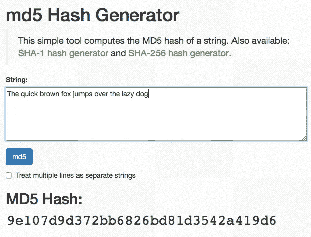

如果我稍微改变一下数据，我们会得到一个完全不同的散列。

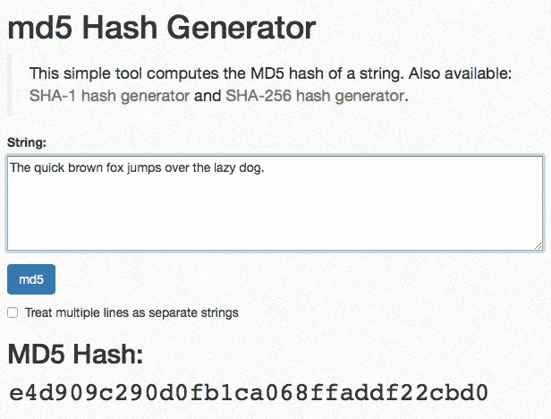

Spot the difference. Or rather, ‘dot’ the difference 😅

这可能是单个字符(a)或 20TB 文件，MD5 将始终生成“该数据的 32 个十六进制表示”。它实际上也适用于零长度的消息。

当你下载一个文件时，你会看到它使用了一个“校验和”。如果该文件的任何部分发生了微小的变化，哈希/校验和将完全不同。

哈希被认为是“单向函数”。我向你保证，在我的有生之年，我将无法从一个 32 个字符的散列中获取 20TB 的数据。因此，通过反向散列来恢复原始数据是“不可能的”。

Yes yes, Hermione, I know there’s a way to reverse the hash. I’m getting there…

为什么这很重要？

因为现在不是使用“password1”保护数据，而是使用更长的哈希，比如(7 c6a 180 b 36896 a0a8c 02787 EEA FB 0e 4c)。

这是“更好”。但这还不够好。

## **为什么哈希不够好？**

因为，令人惊讶的是，熵并没有改变。

它刚刚“换了套衣服”。

Uh oh, the Harry Potter gifs have started…

从技术上讲，这个密钥仍然是“密码 1”，即使它看起来安全得多。

哈希是一种优秀的技术，但就其本身而言，是一种非常糟糕的安全形式。

下面是一个流行的密码列表，以及它们的等价散列。现在，任何稍有数据库知识的人都会知道我要说什么。

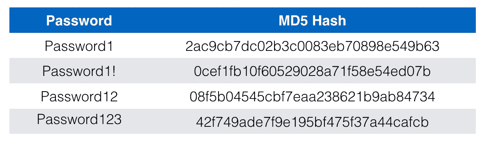

MD5, SHA-1, SHA-256\. Doesn’t matter. They’re all insecure if used improperly.

存在具有大量密码/散列查找的表。很多免费。许多人付了钱。cmd5.org 的[可以访问 24，000，000，000，000 MD5 密码查找。有可能大多数密码都在里面。](http://cmd5.org)

如果给我一个哈希，需要多长时间来查找密码是什么？这是一个 O(1)查找。*是瞬间。*这种攻击被称为“彩虹表攻击”，即查找拥有所有密码的数据库，或者“彩虹的所有颜色”。

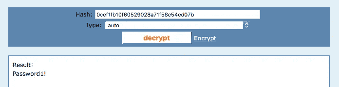

I didn’t even need to pick the hash algorithm. It’s still an O(1) lookup.

如果我能得到散列值，我就能把它还原成密码。如果我知道你用的是什么哈希，我仍然可以用密码的哈希版本进行暴力破解。

Remember kids, only hashing is bad.

**举例**:[https://www . computer world . com/article/2504078/cyber crime-hacking/hackers-crack-60-余-of-breached-linkedin-passwords.html](https://www.computerworld.com/article/2504078/cybercrime-hacking/hackers-crack-more-than-60--of-breached-linkedin-passwords.html)

有时我看到一个开发人员试图通过使用多个散列函数 md5(sha1(sha256(password)))来解决这个问题。这并不明智，而且存在许多嵌套散列组合的数据库。

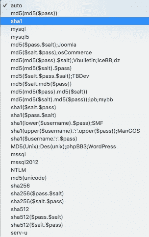

Basic example

那么我们如何解决这个问题呢？哈希时，总是使用盐。

# 盐碱滩

我觉得这篇博文的术语和反术语已经达到了荒谬的程度，但我向你保证——最好的散列方法是使用盐。

## 什么是盐。

盐是一个随机的字符串。超级随机的东西。

可能是 256 位或更高，由您决定。

这个随机字符串或 salt 被添加到密码中(以使密码更安全)，然后被散列。

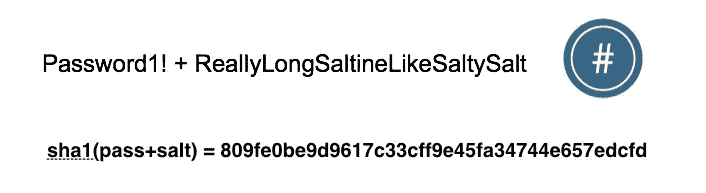

Couldn’t find any gifs on the internet about being salty. Weird. Guess information will have to do.

这可以防止彩虹表攻击。如果我得到这个散列，并试图把它放入一个彩虹表中，我非常怀疑是否存在具有这个密码+ salt 组合的数据库:`Password1!+ae4f27435df0896820a8325ed9562854bf0413e9a847e48c8f3e22b5ef06568f`

这种盐可以明文存储在某个地方。对于我们的“加密文件”，它可以和它一起存储在某个地方。对于其他情况，比如在数据库中存储已经用 salt 散列的敏感数据，salt 可以以明文存储。

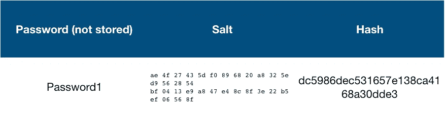

A salt can be stored in a database in cleartext. Make sure you use a different salt each time

当用户键入他们的密码并试图解密文件(或验证进入服务器，无论您正在做什么)时，盐被附加到密码的开头或结尾，然后被散列。

如果这个散列与我们存储的散列相匹配，那么他们输入的密码**一定与创建时的条目相匹配**——这意味着他们知道密钥/密码。

`MD5(Password1+ae4f27435df0896820a8325ed9562854bf0413e9a847e48c8f3e22b5ef06568f)` **永远等于** `dc5986dec531657e138ca4168a30dde3.`

Same process — same result. You’re authenticated.

最轻微的偏差都会导致不同的哈希，并且用户不会被验证。

Not even close…

## 一个开发者的问题:为什么一个盐可以在明文中？如果攻击者获得了整个数据库的访问权限，他们就可以看到 salt？何必呢？

问得好。如果我们不使用 salt，那么我们将有一个“仅哈希”数据库，这意味着我可以根据预先计算的彩虹表非常快速地反转每个密码。

这也意味着每个拥有密码 1！作为他们的密码，都将共享同一个`0cef1fb10f60529028a71f58e54ed07b`散列。纯散列并不比仅仅存储密码更安全，只是换了一件衣服而已。

如果攻击者获得了对 salt 的访问权，他们必须为每个用户生成一个完整的 rainbow 表。这非常耗时。减慢攻击者的速度是我们的目标。

这是一个网站，跟踪所有泄漏的数据库和成功逆转密码的百分比。任何仅哈希的数据库通常有超过 95%的密码被逆转:

 [## Hashes.org-所有哈希表

### Hashes.org 是一个从提交的哈希值中恢复密码的社区。

hashes.org](https://hashes.org/hashlists.php) 

## 糟糕的开发举措#3:静态 Salt

我时常看到这种情况。盐嵌入在源代码中，这意味着每次生成密钥时，使用的盐总是相同的。这意味着攻击者可能需要生成自己的彩虹表，但他们只需要创建一个基于您的“静态盐”的表。

“静态盐”被亲切地称为“胡椒”，它们是否是好的做法(当与盐一起正确使用时)是有争议的。我倾向于警告人们不要使用它们。

但是静态盐本身绝对是不好的实践。

## **糟糕的发展举措#4:不安全的盐**

你的盐需要加密随机。

我听到了。WTF 博客作者先生——怎么会有人弄错随机性。

有可能。

之前，我们在讨论熵。你认为下面哪个是最随机的？

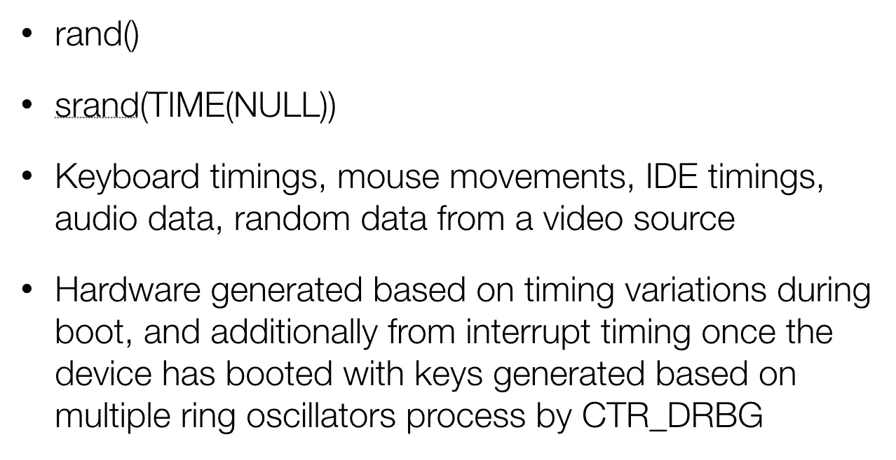

I’ll give you a clue. It’s not rand(). Or a time-seeded rand()

## 你必须用盐调味

CSPRNG(读作 see-spring) —加密安全的伪随机数生成器。

几乎每个平台/语言都可以访问 CSPRNG 算法。这些往往是，但不总是，链接到一个硬件生成的随机数发生器。重要的是，从密码学的角度来看，它是安全的。

如果你认为拥有一个高熵随机数发生器不重要，我向你展示一个:

 [## 比特币盗窃案中的安卓随机数漏洞

### 比特币经常出现在新闻中，尤其是因为它有些争议。这是一种数字货币，由…

nakedsecurity.sophos.com](https://nakedsecurity.sophos.com/2013/08/12/android-random-number-flaw-implicated-in-bitcoin-thefts/) 

## 关键一代——迄今为止的故事

我们知道密钥应该是唯一的(密码)

我们知道密码是不够的，我们应该在密码中添加随机数据(salt)

我们知道盐需要具有高熵(CSPRNG)。

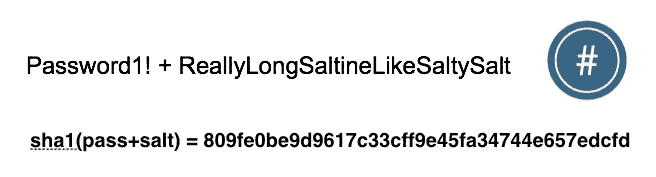

This is a pretty secure key… but…

这样够了吗？

# 拉伸

我们如此接近。我们的安全密钥生成故事还有一个部分，那就是“延伸”，或“密钥延伸”。

什么是拉伸？基本上完全相同的哈希(pass+salt)过程，但是过程重复了很多。我说的很多，是指 1000 次，10000 次，甚至 100000 次。

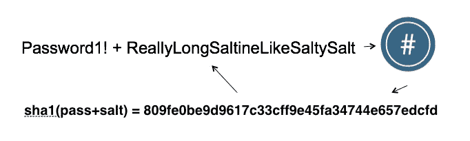

Round and round and round and round

我们为什么要这样做？因为计算起来很慢。慢意味着攻击者生成给定盐的彩虹表要慢得多。

最佳实践通常是在 1 秒内完成尽可能多的回合，但这完全取决于你使用的资源——这并不总是可能的。

Slowing down an attacker is the goal. It’s why we have long passwords, it’s why we also perform stretching.

我们如何“伸展”？我们使用特定的拉伸算法。这些往往是抗 GPU，抗其他高度并行的定制硬件。不要只是把它放在一个`while (count != 1000)`循环中。

例如(数字是近似值，不是我计算的):
一个镭龙 7970 每秒可以计算大约 3，375，000，000 个原始 SHA-1 散列。同样的显卡，使用 PBKDF2 和 HMAC-SHA1，迭代 10，000 次，每秒仅 140，000 次散列。

8 char 密码用 pbk df 2-hmac-sha1 =95⁸/140000 = ~ 1502 年。
8 个字符的原始密码 SHA-1 = 95⁸ / 3，375，000，000 =~ 23 天。

显著差异。

# 关键概念(双关语)和建议

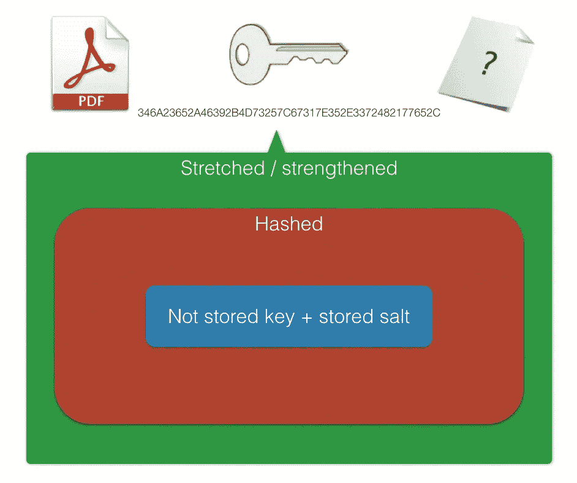

**未存储密钥:**用户密码。建议实施良好的密码策略，以帮助防止暴力攻击(最小长度、大写/非常用单词等)

**存储的盐:**用 CSPRNG 生成的随机数据。CSPRNG 将取决于您使用的平台。

**Hash:** 单向函数，将数据转换成表示原始对象的固定长度值。出于安全考虑，不建议使用 MD5(它速度很快，而且容易发生冲突)。SHA-1 也不再推荐用于哈希。

目前推荐 SHA-2 家族的任何产品(SHA-224、SHA-256、SHA-384 和 SHA-512)，尽管要注意“[长度扩展攻击](https://blog.skullsecurity.org/2012/everything-you-need-to-know-about-hash-length-extension-attacks)”，它会影响 SHA-2 家族的大多数变体。不要和密码分析人员打交道——那些人非常好。此外，不要只选择 SHA-512“因为它是一个更大的数字”🤦🏻‍♂️.

SHA-3 系列还没有被广泛采用，但是一旦发现 SHA-2 的弱点，我们最终会采用它。如果合适的话，欢迎你使用。

**拉伸**:冲洗，重复。目前的建议是 PBKDF2 与 HMAC 和 SHA-(1/256/512，任何适合您的情况)。bcrypt 也不错。scrypt 不错。Argon2 很棒，但是我没有体验过。还有其他的——很多都是好的。谷歌一个适合你和你选择的平台。任何东西都比`while()`循环好。

**对称密钥加密:**使用相同的密钥对信息进行加密和解密。目前的建议是 AES128 / AES 256。在 2018 年，被警告远离任何引用 AES 512 的东西——它闻起来不对劲——它只是看起来像一个取悦人们的大数字。AES 目前仅定义为 128/192/256 密钥大小。

**不要自己卷加密:**我不管你有多聪明，多小/大。不要这样做。这里有两个高调公司这样做的例子。包括 WhatsApp 的另一个安全失误！

 [## 如何解密 WhatsApp crypt5 数据库消息-堆栈指针

### 几周前，WhatsApp 推出了一种加密保存在 SD 卡上的备份信息的新方法。的…

堆栈指针. io](https://stackpointer.io/security/decrypt-whatsapp-crypt5-database-messages/279/)  [## 剖析一场密码灾难——Adobe 的巨大加密失误

### 一个月前的今天，我们报道了 Adobe 的巨大数据泄露。据任何人所知，包括 Adobe，它影响了…

nakedsecurity.sophos.com](https://nakedsecurity.sophos.com/2013/11/04/anatomy-of-a-password-disaster-adobes-giant-sized-cryptographic-blunder/) 

# 这如何应用于存储 web 服务的密码？

当你有一个网络服务，你不应该存储密码。

你应该只存储拉伸的，加盐的哈希。

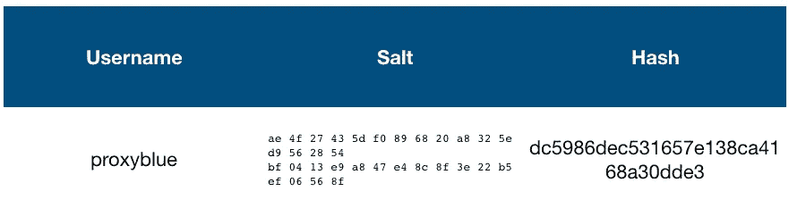

The salt ‘can’ be stored in a seperate area to the hash, but it’s debatable if that’s segregation or just obfuscation

当我键入我的密码(Password1！)，您的服务器端代码应该将已知的 salt 添加到我的密码中，利用拉伸算法(例如 PBKDF2) x 次(确保它与最初创建时相同)，并且它应该输出与数据库中存储的哈希相同的值。如果没有，那么初始值(密码)是不正确的。

## 我们为什么要这样做？

如果攻击者窃取了我们的数据库，或者它以某种方式泄露了——他们绝对无法获得用户的密码。如果两个用户有相同的密码，哈希将完全不同，因为他们的 salts 将不同。我们已经充分保护了用户的数据——不像许多这样的例子

 [## 世界上最大的数据泄露和黑客攻击——信息是美丽的

### 世界上最大的数据泄露、泄漏和黑客攻击的数据可视化。不断更新。由 VizSweet 提供动力。

www.informationisbeautiful.net](http://www.informationisbeautiful.net/visualizations/worlds-biggest-data-breaches-hacks/) 

# **总结**

唷。又一篇长长的安全博文。我正在考虑写第二部分，如果你有任何建议，并希望我在 twitter @proxyblue 上写更多的 message me，或者通过以下渠道联系我:

 [## 加入我们

### 欢迎来到多帽子俱乐部！我们是一个专注于信息安全的团体，成员来自各行各业。我们…

themanyhats.club](https://themanyhats.club/invite/) 

如果你喜欢这篇文章，可以看看我其他一些受欢迎的文章:

 [## 信息安全专业人士需要了解的 10 件网络知识

### 因此，这个故事源于这样一个事实，即我已经从应用程序开发和我的 Sec……

hackernoon.com](https://hackernoon.com/10-things-infosec-professionals-need-to-know-about-networking-d159946efc93)  [## 你“做”信息安全，对吗？你读什么？你听谁的？

### 作为一个超级热心的安全人士，我得到这个问题…很多。😅

路易·兰德](https://louis.land/you-do-infosec-right-what-do-you-read-who-do-you-listen-to-e8d00b7d8ace)  [## 移动应用程序开发人员需要了解的关于应用程序安全性的 3 件事

### 黑客可能不会攻击你。机器人会的。

hackernoon.com](https://hackernoon.com/lack-of-mobile-app-security-2017-how-to-succeed-as-a-red-shirt-without-even-dying-b87d78627efa) 

此外，由于下面的链接(和其他链接)，我最初是在几年前学会这些概念的。这是个很好的资源。

 [## 安全加盐密码散列法——如何正确使用

### 如何使用 salt 正确散列密码？哈希为什么要加盐，如何正确使用盐？

crackstation.net](https://crackstation.net/hashing-security.htm) 

唷。很高兴我都说出来了。

Obligatory Scott Pilgrim Gif.

再见。感谢 AdwareHunter、Clint 和 dist 担任我的校对。*