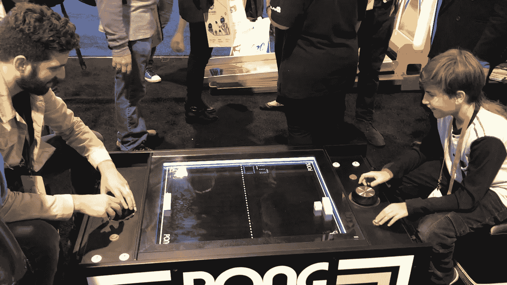

# CES 提供了什么？制造商对最酷的小工具和技术的概述！

> 原文：<https://medium.com/hackernoon/what-did-ces-have-to-offer-a-makers-overview-of-the-coolest-gadgets-and-tech-1522fc6bcec7>

上周，全球最大的科技会议 CES 超越了拉斯维加斯。年复一年，该活动因引领技术潮流和将最热门和最新的创新汇聚一堂而闻名。然而，根据许多来自著名出版物如 The Verge，Mashable 的记者的说法，今年的 CES 没有那么蓬勃发展的创新。虽然大多数大公司只是展示他们对现有产品的改进，但真正的“展示”发生在尤里卡——展示来自世界各地的新奇事物的初创公司展馆。

博览会本身分布在三个大型场馆:科技东区、科技西区和科技南区。一个人肯定需要几天时间来参观每个展览，并与最有趣的小工具和家用电器互动。即使这样，你还是会错过一些东西，这实在是太大了！这就是为什么 CES 是一个为期六天的活动，从周一到周六。

对我来说，去 CES 是一次巨大的冒险！由于在美国许多专业会议和博览会上严格的年龄限制，我是否能参加还不清楚。根据规定，我必须年满 18 岁。作为一个 13 岁的孩子(WOWCube 控制台的创始人)，我确实很好奇，但我的年龄仍然给活动协调员带来了一些问题。最终，经过几个月的谈判，我们给我弄了一张博客通行证。我之前在 HackerNoon、Arduino 博客和我的 [YouTube 频道](https://www.youtube.com/channel/UCYYrDALfWM7hvB3fNglSNMA)上发表的文章派上了用场，证明了我对技术和小工具的认真程度。

**我之前说过，我非常想去。在一个地方看到如此多的技术是非常令人兴奋的，这是世界上最大的令人敬畏的小工具和技术的盛会。以下是我在 CES 上看到的一些最酷的东西:**

诚然，“智能万物”、“物联网”和“移动物联网”的概念并不新鲜。在 CES 上，冰箱独立地与在线商店对话(其中一个在三星展台)，智能床垫将你的数据发送给医生(我尝试了零售价为 3299 美元的 [Sleep Number 360 智能床](http://www.sleepnumber.com/sn/en/beds/Innovation-Series-Beds))。

## **莫多格**

创新型创业公司彻底改变了我们看待熟悉事物的方式，目前正在做的一种方式是让一切变得“智能”。智能行李箱公司 Modobag 就是一个例子。这是伊利诺伊州正在开发的电动行李箱。智能随身小工具可以像真正的滑板车一样在机场运送人们。

Modobag 在 10 公里的骑行中可以承载 118 公斤，由可拆卸锂电池供电。它可以在一小时内从普通插头方便地充电，并且有两个 USB 端口——一个用于手机，另一个可能用于电子书。Modobag 的一个巨大优势是电池是可拆卸的，这让它符合飞行规则。

该设备的市场价格约为 1495 美元。

**雅达利桌球**

雅达利成功地重现了自 1972 年以来最受欢迎的游戏之一。现在，它是一个两人用的游戏机，塞在一张光滑的桌子里。下图中，我正在和 Snapchat 创意总监亚历克斯·莱博维奇玩游戏。

总的来说，复古游戏和复古游戏机在过去几年一直是趋势，任天堂等公司通过发布优秀的老 NES 经典和超级任天堂向新观众重新介绍了经典游戏。NES 可以在亚马逊上以 224 美元的价格买到，这有点疯狂，因为这几乎相当于买一台新的 Xbox 或 PlayStation。顺便说一下，起拍价只有 60 美元。

**Primax 8K VR 耳机**

说到在 CES 上看到的一些我最喜欢的技术，就忍不住要提到 Primax VR 耳机。这个项目始于 Kickstarter，并设法获得了 420 万美元的资金。在我看来，这是目前最令人兴奋的高质量消费虚拟现实技术，我很期待看到 2018 年将会发生什么。

**UBtech 双足步行器**

在 CES 展会上有几十个来自不同公司和国家的机器人。他们都有不同的功能、技术和[设计](https://hackernoon.com/tagged/design)，但是他们都给展览带来了有趣的想法。这里有一些给我印象最深的产品，它们的质量和独特的设计。

UBtech Biped Walker 是一款专为家庭开发的令人敬畏的人形机器人。与沃克在行业中的“同事”不同，他出奇地轻(82 磅)，可以用一条腿保持平衡，而大多数其他机器人仍然使用轮子进行运输。

**FORPHEUS**

FORPHEUS 是一个辅导机器人，可以教任何人打乒乓球。由欧姆龙开发的 Forpheus 以其外星人般的设计和尺寸让你惊叹不已。和这个巨人的一个乒乓设定，让我想起了《阿甘正传》里主角一眨眼就把对手打趴下的场景。然而，FORPHEUS 会适应对手的技能，并帮助其人类伙伴提高技能。

**Revinax —用于医疗和教育的 AR**

这是一个由法国 Revinax 公司为未来的医生开发的非常好的增强现实系统。该公司专注于虚拟和增强现实元素的培训和研讨会解决方案。

**房车/休闲车**

想去公路旅行吗？在美国，和露营者一起旅行是度过暑假的一种常见方式。许多国家公园都配备了能够适应这种交通方式的基础设施。

通常，停车点会把你的“车轮上的房子”与电甚至水连接起来。但是 Furrion 对于 RV 来说是一个全新的解决方案。在里面，你可以找到一个壁炉，一个热水浴缸，桑拿，豪华的浴室配件，一个皮沙发和一个巨大的电视。你也想要一架直升机吗？开发商会为你做一个，只要准备好至少支付 250 万美元就行了。

**PIQS 虚拟触摸投影仪**

PIQS 虚拟触摸投影仪是中国众多伟大创新之一。今年亚洲在 CES 上的主导地位并不令人惊讶:他们在每个类别中都有明显的存在，并提供了非常有趣的解决方案。我最喜欢的是既适合玩耍又适合教育的投影仪。投影仪上的操作系统是基于 Android 的。它的主要和最酷的功能是内置的计算机视觉系统。

谈到整个 CES，这是一次难忘的经历，我迫不及待地想在未来再次尝试这个会议。我留下的一些要点是:

**- CES 比你能想象的大得多**

**——知名品牌落后，需要赶超；**

每个人似乎都在威尼斯人，创业巷尤里卡公园附近闲逛。这也是我发现最令人惊叹的技术的地方。

*大家好！我是 Savva Osipov，一名来自加州的中学生。我参加硬件和物联网黑客马拉松；开发和组装小工具；并且在 YouTube 上有一个* [*脸书页面*](https://www.facebook.com/SavvaOsipov/) *和一个* [*科技频道*](https://www.youtube.com/channel/UCYYrDALfWM7hvB3fNglSNMA) *。我还和我爸爸一起开发了一个游戏设备。请在 wowcube.com 注册更新！*

[https://upscri.be/hackernoon/](https://upscri.be/hackernoon/)