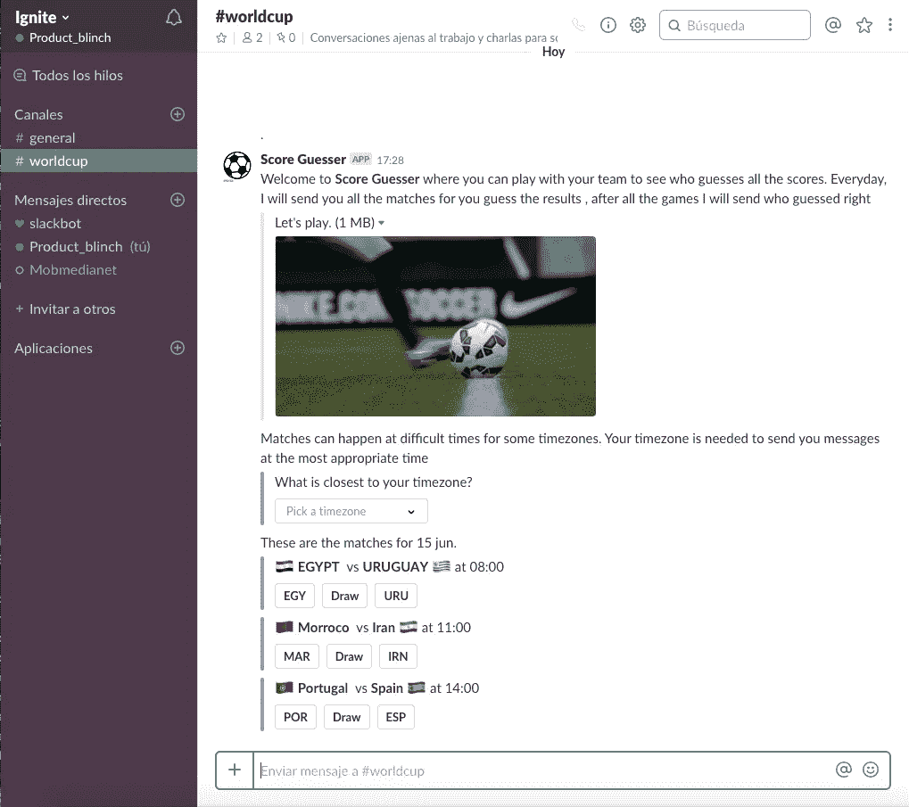
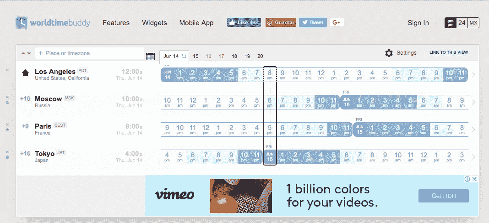
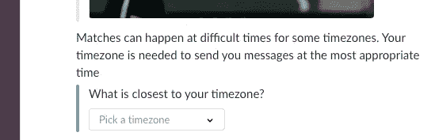
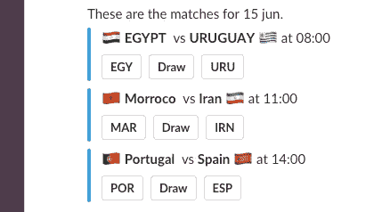

# 在为观看世界杯的办公室开发产品时，我学到了什么？

> 原文：<https://medium.com/hackernoon/what-did-i-learn-while-building-a-product-for-offices-watching-the-world-cup-6e32220bfae4>

Actual screenshot of the app

2018 世界杯你要跟着看吗？你办公室的其他人也在关注它？如果答案是肯定的，并且你关心构建数字产品，那么这篇文章可能适合你。我开发了一个应用程序，通过让每个人竞争看谁是更好的体育猜测者来开始对话。
作为一名[产品](https://hackernoon.com/tagged/product)经理，我决定发起一个“[猜赢家](https://guessthewinner.blinch.site/)”来练习我的产品管理技能。在每一项业务中，促进良好的工作环境是很重要的，其中一个方法是促进办公室联络活动。当你和你认识和喜欢的人一起工作时，会更容易。我想做一个应用程序来促进这些联系活动。因为体育对话是办公室聊天的常见话题，所以我决定做一个关于这方面的应用。

## 应用程序如何工作

这是 Slack 的一个应用程序，因为它是目前最常用的办公室通信方式之一。在你安装应用程序后，每天你都会收到游戏列表来猜测结果。每个人都能猜出谁会赢。比赛结束时，应用程序会公布谁答对了。现在这是一个非常简单的互动。
我对这款 Slack 应用的假设是:

> 比赛谁是最佳猜测者将会产生关于比赛的有趣对话。

这是基于我自己的经验，但是任何产品经理都会告诉你，研究和测试你的假设是必要的。

## 最有价值球员

有很多关于 MVP 以及它们是否有用的信息。作为一个项目经理，你必须了解你的用户。你可以使用不同的技术来了解你的用户，每种技术都会给你不同的信息。有些信息很难获得，除非你把产品放在用户面前，观察他们的反应。
当你想了解你的客户时，另一个要考虑的方面是成本。如果你知道一个你用不起的方法也没关系。金钱和时间通常决定了你研究的范围。在这种情况下，我自己做这个项目，我在世界杯前两周半有了做这个应用程序的想法。正因为如此，我决定开发这款应用，并尝试向真实用户学习。
需要注意的是，MVP 并不意味着半生不熟的功能，牺牲的必须是功能的数量，而不是质量。

> 一个好的产品经理必须知道何时使用他/她的工具箱中的每一个工具。

## 技术细节

出于前面提到的同样的原因(这是一场个人秀)，我决定在一个需要低运营和维护成本，但可以根据需要扩展的平台上开发这个应用程序。我决定使用 Google Firebase，因为它很容易上手，也很容易扩展。性能和可靠性一直是我关心的问题，所以我不得不选择一个不需要太多操作的选项。

## 中断和时区

A 6 PM match in Moscow is 8AM in Los Angeles and midnight in Tokyo. ([WorltimeBuddy totally recommended)](https://www.worldtimebuddy.com/)

与世界杯一起推出这款应用的一个有趣挑战是全球规模。32 个国家参加世界杯，许多其他国家的人也看电视转播。这意味着在比赛的时候，可能世界上每个时区都有人在看比赛。由于 Slack 是一种工作通信工具，它主要在工作时间使用，对于一些用户来说，在那段时间不会进行比赛。我决定在用户安装应用程序时询问他们大部分团队成员在哪里，并让他们在 3 个选项中选择:美国、欧洲/非洲、亚洲/澳大利亚。对于美国的一些人来说，比赛在早上 6:00 开始，所以最好让人们根据前一天下午的情况猜测，对于欧洲、非洲、亚洲和澳大利亚的人来说，比赛是在晚上，所以你可以在当天早上问他们。在恰当的时间发送信息对促进互动至关重要

Select a timezone and get better messages.

## 让用户了解情况

iOS 和 Android 的新版本包括了控制通知的方法，因为它失去了控制。如果一切都值得通知，用户就不再关注它们。我试着对发送信息非常有意识。一天中所有比赛一条消息，每场比赛结束公布获胜者时一条消息。这意味着平均每天有 5 条机器生成的消息，其余的都是人类的消息。该应用程序的目标是人们相互交流，而不是与应用程序交流。当它询问谁将赢得一场比赛或当它公布谁猜对了时，这个想法是要在这个频道引发人类之间的对话。

我这样做是因为我想练习我的产品管理技能，也想了解 Slack 应用程序，以便在那里申请工作。也许有用，也许没用。最后，这是一个有趣的挑战，我从中学到了很多。

> 如果你想支持这一点，请在你的社交网络中分享应用链接，并将其安装在你的 Slack 中。你会玩得很开心的。

# [《猜赢家》app](https://guessthewinner.blinch.site/)