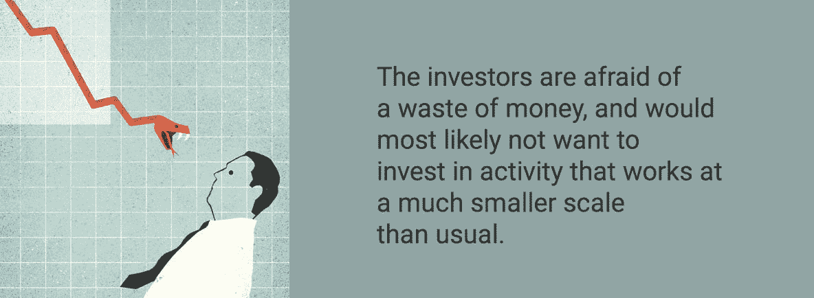

# 未来的区块链技术为中小企业贷款提供了什么？扰乱贸易融资的区块链解决方案。

> 原文：<https://medium.com/hackernoon/what-do-the-future-blockchain-technologies-provide-for-sme-lending-20d711772fcd>

中小企业是我国经济的支柱。你可能会被愚弄，认为像通用汽车、麦当劳或欧莱雅这样的大公司有能力雇佣最多的人，但事实是，中小企业才是美国雇佣最多人的企业，这就是为什么拥有和经营中小企业的责任就像沙漠探险后呼吸一口凉爽的空气一样重要。

小企业的问题是，即使它们推动了大多数经济领域的创新和竞争，它们的所有者也很难找到正确的方式来借出它们的支出。这是由多种因素造成的，包括他们的企业规模、最初几个月的财务能力有限等等。寻找一个好的贷款伙伴变得越来越难，这就是为什么许多新的或正在发展的中小企业在无贷款之锤的强大压力下消失了。

这不仅仅是中小企业的问题。可以说，这是一种全球性的流行病，原因是人们仍然没有完全了解区块链可以为您和您的企业实施的技术。智能合同可以帮助企业更好更快地发展，因为它们的主要特点是可以运行完全自动化的程序。

# 1.中小企业贷款的全球斗争

要意识到的一个重要事实是[的商业正变得越来越全球化。这些技术与他们一起进步，并加速了许多对广大受众至关重要的业务的进程。事实是，对大多数小企业来说，情况并非如此。它们小是有原因的:](https://www.huffingtonpost.com/aj-agrawal/ten-reasons-why-businesse_b_11512636.html)

*   他们服务于特定的人群或地区
*   他们有品牌，在当地工作得更好
*   他们从来没有资本去做大

即使他们真的在自己的市场上发展壮大，取得了不错的业绩，在 T4，中小企业贷款的问题依然存在。银行只是不想涉足某项业务，除非该业务规模很大，或者预计在下一财年有所增长。如果不是这样，中小企业贷款基本不存在，也就是说小企业主有两种选择。

他们可以简单地停留在原地，永远看不到他们的企业充分发挥潜力。这可能意味着，一个具有全球潜力的本土品牌，可能永远不会因为一笔失败的贷款而登上世界舞台。

他们还可以尽最大努力走向全球，并拥有一个强大的合作伙伴，如银行或贷款专家，以将业务发展到全球规模。

区块链技术将很快颠覆小型企业的贷款和融资方式。这些新技术有望一劳永逸地终结银行系统在中小企业身上引发的制度性缺陷，中小企业似乎从未分得一大块蛋糕。他们不再陷入困境，因为加密融资在不断发展，并将很快帮助小企业以他们想要的方式发展。

# 这种新的解决方案会是中小企业的未来吗？

简短的回答是肯定的，事实上它可以成为解决方案。或者至少，根据业务领域，它可以是解决方案的一部分。虽然中小企业面临的问题是地方性的，因为大多数小企业都是从小规模起步的，但区块链提供的解决方案是全球性的，其规模远远超出了企业主的想象。这就是像 [Traxia](https://www.icoexaminer.com/ico-news/traxia-ico-becomes-first-launch-japanese-ethereum-cardano/) 这样的解决方案派上用场的地方；让双方走到一起，创造一个对双方都有利的功能性解决方案。

# 2.全球化你的业务以生存

大多数中小企业没有完全走向全球化的原因只有一个:缺乏资本。仅在美国，[就有 3000 万中小型企业](https://ustr.gov/trade-agreements/free-trade-agreements/transatlantic-trade-and-investment-partnership-t-tip/t-tip-12)，在过去的 10 年里，这些企业提供了几乎三分之二的私营部门新增工作岗位。尽管如此，这些公司似乎从来没有足够的现金做大，所以他们大部分时间都呆在家里。

一个简单的解决办法是贷款，以便采取下一步行动。仅在美国，74%的新企业都是这样做的。尽管这些公司的财务总监表示，他们熟悉替代融资方式，但他们从来没有找到一家点对点贷款公司，甚至没有为他们的商业想法进行过众筹。

尽管环境恶劣，但 80%的企业主更愿意去银行申请贷款，而不是至少考虑为他们的企业提供任何其他类型的融资。事实是，只有一小部分(大约 15%)的企业真正从银行获得了贷款，如果你从全局来看，这是一个极小的差额。

# 区块链机构向全球企业承诺。

随着新的区块链技术的出现，像 Traxia 这样的服务将永远结束新公司和银行之间的纠纷，不是因为它们会减轻纠纷，而是因为它们会彻底消除纠纷。例如，当从 Traxia 这样的服务中贷款时，[你有机会在全球范围内发展你的业务](/@maxwellfreeman/cardanos-first-ico-traxia-7575c5cb13af),而不必担心如果你陷入困境就无法获得贷款。如果你的产品是好的，那么区块链很可能会支持它，最终你会从你目前的状态中一路向上。

# 关于 Traxia

[Traxia](http://traxia.co) 是 Sp8de、Keep Network 和其他几家公司中最早使用区块链解决中小企业现金流问题的全球服务之一。为了理解 Traxia 是什么，我们首先需要看看它说它将解决的问题。

首先，在任何一天都有 43 万亿美元的应收账款，银行仅从这些应收账款中融资 7%的短期资产。第二，银行为了不给中小企业融资而不断争论流动性问题，这就是中小企业在与当地银行谈判条款时陷入困境的原因。第三，典型的贸易融资操作既耗时又官僚，对新成立的中小企业来说成本太高。银行使用冗余的书面记录和缓慢、不透明和集中的信贷决策，这永远不是一个解决方案。

Traxia 承诺建立一个分散的全球贸易金融生态系统。通过使用区块链，他们将能够为小型企业提供透明、快速且成本低廉的交易。Traxia 的工作方式是将硬件组件(区块链本身)和软件组件(如令牌)放在一起，这是智能合约的结果。

如今，如果公司想在市场中生存，就必须遵守大公司的规则。付款的[等待期设定为大约 70 天](http://www.cityam.com/246984/growing-gap-payment-terms-between-smes-and-larger)。Traxia 加入进来，通过 LiqEase 解决了这个问题，为中小企业设计了一个透明的发票交易平台。当公司提供必要的文书工作、发票和其他文件时，LiqEase 会接收这些文件，并将这些资产转换为代币，然后在市场上进行交易。

这一方案被称为保理，它使投资者能够以折扣价购买发票，通常为 5%左右，小企业不必等待长达两个月的付款，因此不再增加其资产流动性。

# 3.区块链承诺了什么？

在这些新技术的帮助下，像 Traxia 和被称为 Cardano T3 的新加密货币区块链[，越来越多的中小企业将能够承受稳定的增长并享受更长的寿命。像 Traxia 这样的系统在您的企业中的实施将一劳永逸地解决中小企业在试图从银行等传统地方或其他融资方式贷款时遇到的三个主要问题。](https://cardanofoundation.org/protocol/)

# 第一个问题:破产

小企业的主要问题是[防止他们破产](https://www.inc.com/bill-carmody/why-96-of-businesses-fail-within-10-years.html)甚至在开始看到一些实际的财务成功之前。当银行不给你贷款时，这是一件很难做到的事情，尤其是当你刚刚起步的时候。通过使用区块链，您可以在一个全球平台上共享您的发票，然后这些发票会被在同一个区块链上工作的所有终端批准。

当公司没有钱支付费用和其他财务问题时，他们就会破产。这是一个现金流问题，而不是运营损失。这是区块链可以将问题缓解到一个简单的解决方案，并允许公司从破产的想法中解脱出来的地方。

# 问题 2:官僚主义

任何新企业主在创业时面临的最重要的问题是官僚主义。仅在美国，就有 30%的创业人士被困在官僚体系中，因为文书工作而无法真正看到他们的业务成为现实。

商业大师加里·哈默尔将官僚主义与埃博拉病毒相提并论，甚至继续说它比疾病更糟糕，因为它影响了人类的更大一部分，而且坦率地说，没有人想对此做任何事情。在区块链，你不需要担心任何文书工作。只有利益，简单的交易，没有别的。文书工作越少，生意越多！

# 问题 3:激励

一旦你解决了前两个问题，剩下的就是[激励](http://info.hktdc.com/alert/cba-e0512a-2.htm)。如果你想把公司发展到你想要的水平，比如说，三年后，这些都是至关重要的。在区块链，最好的想法是增长最快的，因为人们会简单地需要它，然后购买它。当然，在平台上寻找创意的投资者必须首先确信投资项目是一致的，不是骗局。

还有一点就是平台的全球性。你平台上的投资者越多，你获得渴望已久的现金的机会就越大。这是一场猫捉老鼠的游戏，但潜在的回报很重要。

在他们被说服后，他们会批准它，这就足够激励它自己成长。你不需要等着出去做宣传噱头。好主意总是最重要的，而且是由区块链自己提供的。由于区块链，所有其他因素都是次要的，不重要。

# 4.这是现实还是只是承诺？

当然，大多数商家会质疑上面的言论。他们这样做是有道理的。区块链仍然是人们私下谈论的话题。为什么有人要在中小企业贷款或任何其他类型的商业、金融等业务上信任区块链呢？

信任是随着时间建立起来的，为了让承诺变成现实，一些企业必须开始信任这个过程。他们一定是[的远见卓识者，他们向前迈出了疯狂的一步，并勇往直前](https://hackernoon.com/top-10-blockchain-technology-companies-cc1666c9da7e)，向世界证明，在与商业相关的所有事情上使用区块链绝对有很多机会。

区块链技术发展迅速，无边界，这就是为什么越来越多的人开始关注它，并开始投资它。以下是区块链成为中小企业贷款的未来的三个原因:

# 原因 1:普遍性

在谷歌文档中，你有典型的电子表格，你可以自己处理，也可以与第三方分享，共同处理。每当您要更改某个内容，或者其他人要这么做时，每个人都会看到文档中的更改。在区块链上，电子表格被复制到区块链的每一台计算机上，所以每当你或其他人修改某个东西，整个世界都会见证。

美妙的是，你不能删除任何已经添加的内容，只能在获得大量认为你值得信任的用户的批准后，才能向区块链添加数据。这使得[区块链成为一个通用工具](https://www.squiz.net/learn/blog/blockchain-the-technology-of-trust)，对每个人开放，但对值得信任的人来说最有效率。

虽然通用，但是这个特性也有它的缺点。例如，通过普及，区块链将把一个简单的智能合同变成一个非常复杂的步骤，这也将威胁到与之相关的人的匿名性。这违背了区块链的整个理念，它应该是一个透明的，但对每个人都有充分保护的媒体。

# 原因 2:不仅仅是加密货币

当听到区块链时，大多数人都会想到比特币等虚拟货币。事实是，这只是这项新技术如此受欢迎的原因之一。这项技术有无限的可能性。以以太坊为例；这是一个基于区块链的开放软件程序，其主要作用是让软件开发人员能够创建非常著名的分散式应用程序并将其转发给大众。

这就是“区块链 3.0”Cardano 将彻底改变技术世界的地方。卡尔达诺区块链以一种比以前更具创新性的新方式依赖智能合约。这使得它比目前开发的区块链协议更优越。

卡尔达诺的目标是解决当今世界的区块链正在处理的四个问题。它们是治理、可伸缩性、可持续性和互操作性。这就是为什么卡达诺是第三代区块链，准备很快向市场展示它的面孔。此外，它的价格非常低，而且供应量巨大。

今天，如果你要创建一个新的应用程序，你必须通过法律专业人士，让你的应用程序得到第三方的批准，以便让它传播给用户。有了以太坊上的[智能合约，你可以省去所有的中间人，跳过应用程序的审查、验证和认证，让用户充分利用它。](https://www.coindesk.com/information/ethereum-smart-contracts-work/)

# 原因 3:权力下放

小企业信任区块链的第三个也是最后一个原因是权力下放。银行由母银行控制，母银行由货币基金控制，货币基金由政府控制，等等。在区块链，没有中心枢纽。你进行的交易永远不会像银行交易那样通过大数据中心进行。相反，它们是单独的交易，使用它们自己的有效性证明，并且还有一个授权来执行约束。

你做的每一笔交易都通过一个私人服务器的世界，这确保了你的信息永远不会落入不可信的人手中。风险极小，即使一小部分数据最终落入坏人之手，整个系统也可以在遇到问题后平稳运行。

# 结论

为什么区块链技术公司在这个领域有前景？他们能改造和重组这个行业吗？他们能在多大程度上彻底做到这一点？它们是革命性的还是进化性的？简短的回答是:目前没有，但他们正在努力。我们今天拥有的技术已经准备好让大多数中小企业免于许多失败和艰难的时刻，他们试图说服银行或传统投资者给他们一个机会。

和区块链一起

像 Traxia 这样的服务，商业世界可以看到位于今天的经济支柱，中小企业的基础上的过程的全面转变。这将是一个艰难的过程，但该行业转型和重组的可能性可能会很大。这与其说是一场革命，不如说是一种进化，是从目前解决方案所存在的问题中向前迈出的真诚的一步。

当中小型企业试图贷款来发展他们的业务时，他们会遇到困难。银行不愿意把钱给小企业，这就是为什么越来越多的银行甚至在开始增长之前就已经不行了。有了像 Traxia 这样的区块链技术和服务，中小企业可以获得所需的资金，而不必担心银行和繁琐的合同、等待期和激励措施。

发展中国家中小企业融资面临的缺口主要有四个原因:

№1:未来企业主和投资者之间的信息不对称。如果一方不理解另一方的想法、动机和计划，整个事情从一开始就不会顺利进行。

№2:与规模比平时小得多的活动相关的高风险。这意味着投资者担心整个事情可能只是浪费钱，并且很可能不想投资，因为它仍然很小。

№3:与中小企业融资相关的交易成本，这可能相当大，因此对银行或投资者而言不具成本效益。

№4:小企业的贷款没有抵押品。

这些问题有待解决。有了基于区块链的融资，也许几年后我们会看到这些问题，并将它们视为古老的历史。

## 关于作者:

基里尔·希洛夫——geek forge . io 和 Howtotoken.com 的创始人。采访全球 10，000 名顶尖专家，他们揭示了通往技术奇点的道路上最大的问题。加入我的**# 10k QA challenge:**[geek forge 公式](https://formula.geekforge.io/)。