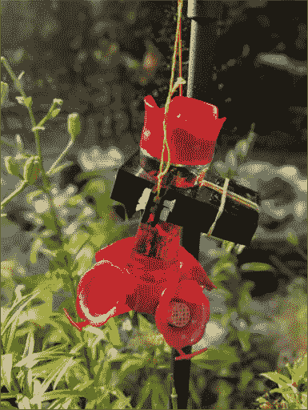
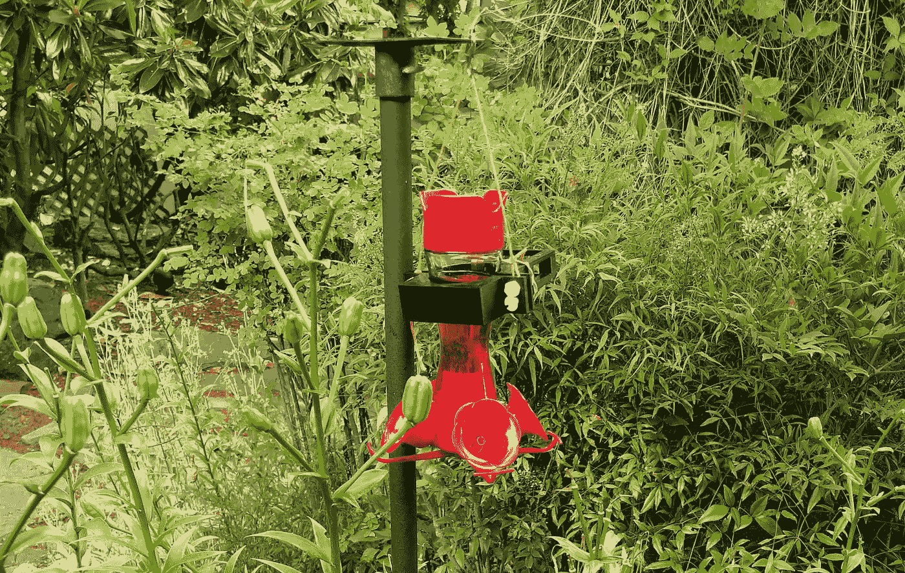
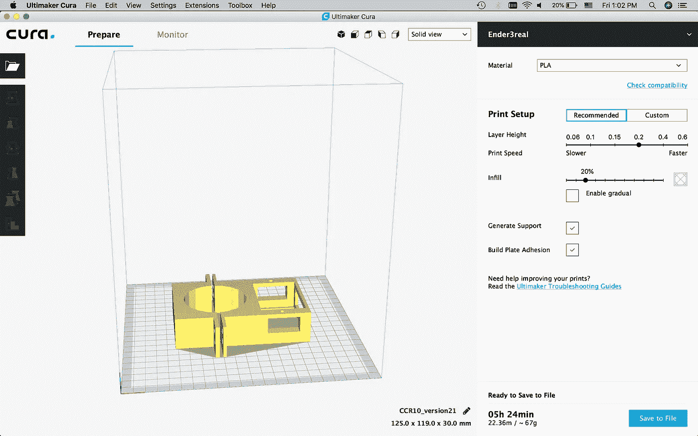
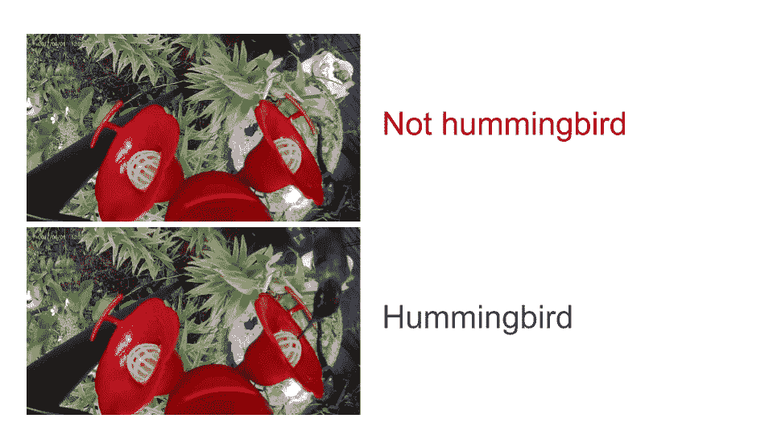
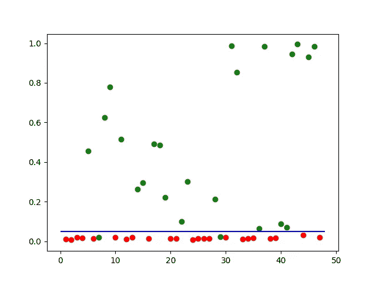

# 糖水、3D 打印、深度学习混合在一起，你得到了什么？

> 原文：<https://medium.com/hackernoon/what-do-you-get-when-you-mix-sugar-water-3d-printing-and-deep-learning-39de7b3f5f0e>

> 可爱的蜂鸟造访你家后院的精彩特写视频！

# 演示:

这是奖励。看可爱的小蜂鸟！

Demo video

# 糖水:

为了确保我们的[蜂鸟](https://hackernoon.com/tagged/hummingbird)朋友出现在试镜现场，我们需要知道他们想要什么，**食物**。蜂鸟在半空中盘旋的独特能力意味着它们需要大量的食物来支持它们的高代谢率。事实上，研究人员发现它们在脊椎动物恒温动物中拥有最高的质量比代谢率。

好的糖水很重要，因为它会吸引蜂鸟来到你的后院。这是能让蜂鸟(和你)快乐的糖和水的比例。

```
white cane sugar : water = 1 : 4 
```

此外，你可以考虑添加一点食用色素来吸引蜂鸟。

# 硬件:

这是完整的硬件设置。



The hardware setup



The hardware setup in the garden

## 蜂鸟喂食器

蜂鸟一直是园丁们的最爱。多年来，人们已经开发了许多种类的喂鸟器来吸引它们到他们的后院。这些设计非常酷，可以防止蜜蜂从蜂鸟那里偷走糖水。

我用的是现成的蜂鸟喂食器， [Perky-Pet 捏腰玻璃蜂鸟喂食器 203CP (8oz)](http://Perky-Pet Pinch-Waist Glass Hummingbird Feeder 203CP (8oz)) 。你可以使用上面的链接从亚马逊订购，但我是从当地的弗雷德·迈耶那里买的。

## 照相机

为了拍摄蜂鸟的特写镜头，我们需要一个小而高质量的相机。我用的是现成的[相机](https://www.amazon.com/REMALI-Waterproof-Battery-Carrying-Accessories/dp/B01GSHGBGU)，REMALI 4K 超高清体育动作相机。

## 蜂鸟喂食器上的 3D 打印相机支架

在这一点上，相机和蜂鸟喂食器仍然是分开的。因此，我需要定制硬件来将摄像机固定在蜂鸟喂食器上。这是我做的模型，它被设计成让相机朝下拍摄特写镜头。模型在这里上传到 Google Drive [。如果你先登录 Gmail，然后点击上面的链接，你可以在浏览器中看到不同的 3d 视图。](https://drive.google.com/open?id=1JwEOZvm8KRo2V7Ft3YV7FnVde08FMbZh)



## 螺栓、螺母、绳子和橡皮筋

最后，我用螺栓和螺母(直径 6mm)将相机支架固定在蜂鸟喂食器上，并用绳子将支架挂在后院的架子上。我还加了一些橡皮筋来进一步固定相机。

# 软件:

这就是我们希望从软件中得到的:能够提取出包含蜂鸟的帧。



Determining whether there is any hummingbird in an image

## 深度学习和计算机视觉

很有可能，蜂鸟一天只在你的喂鸟器前待几分钟。所以，大部分视频帧只捕捉到了[背景](https://hackernoon.com/tagged/background)，并不有趣。如果有一种方法可以自动检测、提取和连接蜂鸟出现的帧，那就太好了。为此，我们需要一些计算机视觉技术。

首先，我将一个预先训练好的 [RESNET](https://arxiv.org/abs/1512.03385) 应用于整个图像，并检查它是一只蜂鸟的可能性。然而，它并没有很好地工作。这可能是因为图像中有如此多的其他东西，它们混淆了分类器。

然后，我注意到蜂鸟在图像中出现的区域通常是靠近喂鸟者花朵的区域。因此，我可以裁剪出靠近两朵花的区域，并对它们应用相同的分类器。而且效果很好。下面是 [Python](https://hackernoon.com/tagged/python) 的代码和结果。

Code to detect whether an image contains any hummingbirds. It also includes an evaluation snippet.



Classification output. x-axis is the index of the image, y-axis is the likelihood that we think the image contains a hummingbird. A green dot means the image contains a hummingbird and a red dot means otherwise. From the plot, we see that a threshold of 0.05 gives us only 2 mis-classified examples.

我们在 47 个例子中只有两个错误分类(即准确率> 95%)。对于两个错误分类的例子，一个是由于蜂鸟的高速移动而导致的模糊图像，另一个只包含蜂鸟的喙。

## 使用 FFMPEG 在 python 中剪辑视频和组合视频

为了剪辑视频，我使用 FFMPEG。这里有一个 Python 脚本来实现这一点。

```
from moviepy.video.io.ffmpeg_tools import ffmpeg_extract_subclipt1 = 22*60 + 40 # Start timestamp in seconds
t2 = 23*60 + 40 # End timestamp in seconds
ffmpeg_extract_subclip("video1.MOV", t1, t2, targetname="video1.mp4")
```

要连接视频，FFMPEG 也很棒。下面是一个执行连接的 Python 脚本。

```
import os
os.environ["FFMPEG_BINARY"] = "/usr/local/bin/ffmpeg"
from moviepy.editor import *clips = []for filename in [ 'video1.mp4','video2.mp4', 'video3.mp4' ]:
  clips.append(VideoFileClip(filename))video = concatenate_videoclips(clips, method='compose')
video.write_videofile('combined2.mp4')
```