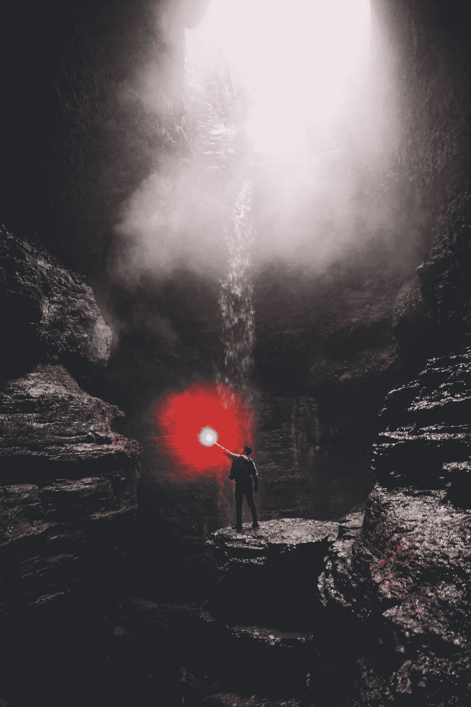
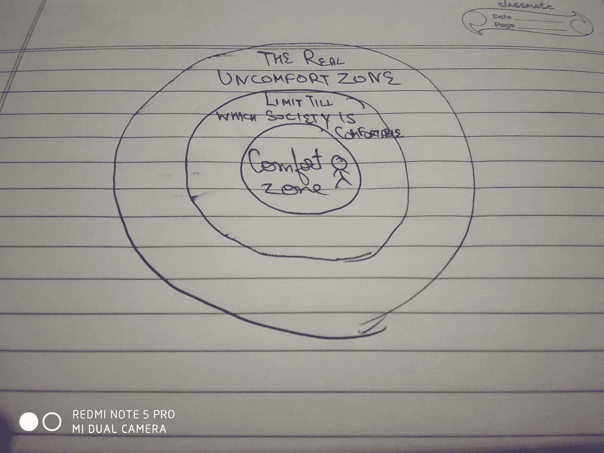

# 你想从生活中得到什么？

> 原文：<https://medium.com/hackernoon/what-do-you-want-from-life-428ab9c61847>

## 是什么阻止了你。

上大学快一个月了。这既令人害怕又令人兴奋。我周围的人一直问我毕业后打算做什么。我讨厌这个问题，它给我内心带来了一种恐惧，这种恐惧伴随着焦虑，对未来的焦虑，这是最常见也是最可怕的。

所以事情是这样的，

我不知道我想要什么样的生活。

我只知道我想过不同的生活。上大学、找工作、结婚、生子是[社会](https://hackernoon.com/tagged/society)教给我们的生活方式。是的，这种生活非常舒适，也许有些人更喜欢这种生活。也许我有时也这样做。有时候。

“person walking holding brown leather bag” by [Marten Bjork](https://unsplash.com/@martenbjork?utm_source=medium&utm_medium=referral) on [Unsplash](https://unsplash.com?utm_source=medium&utm_medium=referral)

这是反叛者的生活。去他妈的大学，去旅行，去认识新的人，去过令人兴奋的快节奏生活。是的，这种生活非常痛苦，但是也许有些人更喜欢这种生活。也许我有时也这样做。有时候。

“man standing on rock formation with water falls” by [Blake Cheek](https://unsplash.com/@blakecheekk?utm_source=medium&utm_medium=referral) on [Unsplash](https://unsplash.com?utm_source=medium&utm_medium=referral)

但有件事一直潜伏在我的大脑后门。这两者都是社会规划的。不是我。社会。

唯一不同的是，第一个是成人推荐的，第二个是 instagram 推荐的。

这就是一直困扰我的事情。我不知道我到底想要什么样的生活，我只知道我想要一种原始的生活。可能是两者的混合，也可能是两者完全不同。

我不知道我想过什么样的生活。也许我永远不会知道。也许当我临终时我会后悔我的决定，但至少这是我的决定。不是父母、朋友或整个社会造成的。

我的决定。

还有，另一件重要的事情。

你知道人们总是告诉你要鞭策自己，走出舒适区。社会在这里耍了一个花招。他们希望我们走出自己的舒适区，但他们希望我们在一定的范围内玩耍，让我们觉得自己已经走出了舒适区。社会希望你走出自己感到舒适的舒适区。

真正的不舒适区。这就像黑客帝国里的尼奥。红色药丸或蓝色药丸。这将是非常困难和痛苦的。如果你不想要也没关系。也许(很可能)我也会害怕，但问题是社会没有告诉我们去那里。

> 我不知道哪里有，但我相信它就在某个地方，我希望它就是我要找的东西。

# 是什么阻止了我去生活。

首先，我不知道我想要什么。有时它让我的头爆炸，有时它是可以忍受的。

此外，作为一个社会人，我不得不与那些有时和我想法不同的人一起生活。但是当我和他们一起生活时，我被他们的想法和生活方式所影响，这让我很难接受，除非我独自一人，这也有不好的一面。

而且，做一些不同的事情也是社会以某种方式告诉我们的。所以，在写这篇文章的时候，我突然想到，也许我必须让我的一些目标与社会的目标保持一致。这样，我就不会被称为弃儿和嬉皮士，但同时也找到了我在寻找的东西。

另一方面，我们是社会人，需要被接受，也喜欢被接受，所以重要的是你不要完全被抛弃。所以这就是为什么不被排斥是很重要的。

感谢阅读。😀

查看我的个人资料了解更多信息。被抛弃的男人